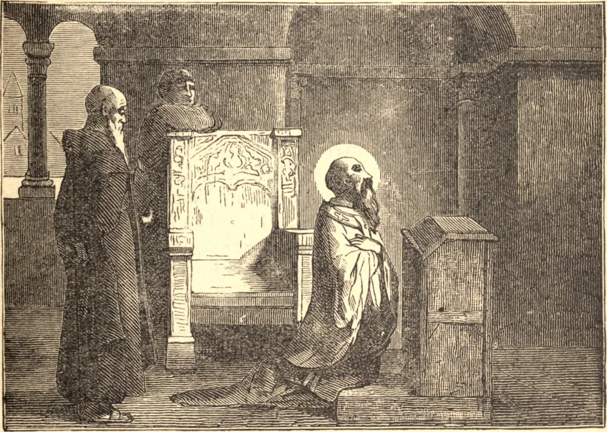

# 9 de setembro — SANTO OMER, Bispo

SANTO OMER nasceu por volta do fim do século VI, no território de Constança. Seus pais, que eram nobres e ricos, deram grande atenção à sua educação, mas, acima de tudo, esforçaram-se por inspirar-lhe o amor à virtude. Por ocasião da morte de sua mãe, ingressou no mosteiro de Luxen, aonde persuadiu seu pai a segui-lo, depois de ter vendido seus bens terrenos e distribuído o produto entre os pobres. Pai e filho fizeram juntos sua profissão religiosa.

A humildade, a obediência, a brandura e a devoção, juntamente com a admirável pureza de costumes que resplandecia em cada ação de Santo Omer, distinguiam-no entre seus santos irmãos, e logo foi chamado de sua solidão a assumir o governo da Igreja de Terouenne. A maior parte dos que viviam em sua diocese ainda eram pagãos, e mesmo os poucos cristãos haviam, pela escassez de sacerdotes, caído numa triste corrupção de costumes. A grande e difícil obra de sua conversão estava reservada a Santo Omer. O santo bispo aplicou-se à sua tarefa com tamanho zelo que, em pouco tempo, sua diocese se tornou uma das mais florescentes da França. Em sua velhice, Santo Omer ficou cego, mas essa aflição não diminuiu o seu cuidado pastoral por seu rebanho. Faleceu em odor de santidade, durante uma visita pastoral a Wavre, em 670.
