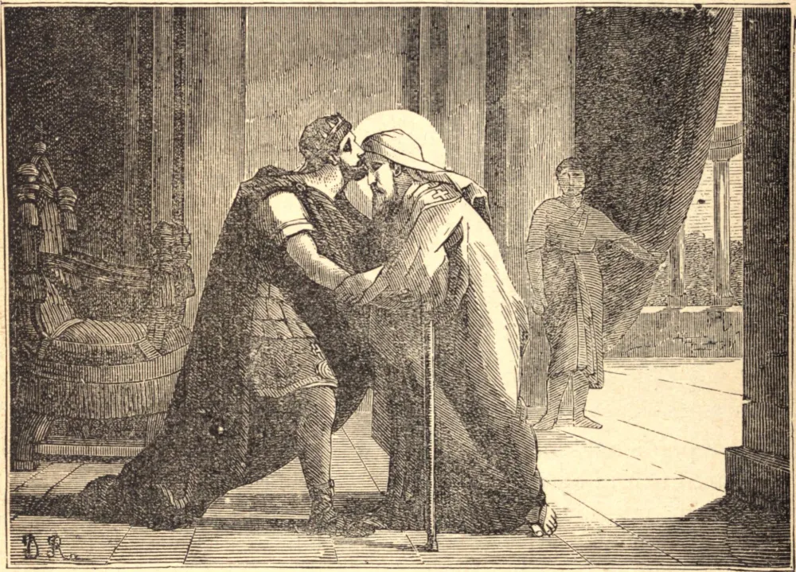

# 11 de setembro — SÃO PAFNÚCIO, Bispo

O santo confessor Pafnúcio era egípcio, e, depois de ter passado vários anos no deserto, sob a direção do grande Santo Antão, foi feito bispo na Alta Tebaida. Foi um daqueles confessores que, sob o tirano Maximino Daia, perderam o olho direito e foram depois enviados a trabalhar nas minas. Restabelecida a paz à Igreja, Pafnúcio regressou ao seu rebanho.

Tendo a heresia ariana se difundido no Egito, foi um dos mais zelosos em defender a fé católica, e, por sua eminente santidade e pelo glorioso título de confessor (ou seja, de quem confessara a Fé diante dos perseguidores e sob tormentos), foi tido em grande conta no grande Concílio de Niceia. Constantino, o Grande, durante a celebração daquele sínodo, conferenciava por vezes em particular com ele em seu palácio, e nunca o despedia sem beijar respeitosamente o lugar que outrora abrigara o olho que ele perdera pela Fé.

São Pafnúcio permaneceu sempre em estreita união com Santo Atanásio, e acompanhou-o ao Concílio de Tiro, em 335, onde encontraram a maior parte daquela assembleia composta de arianos declarados. Vendo Máximo, Bispo de Jerusalém, entre eles, Pafnúcio tomou-o pela mão, conduziu-o para fora, e disse-lhe que não podia ver que algum que ostentava as mesmas marcas que ele em defesa da Fé fosse seduzido e enganado por pessoas resolvidas a oprimir o mais esforçado defensor de seu artigo fundamental. Não temos relato particular da morte de São Pafnúcio, mas seu nome figura no Martirológio Romano no dia 11 de setembro.

**Reflexão**—Se combater por nossa pátria é glorioso, "é igualmente grande glória seguir o Senhor," diz o Sábio.
