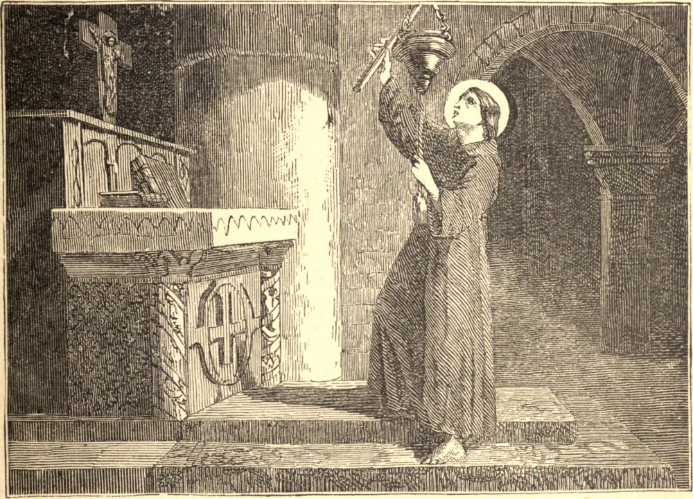

# 12 de setembro — SÃO GUIDO DE ANDERLECHT

QUANDO criança, Guido tinha dois amores: a Igreja e os pobres. Crescendo cada vez mais o amor à oração, deixou sua pobre casa em Bruxelas para buscar maior pobreza e mais estreita união com Deus. Chegou a Laeken, perto de Bruxelas, e ali demonstrou tamanha devoção diante do santuário de Nossa Senhora que o sacerdote suplicou-lhe que ficasse e servisse a Igreja. Dali em diante sua grande alegria era estar sempre na igreja, varrendo o chão e o teto, polindo os altares e limpando os vasos sagrados. Durante o dia ainda achava tempo e meios de socorrer os pobres, de modo que suas esmolas se tornaram famosas em todas aquelas paragens. Um mercador de Bruxelas, ouvindo falar da generosidade deste pobre sacristão, veio a Laeken e ofereceu-lhe uma parte em seus negócios. Guido não suportava deixar a igreja; mas a oferta parecia providencial, e por fim a aceitou. O navio deles, porém, perdeu-se na primeira viagem, e, ao regressar a Laeken, Guido encontrou seu lugar ocupado. O resto de sua vida foi uma longa penitência por sua inconstância. Por volta do ano 1033, sentindo próximo o seu fim, regressou a Anderlecht, em sua própria terra. Ao morrer, uma luz brilhou ao seu redor, e ouviu-se uma voz proclamando a sua recompensa eterna.

## Reflexão

Jesus esteve apenas nove meses no ventre de Maria, três horas na cruz, três dias no sepulcro, mas está sempre no tabernáculo. Dá a nossa reverência diante Dele testemunho desta bem-aventuradíssima verdade?
