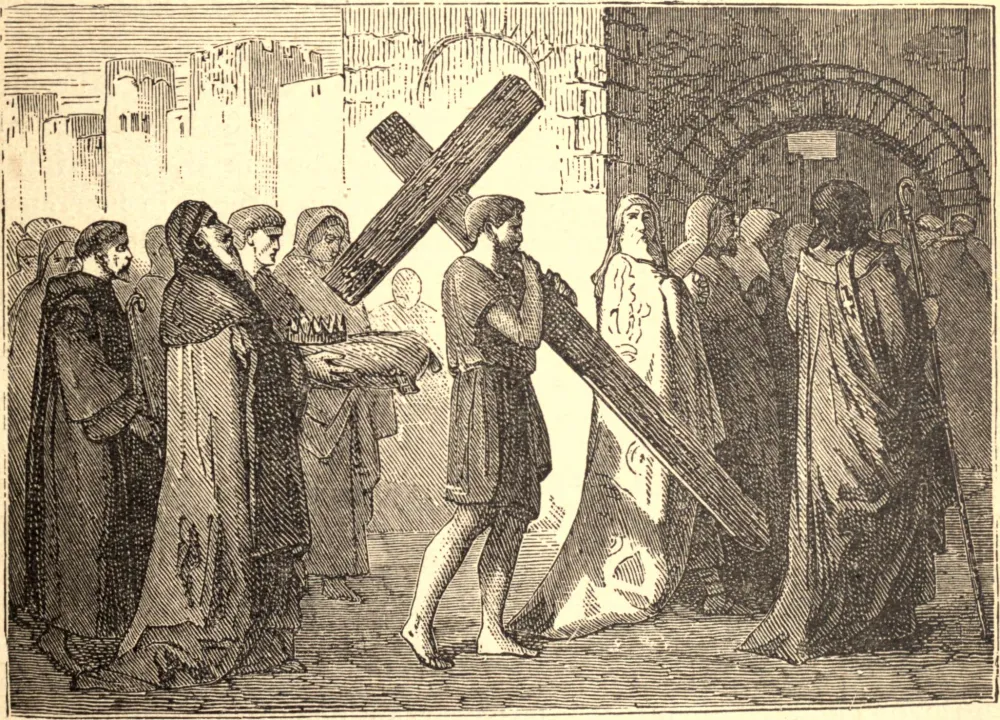

# 14 de setembro — A EXALTAÇÃO DA SANTA CRUZ DE NOSSO SENHOR JESUS CRISTO

CONSTANTINO ainda vacilava entre o Cristianismo e a idolatria quando uma cruz luminosa lhe apareceu nos céus, trazendo a inscrição: "Com este sinal vencerás." Tornou-se cristão, e triunfou sobre seus inimigos, que eram, ao mesmo tempo, os inimigos da Fé.

Poucos anos mais tarde, tendo sua santa mãe encontrado a cruz na qual Nosso Salvador padeceu, foi estabelecida na Igreja a festa da "Exaltação"; mas foi somente num período ainda posterior, a saber, depois que o Imperador Heráclio alcançou três grandes e admiráveis vitórias sobre Cosroes, Rei da Pérsia, que se havia apoderado da santa e preciosa relíquia, que esta festa tomou uma extensão mais geral, e foi revestida de um caráter mais elevado de solenidade. A festa da "Invenção" foi então instituída, em memória da descoberta feita por Santa Helena; e a da "Exaltação" foi reservada para celebrar os triunfos de Heráclio.

O maior poder do mundo católico estava naquele tempo concentrado no Império do Oriente, e inclinava-se para a sua ruína, quando Deus estendeu a sua mão para salvá-lo: o restabelecimento da grande cruz em Jerusalém foi disso o penhor seguro. Este grande acontecimento ocorreu em 629.

**Reflexão**—Aqui se encontra o cumprimento da palavra do Salvador: "Se eu for levantado da terra, atrairei todas as coisas a Mim."
