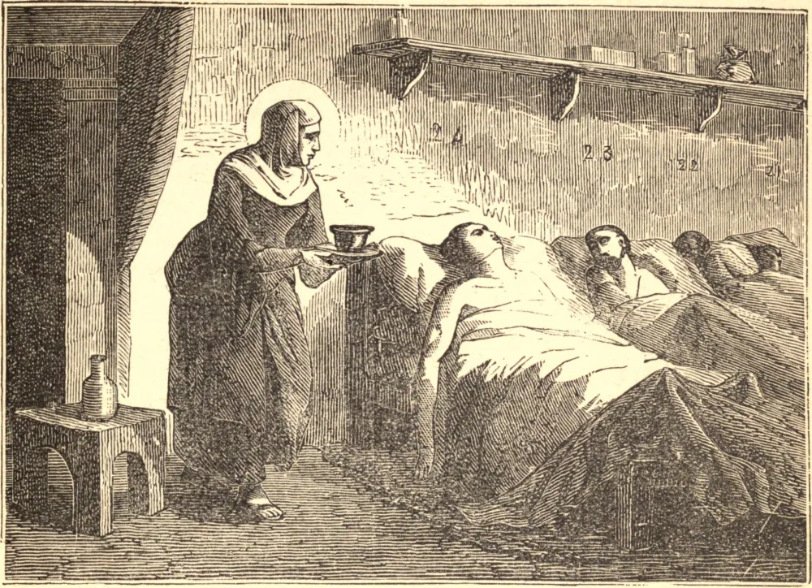

# 15 de setembro — SANTA CATARINA DE GÊNOVA

NOBRE de nascimento, rica e extraordinariamente formosa, Catarina, ainda criança, rejeitara as solicitações do mundo, e suplicara a seu divino Mestre alguma parte em seus sofrimentos. Aos dezesseis anos de idade viu-se prometida em casamento a um jovem nobre de costumes dissolutos, que a tratava com tamanha aspereza que, ao cabo de cinco anos, exausta por sua crueldade, ela de algum modo relaxou o rigor de sua vida e entrou na sociedade mundana de Gênova.

Por fim, esclarecida pela graça divina quanto ao perigo de seu estado, rompeu resolutamente com o mundo e entregou-se a uma vida de rigorosa penitência e oração. A caridade com que se dedicou ao serviço dos hospitais, assumindo com alegria os mais vis ofícios, levou seu marido a emendar seus maus caminhos, e ele morreu penitente.

Sua heroica fortaleza era sustentada pelo constante pensamento nas Santas Almas, cujos sofrimentos lhe foram revelados, e cujo estado ela descreveu num tratado cheio de celestial sabedoria. Uma longa e penosa enfermidade durante os últimos anos de sua vida apenas serviu para aperfeiçoar a sua união com Deus, até que, esgotada no corpo e purificada na alma, exalou o último suspiro a 14 de setembro de 1510.

**Reflexão**—O constante pensamento no purgatório nos ajudará não somente a escapar de suas terríveis penas, mas também a evitar a menor imperfeição que estorve a nossa aproximação de Deus.
