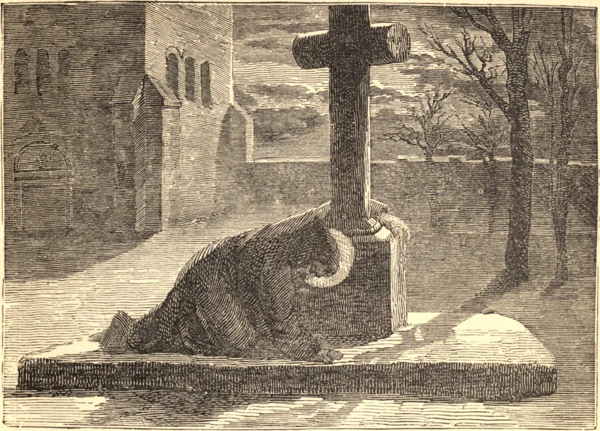

# 17 de setembro — SÃO LAMBERTO, Bispo, Mártir

SÃO LAMBERTO era natural de Maastricht. Seu pai confiou sua educação ao santo Bispo São Teodardo, e, tendo sido este bom homem assassinado, Lamberto foi escolhido seu sucessor. Irrompendo uma revolução que derrubou o reino da Austrásia, nosso Santo foi banido de sua sé por causa de sua devoção ao seu soberano. Retirou-se para o mosteiro de Stavelot, e ali obedeceu à regra tão estritamente quanto o mais jovem dos noviços o faria.

Um único exemplo bastará para mostrar com quão perfeito sacrifício de si mesmo dedicou seu coração a servir a Deus. Quando se levantava certa noite de inverno para suas devoções particulares, deixou cair por acaso sua sandália ou chinelo de madeira. O abade, sem perguntar quem causara o ruído, ordenou que o culpado fosse orar diante da cruz que se erguia ante a porta da igreja. Lamberto, sem dar resposta alguma, saiu como estava, descalço, coberto apenas com seu cilício; e nesta condição orou, ajoelhado diante da cruz, onde foi encontrado algumas horas depois. À vista do santo bispo, o abade e os monges prostraram-se por terra e lhe pediram perdão. "Que Deus vos perdoe", disse ele, "por pensardes que precisais de perdão por esta ação. Quanto a mim, não é no frio e na nudez que, segundo São Paulo, devo domar minha carne e servir a Deus?"

Enquanto São Lamberto gozava o sossego do santo retiro, chorava ao ver a maior parte das igrejas da França devastada. Entrementes, as nuvens políticas começaram a dissipar-se, e Lamberto foi restituído à sua sé; mas o seu zelo em reprimir as muitas e notórias desordens que existiam em sua diocese conduziu ao seu assassínio em 17 de setembro de 709.

**Reflexão**—Quão nobre e heroica é esta virtude da fortaleza! Quão necessária para todo cristão, especialmente para um pastor de almas, a fim de que nem as vistas mundanas nem os temores jamais desviem em coisa alguma a sua integridade ou cegem o seu juízo!
