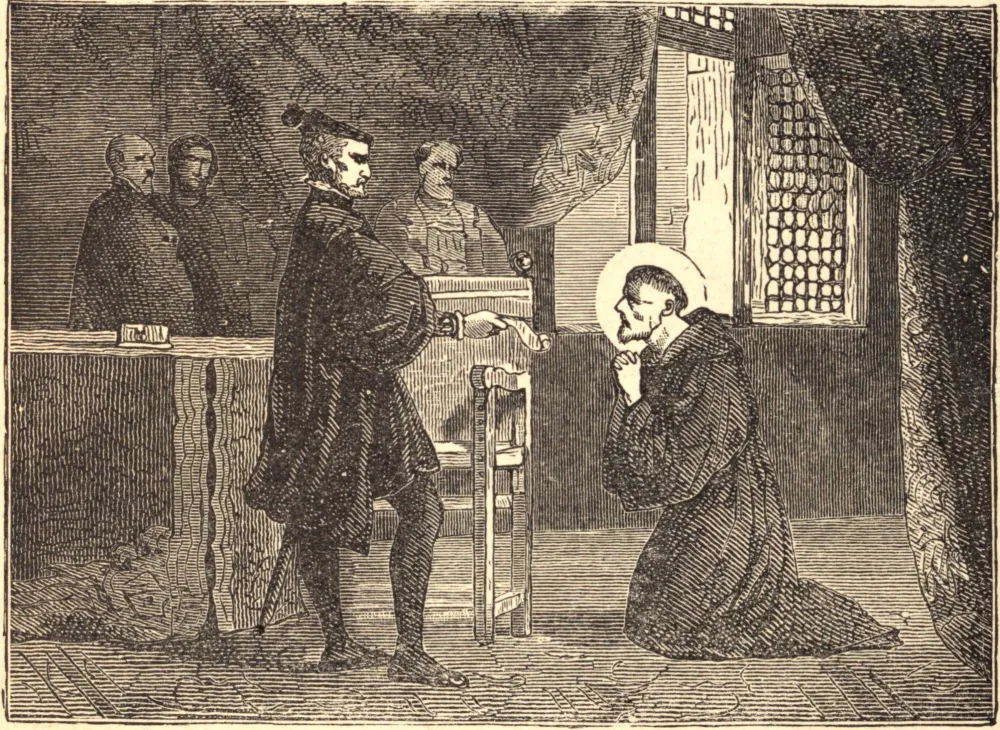

# 18 de setembro — SÃO TOMÁS DE VILANOVA

SÃO TOMÁS, glória da Igreja espanhola no século dezesseis, nasceu em 1488. A sede da ciência dos Santos levou-o a entrar na casa dos Frades Agostinianos em Salamanca. Carlos V o escutava como a um oráculo, e o nomeou Arcebispo de Valência. Ao ser conduzido ao seu trono na igreja, afastou as almofadas de seda e, com lágrimas, beijou o chão. Sua primeira visita foi à prisão; a soma com que o cabido o presenteou para o seu palácio foi destinada ao hospital público. Quando criança, dera a sua refeição aos pobres, e dois terços de suas rendas episcopais eram agora gastos anualmente em esmolas. Diariamente alimentava quinhentos necessitados, criava ele mesmo os órfãos da cidade, e abrigava com cuidado de mãe os enjeitados negligenciados. Durante os onze anos de seu episcopado, nenhuma donzela pobre se casou sem uma esmola do Santo. Estimulados por seu exemplo, os ricos e os egoístas tornaram-se liberais e generosos; e quando, na Natividade de Nossa Senhora de 1555, São Tomás veio a morrer, era quase o único homem pobre em sua sé.

## Reflexão

"Responde-me, ó pecador!", costumava dizer São Tomás, "que podes comprar com o teu dinheiro melhor ou mais necessário do que a redenção dos teus pecados?"
