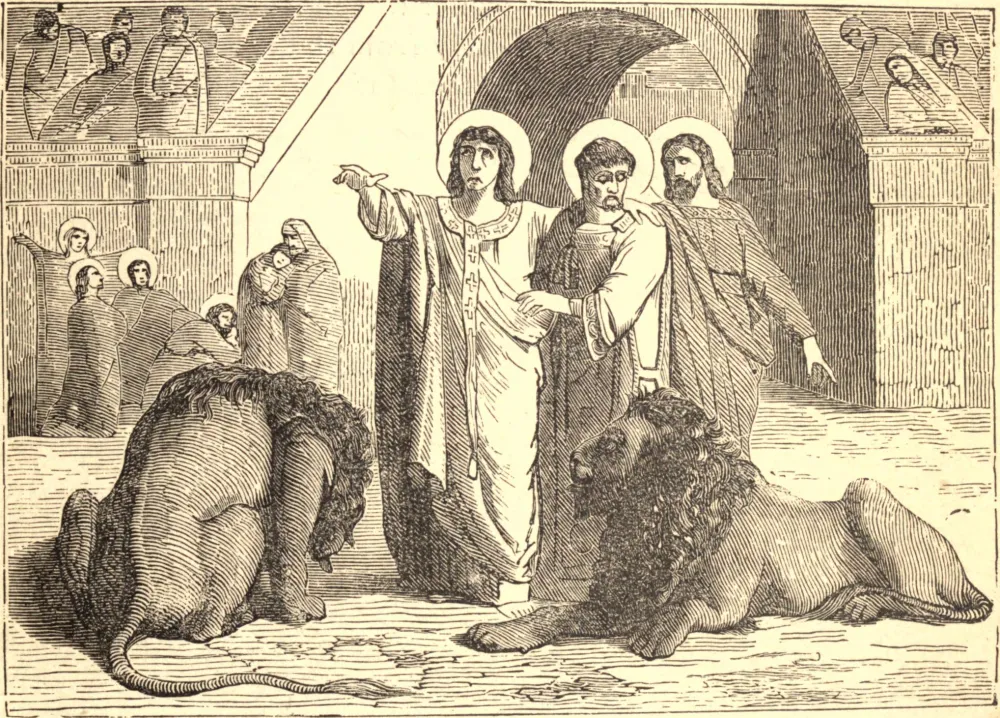

# 19 de setembro — SÃO JANUÁRIO, Mártir

HÁ MUITOS séculos, São Januário morreu pela Fé na perseguição de Diocleciano, e até hoje Deus confirma a fé de Sua Igreja, e opera um milagre contínuo, por meio do sangue que Januário derramou por Ele.

O Santo era Bispo de Benevento, e em certa ocasião viajou a Miseno a fim de visitar um diácono chamado Sósio. Durante esta visita, Januário viu a cabeça de Sósio, que cantava o evangelho na igreja, cingida de chamas, e tomou isto por sinal de que dentro em breve Sósio usaria a coroa do martírio. Assim se comprovou. Pouco depois, Sósio foi preso e lançado no cárcere. Ali São Januário o visitou e encorajou, até que o bispo, por sua vez, também foi preso. Logo o número dos confessores foi aumentado por alguns do clero vizinho.

Foram expostos às feras no anfiteatro. As feras, porém, não lhes fizeram mal algum; e por fim o Governador da Campânia ordenou que os Santos fossem decapitados. Mal imaginava o governador pagão que era o instrumento na mão de Deus para inaugurar a longa sucessão de milagres que atestam a fé de Januário.

As relíquias de São Januário repousam na catedral de Nápoles, e é ali que ocorre a liquefação de seu sangue. O sangue está congelado em duas ampolas de vidro, mas, quando é aproximado da cabeça do mártir, derrete-se e flui como o sangue de um homem vivo.

**Reflexão**—Agradece a Deus, que te concedeu motivos superabundantes para a tua fé; e roga pelo espírito dos primeiros cristãos, o espírito que exulta e se rejubila na crença.
