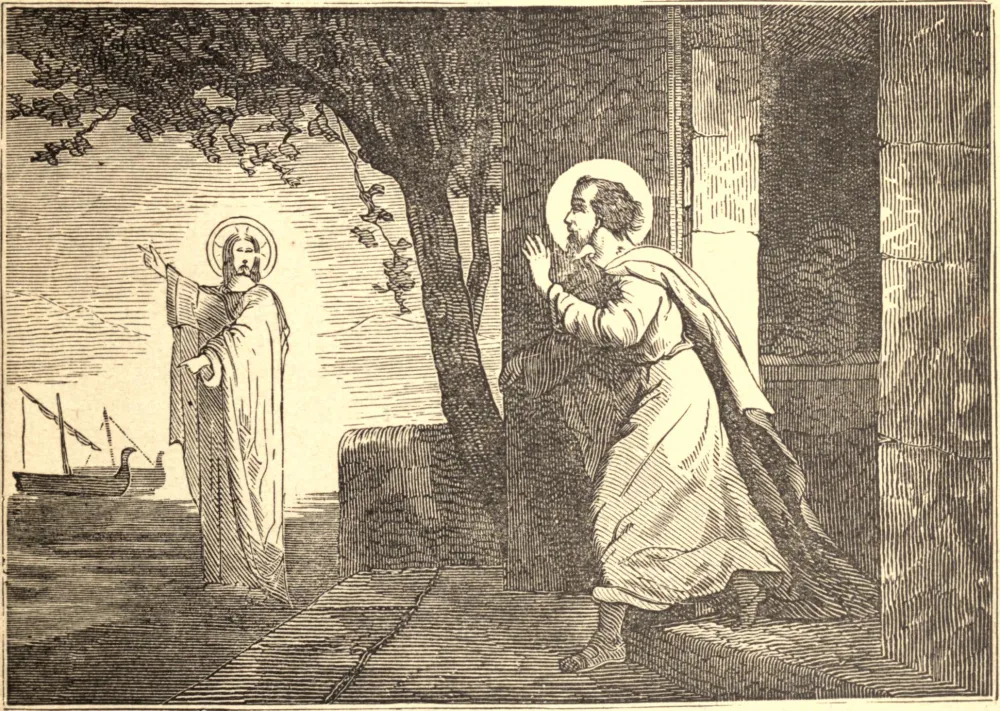

# 21 de setembro — SÃO MATEUS, Apóstolo

CERTO dia, enquanto Nosso Senhor caminhava à beira do Mar da Galileia, viu, sentado à coletoria, Mateus o publicano, cujo ofício era recolher os tributos do povo para os seus senhores romanos. Jesus lhe disse: "Segue-me"; e, deixando tudo, Mateus levantou-se e o seguiu. Ora, os publicanos eram abominados pelos judeus como inimigos de sua pátria, párias e pecadores notórios, que se enriqueciam pela extorsão e pela fraude. Nenhum fariseu se sentaria à mesa com um deles. Somente Nosso Salvador tinha compaixão deles. Assim, São Mateus ofereceu um grande banquete, ao qual convidou Jesus e Seus discípulos, com certo número destes publicanos, que dali em diante começaram a escutá-Lo com avidez. Foi então que, em resposta aos murmúrios dos fariseus, Ele disse: "Os que têm saúde não precisam de médico. Não vim chamar os justos, mas os pecadores à penitência." Após a Ascensão, São Mateus permaneceu alguns anos na Judeia, e ali escreveu o seu evangelho, para ensinar a seus compatriotas que Jesus era o seu verdadeiro Senhor e Rei, predito pelos profetas. São Mateus depois pregou a Fé por toda parte, e diz-se que terminou o seu curso na Pártia.

## Reflexão

Obedece a todas as inspirações de Nosso Senhor tão prontamente quanto São Mateus, que, a uma só palavra, "depôs", diz Santa Brígida, "o pesado fardo do mundo para tomar o leve e suave jugo de Cristo."
