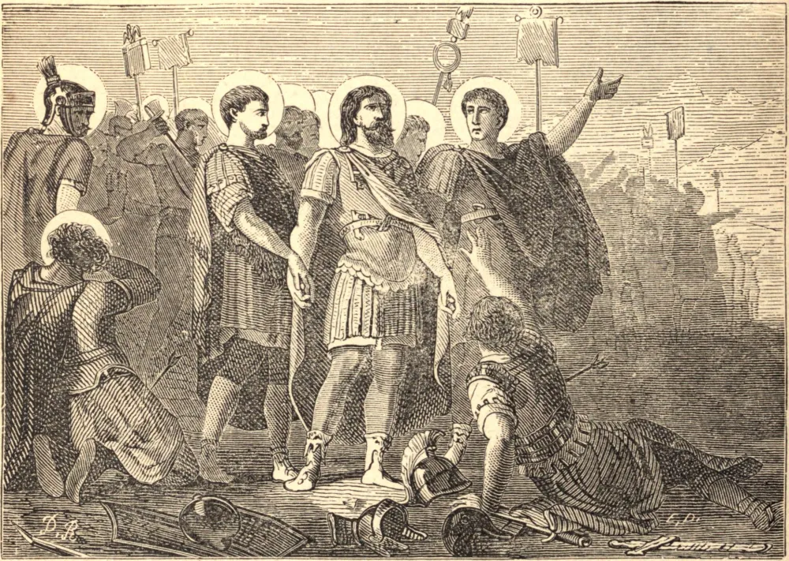

# 22 de setembro — A LEGIÃO TEBANA

A LEGIÃO Tebana contava mais de seis mil homens. Marcharam do Oriente para a Gália, e provaram a sua lealdade ao mesmo tempo ao seu Imperador e ao seu Deus. Estavam acampados perto do Lago de Genebra, sob o Imperador Maximiano, quando receberam ordem de voltar suas espadas contra a população cristã, e recusaram obedecer. Em sua fúria, Maximiano ordenou que fossem dizimados. A ordem foi executada uma e outra vez, mas eles suportaram isto sem um murmúrio ou um esforço para se defender. São Maurício, o capitão-chefe desta legião de mártires, encorajou os demais a perseverar e a seguir seus companheiros ao céu. "Sabe, ó Imperador", disse ele, "que somos teus soldados, mas somos também servos do verdadeiro Deus. Em todas as coisas lícitas obedeceremos prontíssimos, mas não podemos manchar nossas mãos neste sangue inocente. Vimos nossos companheiros mortos, e nos rejubilamos com a sua honra. Temos armas, mas não resistimos, pois preferiríamos morrer sem vergonha a viver pelo pecado." Quando o massacre começou, estes generosos soldados lançaram por terra suas armas, ofereceram seus pescoços à espada, e deixaram-se trucidar em silêncio.

## Reflexão

Agradece a Deus por cada desprezo e injúria que tens de suportar. Uma injúria suportada em mansidão e silêncio é uma verdadeira vitória. É a prova de que somos bons soldados de Jesus Cristo, discípulos daquela sabedoria celeste que é primeiro pura, depois pacífica.
