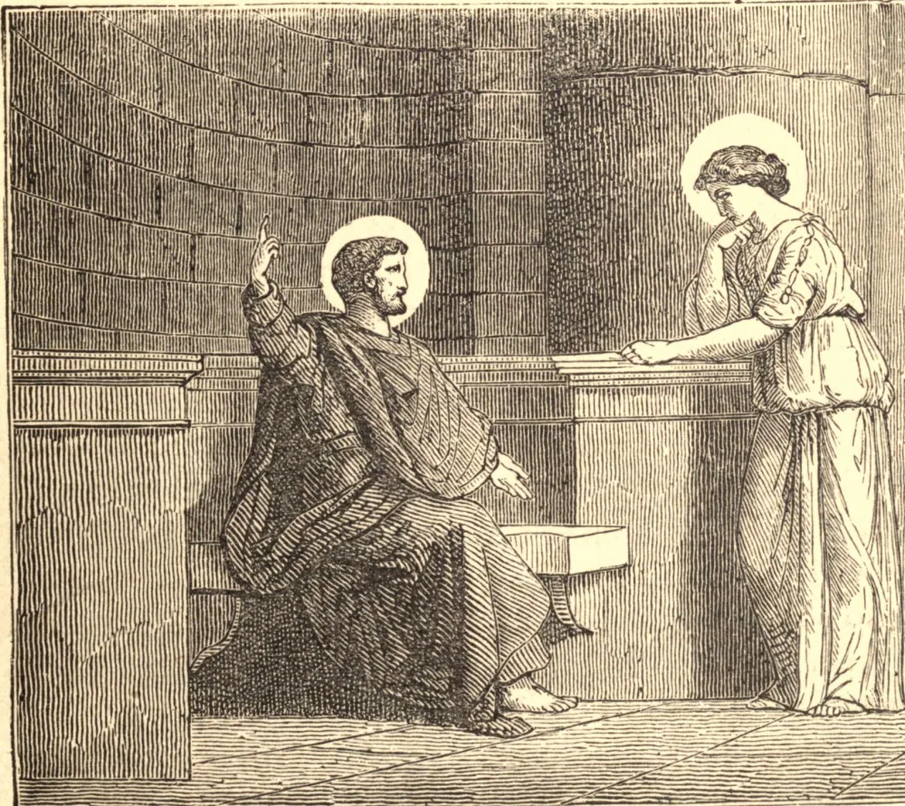

# 23 de setembro — SANTA TECLA, Virgem, Mártir

SANTA TECLA é uma das mais antigas, como é uma das mais ilustres, Santas no calendário da Igreja. Foi em Icônio que São Paulo encontrou Santa Tecla, e acendeu em seu coração o amor da virgindade. Ela fora prometida em casamento a um jovem rico e generoso. Mas, às palavras do Apóstolo, ela morreu para o pensamento dos esponsais terrenos; esqueceu a sua beleza; tornou-se surda às ameaças de seus pais, e, à primeira oportunidade, fugiu de um lar luxuoso e seguiu São Paulo.

A ira de seus pais e de seu pretendido esposo a perseguiu de perto; e o poder romano fez o seu pior contra a virgem que Cristo escolhera para Si. Ela foi despida e colocada no teatro público; mas a sua inocência a envolvia como uma veste. Então os leões foram soltos contra ela; caíram acocorados a seus pés, e os lamberam como que em veneração. Nem mesmo o fogo a pôde ferir. Tormento após tormento lhe foi infligido sem efeito, até que enfim o seu Esposo pronunciou a palavra e a chamou a Si, com a dupla coroa da virgindade e do martírio sobre a sua cabeça.

**Reflexão**—É a pureza na alma e no corpo que te fará forte na dor, na tentação e na hora da morte. Imita a pureza desta gloriosa virgem, e toma-a por tua padroeira especial na tua última agonia.
