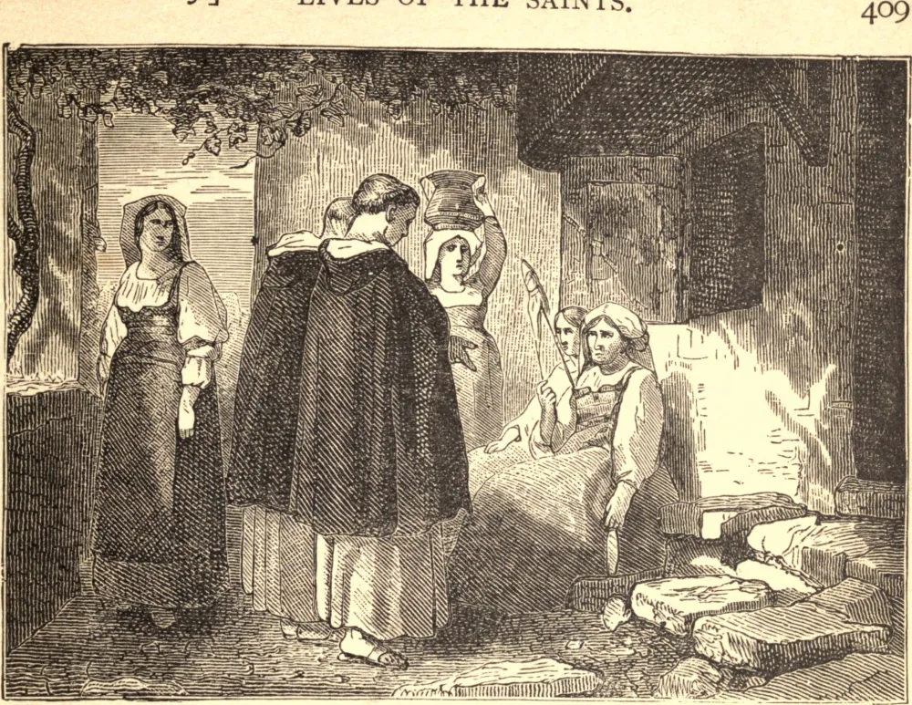

# 24 de setembro — A SANTÍSSIMA VIRGEM MARIA DA MERCÊ

SÃO PEDRO, da nobre família de Nolasco, nasceu no Languedoc, por volta de 1189. Aos vinte e cinco anos fez um voto de castidade, e transferiu suas vastas propriedades à Igreja.

Algum tempo depois, concebeu a ideia de estabelecer uma ordem para a redenção dos cativos. A vontade divina logo se manifestou. A Santíssima Virgem apareceu na mesma noite a Pedro, a Raimundo de Penyafort, seu confessor, e a Tiago, Rei de Aragão, seu pupilo, e ordenou-lhes que prosseguissem sem temor os seus santos desígnios. Após grande oposição, a Ordem foi solenemente estabelecida, e aprovada por Gregório IX, sob o nome de *Nossa Senhora da Mercê*.

Pela graça de Deus, e sob a proteção de Sua Virgem Mãe, a Ordem se espalhou rapidamente, sendo o seu crescimento acrescido pela caridade e pela piedade de seus membros, que se dedicavam não só a recolher esmolas para o resgate dos cristãos, mas até se entregavam à escravidão voluntária para auxiliar a boa obra. É para render graças a Deus e à Santíssima Virgem que foi instituída uma festa, observada na Ordem da Mercê, depois na Espanha e na França, e por fim estendida a toda a Igreja por Inocêncio XII, sendo designado o dia 24 de setembro como aquele em que deve ser observada.

**Reflexão**—São Pedro Nolasco e seus cavaleiros eram leigos, não sacerdotes, e contudo consideravam-se incumbidos da salvação do próximo. Cada um de nós pode, pelo conselho, pela oração, mas sobretudo pelo santo exemplo, auxiliar a salvação de nossos irmãos, e assim assegurar a nossa própria.
