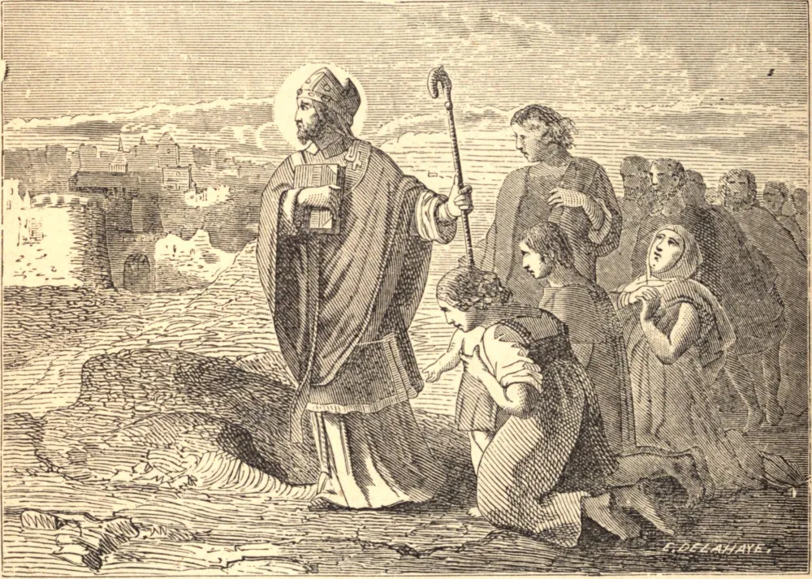

# 25 de setembro — SÃO FIRMINO, Bispo, Mártir. — SÃO FINBARR, Bispo

SÃO FIRMINO era natural de Pamplona, em Navarra, iniciado na fé cristã por Honesto, discípulo de São Saturnino de Toulouse, e consagrado bispo por São Honorato, sucessor de São Saturnino, a fim de pregar o Evangelho nas partes mais remotas da Gália. Pregou a Fé nas regiões de Agen, Anjou e Beauvais, e, tendo chegado a Amiens, ali escolheu sua residência, e fundou ali uma numerosa igreja de fiéis discípulos. Recebeu a coroa do martírio naquela cidade, sendo incerto se sob o prefeito Rício Varo, ou em alguma outra perseguição, desde a de Décio, em 250, até a de Diocleciano, em 303.

SÃO FINBARR, que viveu no século sexto, era natural de Connaught, e instituiu um mosteiro ou escola em Lough Eire, ao qual acorreu tal número de discípulos que transformou, por assim dizer, um deserto numa grande cidade. Esta foi a origem da cidade de Cork, que foi construída principalmente sobre estacas, em pequenas ilhas pantanosas formadas pelo rio Lea. O verdadeiro nome de nosso Santo, sob o qual foi batizado, era Lochan; o sobrenome Finbarr, ou Barr o Branco, lhe foi dado depois. Foi Bispo de Cork por dezessete anos, e morreu no meio de seus amigos em Cloyne, a quinze milhas de Cork. Seu corpo foi sepultado em sua própria catedral em Cork, e suas relíquias, alguns anos depois, foram postas num santuário de prata, e ali guardadas, levando esta grande igreja o seu nome até hoje. A gruta ou ermida de São Finbarr era mostrada num mosteiro que parece ter sido iniciado por nosso Santo, e ficava a oeste de Cork.
