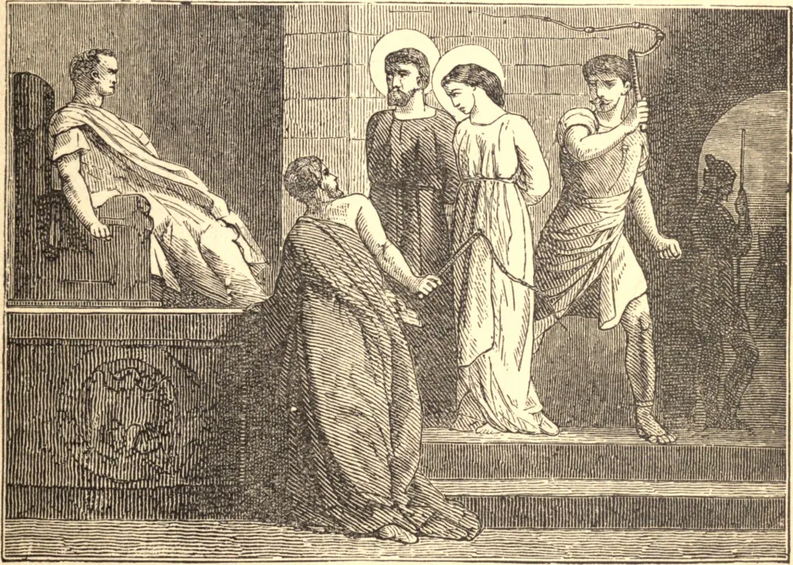

# 26 de setembro — SÃO CIPRIANO e SANTA JUSTINA, Mártires

A DETESTÁVEL superstição dos pais idólatras de São Cipriano consagrou-o desde a infância ao demônio, e ele foi criado em todos os ímpios mistérios da idolatria, da astrologia e da arte negra. Quando Cipriano aprendera todas as extravagâncias destas escolas de erro e ilusão, não hesitou ante crime algum, blasfemou contra Cristo e cometeu assassínios secretos. Vivia em Antioquia uma jovem cristã chamada Justina, de elevado nascimento e grande beleza. Um nobre pagão apaixonou-se profundamente por ela e, achando inacessível o seu pudor e invencível a sua resolução, recorreu a Cipriano em busca de auxílio. Cipriano, não menos enamorado da dama, tentou todos os segredos que conhecia para vencer a resolução dela. Justina, percebendo-se vigorosamente atacada, esforçou-se por armar-se com a oração, a vigilância e a mortificação contra todos os artifícios dele e o poder de seus encantamentos. Cipriano, achando-se vencido por um poder superior, começou a considerar a fraqueza dos espíritos infernais, e resolveu deixar o seu serviço e tornar-se cristão. Agládio, que fora o primeiro pretendente da santa virgem, foi igualmente convertido e batizado. Irrompendo a perseguição de Diocleciano, Cipriano e Justina foram apreendidos e apresentados ao mesmo juiz. Ela foi desumanamente açoitada, e Cipriano foi dilacerado com ganchos de ferro. Depois disto, ambos foram enviados acorrentados a Diocleciano, que ordenou que suas cabeças fossem cortadas, sentença que foi executada.

## Reflexão

Se os erros e as desordens de São Cipriano mostram a degeneração da natureza humana corrompida pelo pecado e escravizada ao vício, a sua conversão exibe o poder da graça e da virtude para repará-la. Roguemos a Deus que nos envie graça para resistir à tentação, e para fazer a Sua santa vontade em todas as coisas.
