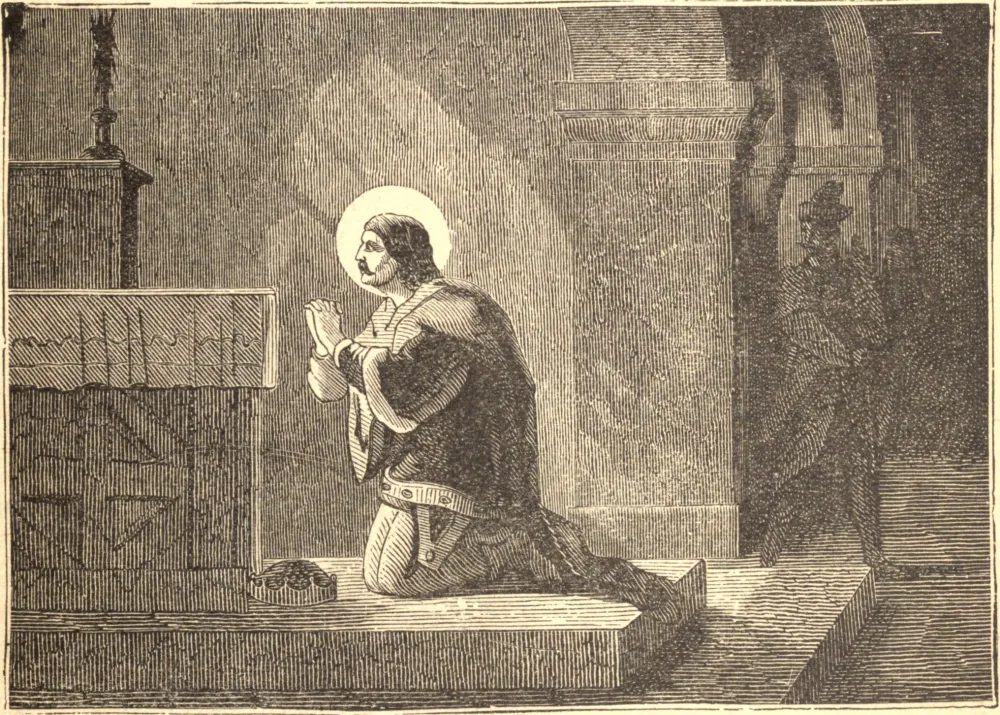

# 28 de setembro — SÃO VENCESLAU, Mártir

VENCESLAU era filho de um Duque cristão da Boêmia, mas sua mãe era uma pagã dura e cruel. Pelo cuidado de sua santa avó, Ludmila, ela mesma mártir, Venceslau foi educado na verdadeira fé, e hauriu uma devoção especial ao Santíssimo Sacramento.

À morte de seu pai, sua mãe, Drahomira, usurpou o governo e promulgou uma série de leis persecutórias. No interesse da Fé, Venceslau reivindicou e obteve, mediante o apoio do povo, uma grande porção do país como seu próprio reino. Sua mãe assegurou a apostasia e a aliança de seu segundo filho, Boleslau, que se tornou dali em diante seu aliado contra os cristãos.

Venceslau, entrementes, governava como um rei valente e piedoso, provia a todas as necessidades de seu povo, e, quando seu reino foi atacado, venceu em combate singular, pelo sinal da cruz, o líder de um exército invasor. No serviço de Deus era constantíssimo, e plantava com suas próprias mãos o trigo e as uvas para a Santa Missa, à qual nunca deixava de assistir diariamente.

Sua piedade foi a ocasião de sua morte. Certa vez, após um banquete no palácio de seu irmão, ao qual fora traiçoeiramente convidado, foi, como era seu costume à noite, orar diante do tabernáculo. Ali, à meia-noite na festa dos Anjos, em 938, recebeu a sua coroa do martírio, desferindo-lhe seu irmão o golpe mortal.

**Reflexão**—São Venceslau nos ensina que o lugar mais seguro para enfrentar as provações da vida, ou para preparar-se para o golpe da morte, é diante de Jesus no Santíssimo Sacramento.
