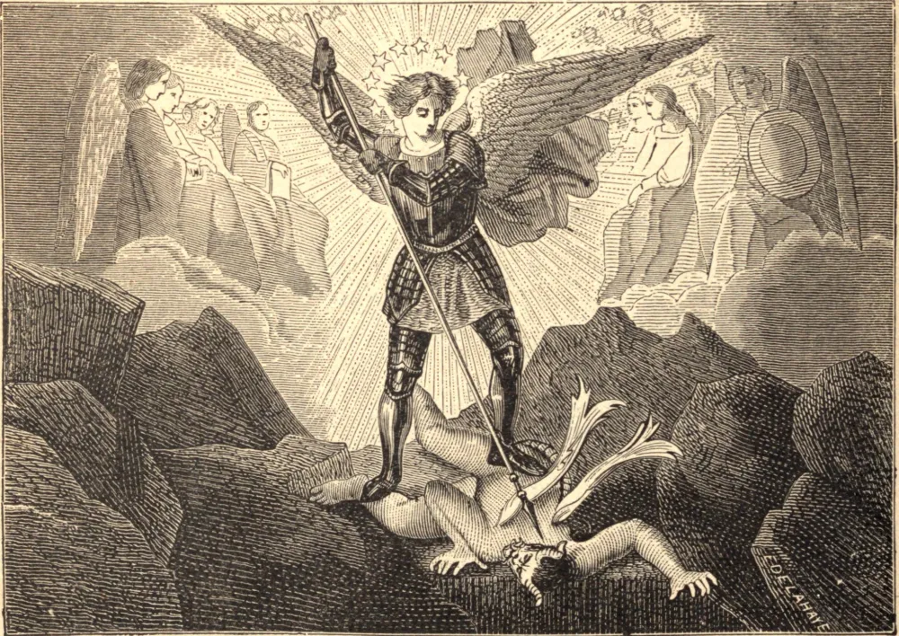

# 29 de setembro — SÃO MIGUEL, Arcanjo

"MI-CA-EL", ou "Quem é como Deus?" Tal foi o grito do grande Arcanjo quando feriu o rebelde Lúcifer no conflito das hostes celestiais, e desde aquela hora ficou conhecido como "Miguel", o capitão dos exércitos de Deus, o modelo da fortaleza divina, o campeão de toda alma fiel na luta contra os poderes do mal. Assim ele aparece na Sagrada Escritura como o guardião dos filhos de Israel, seu consolo e protetor em tempos de tristeza ou de conflito. É ele quem prepara seu retorno do cativeiro persa, quem conduz os valentes Macabeus à vitória, e quem arrebata o corpo de Moisés das garras invejosas do Maligno. E desde a vinda de Cristo a Igreja sempre venerou São Miguel como seu patrono e protetor especial. Ela o invoca pelo nome em sua confissão do pecado, convoca-o para o lado de seus filhos na agonia da morte, e escolhe-o como seu escolta das chamas purificadoras do purgatório para os reinos da luz santa. Por fim, quando o Anticristo houver estabelecido seu reino sobre a terra, será Miguel quem desfraldará mais uma vez o estandarte da Cruz, soará a última trombeta e, atando juntos o falso profeta e a besta, lançá-los-á por toda a eternidade no lago ardente.

## Reflexão

"Sempre que", diz São Bernardo, "qualquer grave tentação ou veemente tristeza te oprimir, invoca teu guardião, teu condutor; clama a ele e dize: 'Senhor, salva-nos, para que não pereçamos!'"
