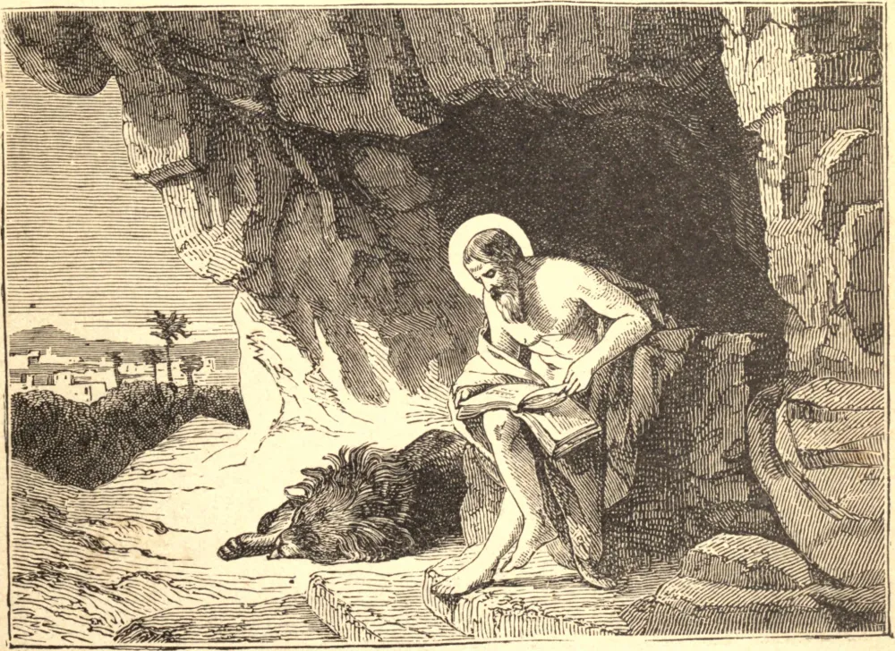

# 30 de setembro — SÃO JERÔNIMO, Doutor

SÃO JERÔNIMO, nascido na Dalmácia, em 329, foi enviado a estudar em Roma. Sua infância não foi isenta de falhas. Sua sede de conhecimento era excessiva, e seu amor pelos livros, uma paixão. Estudara sob os melhores mestres, visitara cidades estrangeiras e dedicara-se à busca da ciência. Mas Cristo tinha necessidade de sua vontade forte e de seu intelecto ativo para o serviço de Sua Igreja. São Jerônimo sentiu e obedeceu ao chamado, fez um voto de celibato, fugiu de Roma para o agreste deserto da Síria, e ali, por quatro anos, aprendeu na solidão, na penitência e na oração uma nova lição de sabedoria divina. Este foi o seu noviciado. O Papa logo o convocou a Roma, e ali impôs ao agora famoso hebraísta a tarefa de revisar a Bíblia latina, que seria a sua mais nobre obra. Retirando-se dali para a sua amada Belém, o eloquente eremita verteu de sua cela solitária, por trinta anos, uma torrente de luminosos escritos sobre o mundo cristão.

## Reflexão

"Saber", diz São Basílio, "como submeter-te com toda a tua alma, é saber como imitar Cristo."
