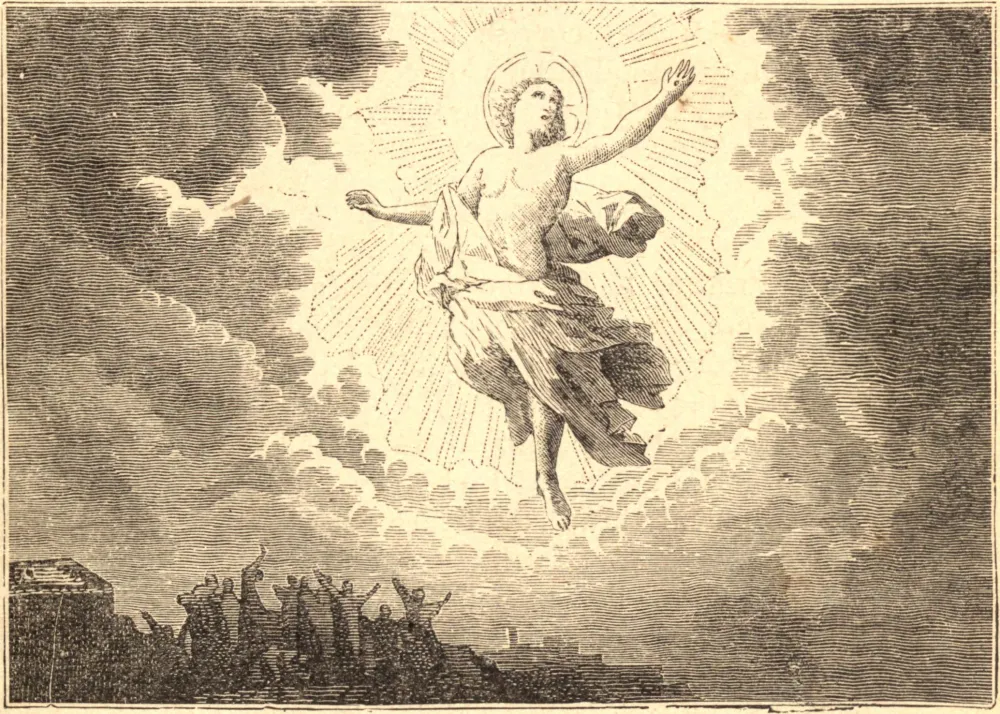

# A Ascensão

O mistério que a Igreja honra neste dia é, ao mesmo tempo, o do triunfo de Jesus Cristo e a santa esperança de Seus discípulos. O Salvador, depois de ter cumprido Sua missão na terra, ascende ao céu para colocar Sua humanidade na posse da glória que lhe é devida, e para nos preparar uma morada. Para lá ascende como nosso Rei, Libertador, Chefe e Mediador. Nosso Rei, porque nos comprou ao preço de Seu sangue; nosso Libertador, porque venceu a morte e o pecado, e nos resgatou da servidão de Satanás; nosso Chefe, porque deseja que sigamos os Seus passos, e que estejamos onde Ele está, como Ele mesmo declarou; nosso Mediador, porque só por Ele podemos ter acesso ao Pai. Para lá ascende como nosso Sumo Sacerdote, a fim de oferecer incessantemente a Deus o sangue que derramou por nós em Sua condição de homem, e de obter-nos pelos méritos de Seu sacrifício a remissão de nossos pecados. Sigamo-Lo, pois, por meio da fé, em Sua ascensão ao céu, e habitemos lá doravante em coração e espírito. Lembremo-nos de que o céu é inteiramente nosso, como nossa herança; e em meio às tentações e misérias desta vida, pensemos com frequência nesta morada de paz, de glória e de bem-aventurança eterna. Não devemos, contudo, lisonjear-nos de que, sem sérios esforços de nossa parte, teremos alguma parte no reino de Jesus Cristo. Há muitas moradas na casa de nosso Pai celestial, mas não há muitos caminhos que para lá conduzam. Jesus Cristo traçou para nós o caminho da humilhação e do sofrimento, e é o único que conduz à paz eterna. Se as durezas da jornada e a vista de nossa própria fraqueza nos enchem de pavor, devemos reunir energia apoiando-nos nas promessas do Homem-Deus. Ele estará conosco até o fim, e, se O amarmos, tudo se tornará fácil.

## Reflexão

Cultivemos a esperança: "Cristo, vindo como Sumo Sacerdote dos bens futuros, entrou no santo dos santos, tendo obtido a redenção eterna por Seu próprio sangue."
