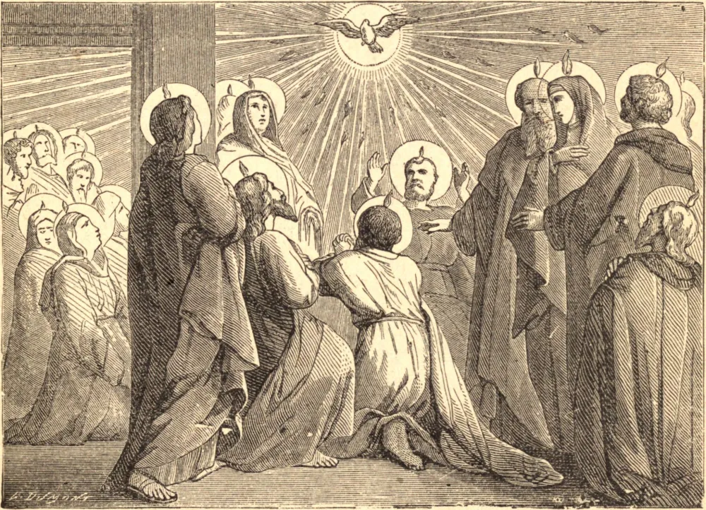

# Domingo de Pentecostes (Pentecostes)

Cinquenta dias após a Páscoa, os apóstolos e discípulos de Jesus Cristo achavam-se reunidos numa câmara alta, entregues à oração, segundo a recomendação do Divino Mestre, e aguardando o cumprimento da promessa que Ele lhes fizera, de enviar-lhes um Espírito Consolador, o Paráclito, que lhes ensinaria todas as coisas. Eis que um grande ruído, como de uma tempestade impetuosa, se ouviu de repente, a casa foi sacudida de um lado para outro, e línguas de fogo foram vistas pousando sobre a cabeça de cada um. Num instante todos foram transformados em homens novos, sendo suas mentes dotadas do pleno entendimento das Escrituras e das maravilhas que até então haviam presenciado sem compreender, e suas almas foram cheias de força do alto; dali em diante já não pertenciam a si mesmos, mas à obra do Evangelho. Desde esse tempo, este Divino Espírito não cessou de derramar-se sobre a Igreja para iluminar, confirmar, proteger e guiar; não cessou de comunicar-se a cada um dos fiéis individualmente, seja por meio dos sacramentos, seja pela graça, sempre que encontrou corações bem dispostos.

Os Padres da Igreja e todos os teólogos concordam unanimemente em reconhecer, nas operações do Espírito Santo nos corações dos fiéis, sete dons principais: Sabedoria, Entendimento, Conselho, Fortaleza, Ciência, Piedade e o Temor do Senhor. O dom da Sabedoria ajuda-nos a julgar saudavelmente todas as coisas concernentes ao nosso último fim; o dom do Entendimento, a apreender as verdades reveladas e a submeter-lhes nossos corações; o dom do Conselho, a escolher em todas as coisas a parte mais apropriada à santificação de nossas almas; o dom da Fortaleza, a resistir às tentações e vencer os perigos; o dom da Ciência, a discernir os melhores meios de nos santificarmos; o dom da Piedade, ou Devoção, faz-nos amar a religião e as práticas que dizem respeito ao Culto Divino; o dom do Temor do Senhor desvia-nos do pecado e de tudo quanto possa desagradar a Deus.

## Reflexão

"Os que são segundo a carne saboreiam as coisas da carne; mas os que são segundo o Espírito saboreiam as coisas do Espírito. Porque a sabedoria da carne é morte; mas a sabedoria do Espírito é vida e paz."
