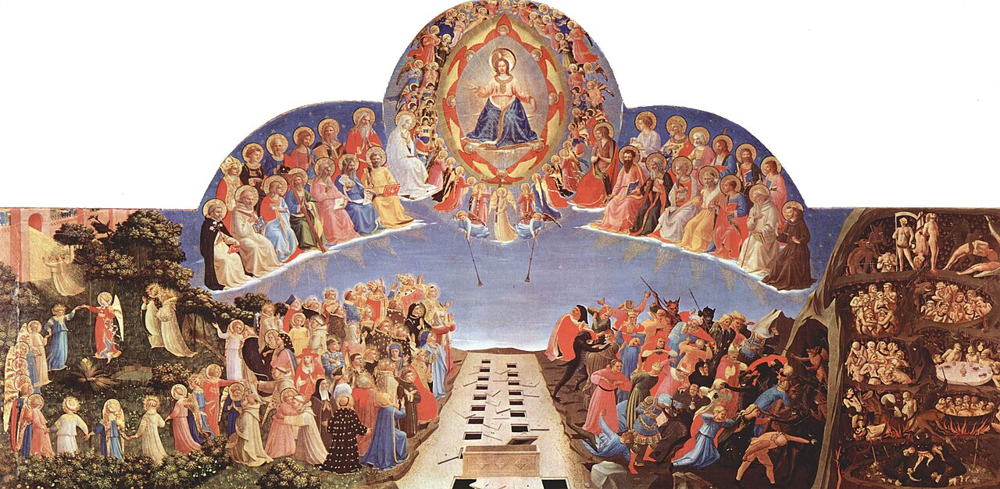

# Session 02 — Heaven, Hell, and Why We Are Here

*Fra Angelico, The Last Judgment (c. 1431). Public Domain via Wikimedia Commons.*

> *There are two horizons in the human life — and only two. The catechism does not let you pretend otherwise. Look at the picture: heaven on one side, hell on the other, and a soul standing at the crossroads. Today you also stand there. Today, again.*

## Pius X asks

**14.** What is heaven?

*Heaven is the eternal enjoyment of God, our happiness, and, in Him, of every other good, without any evil.*

**15.** Who deserves heaven?

*He deserves heaven who is good, that is, who loves and faithfully serves God, and dies in His grace.*

**16.** What do the wicked deserve, who do not serve God and die in mortal sin?

*The wicked, who do not serve God and die in mortal sin, deserve hell.*

**17.** What is hell?

*Hell is the eternal suffering of the privation of God, our happiness, and of fire, with every other evil and without any good.*

**18.** Why does God reward the good and punish the wicked?

*God rewards the good and punishes the wicked because He is infinite justice.*

**19.** Is there only one God?

*There is only one God, but in three Persons equal and distinct, who are the Most Holy Trinity.*

**20.** What are the names of the three Persons of the Most Holy Trinity?

*The three Persons of the Most Holy Trinity are called Father, Son, and Holy Spirit.*

**21.** Of the three Persons of the Most Holy Trinity, has any one been incarnate and made man?

*Of the three Persons of the Most Holy Trinity, the second, that is, the Son, was incarnate and made man.*

**22.** What is the name of the Son of God made man?

*The Son of God made man is called Jesus Christ.*

**23.** Who is Jesus Christ?

*Jesus Christ is the second Person of the Most Holy Trinity, that is, the Son of God made man.*

**24.** Is Jesus Christ God and man?

*Yes, Jesus Christ is true God and true man.*

**25.** Why did the Son of God become man?

*The Son of God became man to save us, that is, to redeem us from sin and to win heaven back for us.*

**26.** What did Jesus Christ do to save us?

*To save us, Jesus Christ made satisfaction for our sins by suffering and sacrificing Himself on the Cross, and He taught us to live according to God.*

**27.** To live according to God, what must we do?

*To live according to God, we must BELIEVE THE TRUTHS REVEALED by Him and KEEP HIS COMMANDMENTS, with the help of His GRACE, which is obtained through THE SACRAMENTS and PRAYER.*

> **Scripture.** *Now this is eternal life: That they may know thee, the only true God, and Jesus Christ, whom thou hast sent.* — John 17:3

> *Lord, I was not made for less than You. Today, refuse on my behalf the small horizons. Open me to the eternal one.*
