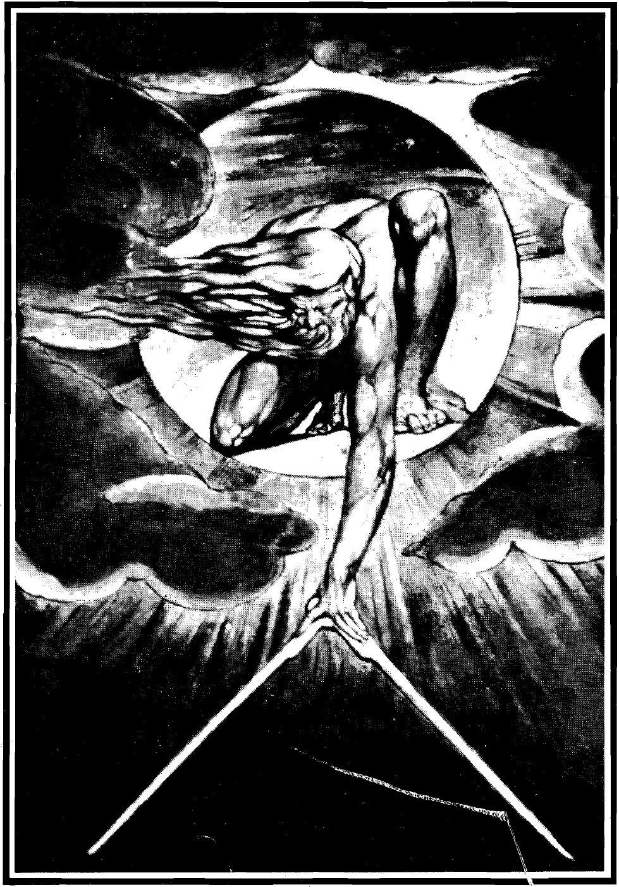

# Session 08 — Creator of Heaven and Earth

*William Blake, The Ancient of Days (1794). Public Domain via Wikimedia Commons.*

> *Look at the painter's hand reaching across the panel and you understand: every shape, every star, every blade of grass came out of a hand that did not have to make them. Existence is not necessary. It is gift.*

## Pius X asks

**51.** Why is God called "Creator of heaven and earth"?

*God is called Creator of heaven and earth, that is, of the world, because He made it from nothing, and to make from nothing is to create.*

**52.** Is the whole world the work of God?

*The whole world is the work of God; and in its greatness, beauty, and wonderful order it shows us His infinite power, wisdom, and goodness.*

## St. Thomas teaches

It has been shown that we must first of all believe there is but one God. Now, the second is that this God is the Creator and maker of heaven and earth, of all things visible and invisible. Let us leave more subtle reasons for the present and show by a simple example that all things are created and made by God. If a person, upon entering a certain house, should feel-a warmth at the door of the house, and going within should feel a greater warmth, and so on the more he went into its interior, he would believe that somewhere within was a fire, even if he did not see the fire itself which caused this heat which he felt. So also is it when we consider the things of this world. For one finds all things arranged in different degrees of beauty and worth, and the closer things approach to God, the more beautiful and better they are found to be. Thus, the heavenly bodies are more beautiful and nobler than those which are below them; and, likewise, the invisible things in relation to the visible. Therefore, it must be seen that all these things proceed from one God who gives His being and beauty to each and everything. "All men are vain, in whom there is not the knowledge of God: and who by these good things that are seen could not understand Him that is. Neither by attending to the works have acknowledged who was the workman. . . . For by the greatness of the beauty, and of the creature, the creator of them may be seen, so as to be known thereby."[^1] Thus, therefore, it is certain for us that all things in the world are from God.

## Errors Relating to the First Article

There are three errors concerning this truth which we must avoid. First, the error of the Manicheans, who say that all visible created things are from the devil, and only the invisible creation is to be attributed to God. The cause of this error is that they hold that God is the highest good, which is true; but they also assert that whatsoever comes from good is itself good. Thus, not distinguishing what is evil and what is good, they believed that whatever is partly evil is essentially evil--as, for instance, fire because it burns is essentially evil, and so is water because it causes suffocation, and so with other things. Because no sensible thing is essentially good, but mixed with evil and defective, they believed that all visible things are not made by God who is good, but by the evil one. Against them St. Augustine gives this illustration. A certain man entered the shop of a carpenter and found tools which, if he should fall against them, would seriously wound him. Now, if he would consider the carpenter a bad workman because he made and used such tools, it would be stupid of him indeed. In the same way it is absurd to say that created things are evil because they may be harmful; for what is harmful to one may be useful to another. This error is contrary to the faith of the Church, and against it we say: "Of all things visible and invisible."[^2] "In the beginning God created heaven and earth."[^3] ''All things were made by Him."[^4]

The second error is of those who hold the world has existed from eternity: "Since the time that the fathers slept, all things continue as they were from the beginning of the creation."[^5] They are led to this view because they do not know how to imagine the beginning of the world. They are, says Rabbi Moses, in like case to a boy who immediately upon his birth was placed upon an island, and remained ignorant of the manner of child-bearing and of infants' birth. thus, when he grew up, if one should explain all these things to him, he would not believe how a man could once have been in his mother's womb. So also those who consider the world as it is now, do not believe that it had a beginning. This is also contrary to the faith of the Church, and hence we say: "the Maker of heaven and earth." For if they were made, they did not exist forever. "He spoke and they were made."[^7]

The third is the error which holds that God made the world from prejacent matter (ex praejacenti materia). They are led to this view because they wish to measure divine power according to human power; and since man cannot make anything except from material which already lies at hand, so also it must be with God. But this is false. Man needs matter to make anything, because he is a builder of particular things and must bring form out of definite material. He merely determines the form of his work, and can be only the cause of the form that he builds. God, however, is the universal cause of all things, and He not only creates the form but also the matter. Hence, He makes out of nothing, and thus it is said in the Creed: "the Creator of heaven and earth." We must see in this the difference between making and creating. To create is to make something out of nothing; and if everything were destroyed, He could again make all things. He, thus, makes the blind to see, raises up the dead, and works other similar miracles. "Thy power is at hand when Thou wilt."[^8]

## Good Effects of Our Faith

From a consideration of all this, one is led to a fivefold benefit. (1) We are led to a knowledge of the divine majesty. Now, if a maker is greater than the things he makes, then God is greater than all things which He has made. "With whose beauty, if they being delighted, took them to be gods, let them know how much the Lord of them is more beautiful than they. . . . Or if they admired their power and their effects, let them understand by them that He that made them, is mightier than they."[^9] Hence, whatsoever can even be affirmed or thought of is less than God. "Behold: God is great, exceeding our knowledge."[^10]

(2) We are led to give thanks to God. Because God is the Creator of all things, it is certain that what we are and what we have is from God: "What hast thou that thou hast not received."[^11] "The earth is the Lord's and the fullness thereof; the world and all they that dwell therein.[^12] "We, therefore, must render thanks to God: What shall I render to the Lord for all the things that He hath rendered to me?"[^13]

(3) We are led to bear our troubles in patience. Although every created thing is from God and is good according to its nature, yet, if something harms us or brings us pain, we believe that such comes from God, not as a fault in Him, but because God permits no evil that is not for good. Affliction purifies from sin, brings low the guilty, and urges on the good to a love of God: "If we have received good things from the hand of God, why should we not receive evil?"[^14]

(4) We are led to a right use of created things. Thus, we ought to use created things as having been made by God for two purposes: for His glory, "since all things are made for Himself"[^15] (that is, for the glory of God), and finally for our profit: "Which the Lord thy God created for the service of all the nations."[^16] Thus, we ought to use things for God's glory in order to please Him no less than for our own profit, that is, so as to avoid sin in using them: All things are Thine, and we have given Thee what we received of Thy hand."[^17] Whatever we have, be it learning or beauty, we must revere all and use all for the glory of God.

(5) We are led also to acknowledge the great dignity of man. God made all things for man: "Thou hast subjected all things under is feet,"[^18] and man is more like to God than all other creatures save the Angels: "Let us make man to Our image and likeness."[^19] God does not say this of the heavens or of the stars, but of man; and this likeness of God in man does not refer to the body but to the human soul, which has free will and is incorruptible, and therein man resembles God more than other creatures do. We ought, therefore, to consider the nobleness of man as less than the Angels but greater than all other creatures. Let us not, therefore, diminish his dignity by sin and by an inordinate desire for earthly things which are beneath us and are made for our service. Accordingly, we must rule over things of the earth and use them, and be subject to God by obeying and serving Him. And thus we shall come to he enjoyment of God forever.

[^1]: Wis., xiii. 1, 5.
[^2]: In the Nicene Creed.
[^3]: Gen., i. 1.
[^4]: John, i. 3.
[^5]: II Peter, iii. 4.
[^6]: In the Nicene Creed.
[^7]: Ps. cxlviii. 5.
[^8]: wis., xii. 18.
[^9]: "Ibid.," xiii. 3-4.
[^10]: Job, xxxvi. 26.
[^11]: I Cor., iv. 7.
[^12]: Ps. xxiii. 1.
[^13]: Ps, cxv. 12.
[^14]: Job, ii. 10.
[^15]: Prov., xvi. 4.
[^16]: Deut., iv. 19.
[^17]: I Paral., xxix. 14.
[^18]: Ps. viii. 8.
[^19]: Gen., i. 26.

> **Scripture.** *The heavens shew forth the glory of God, and the firmament declareth the work of his hands.* — Psalm 19:1

> *Maker of all, today the world will keep speaking of You. Help me overhear it once or twice and answer back.*

---

#### Going Deeper — *Catechism of Trent*

## "The Father"

As God is called Father for more reasons than one, we must
first determine the more appropriate sense in which the word is
used in the present instance.

### God Is Called Father Because He Is Creator And Ruler

Even some on whose darkness the light of faith never shone
conceived God to be an eternal substance from whom all things
have their beginning, and by whose Providence they are governed
and preserved in their order and state of existence. Since,
therefore, he to whom a family owes its origin and by whose
wisdom

derived from human things these persons gave the name Father
to God, whom they acknowledge to be the Creator and Governor of
the universe. The Sacred Scriptures also, when they wish to show
that to God must be ascribed the creation of all things, supreme
power and admirable Providence, make use of the same name. Thus
we read: Is not he thy Father, that hath possessed thee, and made
thee and created thee? And: Have we not all one Father? hath not
one God created us?

### God Is Called Father Because He Adopts Christians Through Grace

But God, particularly in the New Testament, is much more
frequently, and in some sense peculiarly, called the Father of
Christians, who have not received the spirit of bondage again in
fear; but have received the spirit of adoption of sons (of God),
whereby they cry: Abba (Father). For the Father hath bestowed
upon us that manner of charity that we should be called, and be
the sons of God, and if sons, heirs also; heirs indeed of God,
and jointheirs with Christ, who is the firstborn amongst many
brethren, and is not ashamed to call us brethren. Whether,
therefore, we look to the common title of creation and
Providence, or to the special one of spiritual adoption, rightly
do the faithful profess their belief that God is their Father.

### The Name Father Also Discloses The Plurality Of Persons In God

But the pastor should teach that on hearing the word Father,
besides the ideas already unfolded, the mind should rise to more
exalted mysteries. Under the name Father, the divine oracles
begin to unveil to us a mysterious truth which is more abstruse
and more deeply hidden in that inaccessible light in which God
dwells, and which human reason and understanding could not attain
to, nor even conjecture to exist.

This name implies that in the one Essence of the Godhead is
proposed to our belief, not only one Person, but a distinction of
persons; for in one Divine Nature there are Three Personsthe
Father, begotten of none; the Son, begotten of the Father before
all ages; the Holy Ghost, proceeding from the Father and the
likewise, from all eternity

### The Doctrine Of The Trinity

In the one Substance of the Divinity the Father is the First
Person, who with His Onlybegotten Son, and the Holy Ghost, is
one God and one Lord, not in the singularity of one Person, but
in the trinity of one Substance. These Three Persons, since it
would be impiety to assert that they are unlike or unequal in any
thing, are understood to be distinct only in their respective
properties. For the Father is unbegotten, the Son begotten of the
Father, and the Holy Ghost proceeds from both. Thus we
acknowledge the Essence and the Substance of the Three Persons to
be the same in such wise that we believe that in confessing the
true and eternal God we are piously and religiously to adore
distinction in the Persons, unity in the Essence, and equality in
the Trinity.

Hence, when we say that the Father is the First Person, we
are not to be understood to mean that in the Trinity there is
anything first or last, greater or less. Let none of the faithful
be guilty of such impiety, for the Christian religion proclaims
the same eternity, the same majesty of glory in the Three
Persons. But since the Father is the Beginning without a
beginning, we truly and unhesitatingly affirm that He is the
First Person, and as He is distinct from the Others by His
peculiar relation of paternity, so of Him alone is it true that
He begot the Son from eternity. For when in the Creed we
pronounce together the words God and Father, it means that He was
always both God and Father.

### Practical Admonitions Concerning The Mystery Of The Trinity

Since nowhere is a too curious inquiry more dangerous, or
error more fatal, than in the knowledge and exposition of this,
the most profound and difficult of mysteries, let the pastor
teach that the terms nature and person used to express this
mystery should be most scrupulously retained; and let the
faithful know that unity belongs to essence, and distinction to
persons.

But these are truths which should not be made the subject of
too subtle investigation, when we recollect that he who is a
searcher of majesty shall be overwhelmed by glory. We should be
satisfied with the assurance and certitude which faith gives us
that we have been taught these truths by God Himself, to doubt
whose word is the extreme of folly and misery. He has said: Teach
ye all nations, baptising them in the name of the Father, and of
the Son, and of the Holy Ghost; and again, there are three who
give testimony in heaven, the Father, the Word, and the Holy
Ghost; and these three are one.

Let him, however, who by the divine bounty believes these
truths, constantly beseech and implore God and the Father, who
made all things out of nothing, and ordereth an things sweetly,
who gave us power to become the sons of God, and who made known
to the human mind the mystery of the Trinity — let him, I say,
pray unceasingly that, admitted one day into the eternal
tabernacles, he may be worthy to see how great is the fecundity
of the Father, who contemplating and understanding Himself, begot
the Son like and equal to Himself, how a love of charity in both,
entirely the same and equal, which is the Holy Ghost, proceeding
from the Father and the Son, connects the begetter and the
begotten by an eternal and indissoluble bond; and that thus the
Essence of the Trinity is one and the distinction of the Three
Persons perfect.

## "Almighty"

The Sacred Scriptures, in order to mark the piety and devotion
with which the most holy name of God is to be adored, usually
express His supreme power and infinite majesty in a variety of
ways; but the pastor should, first of all, teach that almighty
power is most frequently attributed to Him. Thus He says of
Himself: I am the almighty Lord and again, Jacob when sending his
sons to Joseph thus prayed for them: May my almighty God make him
favourable to you. In the Apocalypse also it is written: The Lord
God, who is, and who was, and who is to come, the almighty; and
in another place the last day is called the great day of the
almighty God. Sometimes the same attribute is expressed in many
words; thus: No word shall be impossible with God; Is the hand of
the Lord unable? Thy power is at hand when thou wiIt, and so on.

### Meaning Of The Term "Almighty"

From these various modes of expression it is clearly perceived
what is comprehended under this single word almighty. By it we
understand that there neither exists nor can be conceived in
thought or imagination anything which God cannot do. For not only
can He annihilate all created things, and in a moment summon from
nothing into existence many other worlds, an exercise of power
which, however great, comes in some degree within our
comprehension; but He can do many things still greater, of which
the human mind can form no conception.

But though God can do all things, yet He cannot lie, or
deceive, or be deceived; He cannot sin, or cease to exist, or be
ignorant of anything. These defects are compatible with those
beings only whose actions are imperfect; but God, whose acts are
always most perfect, is said to be incapable of such things,
simply because the capability of doing them implies weakness, not
the supreme and infinite power over all things which God
possesses. Thus we so believe God to be omnipotent that we
exclude from Him entirely all that is not intimately connected
and consistent with the perfection of His nature.

### Why Omnipotence Alone Is Mentioned In The Creed

The pastor should point out the propriety and wisdom of having
omitted all other names of God in the Creed, and of having
proposed to us only that of almighty as the object of our belief.
For by acknowledging God to be omnipotent, we also of necessity
acknowledge Him to be omniscient, and to hold all things in
subjection to His supreme authority and dominion. When we do not
doubt that He is omnipotent, we must be also convinced of
everything else regarding Him, the absence of which would render
His omnipotence altogether unintelligible.

Besides, nothing tends more to confirm our faith and animate
our hope than a deep conviction that all things are possible to
God; for whatever may be afterwards proposed as an object of
faith, however great, however wonderful, however raised above the
natural order, is easily and without hesitation believed, once
the mind has grasped the knowledge of the omnipotence of God. Nay
more, the greater the truths which the divine oracles announce,
the more willingly does the mind deem them worthy of belief. And
should we expect any favour from heaven, we are not discouraged
by the greatness of the desired benefit, but are cheered and
confirmed by frequently considering that there is nothing which
an omnipotent God cannot effect.

### Advantages Of Faith In God's Omnipotence

With this faith, then, we should be specially fortified
whenever we are required to render any extraordinary service to
our neighbour or seek to obtain by prayer any favour from God.
Its necessity in the one case we learn from the Lord Himself,
who, when rebuking the incredulity of the Apostles, said: If you
have faith as a grain of mustard seed, you shall say to this
mountain: Remove from hence thither, and it shall remove; and
nothing shall be impossible to you; and in the other case, from
these words of St. James: Let him ask in faith, nothing wavering.
For he that wavereth is like a wave of the sea, which is moved
and carried about by the wind. Therefore let not that man think
that he shall receive any thing of the Lord.

This faith brings with it also many advantages and helps. It
forms us, in the first place, to all humility and lowliness of
mind, according to these words of the Prince of the Apostles: Be
you humbled therefore under the mighty hand of God. It also
teaches us not to fear where there is no cause of fear, but to
fear God alone, in whose power we ourselves and all that we have
are placed; for our Saviour says: I will shew you whom you shall
fear; fear ye him, who after he hath killed, hath power to cast
into hell. This faith is also useful to enable us to know and
exalt the infinite mercies of God towards us. For he who reflects
on the omnipotence of God, cannot be so ungrateful as not
frequently to exclaim: He that is mighty, hath done great things
to me.

### Not Three Almighties But One Almighty

When, however, in this Article we call the Father almighty,
let no one be led into the error of thinking that this attribute
is so ascribed to Him as not to belong also to the Son and the
Holy Ghost. As we say the Father is God, the Son is God, the Holy
Ghost is God, and yet there are not three Gods but one God; so in
like manner we confess that the Father is almighty, the Son
almighty, and the Holy Ghost almighty, and yet there are not
three almighties but one almighty.

The Father, in particular, we call almighty, because He is
the Source of all being; as we also attribute wisdom to the Son,
because He is the eternal Word of the Father; and goodness to the
Holy Ghost, because He is the love of both. These, however, and
similar appellations, may be given indiscriminately to the Three
Persons, according to the teaching of Catholic faith.

## "Creator"

The necessity of having previously imparted to the faithful a
knowledge of the omnipotence of God will appear from what we are
now about to explain with regard to the creation of the world.
The wondrous production of so stupendous a work is more easily
believed when all doubt concerning the immense power of the
Creator has been removed.

For God formed the world not from materials of any sort, but
created it from nothing, and that not by constraint or necessity,
but spontaneously, and of His own free will. Nor was He impelled
to create by any other cause than a desire to communicate His
goodness to creatures. Being essentially happy in Himself He
stands not in need of anything, as David expresses it: I have
said to the Lord, thou art my God, for thou hast no need of my
goods.

As it was His own goodness that influenced Him when He did
all things whatsoever He would, so in the work of creation He
followed no external form or model; but contemplating, and as it
were imitating, the universal model contained in the divine
intelligence, the supreme Architect, with infinite wisdom and
powerattributes peculiar to the Divinity — created all
things in the be ginning. He spoke and they were made: he
commanded and they were created.

## "Of Heaven and Earth"

The words heaven and earth include all things which the
heaven's and the earth contain; for besides the heavens, which
the Prophet has called the works of his fingers, He also gave to
the sun its brilliancy, and to the moon and stars their beauty;
and that they might be for signs, and for seasons, and for days
and years. He so ordered the celestial bodies in a certain and
uniform course, that nothing varies more than their continual
revolution, while nothing is more fixed than their variety.

### Creation Of The World Of Spirits

Moreover, He created out of nothing the spiritual world and
Angels innumerable to serve and minister to Him; and these He
enriched and adorned with the admirable gifts of His grace and
power.

That the devil and the other rebel angels were gifted from
the beginning of their creation with grace, clearly follows from
these words of the Sacred Scriptures: He (the devil) stood not in
the truth. On this subject St. Augustine says: In creating the
Angels He endowed them with good will, that is, with pure love
that they might adhere to Him, giving them existence and adorning
them with grace at one and the same time. Hence we are to believe
that the holy Angels were never without good will, that is, the
love of God.

As to their knowledge we have this testimony of Holy
Scripture: Thou, my Lord, O king, art wise, according to the
wisdom of an angel of God, to understand all things upon earth.'
Finally, the inspired David ascribes power to them, saying that
they are mighty in strength, and execute his word; and on this
account they are often called in Scripture the powers and the
armies of the Lord.

But although they were all endowed with celestial gifts, very
many, having rebelled against God, their Father and Creator, were
hurled from those high mansions of bliss, and shut up in the
darkest dungeon of earth, there to suffer for eternity the
punishment of their pride. Speaking of them the Prince of the
Apostles says: God spared not the angels that sinned, but
delivered them, drawn by infernal ropes to the lower hell, unto
torments, to be reserved unto judgment.

### Formation Of The Universe

The earth also God commanded to stand in the midst of the
world, rooted in its own foundation, and made the mountains
ascend, and the plains descend into the place which he had
founded for them. That the waters should not inundate the earth,
He set a bound which they shall not pass over; neither shall they
return to cover the earth. He next not only clothed and adorned
it with trees and every variety of plant and flower, but filled
it, as He had already filled the air and water, with innumerable
kinds of living creatures.

### Production Of Man

Lastly, He formed man from the slime of the earth, so created
and constituted in body as to be immortal and impassible, not,
however, by the strength of nature, but by the bounty of God.
Man's soul He created to His own image and likeness; gifted him
with free will, and tempered all his motions and appetites so as
to subject them, at all times, to the dictates of reason. He then
added the admirable gift of original righteousness, and next gave
him dominion over all other animals. By referring to the sacred
history of Genesis the pastor will easily make himself familiar
with these things for the instruction of the faithful.
