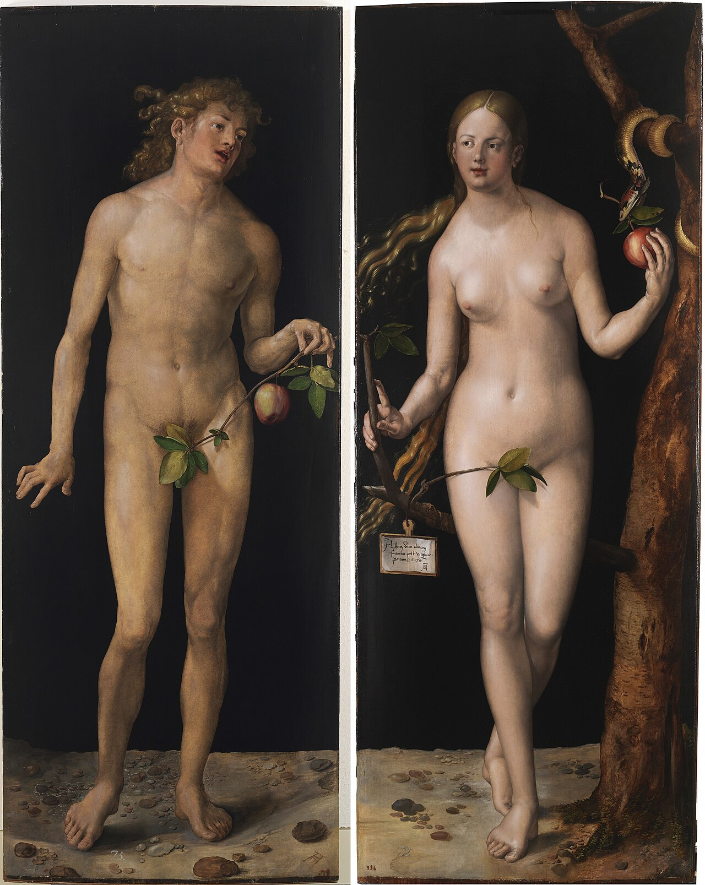

# Session 11 — The First Parents in Eden

*Albrecht Dürer, Adam and Eve (1507). Public Domain via Wikimedia Commons.*

> *Adam and Eve before the fall — naked, unashamed, the lion lying down with the lamb behind them. The painter remembers what we have forgotten: that this was first. We were happy once. We can be again.*

## Pius X asks

**66.** Who were the first human beings?

*The first human beings were Adam and Eve, created immediately by God; all others descend from them, and for this reason they are called the progenitors of mankind.*

**67.** Was man created weak and miserable as we now are?

*Man was not created weak and miserable as we now are, but in a happy state, with a destiny and gifts above human nature.*

**68.** What destiny did man receive from God?

*Man received from God the most exalted destiny of seeing and enjoying Him eternally — the infinite Good — and because this is wholly above the capacity of nature, he received together with it, in order to attain it, a supernatural power which is called grace.*

**69.** Besides grace, what else had God given to man?

*Besides grace, God had given man exemption from the weaknesses and miseries of life and from the necessity of dying, provided he had not sinned, as Adam, the head of mankind, unfortunately did by tasting the forbidden fruit.*

> **Scripture.** *And the Lord God formed man of the slime of the earth: and breathed into his face the breath of life, and man became a living soul.* — Genesis 2:7

> *You breathed me into being, Lord. Today, let me breathe back — toward You, not against You.*
