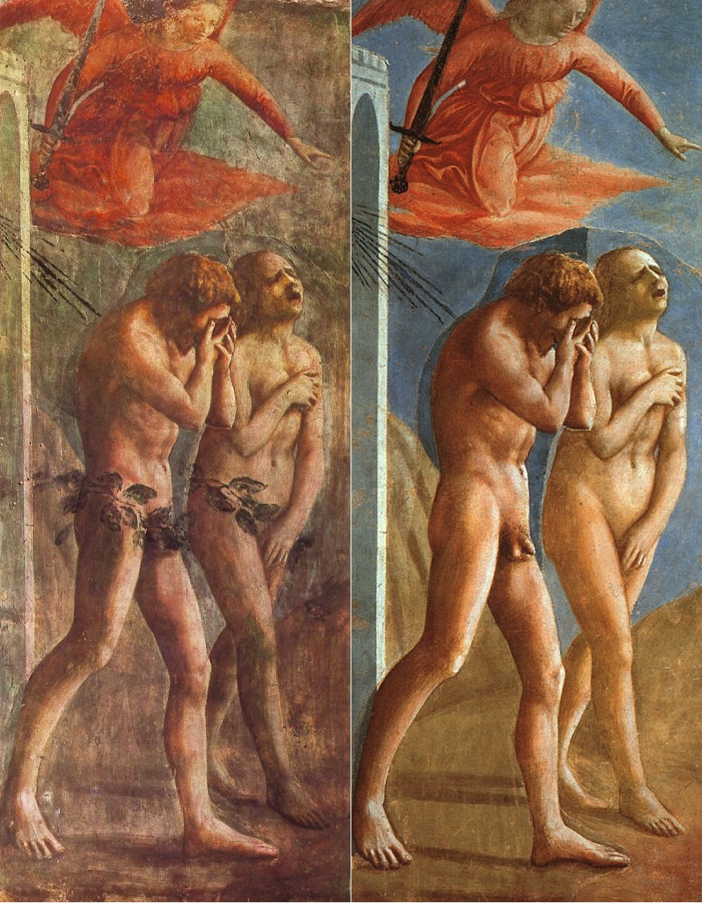

# Session 12 — The Fall and Original Sin

*Masaccio, The Expulsion from the Garden of Eden (c. 1425). Public Domain via Wikimedia Commons.*

> *The angel's sword over Eden's gate. Masaccio's Eve cries out, mouth open, real. Sin is not abstract — it is the voluntary refusal of a love already given. We inherited it, and it inherits in us. But the gate, mercifully, is not the last word.*

## Pius X asks

**70.** What kind of sin was Adam's?

*Adam's sin was a grave sin of pride and disobedience.*

**71.** What harm did Adam's sin cause?

*Adam's sin stripped him and all men of grace and of every other supernatural gift, making them subject to sin, to the devil, to death, to ignorance, to evil inclinations, and to every other misery, and excluding them from heaven.*

**72.** What is the sin called to which Adam subjected mankind by his fault?

*The sin to which Adam subjected mankind by his fault is called original, because, having been committed at the beginning of mankind, it is transmitted with our nature to all human beings at their origin.*

**73.** In what does original sin consist?

*Original sin consists in the privation of original grace, which by God's disposition we ought to have but do not have, because the head of mankind, by his disobedience, deprived himself and all of us, his descendants, of it.*

**74.** How is original sin "voluntary," and therefore a fault for us?

*Original sin is voluntary and therefore a fault for us only because Adam, as the head of mankind, voluntarily committed it; and for this reason God does not punish, but simply does not reward with heaven, one who has only original sin.*

> **Scripture.** *Wherefore as by one man sin entered into this world, and by sin death; and so death passed upon all men, in whom all have sinned.* — Romans 5:12

> *I am inheritor and heir of a wound, Lord. Heal what I cannot heal. Reverse in me what I cannot reverse.*
