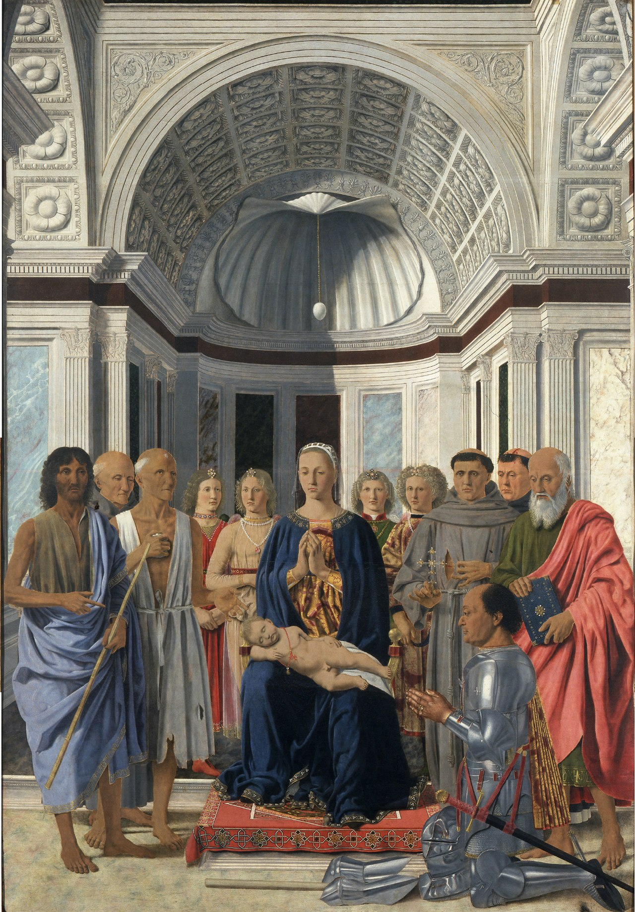

# Session 14 — True God and True Man

*Piero della Francesca, The Baptism of Christ (c. 1448-1450). Public Domain via Wikimedia Commons.*

> *The Jordan opens. The dove descends. The Father speaks. A man is also God; God is also a man. Look at the figure standing in cold water. He is one of you and He is what made you.*

## Pius X asks

**78.** Are there two natures in Jesus Christ?

*In Jesus Christ there are two natures: the divine nature and the human nature.*

**79.** Are there in Jesus Christ also two persons together with the two natures?

*In Jesus Christ, with the two natures, there are not two persons, but only one — the divine Person of the Son of God.*

**80.** How was Jesus Christ known to be the Son of God?

*Jesus Christ was known to be the Son of God because God the Father proclaimed Him such at the Baptism and at the Transfiguration, saying, "This is my beloved Son, in whom I am well pleased" (Matt. III. 17; Luke IX. 35); and because Jesus Himself declared the same in His earthly life.*

**81.** Did Jesus Christ always exist?

*Jesus Christ as God always existed; as man He began to be from the moment of the Incarnation.*

## St. Thomas teaches

## The Divine Generation

It must be known that different things have different modes of generation. The generation of God is different from that of other things. Hence, we cannot arrive at a notion of divine generation except through the generation of that created thing which more closely approaches to a likeness to God. We have seen that nothing approaches in likeness to God more than the human soul. The manner of generation in the soul is effected in the thinking process in the soul of man, which is called a conceiving of the intellect. This conception takes its rise in the soul as from a father, and its effect is called the word of the intellect or of man. In brief, the soul by its act of thinking begets the word. So also the Son of God is the Word of God, not like a word that is uttered exteriorly (for this is transitory), but as a word is interiorly conceived; and this Word of God is of the one nature as God and equal to God.[^9]

The testimony of St. John concerning the Word of God destroys these three heresies, viz., that of Photinus in the words: "In the beginning was the Word;"[^10] that of Sabellius in saying: "And the Word was with God;"[^11] and that of Arius when it says: "And the Word was God.[^12]

But a word in us is not the same as the Word in God. In us the word is an accident;[^13] whereas in God the Word is the same as God, since there is nothing in God that is not of the essence of God. No one would say God has not a Word, because such would make God wholly without knowledge; and therefore, as God always existed, so also did His Word ever exist. Just as a sculptor works from a form which he has previously thought out, which is his word; so also God makes all things by His Word, as it were through His art: "All things were made by Him."[^14]

Now, if the Word of God is the Son of God and all the words of God bear a certain likeness of this Word, then we ought to hear the Word of God gladly; for such is a sign that we love God. We ought also believe the word of God whereby the Word of God dwells in us, who is Christ: "That Christ may dwell by faith in your hearts."[^15] And you have not His word abiding in you."[^16] But we ought not only to believe that the Word of God dwells in us, but also we should meditate often upon this; for otherwise we will not be benefited to the extent that such meditation is a great help against sin: Thy words have I hidden in my heart, that I may not sin against Thee."[^17] Again it is said of the just man: "On His law he shall meditate day and night."[^18] And it is said of the Blessed Virgin that she "kept all these words, pondering them in her heart."[^19] Then also, one should communicate the word of God to others by advising, preaching and inflaming their hearts: "Let no evil speech proceed from your mouth; but that which is good, to the edification of faith."[^20] Likewise, "let the word of Christ dwell in you abundantly in all wisdom, teaching and admonishing one another."[^21] So also: "Preach the word; be instant in season, out of season; reprove, entreat, rebuke in all patience and doctrine."[^22] Finally, we ought to put the word of God into practice: "Be ye doers of the word and not hearers only, deceiving your own selves."[^23]

The Blessed Virgin observed these five points when she gave birth to the Word of God. First, she heard what was said to her: "The Holy Ghost shall come upon thee."[^24] Then she gave her consent through faith: "Behold the handmaid of the Lord."[^25] And she also received and carried the Word in her womb. Then she brought forth the Word of God and, finally, she nourished and cared for Him. And so the Church sings: "Only a Virgin didst nourish Him who is King of the Angels."[^26]

[^1]: 2 Peter 1:16.
[^2]: "Jesus Christ is the Son of God, and true God, like the Father who begot Him from all eternity. We also believe that He is the Second Person of the Blessed Trinity, in all things equal to the Father and to the Holy Spirit. Since we acknowledge the essence, will and power of all the Divine Persons to be one, then in them nothing unequal or unlike should exist or even be imagined to exist: ("Roman Catechism," Second Article, 8).
[^3]: John 1:18.
[^4]: John 8:58.
[^5]: John 8:16.
[^6]: "Symbol" (from the Greek "Symbolon," and the late Latin "Symbolum") is a formal authoritative statement ot the religious belief of the Church, referring here to the Nicene Creed. This treatise of St. Thomas is indeed called by him an "Explanation of the Symbol of the Apostles," or the Apostles Creed.
[^7]: John 10:30.
[^8]: ". . . we beiieve Him [Christ] to be one son, because His divine and human natures meet in one Person. As to His divine generation, He has no brethren or coheirs. being the Only-begotten Son of the Father, and we men are the image and work of His hands" ("Roman Catechism, "loc. cit.," 9-10).
[^9]: "Among the dirferent comparisorls brought forth to show the mode and manner ot this eternal generation, that which is taken from the production of thought in our mind seems to come nearest to its illustration, and hence St. John calls the Son 'the Word.' For our mind, understanding itself in some way, forms an image of itself which theologians have called the word; so God, in so far as we may compare human things to divine, understanding Himself, begets the Eternal Word. But it is more advantageous to consider what faith proposes, and with all sincerity of mind to believe and profess that Jesus Christ is true God and true Man--as God, begotten before all time; as Man, born in time of Mary, His Virgin Mother" ("Roman Catechism," "loc. cit.," 9). St. Thomas treats more fully the eternal generation and Sonship of Christ in the "Summa Theol.," I, Q. xxvii, art. 2; Q. xxxiv.
[^10]: John 1:1.
[^11]: "Ibid."
[^12]: "Ibid."
[^13]: An accident is an attribute which is not part of the essence.
[^14]: John 1:3.
[^15]: Ephesians 3:17.
[^16]: John 5:38.
[^17]: Psalm 118:11.
[^18]: Psalm 1:2.
[^19]: Luke 2:19.
[^20]: Ephesians 4.
[^21]: Colossians 3:16.
[^22]: 2 Timothy 4:2.
[^23]: James 1:22.
[^24]: Luke 1:35.
[^25]: Luke 1.
[^26]: Fourth Responsory, Office of the Circumcision, Dominican Breviary.

> **Scripture.** *And behold a voice from heaven saying: This is my beloved Son, in whom I am well pleased.* — Matthew 3:17

> *Christ, true God and true man — touch what in me only a man can touch, save what only God can save.*

---

#### Going Deeper — *Catechism of Trent*

## "His Only Son"

In these words, mysteries more exalted with regard to Jesus
are proposed to the faithful as objects of their belief and
contemplation; namely, that He is the Son of God, and true God,
like the Father who begot Him from eternity. We also confess that
He is the Second Person of the Blessed Trinity, equal in all
things to the Father and the Holy Ghost; for in the Divine
Persons nothing unequal or unlike should exist, or even be
imagined to exist, since we acknowledge the essence, will and
power of all to be one. This truth is both clearly revealed in
many passages of Holy Scripture and sublimely announced in the
testimony of St. John: In the beginning was the Word, and the
Word was with God, and the Word was God.

But when we are told that Jesus is the Son of God, we are not
to understand anything earthly or mortal in His birth; but are
firmly to believe and piously to adore that birth by which, from
all eternity, the Father begot the Son, a mystery which reason
cannot fully conceive or comprehend, and at the contemplation of
which, overwhelmed, as it were, with admiration, we should
exclaim with the Prophet: Who shall declare his generation? On
this point, then, we are to believe that the Son is of the same
nature, of the same power and wisdom, with the Father, as we more
fully profess in these words of the Nicene Creed: And in one Lord
Jesus Christ, his Onlybegotten Son, born of the Father before
all ages, God of God, light of light, true God of true God,
begotten, not made, consubstantial to the Father, by whom all
things were made.

Among the different comparisons employed to elucidate the
mode and manner of this eternal generation that which is borrowed
from the production of thought in our mind seems to come nearest
to its illustration, and hence St. John calls the Son the Word.
For as our mind, in some sort understanding itself, forms an
image of itself, which theologians express by the term word, so
God, as far as we may compare human things to divine,
understanding Himself, begets the eternal Word. It is better,
however, to contemplate what faith proposes, and in the sincerity
of our souls to believe and confess that Jesus Christ is true God
and true Man, as God, begotten of the Father before all ages, as
Man, born in time of Mary, His Virgin Mother.

While we thus acknowledge His twofold Nativity; we believe
Him to be one Son, because His divine and human natures meet in
one Person. As to His divine generation He has no brethren or
coheirs, being the Onlybegotten Son of the Father, while we
mortals are the work of His hands. But if we consider His birth
as man, He not only calls many by the name of brethren, but
treats them as such, since He admits them to share with Him the
glory of His paternal inheritance. They are those who by faith
have received Christ the Lord, and who really, and by works of
charity, show forth the faith which they profess in words. Hence
the Apostle calls Christ, the firstborn amongst many brethren.

## "Our Lord"

Of our Saviour many things are recorded in Sacred Scripture.
Some of these, it is evident, apply to Him as God and some as
man, because from His two natures He received the different
properties which belong to both. Hence we say with truth that
Christ is Almighty, Eternal, Infinite, and these attributes He
has from His Divine Nature; again, we say of Him that He
suffered, died, and rose again, which are properties manifestly
that belong to His human nature.

Besides these terms, there are others common to both natures;
as when in this Article of the Creed we say our Lord. If, then,
this name applies to both natures, rightly is He to be called our
Lord. For as He, as well as the Father, is the eternal God, so is
He Lord of all things equally with the Father; and as He and the
Father are not the one, one God, and the other, another God, but
one and the same God, so likewise He and the Father are not the
one, one Lord, and the other, another Lord.

As man, He is also for many reasons appropriately called our
Lord. First, because He is our Redeemer, who delivered us from
sin, He deservedly acquired the power by which He truly is and is
called our Lord. This is the doctrine of the Apostle:

He humbled himself, becoming obedient unto death, even to the
death of the cross. For which cause God also hath exalted him,
and hath given him a name which is above all names: that at the
name of Jesus every knee should bend, of those that are in
heaven, on earth, and under the earth: and that every tongue
should confess that the Lord Jesus Christ is in the glory of God
the Father. And of Himself He said, after His Resurrection: All
power is given to me in heaven and in earth.

He is also called Lord because in one Person both natures,
the human and the divine, are united; and even though He had not
died for us, He would have yet deserved, by this admirable union,
to be constituted common Lord of all created things, particularly
of the faithful who obey and serve Him with all the fervour of
their souls.

## Duties Owed To Christ Our Lord

It remains, therefore, that the pastor remind the faithful
that: from Christ we take our name and are called Christians;
that we cannot be ignorant of the extent of His favours,
particularly since by His gift of faith we are enabled to
understand all these things. We, above all others, are under the
obligation of devoting and consecrating ourselves forever, like
faithful servants, to our Redeemer and our Lord.

This indeed, we promised at the doors of the church when
about to be baptised; for we then declared that we renounced the
devil and the world, and gave ourselves unreservedly to Jesus
Christ. But if to be enrolled as soldiers of Christ we
consecrated ourselves by so holy and solemn a profession to our
Lord, what punishments should we not deserve if after our
entrance into the Church, and after having known the will and
laws of God and received the grace of the Sacraments, we were to
form our lives upon the precepts and maxims of the world and the
devil, just as though when cleansed in the waters of Baptism, we
had pledged our fidelity to the world and to the devil, and not
to Christ the Lord and Saviour!

What heart so cold as not to be inflamed with love by the
kindness and good will exercised toward us by so great a Lord,
who, though holding us in His power and dominion as slaves
ransomed by His blood, yet embraces us with such ardent love as
to call us not servants, but friends and brethren? This,
assuredly, supplies the most just, and perhaps the strongest,
claim to induce us always to acknowledge, venerate, and adore Him
as our Lord.

## Duties Owed To Christ Our Lord

It remains, therefore, that the pastor remind the faithful
that: from Christ we take our name and are called Christians;
that we cannot be ignorant of the extent of His favours,
particularly since by His gift of faith we are enabled to
understand all these things. We, above all others, are under the
obligation of devoting and consecrating ourselves forever, like
faithful servants, to our Redeemer and our Lord.

This indeed, we promised at the doors of the church when
about to be baptised; for we then declared that we renounced the
devil and the world, and gave ourselves unreservedly to Jesus
Christ. But if to be enrolled as soldiers of Christ we
consecrated ourselves by so holy and solemn a profession to our
Lord, what punishments should we not deserve if after our
entrance into the Church, and after having known the will and
laws of God and received the grace of the Sacraments, we were to
form our lives upon the precepts and maxims of the world and the
devil, just as though when cleansed in the waters of Baptism, we
had pledged our fidelity to the world and to the devil, and not
to Christ the Lord and Saviour!

What heart so cold as not to be inflamed with love by the
kindness and good will exercised toward us by so great a Lord,
who, though holding us in His power and dominion as slaves
ransomed by His blood, yet embraces us with such ardent love as
to call us not servants, but friends and brethren? This,
assuredly, supplies the most just, and perhaps the strongest,
claim to induce us always to acknowledge, venerate, and adore Him
as our Lord.
