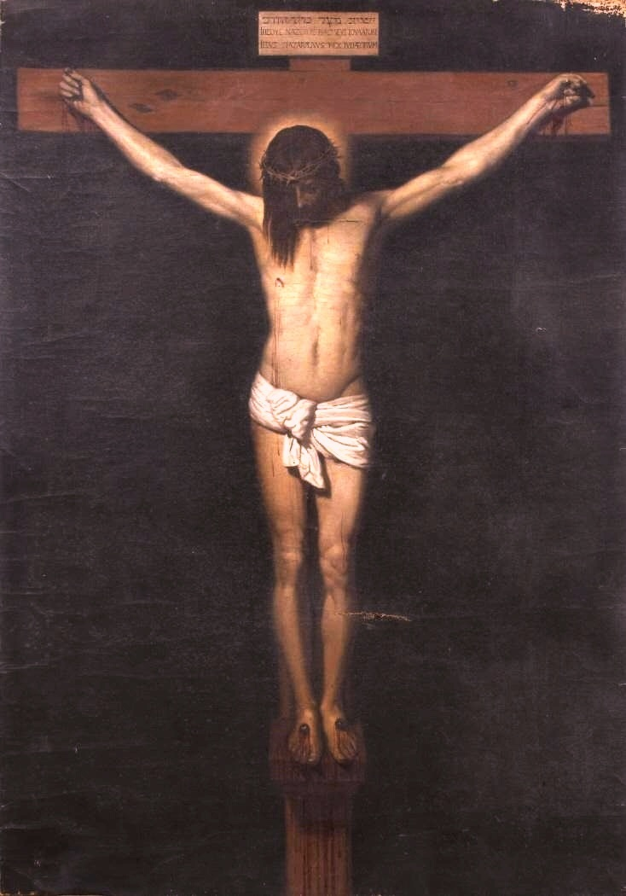

# Session 17 — His Death and the Three Days in the Tomb

*After Diego Velázquez, Christ Crucified (copy after Velázquez) (17th century). Public Domain via Wikimedia Commons.*

> *Velázquez's crucified Christ — quiet, total, alone. He died as a man because as God He could not. Three days a body, in a tomb, in the dark. The center of all the world was right there, hidden under stone.*

## Pius X asks

**89.** Did Jesus Christ die as God or as man?

*Jesus Christ died as man, because as God He could neither suffer nor die.*

**90.** What became of Jesus Christ after His death?

*After His death, Jesus Christ descended in soul to Limbo, to the souls of the just who had died until then, to lead them with Him into heaven; then He rose, taking again His body which had been buried.*

**91.** How long did the body of Jesus Christ remain in the tomb?

*The body of Jesus Christ remained in the tomb three days, not whole, from the evening of Friday until the dawn of the day now called Easter Sunday.*

## St. Thomas teaches

It is just as necessary for the Christian to believe in the passion and death of the Son of God as it is to believe in His Incarnation. For, as St. Gregory says, "there would have been no advantage in His having been born for us unless we had profited by His Redemption." That Christ died for us is so tremendous a fact that our intellect can scarcely grasp it; for in no way does it fall in the natural way of our understanding. This is what the Apostle says: "I work in your days, a work which you will not believe, if any man shall tell it to you."[^1] The grace of God is so great and His love for us is such that we cannot understand what He has done for us. Now, we must believe that, although Christ suffered death, yet His Godhead did not die; it was the human nature in Christ that died. For He did not die as God, but as man.[^2]

This will be clear from two examples, one of which is taken from himself. Now, when a man dies, in the separation of the soul from the body the soul does not die but the body or flesh does die. So also in the death of Christ, His Divinity did not die, but His man nature suffered death. But if the Jews did not slay the Divinity of Christ, it would seem that their sin was not any greater than if they killed any ordinary man. In answering this we say that it is as if a king were clothed only in one garment, and if someone befouled this garment, such a one has committed as grave a crime as if he had defiled the king himself. Likewise, although the Jews could not slay God, yet in putting to death the human nature which Christ assumed, they were as severely punished as if they had put the Godhead itself to death. Another example is had from what we said before, viz., that the Son of God is the Word of God, and the Word of God made flesh is like the word of a king written on paper.[^3] So if one should tear this royal paper in pieces, it would be considered that he had rent apart the word of the king. Thus, the sin of the Jews was as grievous as if they had slain the Word of God.

But what need was there that the Son of God should suffer for us? There was a great need; and indeed it can be assigned to two reasons. The first is that it was a remedy against sin, and the second is for an example of what we ought to do. It was a remedy to such an extent that in the passion of Christ we find a remedy against all the evils which we incur by our sins. And by our sins we incur five different evils.

## Evil Effects of Sin

The first evil that man incurs by sin is the defilement of his soul. Just as virtue gives the soul its beauty, so sin makes it ugly. "How happened it, O Israel, that thou art in thy enemies' land? . . . Thou art defiled with the dead."[^4] But all this is taken away by the passion of Christ, whereby Christ poured out His blood as a laver wherein sinners are cleansed: "Who hath loved us and washed us from our sins in His own blood."[^5] So, too, the soul is washed by the blood of Christ in baptism because then a new birth is had in virtue of His blood, and hence when one defiles one's soul by sin, one offers insult to Christ and sins more gravely than before one's baptism. "A man making void the law of Moses dieth without any mercy under two or three witnesses. How much more, do you think, he deserveth worse punishments, who hath trodden underfoot the Son of God and hath esteemed the blood of the testament unclean!"[^6]

Secondly, we commit an offense against God. A sensual man loves the beauty of the flesh, but God loves spiritual beauty, which is the beauty of the soul. When, however, the soul is defiled by sin, God is offended and the sinner incurs His hatred: "To God the wicked and his wickedness are hateful alike."[^7] This also is removed by the passion of Christ, which made satisfaction to God the Father for sin--a thing which man of himself could never do. The charity and obedience of Christ in His suffering were greater than the sin and disobedience of the first man: "When we were enemies, we were reconciled to God by the death of His Son."[^8]

Thirdly, we have been weakened by sin. When a person sins the first time, he believes that he will thereafter keep away from sin, but what happens is the very opposite. This is because by that first sin he is weakened and made more prone to commit sins, and sin more and more has power over him. Such a one, as far as he alone is concerned, has lowered himself to such a condition that he cannot rise up, and is like to a man who jumps into a well from which, without God's help, he would never be rescued. After the fall of man, our nature was weakened and corrupted, and we were made more prone to sin. Christ, however, lessened this sickness and weakness, although He did not entirely take it away. So now man is strengthened by the passion of Christ, and sin is not given such power over him. Moreover, he can rise clean from his sins when aided by God's grace conferred by the Sacraments, which receive their efficacy from the passion of Christ: "Our old man is crucified with Him, that the body of sin may be destroyed."[^9] Indeed, before the passion of Christ few there were who lived without falling into mortal sin; but afterwards many have lived and are living without mortal sin.

Fourthly, we incur the punishment due to sin. For the justice of God demands that whosoever sins must be punished. This punishment, however, is in proportion to the guilt. But the guilt of mortal sin is infinite, because it is an offense against the infinite good, namely, God, whose commandments the sinner holds in contempt. Therefore, the punishment due to mortal sin is infinite. Christ, however, through His passion has taken away this punishment from us and borne it Himself: "Who His own self bore our sins in His body upon the tree."[^10] "Our sins [that is, the punishment due to sin] His own self bore in His body." The passion of Christ was of such value that it sufficed to expiate for all the sins of the whole world, even of a hundred thousand worlds. And so it is that, when a man is baptized, he is released from all his sins; and so also is it that the priest forgives sins; and, again, the more one conforms himself to the passion of Christ, the greater is the pardon and the grace which he gains.

Fifthly, we incur banishment from the kingdom of heaven. Those who offend kings are compelled to go into exile. Thus, man is expelled from heaven on account of sin. Adam was driven out of paradise immediately after his sin, and the gate of paradise was shut. But Christ by His sufferings and death opened this gate and recalled all the exiles to the kingdom. With the opening of the side of Christ, the gate of paradise is opened; and with the pouring out of His blood, guilt is washed away, satisfaction is made to God, infirmity is removed, punishment is expiated, and the exiles are called back to the kingdom. Hence, the thief received the immediate response: "This day thou shalt be with Me in paradise."[^11] Never before was this spoken to anyone, not to Adam, not to Abraham, not to David; but this day (i.e., as soon as the gate is opened) the thief, having asked for pardon, received it: "Having a confidence in the entering into the holies by the blood of Christ."[^12]

## Christ, Exemplar of Virtues

From all this then is seen the effect of the passion of Christ as a remedy for sin. But no less does it profit us as an example. St. Augustine says that the passion of Christ can bring about a complete reformation of our lives. Whoever wishes to live perfectly need do nothing other than despise what Christ despised on the cross, and desire what Christ desired. There is no virtue that did not have its example on the Cross.

So if you seek an example of charity, then, "greater love than his no man hath, that a man lay down his life for his friends."[^13] And this Christ did upon the Cross. If, therefore, He gave His life or us, we ought to endure any and all evils for Him: "What shall I render to the Lord for all the things that He hath rendered to me?"[^14]

If you seek an example of patience, you will find it in its highest degree upon the Cross. Great patience is exemplified in two ways: either when one suffers intensely in all patience, or when one suffers that which he could avoid if he so wished. Christ suffered greatly upon the Cross: "O all ye that pass by the way, attend, and see if there be any sorrow like to My sorrow."[^15] And with all patience, because, "when He suffered, He threatened not."[^16] And again: "He shall be led as a sheep to the slaughter and shall be dumb before His shearer, and shall not open His mouth.[^17] He could have avoided this suffering, but He did not: "Thinkest thou that I cannot ask My Father, and He will give Me presently more than twelve legions of Angels?"[^18] The patience of Christ upon the cross, therefore, was of the highest degree: "Let us run by patience to the fight proposed to us; looking on Jesus, the author and finisher of faith, who, having joy set before Him endured the cross, despising the shame."[^19]

If you seek an example of humility, look upon Him who is crucified; although He was God, He chose to be judged by Pontius Pilate and to be put to death: "Thy cause has been judged as that of the wicked."[^20] Truly "that of the wicked," because: "Let us condemn Him to a most shameful death."[^21] The Lord chose to die for His servant; the Life of the Angels suffered death for man: "He humbled Himself, becoming obedient unto death, even to the death of the cross."[^22]

If you seek an example of obedience, imitate Him who was obedient to the Father unto death: "For by the disobedience of one man, many were made sinners; so also by the obedience of one, many shall be made just."[^23]

If you seek an example of contempt for earthly things, imitate Him who is the King of kings, the Lord of rulers, in whom are all the treasures of wisdom; but on the Cross He was stripped naked, ridiculed, spat upon, bruised, crowned with thorns, given to drink of vinegar and gall, and finally put to death. How falsely, therefore, is one attached to riches and raiment, for: "They parted My garments amongst them; and upon My vesture they cast lots."[^24] How falsely to honors, since "I was covered with lashes and insults;" how falsely to positions of power, because "taking a crown of thorns, they placed it upon My brow;" how falsely to delicacies of the table, for "in My thirst they gave Me to drink of vinegar." Thus, St. Augustine, in commenting on these words, "Who, having joy set before Him, endured the Cross despising the shame,"[^25] says: "The man Christ despised all earthly things in order to teach us to despise them.

[^1]: Acts, xiii. 41 (quoting Hab., i. 5).
[^2]: "As Christ was true and perfect man, He was capable of truly dying. Now, man dies when the soul is separated from the body. When, therefore, we say that Jesus died, we mean this, that His soul was disunited from His body. We do not admit, however, that the Divinity was separated from His Body. On the contrary, we firmly believe and profess that when His soul was dissociated from His body, His Divinity continued always united both to His body in the sepulchre and to His soul in limbo" ("Roman Catechism," Fourth Article, 6).
[^3]: See above, p. 6.
[^4]: Bar., iii. 10-11.
[^5]: Apoc., i. 5.
[^6]: Heb., x. 28-29.
[^7]: Wis., xiv. 9.
[^8]: Rom., v. 10.
[^9]: Rom., vi. 6.
[^10]: I Pet., ii. 24.
[^11]: Luke, xxiii. 43.
[^12]: Heb., x.
[^13]: John, xv. 13.
[^14]: Ps. cxv. 12.
[^15]: Lament., i. 12.
[^16]: Pet., ii. 23.
[^17]: Isa., liii. 7.
[^18]: Matt., xxvi. 53.
[^19]: Heb., xii. 1-2.
[^20]: Job, xxxvi. 17.
[^21]: Wis., ii. 20.
[^22]: Phil., ii. 8.
[^23]: Rom., v. 19.
[^24]: Ps. xxi. 19.
[^25]: Heb., xii. 2.

---

The death of Christ was the separation of His soul from His body as it is with other men. But the Divinity was so indissolubly conjoined to the Man-Christ that although His soul and body were disunited, His Divinity was always most perfectly united to both the soul and body. This we have seen above. Therefore in the Sepulchre His body was together with the Son of God who together with His soul descended into hell.[^1]

## Reasons for Christ's Descent

There are four reasons why Christ together with His soul descended into hell. First, He wished to take upon Himself the entire punishment for our sin, and thus atone for its entire guilt. The punishment for the sin of man was not alone death of the body, but there was also a punishment of the soul, since the soul had its share in sin; and it was punished by being deprived of the beatific vision; and as yet no atonement had been offered whereby this punishment would be taken away. Therefore, before the coming of Christ all men, even the holy fathers after their death, descended into hell. Accordingly in order to take upon Himself most perfectly the punishment due to sinners, Christ not only suffered death, but also His soul descended into hell.[^2] He, however, descended for a different cause than did the fathers; for they did so out of necessity and were of necessity taken there and detained, but Christ descended there of His own power and free will: "I am counted among them that go down to the pit; I am become as a man without help, free among the dead."[^3] The others were there as captives, but Christ was freely there.

The second reason is that He might perfectly deliver all His friends. Christ had His friends both in the world and in hell. The former were His friends in that they possessed charity; and the latter were they who departed this life with charity and faith in the future Redeemer, such as Abraham, Isaac, Jacob, Moses, David, and other just and good men. Therefore, since Christ had dwelt among His friends in this world and had delivered them by His death, so He wished to visit His friends who were detained in hell and deliver them also: "I will penetrate to all the lower parts of the earth, and will behold all that hope in the Lord."[^4]

The third reason is that He would completely triumph over the devil. Now, a person is perfectly vanquished when he is not only overcome in conflict, but also when the assault is carried into his very home, and the seat of his kingdom is taken away from him. Thus Christ triumphed over the devil,[^5] and on the Cross He completely vanquished him: "Now is the judgment of this world; now shall the prince of this world (that is, the devil) be cast out."[^6] To make this triumph complete, Christ wished to deprive the devil of the seat of his kingdom and to imprison him in his own house- -which is hell. Christ, therefore, descended there, and despoiled the devil of everything and bound him, taking away his prey:[^7] "And despoiling the principalities and powers, He hath exposed them confidently in open show, triumphing over them in Himself."[^8] Likewise, Christ who had received the power and possession of heaven and earth, desired too the possession of hell, as says the Apostle: "That in the name of Jesus every knee should bow, of those that are in heaven, on earth, and under the earth."[^9] "In My name they shall cast out devils."[^10]

The fourth and final reason is that Christ might free the just who were in hell [or Limbo]. For as Christ wished to suffer death to deliver the living from death, so also He would descend into hell to deliver those who were there: "Thou also by the blood of Thy testament, hast sent forth Thy prisoners out of the pit wherein is no water."[^11] And again: "O death, I will be thy death; O hell, I will be thy bite."[^12] Although Christ wholly overcame death, yet not so completely did He destroy hell, but, as it were, He bit it. He did not free all from hell, but those only who were without mortal sin. He likewise liberated those without original sin, from which they, as individuals, were freed by circumcision; or before [the institution of] circumcision, they who had been saved through their parents' faith (which refers to those who died before having the use of reason); or by the sacrifices, and by their faith in the future coming of Christ (which refers to adults)."[^13] The reason they were there in hell [i.e., Limbo] is original sin which they had contracted from Adam, and from which as members of the human race they could not be delivered except by Christ. Therefore, Christ left there those who had descended there with mortal sin, and the non-circumcised children. Thus, it is seen that Christ descended into hell, and for what reasons. Now we may gather four considerations from this for our own instruction.

## What We May Learn from This

(1) A firm hope in God. No matter how much one is afflicted, one ought always hope in the assistance of God and have trust in Him. There is nothing so serious as to be in hell. If, therefore, Christ delivered those who were in hell, what great confidence ought every friend of God have that he will be delivered from all his troubles! "She [that is, wisdom] forsook not the just when he was sold, but delivered him from sinners. She went down with him into the pit. And in bonds she left him not."[^14] God helps in a special manner those who serve Him, and hence the servant of God should feel secure in Him: "He that feareth the Lord shall tremble at nothing and shall not be afraid; for He is his hope."[^15]

(2) We ought to conceive a fear of God and avoid all presumption. We have already seen that Christ suffered for sinners and descended into hell for them. However, He did not deliver all sinners, but only those who were free from mortal sin. He left there those who departed this life in mortal sin. Hence, anyone who descends into hell in mortal sin has no hope of deliverance; and he will remain in hell as long as the holy fathers remain in paradise, that is, for all eternity: "And these shall go into everlasting punishment; but the just, into life everlasting."[^16]

(3) We ought to arouse in ourselves a mental anxiety. Since Christ descended into hell for our salvation, we ought in all care go down there in spirit by considering, for instance, its punishments as did that holy man, Ezechias: "I said: In the midst of my days I shall go to the gates of hell.[^17] Indeed, he who during this life frequently descends into hell by thinking of it, will not easily fall into hell at death; for such meditation keeps one from sin, and draws one out of it. We see how men of this world guard themselves against wrongdoing because of the temporal punishment; but with how much more care ought they avoid the punishment of hell which far exceeds all else in its duration, its severity, and its varied nature! "In all thy works remember thy last end, and thou shalt never sin."[^18]

(4) There comes to us in this an example of love. Christ descended into hell in order to deliver His own; and so we should go down there to rescue our own. They cannot help themselves. Therefore, let us deliver those who are in purgatory. He would be very hard-hearted who does not come to the aid of a relative who is detained in an earthly prison; but much more cruel is he who will not assist a friend who is in purgatory, for there is no comparison between the pains of this world and of that: "Have pity on me, have pity on me, at least you my friends, because the hand of the Lord hath touched me."[^19] "It is therefore a holy and wholesome thought to pray for the dead, that they may be loosed from their sins."[^20] We may assist these souls in three ways as St. Augustine tells us, viz., through Masses, prayers, and almsgiving. St. Gregory adds a fourth, that is, fasting. All this is not so amazing, for even in this world a friend can pay a debt for his friend; but this applies only to those who are in purgatory.

(For "Questions for Discussions" see pp. 181-194.)

[^1]: "Hell here means those far-removed places in which are detained those souls that have not been awarded the happiness of heaven. . . These places are not of the same nature. There is that most abominable and most dark prison where the souls of the damned, together with the unclean spirits, are punished in eternal and unquenchable fire. This is gehenna or the 'abyss,' and is Hell, strictly so-called. There also is the fire of Purgatory, in which the suffering souls of the just are purified for a definite time in order that they be permitted to enter into the everlasting Fatherland, where nothing unclean is admitted. . . The third and last place is that in which the souls of the just before the coming of the Lord were received; there without any pain, sustained by the blessed hope of the redemption, they enjoyed a quiet repose. It was to these souls who waited in the bosom of Abraham that Christ the Lord descended, and whom He delivered" ("Roman Catechism," Fifth Article, Chapter VI, 2-3). Therefore, "He descended into hell" means that the soul of Jesus Christ, after His death, descended into Limbo, i.e., to the place where the souls of the just who died before Christ were detained, and were waiting for the time of their redemption. St. Peter writes: "He was put to death indeed in the flesh. but enlivened in the spirit, in which also coming, He preached to those spirits that were in prison" (I Peter, iii, 18-19). "We profess that immediately after the death of Christ, His soul descended into hell, and remained there as long as His body was in the sepulchre; and we believe also that the one Person of Christ was at the same time in hell and in the tomb" ("Roman Catechism," "loc. cit.," 1).
[^2]: See last footnote. This place is also called Limbo.
[^3]: Ps. lxxxvii. 5. "They descended as captives; He as free and victorious amongst the dead, to overcome those devils by whom, in consequence of their guilt, they were held in captivity" ("Roman Catechism," "loc. cit.," 5).
[^4]: Ecclus., xxiv. 45.
[^5]: This refers to the temptation of Our Lord in the desert.
[^6]: John, xii. 31.
[^7]: St. Thomas says that the soul of Christ descended to the hell of the just or to Limbo "per suam essentiam," but to the hell of the damned only "per suum effectum" ("Summa Theol.," III, Q. lii, Art. 2).
[^8]: Col., ii. 15.
[^9]: Phil., ii. Io
[^10]: Mark, xvi. 17.
[^11]: Zach.. ix. 11.
[^12]: Osee, xiii. 14.
[^13]: Italics added.
[^14]: Wis., 13-14.
[^15]: Ecclus., xxxiv. 16.
[^16]: Matt., xxv. 46.
[^17]: Isa., xxxviii. 10.
[^18]: Ecclus., vii. 40.
[^19]: Job, xix. 21.
[^20]: II Mach., xii. 46.

> **Scripture.** *Christ also died once for our sins, the just for the unjust: that he might offer us to God, being put to death indeed in the flesh, but enlivened in the spirit.* — 1 Peter 3:18

> *By Your wounds I am healed. Today, let me carry someone else's a little, in You.*

---

#### Going Deeper — *Catechism of Trent*

## Importance Of This Article

How necessary is a knowledge of this Article, and how
assiduous the pastor should be in stirring up in the minds of the
faithful the frequent recollection of our Lord's Passion" we
learn from the Apostle when he says that he knows nothing but
Jesus Christ and him crucified.' The pastor, therefore, should
exercise the greatest care and pains in giving a thorough
explanation of this subject" in order that the
faithful" being moved by the remembrance of so great a
benefit" may give themselves entirely to the contemplation
of the goodness and love of God towards us.

## First Part of this Article: "Suffered Under Pontius Pilate, was Crucified"

The first part of this Article (of the second we shall treat
hereafter) proposes for our belief that when Pontius Pilate
governed the province of Judea" under Tiberius Caesar"
Christ the Lord was nailed to a cross. Having been seized"
mocked, outraged and tortured in various forms" He was
finally crucified.

### "Suffered"

It cannot be a matter of doubt that His soul" as to its
inferior part" was sensible of these torments; for as He
really assumed human nature" it is a necessary consequence
that He really, and in His soul, experienced a most acute sense
of pain. Hence these words of the Saviour: My soul is sorrowful
even unto death.

Although human nature was united to the Divine Person, He
felt the bitterness of His Passion as acutely as if no such union
had existed" because in the one Person of Jesus Christ were
preserved the properties of both natures" human and divine;
and therefore what was passible and mortal remained passible and
mortal; while what was impassible and immortal, that is, His
Divine Nature, continued impassible and immortal.

### "Under Pontius Pilate"

Since we find it here so diligently recorded that Jesus Christ
suffered when Pontius Pilate was procurator of Judea, the pastor
should explain the reason. By fixing the time, which we find also
done by the Apostle Paul, so important and so necessary an event
is rendered more easily ascertainable by all. Furthermore those
words show that the Saviour's prediction was really verified:
They shall deliver him to the Gentiles, to be mocked and scourged
and crucified.

### "Was Crucified"

The fact that He suffered death precisely on the wood of the
cross must also be attributed to a particular counsel of God,
which decreed that life should return by the way whence death had
arisen The serpent who had triumphed over our first parents by
the wood (of a tree) was vanquished by Christ on the wood of the
cross.

Many other reasons which the Fathers have discussed in detail
might be adduced to show that it was fit that our Redeemer should
suffer death on the cross rather than in any other way. But, as
the pastor will show" it is enough for the faithful to
believe that this kind of death was chosen by the Saviour because
it appeared better adapted and more appropriate to the redemption
of the human race; for there certainly could be none more
ignominious and humiliating. Not only among the Gentiles was the
punishment of the cross held accursed and full of shame and
infamy, but even in the Law of Moses the man is called accursed
that hangeth on a tree.

### Importance Of The History Of The Passion

Furthermore, the pastor should not omit the historical part of
this Article, which has been so carefully set forth by the holy
Evangelists; so that the faithful may be acquainted with at least
the principal points of this mystery, that is to say, such as
seem more necessary to confirm the truth of our faith. For it is
on this Article, as on their foundation, that the Christian faith
and religion rest; and if this truth be firmly established, all
the rest is secure. Indeed, if one thing more than another
presents difficulty to the mind and understanding of man,
assuredly it is the mystery of the cross, which, beyond all
doubt, must be considered the most difficult of all; so much so
that only with great difficulty can we grasp the fact that our
salvation depends on the cross, and on Him who for us was nailed
thereon. In this, however, as the Apostle teaches, we may well
admire the wonderful Providence of God; for, seeing that in the
wisdom of God, the world by wisdom knew not God, it pleased God
by the foolishness of preaching, to save them that believe. It is
no wonder, then, that the Prophets, before the coming of Christ,
and the Apostles, after His death and Resurrection, labored so
strenuously to convince mankind that He was the Redeemer of the
world, and to bring them under the power and obedience of the
Crucified.

### Figures And Prophecies Of The Passion And Death Of The Saviour

Since, therefore, nothing is so far above the reach of human
reason as the mystery of the cross, the Lord immediately after
the fall ceased not, both by figures and prophecies, to signify
the death by which His Son was to die.

To mention a few of these types. First of all, Abel, who fell
a victim of the envy of his brother, Isaac who was commanded to
be offered in sacrifice, the lamb immolated by the Jews on their
departure from Egypt, and also the brazen serpent lifted up by
Moses in the desert, were all figures of the Passion and death of
Christ the Lord.

As to the Prophets, how many there were who foretold Christ's
Passion and death is too well known to require development here.
Not to speak of David, whose Psalms embrace all the principal
mysteries of Redemption, the oracles of Isaias in particular are
so clear and graphic that he might be said rather to have
recorded a past than predicted a future event. a

## Second Part Of This Article: "Dead, And Buried"

### Christ Really Died

The pastor should explain that these words present for our
belief that Jesus Christ, after He was crucified, really died and
was buried. It is not without just reason that this is proposed
to the faithful as a separate object of belief, since there were
some who denied His death upon the cross. The Apostles,
therefore, were justly of opinion that to such an error should be
opposed the doctrine of faith contained in this Article, the
truth of which is placed beyond the possibility of doubt by the
united testimony of all the Evangelists, who record that Jesus
yielded up the ghost.

Moreover as Christ was true and perfect man, He of course was
capable of dying. Now man dies when the soul is separated from
the body. When, therefore, we say that Jesus died, we mean that
His soul was disunited from His body. We do not admit, however,
that the Divinity was separated from His body. On the contrary,
we firmly believe and profess that when His soul was dissociated
from His body, His Divinity continued always united both to His
body in the sepulchre and to His soul in limbo. It became the Son
of God to die, that, through death, he might destroy him who had
the empire of death that is the devil, and might deliver them,
who through the fear of death were all their lifetime subject to
servitude.

### Christ Died Freely

It was the peculiar privilege of Christ the Lord to have died
when He Himself decreed to die, and to have died not so much by
external violence as by internal assent. Not only His death, but
also its time and place, were ordained by Him. For thus Isaias
wrote: He was offered because it was his own will. The Lord
before His Passion, declared the same of Himself: I lay down my
life, that I may take it again. No man taketh it away from me:
but I lay it down of myself, and I have power to lay it down: and
I have power to take it again. As to the time and place of His
death, He said, when Herod insidiously sought His life: Go and
tell that fox: Behold I cast out devils, and do cures today and
tomorrow, and the third day I am consummated. Nevertheless I
must walk today and tomorrow, and the day following, because it
cannot be that a prophet perish out of Jerusalem.'' He therefore
offered Himself not involuntarily or by compulsion but of His own
free will. Going to meet His enemies He said: I am he; and all
the punishments which injustice and cruelty inflicted on Him He
endured voluntarily.

### The Thought Of Christ's Death Should Excite Our Love And Gratitude

When we meditate on the sufferings and all the torments of the
Redeemer, nothing is better calculated to stir our souls than the
thought that He endured them thus voluntarily. Were anyone to
endure all kinds of suffering for our sake, not because he chose
them but simply because he could not escape them, we should not
consider this a very great favour; but were he to endure death
freely, and for our sake only, having had it in his power to
avoid it, this indeed would be a benefit so overwhelming as to
deprive even the most grateful heart, not only of the power of
returning but even of feeling due thanks. We may hence form an
idea of the transcendent and intense love of Jesus Christ towards
us, and of His divine and boundless claims to our gratitude.

### Christ Was Really Buried

When we confess that He was buried, we do not make this, as it
were, a distinct part of the Article, as if it presented any new
difficulty which is not implied in what we have said of His
death; for if we believe that Christ died, we can also easily
believe that He was buried. The word buried was added in the
Creed, first, that His death might be rendered more certain, for
the strongest argument of a person's death is the proof that his
body was buried; and, secondly, to render the miracle of His
Resurrection more authentic and illustrious.

It is not, however, our belief that the body of Christ alone
was interred. The above words propose, as the principal object of
our belief, that God was buried; as according to the rule of
Catholic faith we also say with the strictest truth that God
died, and that God was born of a virgin. For as the Divinity was
never separated from His body which was laid in the sepulchre, we
truly confess that God was buried.

### Circumstances Of Christ's Burial

As to the manner and place of His burial, what the holy
Evangelists record on these subjects will be sufficient for the
pastor. There are, however, two things which demand particular
attention; the one, that the body of Christ was in no degree
corrupted in the sepulchre, according to the prediction of the
Prophet: Thou wilt not give thy holy one to see corruption; the
other, and it regards the several parts of this Article, that
burial, Passion, and also death, apply to Christ Jesus not as God
but as man. To suffer and die are incidental to human nature
only; yet they are also attributed to God, since, as is clear,
they are predicated with propriety of that Person who is at once
perfect God and perfect man.

## Useful Considerations on the Passion

When the faithful have once attained the knowledge of these
things, the pastor should next proceed to explain those
particulars of the Passion and death of Christ which may enable
them if not to comprehend, at least to contemplate, the immensity
of so stupendous a mystery.

### The Dignity Of The Sufferer

And first we must consider who it is that suffers all these
things. His dignity we cannot express in words or even conceive
in mind. Of Him St. John says, that He is the Word which was with
God. And the Apostle describes Him in sublime terms, saying that
this is He whom God hath appointed heir of all things, by whom
also he made the world, who being the brightness of his glory,
and the figure of his substance, and upholding all things by the
word of his power, making purgation of sins. sitteth on the right
hand of the majesty on high. In a word, Jesus Christ, the
Godman, suffers ! The Creator suffers for His creatures, the
Master for His servant. He suffers by whom the Angels, men, the
heavens, and the elements were made; in whom, by whom, and of
whom, are all things.

It cannot, therefore, be a matter of surprise that while He
agonised under such an accumulation of torments the whole frame
of the universe was convulsed; for as the Scriptures inform us,
the earth quaked, and the rocks were rent, there was darkness
over all the earth; and the sun was obscured. If, then, even mute
and inanimate nature sympathised with the sufferings of her
Creator, let the faithful consider with what tears they, the
living stones of this edifice, should manifest their sorrow.

### Reasons Why Christ Suffered

The reasons why the Saviour suffered are also to be explained,
that thus the greatness and intensity of the divine love towards
us may the more fully appear. Should anyone inquire why the Son
of God underwent His most bitter Passion, he will find that
besides the guilt inherited from our first parents the principal
causes were the vice's and crimes which have been perpetrated
from the beginning of the world to the present day and those
which will be committed to the end of time. In His Passion and
death the Son of God, our Saviour, intended to atone for and blot
out the sins of all ages, to offer for them to his Father a full
and abundant satisfaction.

Besides, to increase the dignity of this mystery, Christ not
only suffered for sinners, but even for those who were the very
authors and ministers of all the torments He endured. Of this the
Apostle reminds us in these words addressed to the Hebrews: Think
diligently upon him that endured such opposition from sinners
against himself; that you be not wearied, fainting in your minds.
In this guilt are involved all those who fall frequently into
sin; for, as our sins consigned Christ the Lord to the death of
the cross, most certainly those who wallow in sin and iniquity
crucify to themselves again the Son of God, as far as in them
lies, and make a mockery of Him. This guilt seems more enormous
in us than in the Jews, since according to the testimony of the
same Apostle: If they had known it, they would never have
crucified the Lord of glory; while we, on the contrary,
professing to know Him, yet denying Him by our actions, seem in
some sort to lay violent hands on him.

### Christ Was Delivered Over To Death By The Father And By Himself

But that Christ the Lord was also delivered over to death by
the Father and by Himself, the Scriptures bear witness. For in
Isaias (God the Father) says For the wickedness of my people have
I struck him. And a little before the same Prophet filled with
the Spirit of God, cried out, as he saw the Lord covered with
stripes and wounds: All we like sheep have gone astray, every one
hath turned aside into his own way: and the Lord hath laid on him
the iniquity of us all. But of the Son it is written: If he shall
lay down his life for sin, he shall see a longlived seed. This
the Apostle expresses in language still stronger when, in order
to show how confidently we, on our part, should trust in the
boundless mercy and goodness of God, he says: He that spared not
even his own Son, but delivered him up for us all, how hath he
not also, with him, given us all things? a

### The Bitterness Of Christ's Passion

The next subject of the pastor's instruction is the bitterness
of the Redeemer's Passion. If we bear m mind that his sweat
became as drops of blood, trickling down upon the ground, and
this, at the sole anticipation of the torments and agony which He
was about to endure, we must at once perceive that His sorrows
admitted of no increase. For if the very idea of impending evils
was overwhelming, and the sweat of blood shows that it was, what
are we to suppose their actual endurance to have been ?

That Christ our Lord suffered the most excruciating torments
of mind and body is certain. In the first place, there was no
part of His body that did not experience the most agonising
torture. His hands and feet were fastened with nails to the
cross; His head was pierced with thorns and smitten with a reed;
His face was befouled with spittle and buffeted with blows; His
whole body was covered with stripes.

Furthermore men of all ranks and conditions were gathered
together against the Lord, and against his Christ. Gentiles and
Jews were the advisers, the authors, the ministers of His
Passion: Judas betrayed Him, Peter denied Him, all the rest
deserted Him.

And while He hangs from the cross are we not at a loss which
to deplore, His agony, or His ignominy, or both? Surely no death
more shameful, none more cruel, could have been devised than
this. It was the punishment usually reserved for the most guilty
and atrocious malefactors, a death whose slowness aggravated the
exquisite pain and torture I

His agony was increased by the very constitution and frame of
His body. Formed by the power of the Holy Ghost, it was more
perfect and better organised than the bodies of other men can be,
and was therefore endowed with a superior susceptibility and a
keener sense of all the torments which it endured.

And as to His interior anguish of soul, that too was no doubt
extreme; for those among the Saints who had to endure torments
and tortures were not without consolation from above, which
enabled them not only to bear their sufferings patiently, but in
many instances, to feel, in the very midst of them, filled with
interior joy. I rejoice, says the Apostle, in my sufferings for
you, and fill up those things that are wanting of the sufferings
of Christ, in my flesh, for his body, which is the church;' and
in another place: I am filled with comfort, I exceedingly abound
with joy in all our tribulations. Christ our Lord tempered with
no admixture of sweetness the bitter chalice of His Passion but
permitted His human nature to feel as acutely every species of
torment as if He were only man, and not also God.

### Fruits Of Christ's Passion

It only remains now that the pastor carefully explain the
blessings and advantages which flow from the Passion of Christ.
In the first place, then, the Passion of our Lord was our
deliverance from sin; for, as St. John says, He hath loved us,
and washed us from our sins in his own blood. He hath quickened
you together with him, says the Apostle, forgiving you all
offences, blotting out the handwriting of the decree that was
against us, which was contrary to us. And he hath taken the same
out of the way, fastening it to the cross.

In the next place He has rescued us from the tyranny of the
devil, for our Lord Himself says: Now is the judgment of the
world; now shall the prance of this world be cast out. And I if I
be lifted up from the earth, will draw all things to myself.

Again He discharged the punishment due to our sins. And as no
sacrifice more pleasing and acceptable could have been offered to
God, He reconciled us to the Father, appeased His wrath, and made
Him favourable to us.

Finally, by taking away our sins He opened to us heaven,
which was closed by the common sin of mankind. And this the
Apostle pointed out when he said: We have confidence in the
entering into the holies by the blood of Christ. Nor are we
without a type and figure of this mystery in the Old Law. For
those who were prohibited to return into their native country
before the death of the highpriest typified that no one,
however just and holy may have been his life, could gain
admission into the celestial country until the eternal
Highpriest, Christ Jesus, had died, and by His death
immediately opened heaven to those who, purified by the
Sacraments and gifted with faith, hope, and charity, become
partakers of His Passion.

### Christ's Passion — A Satisfaction, A Sacrifice, A Redemption, An Example

The pastor should teach that all these inestimable and divine
blessings flow to us from the Passion of Christ. First, indeed,
because the satisfaction which Jesus Christ has in an admirable
manner made to God the Father for our sins is full and complete.
The price which He paid for our ransom was not only adequate and
equal to our debts, but far exceeded them.

Again, it (the Passion of Christ) was a sacrifice most
acceptable to God, for when offered by His Son on the altar of
the cross, it entirely appeased the wrath and indignation of the
Father. This word (sacrifice) the Apostle uses when he says:
Christ hath loved us, and hath delivered himself for us, an
oblation and a sacrifice to God for an odour of sweetness.

Furthermore, it was a redemption, of which the Prince of the
Apostles says: You were not redeemed with corruptible things as
gold or silver, from your vain conversation of the tradition of
your fathers: but with the precious blood of Christ, as of a lamb
unspotted and undefiled. While the Apostle teaches: Christ hath
redeemed us from the curse of the law, being made a curse for us.

Besides these incomparable blessings, we have also received
another of the highest importance; namely, that in the Passion
alone we have the most illustrious example of the exercise of
every virtue. For He so displayed patience, humility, exalted
charity, meekness, obedience and unshaken firmness of soul, not
only in suffering for justice, sake, but also in meeting death,
that we may truly say on the day of His Passion alone, our
Saviour offered, in His own Person, a living exemplification of
all the moral precepts inculcated during the entire time of His
public ministry.

## Admonition

This exposition of the saving Passion and death of Christ the
Lord we have given briefly. Would to God that these mysteries
were always present to our minds, and that we learned to suffer,
die, and be buried together with our Lord; so that from
henceforth, having cast aside all stain of sin, and rising with
Him to newness of life, we may at length, through His grace and
mercy, be found worthy to be made partakers of the celestial
kingdom and glory !
