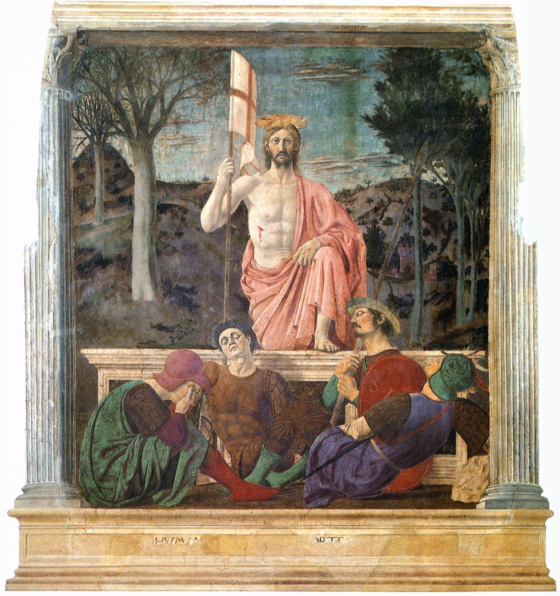

# Session 18 — He Rose Again from the Dead

*Piero della Francesca, The Resurrection (c. 1463-1465). Public Domain via Wikimedia Commons.*

> *Piero's Christ steps out of the tomb upright, banner in hand, the soldiers asleep at His feet. This was not metaphor. A body that had stopped breathing started again — the same body, glorified. Christianity rises or falls on this morning.*

## Pius X asks

**92.** What did Jesus Christ do after His resurrection?

*Jesus Christ, after His resurrection, remained on earth forty days; then He ascended into heaven, where He sits at the right hand of God the Father almighty.*

**93.** Why did Jesus Christ remain on earth forty days after His resurrection?

*Jesus Christ remained on earth forty days after His resurrection in order to show that He had truly risen, to confirm His disciples in their faith in Him, and to instruct them more deeply in His doctrine.*

## St. Thomas teaches

We must necessarily know two things: the glory of God and the punishment of hell. For being attracted by His glory and made fearful by punishments, we take warning and withdraw ourselves from sin. But for us to appreciate these facts is very difficult. Thus, it is said of God's glory: "But the things that are in heaven, who shall search out?"[^1] For those who are worldly minded this is indeed difficult, because "he that is of the earth, of the earth he is, and of the earth he speaketh;"[^2] but it is easier for the spiritually minded, because, "he that cometh from above is above all," as is said in the same place. Accordingly, God descended from heaven and became incarnate to teach us heavenly things. Once it was difficult to know about the punishments of hell: "no man hath been known to have returned from hell,"[^3] as it is said in the person of the wicked. But this cannot be said now, for just as Christ descended from heaven to teach us heavenly things, so also He came back from the region of hell to teach us about it. It is, therefore, necessary that we believe not only that Christ was made man, and died, but also that He arose again from the dead. Therefore, it is said in the Creed: "The third day He arose again from the dead."

We find that many arose from the dead, such as Lazarus,[^4] the son of the widow,[^5] and the daughter of the Ruler of the synagogue.[^6] But the resurrection of Christ differed from the resurrection of these and of all others in four points.

## Special Character of Christ's Resurrection

(1) Christ's resurrection differed from that of all others in its cause. Those others who arose did so not of their own power, but either by the power of Christ or through the prayers of some Saint. Christ, on the contrary, arose by His own power, because He was not only Man but also God, and the Divinity of the Word was at no time separated either from His soul or from His body. Therefore, His body could, whenever He desired, take again the soul, and His soul the body: "I lay down My life, that I may take it again. . . . And I have power to lay it down; and I have power to take it up again."[^7] Christ truly died, but not because of weakness or of necessity but rather of His own will entirely and by His own power. This is seen in that moment when He yielded up the ghost; He cried out with a loud voice,[^8] which could not be true of others at the moment of dying, because they die out of weakness. . . . For this the centurion said: "Indeed, this was the Son of God."[^9] By that same power whereby He gave up His soul, He received it again; and hence the Creed says, "He arose again," because He was not raised up as if by anyone else. "I have slept and have taken My rest; and I have risen up."[^10] Nor can this be contrary to these words, "This Jesus hath God raised again,"[^11] because both the Father and the Son raised Him up, since one and the same power is of the Father and the Son.

(2) Christ's resurrection was different as regards the life to which He arose. Christ arose again to a glorious and incorruptible life: "Christ is risen from the dead by the glory of the Father."[^12] The others, however, were raised to that life which they had before, as seen of Lazarus and the others.

(3) Christ's resurrection was different also in effect and efficacy. In virtue of the resurrection of Christ all shall rise again: "And many bodies of the saints that had slept arose."[^13] The Apostle declares that "Christ is risen from the dead, the first fruits of them that sleep."[^14] But also note that Christ by His Passion arrived at glory: "Ought not Christ to have suffered these things and so to enter into His glory?"[^15] And this is to teach us how we also may arrive at glory: "Through many tribulations we must enter into the kingdom of God."[^16]

(4) Christ's resurrection was different in point of time. Christ arose on the third day; but the resurrection of the others is put off until the end of the world. The reason for this is that the resurrection and death and nativity of Christ were "for our salvation,[^17] and thus He wished to rise again at a time when it would be of profit to us. Now, if He had risen immediately, it would not have been believed that He died; and similarly, if He had put it off until much later, the disciples would not have remained in their belief, and there would have been no benefit from His Passion. He arose again, therefore, on the third day, so that it would be believed that He died, and His disciples would not lose faith in him.[^18]

## What We May Learn from the Resurrection

From all this we can take four things for our instruction. Firstly, let us endeavour to arise spiritually, from the death of the soul which we incur by our sins, to that life of justice which is had through penance: "Rise, thou that sleepest, and arise from the dead; and Christ shall enlighten thee."[^19] This is the first resurrection: "Blessed and holy is he that hath part in the first resurrection."[^20]

Secondly, let us not delay to rise until our death, but do it at once, since Christ arose on the third day: "Delay not to be converted to the Lord; and defer it not from day to day."[^21] You will not be able to consider what pertains to salvation when weighed down by illness, and, moreover, by persevering in sin, you will lose part of all the good which is done in the Church, and you will incur many evils. Indeed, the longer you possess the devil, the harder it is to put him away, as St. Bede tells us.

Thirdly, let us rise up again to an incorruptible life in that we may not die again, but resolve to sin no more: "Knowing that Christ, rising again from the dead, dieth now no more. Death shall no more have dominion over Him. . . . So do you also reckon that you are dead to sin, but alive unto God, in Christ Jesus our Lord. Neither yield ye your members as instruments of iniquity unto sin; but present yourselves to God, as those that are alive from the dead."[^22]

Fourthly, let us rise again to a new and glorious life by avoiding all that which formerly were the occasions and the causes of our death and sin: "As Christ is risen from the dead by the glory of the Father, so we also may walk in newness of life."[^23] This new life is the life of justice which renews the soul and leads it to the life of glory.

[^1]: Wis., ix. 16.
[^2]: John, iii. 31.
[^3]: Wisd., ii. 1.
[^4]: John, xi 1-
[^5]: Luke, vii. 11-16.
[^6]: Mark, v. 35-43.
[^7]: John, x. 18.
[^8]: Matt., xxvii. 50.
[^9]: Matt., xxvii. 54.
[^10]: Ps. iii. 6.
[^11]: Acts, ii. 24.
[^12]: Rom., vi. 4.
[^13]: Matt., xxviii. 52.
[^14]: I Cor., xv. 20.
[^15]: Luke xxiv. 26.
[^16]: Acts, xiv. 21.
[^17]: From the Nicene Creed.
[^18]: "Chirst did not remain in the grave during all of these three days, but as He lay in the sepulchre during an entire natural day during part of the preceding day and part of the following day, he is said, in very truth, to have lain in the grave for three days, and on the third day to have risen again from the dead" ("Roman Catechism," "loc. cit., 10).
[^19]: Eph., v. 14.
[^20]: John, xx. 6.
[^21]: Ecclus., v. 8.
[^22]: Rom., vi. 9, 11-14.
[^23]: "Ibid.," 4.

> **Scripture.** *But now Christ is risen from the dead, the firstfruits of them that sleep.* — 1 Corinthians 15:20

> *Risen Lord, You went first. Where I am sleeping, wake me. What in me has died, raise.*

---

#### Going Deeper — *Catechism of Trent*

## Importance Of This Article

To know the glory of the burial of our Lord Jesus Christ, of
which we last treated, is highly important; but of still higher
importance is it to the faithful to know the splendid triumphs
which He obtained by having subdued the devil and despoiled the
abodes of hell. Of these triumphs, and also of His Resurrection,
we are now about to speak.

Although the latter presents to us a subject which might with
propriety be treated under a separate and distinct head, yet
following the example of the holy Fathers, we have deemed it
fitting to unite it with His descent into hell.

## Second Part of this Article: "The Third Day He arose again from the Dead"

We now come to the second part of the Article, and how
indefatigable should be the labours of the pastor in its
exposition we learn from these words of the Apostle: Be mindful
that the Lord Jesus Christ is risen again from the dead. This
command no doubt was addressed not only to Timothy, but to all
others who have care of souls.

The meaning of the Article is this: Christ the Lord expired
on the cross, on Friday at the ninth hour, and was buried on the
evening of the same day by His disciples, who with the permission
of the governor, Pilate, laid the body of the Lord, taken down
from the cross, in a new tomb, situated in a garden near at hand.
Early on the morning of the third day after His death, that is,
on Sunday, His soul was reunited to His body, and thus He who was
dead during those three days arose, and returned again to life,
from which He had departed when dying.

### "He arose Again"

By the word Resurrection, however, we are not merely to
understand that Christ was raised from the dead, which happened
to many others, but that He rose by His own power and virtue, a
singular prerogative peculiar to Him alone. For it is
incompatible with nature and was never given to man to raise
himself by his own power, from death to life. This was reserved
for the almighty power of God, as we learn from these words of
the Apostle: Although he was crucified through weakness, yet he
liveth by the power of God. This divine power, having never been
separated, either from His body in the grave, or from His soul in
hell, there existed a divine force both within the body, by which
it could be again united to the soul, and within the soul, by
which it could again return to the body. Thus He was able by His
own power to return to life and rise from the dead.

This David, filled with the spirit of God, foretold in these
words: His right hand hath wrought for him salvation, and his arm
is holy. Our Lord confirmed this by the divine testimony of His
own mouth when He said: I lay down my life that I may take it
again . . . and I have power to lay it down: and I have power to
take it up again. To the Jews He also said, in corroboration of
His doctrine: Destroy this temple, and in three days I will raise
it up. Although the Jews understood Him to have spoken thus of
that magnificent Temple built of stone, yet as the Scripture
testifies in the same place, he spoke of the temple of his body.
We sometimes, it is true, read in Scripture that He was raised by
the Father; but this refers to Him as man, just as those passages
on the other hand, which say that He rose by His own power relate
to Him as God.

### "From the Dead"

It is also the peculiar privilege of Christ to have been the
first who enjoyed this divine prerogative of rising from the
dead, for He is called in Scripture the firstbegotten from the
dead, and also the firstborn of the dead. The Apostle also
says: Christ is risen from the dead, the firstfruits of them
that sleep: for by a man came death, and by a man the
resurrection of the dead. And as in Adam all die, so also in
Christ all shall be made alive. But every one in his own order:
the firstfruits Christ, then they that are of Christ.

These words of the Apostle are to be understood of a perfect
resurrection, by which we are raised to an immortal life and are
no longer subject to the necessity of dying. In this resurrection
Christ the Lord holds the first place; for if we speak of
resurrection; that is, of a return to life, subject to the
necessity of again dying, many were thus raised from the dead
before Christ, all of whom, however, were restored to life to die
again. But Christ the Lord, having subdued and conquered death,
so arose that He could die no morel according to' this most clear
testimony: Christ rising again from the dead, dieth now no more,
death shall no more have dominion over him.

### "The Third Day"

In explanation of the additional words of the Article, the
third day, the pastor should inform the people that they must not
think our Lord remained in the grave during the whole of these
three days. But as He lay in the sepulchre one full day, a part
of the preceding and a part of the following day, He is said,
with strictest truth, to have lain in the grave for three days,
and on the third day to have risen again from the dead.

To prove that He was God He did not delay His Resurrection to
the end of the world; while, on the other hand, to convince us
that He was truly man and really died, He rose not immediately,
but on the third day after His death, a space of time sufficient
to prove the reality of His death.

### "According to the Scriptures"

Here the Fathers of the first Council of Constantinople added
the words, according to the Scriptures, which they took from St.
Paul. These words they embodied with the Creed, because the same
Apostle teaches the absolute necessity of the mystery of the
Resurrection when he says: If Christ be not risen again, then is
our preaching vain, and your faith is also vain . . . for you are
yet in your sins. Hence,, admiring our belief of this Article St.
Augustine says: It is no great thing to believe that Christ died.
This the pagans, Jews, and all the wicked believe; in a word, all
believe that Christ died. But that He rose from the dead is the
belief of the Christians. To believe that He rose again, this we
deem of great moment.

Hence it is that our Lord very frequently spoke to His
disciples of His Resurrection, and seldom or never of His Passion
without adverting to His Resurrection. Thus, when He said: The
son of man . . . shall be delivered to the Gentiles, and shall be
mocked, and scourged, and spit upon; and after they have scourged
him, they will put him to death; He added: and the third day he
shall rise again.' Also when the Jews called upon Him to give an
attestation of the truth of His doctrine by some miraculous sign
He said: A sign shall not be given to them, but the sign of Jonas
the prophet. For as Jonas was in the whales belly three days and
three nights: so shall the son of man be in the heart of the
earth three days and three nights.

## Three Useful Considerations on this Article

To understand still better the force and meaning of this
Article, there are three things which we must consider and
understand: first, why the Resurrection was necessary; secondly,
its end and object; thirdly, the blessings and advantages of
which it is to us the source.

### Necessity Of The Resurrection

With regard to the first, it was necessary that Christ should
rise again in order to manifest the justice of God; for it was
most congruous that He who through obedience to God was degraded,
and loaded with ignominy, should by Him be exalted. This is a
reason assigned by the Apostle when he says to the Philippians:
He humbled himself, becoming obedient unto death, even to the
death of the cross. For which cause God also hath exalted him. He
rose also to confirm our faith, which is necessary for
justification; for the Resurrection of Christ from the dead by
His own power affords an irrefragable proof that He was the Son
of God. Again the Resurrection nourishes and sustains our hope.
As Christ rose again, we rest on an assured hope that we too
shall rise again; the members must necessarily arrive at the
condition of their head. This is the conclusion which St. Paul
seems to draw when he writes to the Corinthians and to the
Thessalonians.' And Peter, the Prince of the Apostles, says:
Blessed be the God and Father of our Lord Jesus Christ, who
according to his great mercy hath regenerated us unto a lively
nope, by the resurrection of Jesus Christ from the dead, unto the
inheritance incorruptible.

Finally, the Resurrection of our Lord, as the pastor should
inculcate, was necessary to complete the mystery of our salvation
and redemption. By His death Christ liberated us from sin; by His
Resurrection, He restored to us the most important of those
privileges which we had forfeited by sin. Hence these words of
the Apostle: He was delivered up for our sins, and rose again for
our justification. That nothing, therefore, may be wanting to the
work of our salvation, it was necessary that as He died, He
should also rise again.'

### Ends Of The Resurrection

From what has been said we can perceive what important
advantages the Resurrection of Christ the Lord has conferred on
the faithful. In the Resurrection we acknowledge God to be
immortal, full of glory, the conqueror of death and the devil;
and all this we are firmly to believe and openly to profess of
Christ Jesus.

Again, the Resurrection of Christ effects for us the
resurrection of our bodies not only because it was the efficient
cause of this mystery, but also because we all ought to arise
after the example of the Lord. For with regard to the
resurrection of the body we have this testimony of the Apostle:
By a man came death, and by a man the resurrection of the dead.
In all that God did to accomplish the mystery of our redemption
He made use of the humanity of Christ as an effective instrument,
and hence His Resurrection was, as it were, an instrument for the
accomplishment of our resurrection.

It may also be called the model of ours, inasmuch as His
Resurrection was the most perfect of all. And as His body, rising
to immortal glory, was changed, so shall our bodies also, before
frail and mortal, be restored and clothed with glory and
immortality. In the language of the Apostle: We look for the
Saviour, our Lord Jesus Christ, who will reform the body of our
lowness, made like to the body of his glory.

The same may be said of a soul dead in sin. How the
Resurrection of Christ is proposed to such a soul as the model of
her resurrection the same Apostle shows in these words: As Christ
is risen from the dead by the glory of the Father, so we also may
walk in newness of life. For if we have been planted together in
the likeness of his death, we shall be also in the likeness of
his resurrection. Again a little further on he says: Knowing that
Christ rising again from the dead, dieth now no more, death shall
no more have dominion over him. For in that he died to sin, he
died once; but in that he liveth, he liveth unto God: so do you
also reckon, that you are dead to sin, but alive unto God, in
Christ Jesus.

### Advantages Of The Resurrection

From the Resurrection of Christ, therefore, we should draw
two lessons: the one, that after we have washed away the stains
of sin, we should begin to lead a new life, distinguished by
integrity, innocence, holiness, modesty, justice, beneficence and
humility; the other, that we should so persevere in that newness
of life as never more, with the divine assistance, to stray from
the paths of virtue on which we have once entered.

Nor do the words of the Apostle prove only that the
Resurrection of Christ is proposed as the model of our
resurrection; they also declare that it gives us power to rise
again, and imparts to us strength and courage to persevere in
holiness and righteousness, and in the observance of the
Commandments of God. For as His death not only furnishes us with
an example, but also supplies us with strength to die to sin, so
also His Resurrection invigorates us to attain righteousness, so
that thenceforward serving God in piety and holiness, we may walk
in the newness of life to which we have risen. By His
Resurrection, our Lord accomplished this especially that we, who
before died with Him to sin and to the world, should rise also
with Him to a new order and manner of life.

### Signs Of Spiritual Resurrection

The principal signs of this resurrection from sin which should
be noted are taught us by the Apostle. For when he says: If you
be risen with Christ, seek the things that are above, where
Christ is sitting at the right hand of God, he distinctly tells
us that they who desire to possess life, honour, repose and
riches, there chiefly where Christ dwells, have truly risen with
Christ.

When he adds: Mind the things that are above, not the things
that are upon the earth, he gives, as it were, another sign by
which we may ascertain if we have truly risen with Christ. As a
relish for food usually indicates a healthy state of the body, so
with regard to the soul, if a person relishes whatever things are
true, whatever modest, whatever just, whatever holy, and
experiences within him the sweetness of heavenly things, this we
may consider a very strong proof that such a one has risen with
Christ Jesus to a new and spiritual life.
