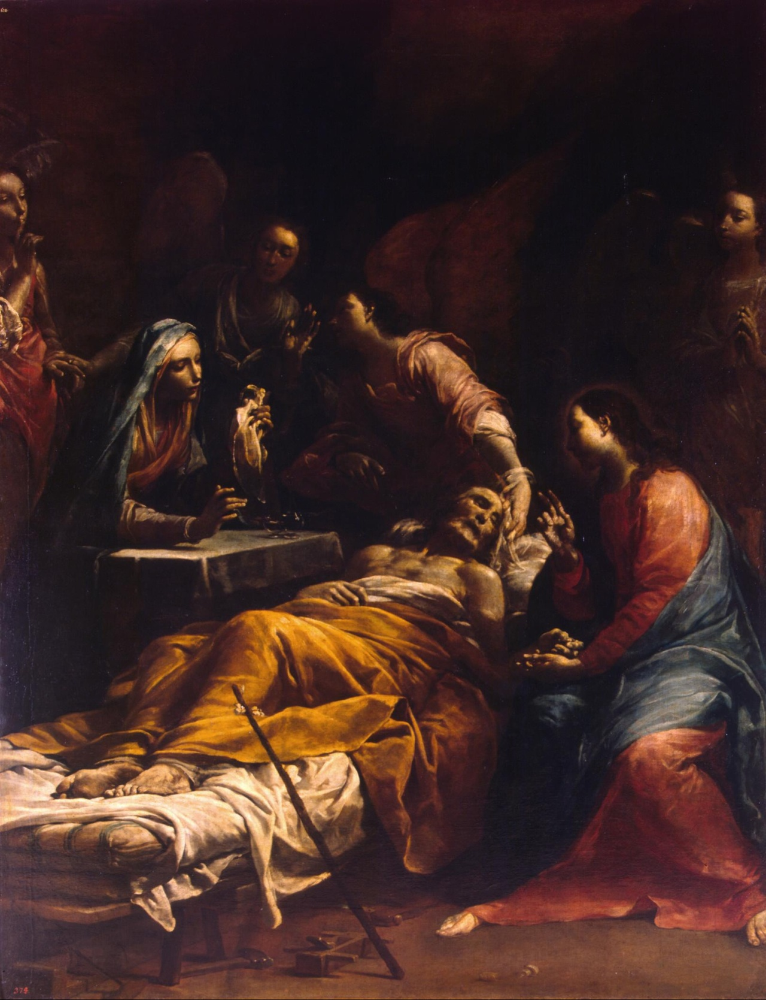

# Session 21 — The Particular and Universal Judgment

*Giuseppe Maria Crespi, The Death of Saint Joseph (c. 1712). Public Domain via Wikimedia Commons.*

> *A small panel: a body on a deathbed, a soul above it, light or dark depending. There are two judgments, one personal and immediate, one cosmic and final — and you will be in both. The first is closer than you think.*

## Pius X asks

**98.** On what will Jesus Christ judge us?

*Jesus Christ will judge us on the good and the evil done in life, even on our thoughts and our omissions.*

**99.** After the particular judgment, what becomes of the soul?

*After the particular judgment, the soul, if it is without sin and without debt of punishment, goes to heaven; if it has some venial sin or some debt of punishment, it goes to purgatory until it has made satisfaction; if it is in mortal sin, then, as a rebel beyond conversion to God, it goes to hell.*

**100.** Where do children who die without Baptism go?

*Children who die without Baptism go to Limbo, where there is no supernatural reward nor any pain; because, having only original sin and nothing more, they do not merit heaven, but neither do they merit hell or purgatory.*

## St. Thomas teaches

## The Fear of the Judgment

The judgment ought indeed to be feared. (a) Because of the wisdom of the Judge. God knows all things, our thoughts, words and deeds, and "all things are naked and open to his eyes.[^17] "All the ways of men are open to His eyes."[^18] He knows our words: "The ear of jealousy heareth all things."[^19] Also our thoughts: "The heart is perverse above all things and unsearchable. Who can know it? I am the Lord, who search the heart and prove the reins; who give to every one according to his way and according to the fruit of his devices."[^20] There will be infallible witnesses-- men's own consciences: "Who show the work of the law written in their hearts, their conscience bearing witness to them; and their thoughts between themselves accusing or also defending one another, in the day when God shall judge the secrets of men."[^21]

(b) Because of the power of the Judge, who is almighty in Himself: "Behold, the Lord God will come with strength."[^22] And also almighty in others: "The whole world shall fight with Him against the unwise."[^23] Hence, Job says: "Whereas there is no man that can deliver out of Thy hand."[^24] "If I ascend into heaven, Thou art there; if I descend into hell, Thou art present," says the Psalmist.[^25]

(c) Because of the inflexible justice of the Judge. The present is the time for mercy; but the future is the time solely for justice; and so the present is our time, but the future is God's time: "When I shall take a time, I shall judge justices."[^26] "The jealousy and rage of the husband will not spare in the day of revenge. Nor will he yield to any man's prayers; nor will he accept for satisfaction ever so many gifts."[^27]

(d) Because of the anger of the Judge. He shall appear in different ways to the just and to the wicked. To the just, He will be pleasant and gracious: "They will behold the King of beauty."[^28] To the wicked He will be angry and pitiless, so that they may say to the mountains: "Fall upon us and hide us from the wrath of the Lamb."[^29] But this anger of God does not bespeak in Him any perturbation of soul, but rather the effect of His anger which is the eternal punishment inflicted upon sinners.

## Our Preparation for the Judgment

Now, against this fear of the judgment we ought to have four remedies. The first is good works: "Wilt thou then not be afraid of the power? Do that which is good, and thou shalt have praise from the same."[^30] The second is confession and repentance for sins committed; and this ought to include sorrow in thinking of hem, feeling of shame in confessing them, and all severity in making satisfaction for them. And these will take away the eternal punishment. The third is giving of alms, which makes all things clean: "Make unto you friends of the mammon of iniquity; that when you shall fail, they may receive you into everlasting dwellings."[^31] The fourth is charity, viz., the love of God and our neighbour, for "charity covereth a multitude of sins."[^32]

[^1]: Proverbs 20:8.
[^2]: Acts 1:11.
[^3]: Acts 10:42.
[^4]: John 5:27.
[^5]: Job 36:17.
[^6]: Luke 21:27.
[^7]: 2 Corinthians 5:10.
[^8]: John 3:18.
[^9]: Romans 6:23.
[^10]: Matthew 19:28.
[^11]: 1 Corinthians 6:3.
[^12]: Isaiah 3:14.
[^13]: Ecclesiastes 11:9.
[^14]: "Ibid.," 12:14.
[^15]: Matthew 12:36.
[^16]: Wisdom 1:9.
[^17]: Hebrews 4:13.
[^18]: Proverbs 16:2.
[^19]: Wisdom 1:10.
[^20]: Jeremiah 17:9-10.
[^21]: Romans 2:15-16.
[^22]: Isaiah 40:10.
[^23]: Wisdom 5:21.
[^24]: Job 10:7.
[^25]: Psalm 138:8.
[^26]: Psalm 74:3.
[^27]: Proverbs 6:34-35.
[^28]: Isaiah 33:17.
[^29]: Revelation 6:16.
[^30]: Romans 13:3.
[^31]: Luke 16:9.
[^32]: 1 Peter 4:8.

> **Scripture.** *And as it is appointed unto men once to die, and after this the judgment.* — Hebrews 9:27

> *Lord, I will meet You alone. Make me the kind of soul You can recognize when that meeting comes.*

---

#### Going Deeper — *Catechism of Trent*

## Circumstances of the Judgment

### The Judge

That the judgment of the world has been assigned to Christ the
Lord, not only as God, but also as man, is declared in Scripture.
Although the power of judging is common to all the Persons of the
Blessed Trinity, yet it is specially attributed to the Son,
because to Him also in a special manner is ascribed wisdom. But
that as man, He will judge the world, is taught by our Lord
Himself when He says: As the Father hath life in himself, so he
hath given to the Son also, to have life in himself; and he hath
given him power to do judgment, because he is the son of man.

There is a peculiar propriety in Christ the Lord sitting in
judgment; for sentence is to be pronounced on mankind, and they
are thus enabled to see their Judge with their eyes and hear Him
with their ears, and so learn their judgment through the medium
of the senses.

Most just is it also that He who was most iniquitously
condemned by the judgment of men should Himself be afterwards
seen by all men sitting in judgment on all. Hence when the Prince
of the Apostles had expounded in the house of Cornelius the chief
dogmas of Christianity, and had taught that Christ was suspended
from a cross and put to death by the Jews and rose the third lay
to life, he added: And he commanded us to preach to the people,
and to testify that this is he, who was appointed of God, to be
the judge of the living and the dead.

### Signs Of The General Judgment

The Sacred Scriptures inform us that the general judgment will
be preceded by these three principal signs: the preaching of the
Gospel throughout the world, a falling away from the faith, and
the coming of Antichrist. This gospel of the kingdom, says our
Lord, shall be preached in the whole world, for a testimony to
all nations, and then shall the consummation come. The Apostle
also admonishes us that we be not seduced by anyone, as if the
day of the Lord were at hand; for unless there come a revolt
first, and the man of sin be revealed, the judgement will not
come.

### The Sentence Of The Just

The form and procedure of this judgment the pastor will easily
learn from the prophecies of Daniel, the writings of the
Evangelists and the doctrine of the Apostle. The sentence to be
pronounced by the judge is here deserving of more than ordinary
attention.

Looking with joyful countenance on the just standing on His
right, Christ our Redeemer will pronounce sentence on them with
the greatest benignity, in these words: Come ye blessed of my
Father, possess the kingdom prepared for you from the beginning
of the world. That nothing can be conceived more delightful to
the ear than these words, we shall understand if we only compare
them with the condemnation of the wicked; and call to mind, that
by them the just are invited from labor to rest, from the vale of
tears to supreme joy, from misery to eternal happiness, the
reward of their works of charity.

### The Sentence Of The Wicked

Turning next to those who shall stand on His left, He will
pour out His justice upon them in these words: Depart from me, ye
cursed, into everlasting fire, prepared f or the devil and his
angels.

The first words, depart from me, express the heaviest
punishment with which the wicked shall be visited, their eternal
banishment from the sight of God, unrelieved by one consolatory
hope of ever recovering so great a good. This punishment is
called by theologians the pain of loss, because in hell the
wicked shall be deprived forever of the light of the vision of
God.

The words ye cursed, which follow, increase unutterably their
wretched and calamitous condition. If when banished from the
divine presence they were deemed worthy to receive some
benediction, this would be to them a great source of consolation.
But since they can expect nothing of this kind as an alleviation
of their misery, the divine justice deservedly pursues them with
every species of malediction, once they have been banished.

The next words, into everlasting fire, express another sort
of punishment, which is called by theologians the pain of sense,
because, like lashes, stripes or other more severe chastisements,
among which fire, no doubt, produces the most intense pain, it is
felt through the organs of sense. When, moreover, we reflect that
this torment is to be eternal, we can see at once that the
punishment of the damned includes every kind of suffering.

The concluding words, which was prepared f or the devil and
his angels, make this still more clear. For since nature has so
provided that we feel miseries less when we have companions and
sharers in them who can, at least in some measure, assist us by
their advice and kindness, what must be the horrible state of the
damned who in such calamities can never separate themselves from
the companionship of most wicked demons ? And yet most justly
shall this very sentence be pronounced by our Lord and Saviour on
those sinners who neglected all the works of true mercy, who gave
neither food to the hungry, nor drink to the thirsty, who refused
shelter to the stranger and clothing to the naked, and who would
not visit the sick and the imprisoned.

## Importance of Instruction on this Article

These are thoughts which the pastor should very often bring to
the attention of his people; for the truth which is contained in
this Article will, if accepted with faithful dispositions, be
most powerful in bridling the evil inclinations of the heart and
in withdrawing men from sin. Hence we read in Ecclesiasticus: In
all thy works remember thy last end, and thou shalt never sin.'
And indeed there is scarcely anyone so given over to vice as not
to be recalled to virtue by the thought that he must one day
render an account before an alljust Judge, not only of all his
words and actions, but even of his most secret thoughts, and must
suffer punishment according to his deserts.

On the other hand, the just man will be more and more
encouraged to lead a good life. Even though his days be passed in
poverty, ignominy and suffering, he must be gladdened exceedingly
when he looks forward to that day when, the conflicts of this
wretched life being over, he shall be declared victorious in the
hearing of all men, and shall be admitted into his heavenly
country to be crowned with divine honours that shall never fade.

It only remains, then, for the pastor to exhort the faithful
to lead holy lives and practice every virtue, that thus they may
be enabled to look forward with confidence to the coming of that
great day of the Lord — nay, as becomes children, even to
desire it most fervently.
