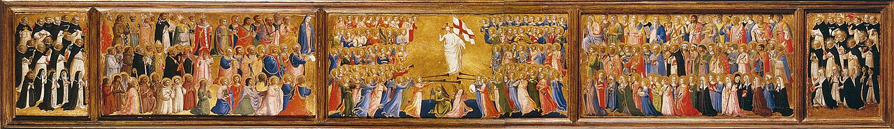

# Session 23 — Heaven and Hell, Both Eternal

*Fra Angelico, Predella of the San Domenico Altarpiece (c. 1423-1424). Public Domain via Wikimedia Commons.*

> *Fra Angelico's heaven: figures dancing, hands joined, faces lit. Heaven is not a passive reward — it is the maximum of being awake. And hell is the maximum of being alone. Both are forever. Choose accordingly, today, in what you choose.*

## Pius X asks

**103.** Is it certain that heaven and hell exist?

*It is certain that heaven and hell exist: God has revealed it, often promising to the good eternal life and His own joy, and threatening the wicked with perdition and eternal fire.*

**104.** How long will heaven and hell last?

*Heaven and hell will last eternally.*

## St. Thomas teaches

## What Is Everlasting Life?

We must first consider in this Article what is everlasting life. And in this we must know that in everlasting life man is united to God. God Himself is the reward and the end of all our labors: "I am thy protector, and thy reward exceeding great."[^3] This union with God consists, firstly, in a perfect vision: "We see now through a glass in a dark manner; but then face to face."[^4] Secondly, in a most fervent love; for the better one is known, the more perfectly is one loved: "The Lord hath said it, whose fire is in Sion, and His furnace in Jerusalem."[^5] Thirdly, in the highest praise. "We shall see, we shall love, and we shall praise," as says St. Augustine.[^6] "Joy and gladness shall be found therein, thanksgiving and the voice of praise."[^7]

Then, too, in everlasting life is the full and perfect satisfying of every desire; for there every blessed soul will have to overflowing what he hoped for and desired. The reason is that in this life no one can fulfill all his desires, nor can any created thing fully satisfy the craving of man. God only satisfies and infinitely exceeds man's desires; and, therefore, perfect satiety is found in God alone. As St. Augustine says: "Thou hast made us for Thee, O Lord, and our heart is restless until it rests in Thee."[^8] Because the blessed in the Fatherland will possess God perfectly, it is evident that their desires will be abundantly filled, and their glory will exceed their hopes. The Lord has said: "Enter thou into the joy of the Lord."[^9] And as St. Augustine says: "Complete joy will not enter into those who rejoice, but all those who rejoice will enter into joy." "I shall be satisfied when Thy glory shall appear."[^10] And again: "Who satisfieth thy desire with good things."[^11]

## What Is Everlasting Death?

The perfect will enjoy all this in the life everlasting, and much more that surpasses description. But the wicked, on the other hand, will be in eternal death suffering pain and punishment as great as will be the happiness and glory of the good. The punishment of the damned will be increased, firstly, by their separation from God and from all good. This is the pain of loss which corresponds to aversion, and is a greater punishment than that of sense: "And the unprofitable servant, cast ye out into the exterior darkness."[^21] The wicked in this life have interior darkness, namely sin; but then they shall also have exterior darkness.

Secondly, the damned shall suffer from remorse of conscience: "I will reprove thee, and set before thy face."[^22] "Groaning for anguish of spirit."[^23] Nevertheless, their repentance and groaning will be of no avail, because it rises not from hatred of evil, but from fear and the enormity of their punishments. Thirdly, there is the great pain of sense. It is the fire of hell which tortures the soul and the body; and this, as the Saints tell us, is the sharpest of all punishments. They shall be ever dying, and yet never die; hence it is called eternal death, for as dying is the bitterest of pains, such will be the lot of those in hell: "They are laid in hell like sheep; death shall feed upon them."[^24] Fourthly, there is the despair of their salvation. If some hope of delivery from their punishments would be given them, their punishment would be somewhat lessened; but since all hope is withdrawn from them, their sufferings are made most intense: "Their worm shall not die, and their fire shall not be quenched.[^25]

We thus see the difference between doing good and doing evil. Good works lead to life, evil drags us to death. For this reason, men ought frequently to recall these things to mind, since they will incite one to do good and withdraw one from evil. Therefore, very significantly, at the end of the Creed is placed "life everlasting," so that it would be more and more deeply impressed on the memory. To this life everlasting may the Lord Jesus Christ, blessed God for ever, bring us! Amen.

[^1]: Ps. xlviii. 21.
[^2]: Wis., ii. 22-23. Note also: "And though in the sight of men they suffer torments their hope is full of immortality" ("ibid.," iii. 4).
[^3]: Gen., xv. 1.
[^4]: I Cor., xiii. 12. "The blessed always see God present, and by this greatest and most exalted of gifts, 'being made partakers of the divine nature' (II Peter, i. 4), they enjoy true and solid happiness" ("Roman Catechism," Twelfth Article, 9)
[^5]: Isa., xxxi. 9. Note: This second consideration is found in the vives edition Chapter XV
[^6]: "Ibi vacabimus, et videbimus: videbimus, et amabimus: amabimus, et laudabimus" ("There we shall rest and we shall see; we shall see and we shall love; we shall love and we shall praise," in "The city of God," Book XXII, Chapter xxx).
[^7]: Isa., li. 3.
[^8]: "Confessions," Book I, 1.
[^9]: Matt., xxv. 21.
[^10]: Ps. xvi. 15.
[^11]: Ps. cii. 5.
[^12]: Job, xxii. 26.
[^13]: Ps. xv. 11. "To enumerate all the delights with which the souls of the blessed will be filled, would be an endless task. We cannot even conceive them in thought. The happiness of the Saints is filled to overflowing of all those pleasures which can be enjoyed or even desired in this life, whether they pertain to the powers of the mind or the perfection of the body" ("Roman Catechism," "loc. cit.," 12).
[^14]: Apoc., v.
[^15]: Wis., v. 5. "How distinguished that honour must be which is conferred by God Himself, who no longer calls them servants, but friends, brethren, and sons of God. Hence, the Redeemer will address His elect in these infinitely loving and highly honorable words: 'Come, ye blessed of My Father, possess you the kingdom prepared for you' " ("Roman Catechism." "loc. cit.," 11).
[^16]: Wis.. vii. 11.
[^17]: Prov., x. 24.
[^18]: Isa., xxxii. 10. This is in the Vives edition, Chapter XV.
[^19]: Prov., i. 33.
[^20]: Ps. lxxxvi. 7.
[^21]: Matt., xxv. 30.
[^22]: Ps. xlix. 21.
[^23]: Wis., v. 3.
[^24]: Ps. xlviii. 15.
[^25]: Isa., lxvi. 24.

> **Scripture.** *And these shall go into everlasting punishment: but the just, into life everlasting.* — Matthew 25:46

> *Lord, my soul is not made for an afternoon. Make me ready to live forever — with You.*

---

#### Going Deeper — *Catechism of Trent*

## Negative and Positive Elements of Eternal Life

The happiness of eternal life is, as defined by the Fathers,
an exemption from all evil, and an enjoyment of all good.

### The Negative

Concerning (the exemption from all) evil the Scriptures bear
witness in the most explicit terms. For it is written in the
Apocalypse: They shall no more hunger nor thirst, neither shall
the sun fall on them, nor any heat; '° and again, God shall wipe
away all tears from their eyes: and death shall be no more, nor
mourning nor crying, nor sorrow shall be any more, for the former
things are passed away.

### The Positive

As for the glory of the blessed, it shall be without measure,
and the kinds of their solid joys and pleasures without number.
Since our minds cannot grasp the greatness of this glory, nor can
it possibly enter into our souls, it is necessary for us to enter
into it, that is, into the joy of the Lord, so that immersed
therein we may completely satisfy the longing of our hearts.

Although, as St. Augustine observes, it would seem easier to
enumerate the evils from which we shall be exempt than the goods
and the pleasures which we shall enjoy; yet we must endeavour to
explain, briefly and clearly, these things which are calculated
to inflame the faithful with a desire of arriving at the
enjoyment of this supreme felicity.

But first of all we should make use of a distinction which
has been sanctioned by the most eminent writers on religion; for
they teach that there are two sorts of goods, one of which
constitutes happiness, the other follows upon it. The former,
therefore, for the sake of perspicuity, they have called
essential blessings, the latter, accessory.

## Essential Happiness

Solid happiness, which we may designate by the common
appellation, essential, consists in the vision of God, and the
enjoyment of His beauty who is the source and principle of all
goodness and perfection. This, says Christ our Lord, is eternal
life: that they may know thee, the only true God, and Jesus
Christ, whom thou hast sent. These words St. John seems to
interpret when he says: Dearly beloved, we are now the sons of
God; and it hath not yet appeared what we shall be. We know that
when he shall appear, we shall be like to him: because we shawl
see him as he is. He shows, then, that beatitude consists of two
things: that we shall behold God such as He is in His own nature
and substance; and that we ourselves shall become, as it were,
gods.

### The Light Of Glory

For those who enjoy God while they retain their own nature,
assume a certain admirable and almost divine form, so as to seem
gods rather than men. Why this transformation takes place becomes
at once intelligible if we only reflect that a thing is known
either from its essence, or from its image and appearance,
consequently, as nothing so resembles God as to afford by its
resemblance a perfect knowledge of Him, it follows that no
creature can behold His Divine Nature and Essence unless this
same Divine Essence has joined itself to us, and this St. Paul
means when he says: We now see through a glass in a dark manner;
but then face to face.' The words, in a dark manner, St.
Augustine understands to mean that we see Him in a resemblance
calculated to convey to us some notion of the Deity.

This St. Denis' also clearly shows when he says that the
things above cannot be known by comparison with the things below;
for the essence and substance of anything incorporeal cannot be
known through the image of that which is corporeal, particularly
as a resemblance must be less gross and more spiritual than that
which it represents, as we easily know from universal experience.
Since, therefore, it is impossible that any image drawn from
created things should be equally pure and spiritual with God, no
resemblance can enable us perfectly to comprehend the Divine
Essence. Moreover, all created things are circumscribed within
certain limits of perfection, while God is without limits; and
therefore nothing created can reflect His immensity.

The only means, then, of arriving at a knowledge of the
Divine Essence is that God unite Himself in some sort to us, and
after an incomprehensible manner elevate our minds to a higher
degree of perfection, and thus render us capable of contemplating
the beauty of His Nature. This the light of His glory will
accomplish. Illumined by its splendour we shall see God, the true
light, in His own light.

### The Beatific Vision

For the blessed always see God present and by this
greatest and most exalted of gifts, being made partakers of the
divine nature, they enjoy true and solid happiness. Our belief in
this happiness should be joined with an assured hope that we too
shall one day, through the divine goodness, attain it. This the
Fathers declared in their Creed, which says: I expect the
resurrection of the dead and the life of the world to come.

### An Illustration Of This Truth

These are truths, so divine that they cannot be expressed in
any words or comprehended by us in thought. We may, however,
trace some resemblance of this happiness in sensible objects.
Thus, iron when acted on by fire becomes inflamed and while it is
substantially the same seems changed into fire, a different
substance; so likewise the blessed, who are admitted into the
glory of heaven and burn with a love of God, are so affected
that, without ceasing to be what they are, they may be said with
truth to differ more from those still on earth than redhot iron
differs from itself when cold.

To say all in a few words, supreme and absolute happiness,
which we call essential, consists in the possession of God; for
what can he lack to consummate his happiness who possesses the
God of all goodness and perfection?

## Accessory Happiness

To this happiness, however, are added certain gifts which are
common to all the blessed, and which, because more within the
reach of human comprehension, are generally found more effectual
in moving and inflaming the heart. These the Apostle seems to
have in view when, in his Epistle to the Romans, he says: Glory
and honour, and peace to every one that worketh good.

### Glory

For the blessed shall enjoy glory; not only that glory which
we have already shown to constitute essential happiness, or to be
its inseparable accompaniment, but also that glory which consists
in the clear and distinct knowledge which each (of the blessed)
shall have of the singular and exalted dignity of his companions
(in glory).

### Honour

And how distinguished must not that honour be which is
conferred by God Himself, who no longer calls them servants, but
friends, brethren and sons of God! Hence the Redeemer will
address His elect in these most loving and honourable words:
Come, ye blessed of my Father, possess you the kingdom prepared
for you. Justly, then, may we exclaim: Thy friends, O God, are
made exceedingly honourable. They shall also receive the highest
praise from Christ the Lord, in presence of His heavenly Father
and His Angels.

And if nature has implanted in the heart of every man the
common desire of securing the esteem of men eminent for wisdom,
because they are deemed the most reliable judges of merit, what
an accession of glory to the blessed, to show towards each other
the highest veneration !

### Peace

To enumerate all the delights with which the souls of the
blessed shall be filled would be an endless task. We cannot even
conceive them in thought. With this truth, however, the minds of
the faithful should be deeply impressed — that the happiness
of the Saints is full to overflowing of all those pleasures which
can be enjoyed or even desired in this life, whether they regard
the powers of the mind or of the perfection of the body; albeit
this must be in a manner more exalted than, to use the Apostle's
words, eye hath seen, ear heard, or the heart of man conceived.

Thus the body, which was before gross and material, shall put
off in heaven its mortality, and having become refined and
spiritualised, will no longer require corporal food; while the
soul shall be satiated to its supreme delight with that eternal
food of glory which the Master of that great feast passing will
minister to all.

Who will desire rich apparel or royal robes, where there
shall be no further use for such things, and where all shall be
clothed with immortality and splendour, and adorned with a crown
of imperishable glory?

And if the possession of a spacious and magnificent mansion
contributes to human happiness, what more spacious, what more
magnificent, can be conceived than heaven itself, which is
illumined throughout with the brightness of God ? Hence the
Prophet, contemplating the beauty of this dwellingplace, and
burning with the desire of reaching those mansions of bliss,
exclaims: How lovely are thy tabernacles, O Lord of hosts! my
soul longeth and fainteth for the courts of the Lord. My heart
and my flesh have rejoiced in the living God. That the faithful
may be all filled with the same sentiments and utter the same
language should be the object of the pastor's most earnest
desires, as it should also be of his zealous labours. For in my
Father's house, says our Lord, there are many mansions," in
which shall be distributed rewards of greater and of less value
according to each one's deserts. He who soweth sparingly, shall
also reap sparingly: and he who soweth in blessings, shall also
reap blessings.
