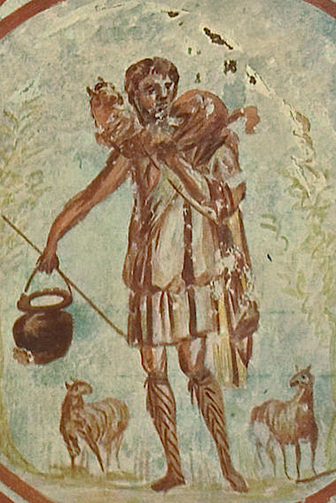

# Session 29 — Outside the Church

*Early Christian fresco (Catacombs of Domitilla), The Good Shepherd (c. 3rd-4th century). Public Domain via Wikimedia Commons.*

> *The Good Shepherd carries one sheep across His shoulders. The Church is a fold; outside the fold is real cold, real loss. Pray for those outside — including the parts of yourself that wandered.*

## Pius X asks

**128.** Who are the apostates?

*The apostates are the baptized who, by an outward act, renounce the Catholic faith they had previously professed.*

**129.** Who are the schismatics?

*The schismatics are the baptized who obstinately refuse to submit to the legitimate Pastors, and are therefore separated from the Church, even if they do not deny any truth of faith.*

**130.** Who are the excommunicates?

*The excommunicates are the baptized who have been excluded, on account of very grave faults, from the communion of the Church, so that they may not pervert others and may be punished and corrected by this extreme remedy.*

**131.** Is it a serious harm to be outside the Church?

*To be outside the Church is a most serious harm, because outside her one has neither the established means of salvation nor the sure guide to eternal salvation, which is the only thing truly necessary for man.*

**132.** Can one who is outside the Church be saved?

*One who is outside the Church through his own fault and dies without perfect contrition is not saved; but one who finds himself outside her through no fault of his own and lives well can be saved through the love of charity, which unites him to God, and, in spirit, also to the Church, that is, to her soul.*

> **Scripture.** *And other sheep I have, that are not of this fold: them also I must bring, and they shall hear my voice.* — John 10:16

> *Good Shepherd, find what is wandering today — in the world, in me. Carry it back.*
