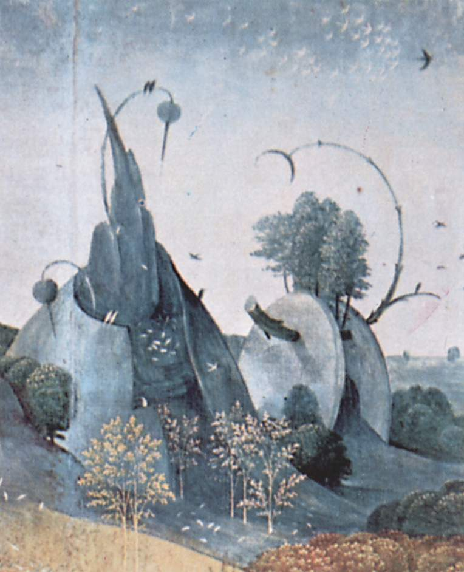

# Session 32 — Venial Sin and the Sins Against the Holy Spirit

*Hieronymus Bosch, The Death of the Miser (c. 1500). Public Domain via Wikimedia Commons.*

> *A medieval panel of the Four Last Things — death, judgment, hell, heaven — set in the corners. The little sins matter; they are the path that ends at one of those corners. Today, the small choice. Tomorrow, the corner.*

## Pius X asks

**149.** Why is sin that is not grave called venial?

*Sin that is not grave is called venial, that is, pardonable, because it does not take away grace, and pardon for it can be obtained by repentance and by good works, even without sacramental confession.*

**150.** Is venial sin harmful to the soul?

*Venial sin is harmful to the soul, because it cools its love for God, disposes it to mortal sin, and renders it deserving of temporal pains in this life and in the next.*

**151.** Are all sins equal?

*Sins are not all equal; and just as some venial sins are less light than others, so some mortal sins are graver and more deadly.*

**152.** Among the mortal sins, which are graver and more deadly?

*Among the mortal sins, the graver and more deadly are the sins against the Holy Spirit and those that cry to heaven for vengeance in the sight of God.*

*152 a. The Six Sins Against the Holy Spirit: 1. Despair of salvation; 2. Presumption of being saved without merit; 3. Impugning the known truth; 4. Envy of another's spiritual good; 5. Obstinacy in sin; 6. Final impenitence.*

*152 b. The Four Sins Crying to Heaven for Vengeance: 1. Wilful murder; 2. The sin of Sodom; 3. Oppression of the poor; 4. Defrauding labourers of their wages.*

**153.** Why are the sins against the Holy Spirit among the graver and more deadly?

*The sins against the Holy Spirit are among the graver and more deadly because by them man sets himself against the spiritual gifts of truth and of grace, and therefore, even when he is able to convert, he does so only with great difficulty.*

**154.** Why are the sins that cry to heaven for vengeance in the sight of God among the graver and more deadly?

*The sins that cry to heaven for vengeance in the sight of God are among the graver and more deadly because they are directly contrary to the good of mankind and most odious, so much so that they provoke God's chastisements more than other sins.*

**155.** What is particularly helpful in keeping us far from sin?

*What is particularly helpful in keeping us far from sin is the thought that God is everywhere and sees the secret of hearts, and the consideration of the Last Things, that is, of what awaits us at the end of this life and at the end of the world.*

*155 a. The Four Last Things: 1. Death; 2. Judgment; 3. Hell; 4. Heaven.*

## The Roman Catechism teaches

## Exhortation

### This Remedy To Be Used

The faithful, therefore, having formed a just conception of
the dignity of so excellent and exalted a blessing, should be
exhorted to profit by it to the best of their ability. For he who
makes no use of what is really useful and necessary must be
supposed to despise it; particularly since, in communicating to
the Church the power of forgiving sin, the Lord did so with the
view that all should have recourse to this healing remedy. As
without Baptism no one can be cleansed, so in order to recover
the grace of Baptism, forfeited by actual mortal guilt, recourse
must be had to another means of expiation,  namely, the
Sacrament of Penance.

### Abuse To Be Guarded Against

But here the faithful are to be admonished to guard against
the danger of becoming more prone to sin, or slow to repentance,
from a presumption that they can have recourse to this power of
forgiving sins which is so complete and, as we saw, unrestricted
as to time. For, as such a propensity to sin would manifestly
convict them of acting injuriously and contumaciously to this
divine power, and would therefore render them unworthy of the
divine mercy; so this slowness to repentance gives great reason
to fear that, overtaken by death, they may in vain confess their
belief in the remission of sins, which by their tardiness and
procrastination they deservedly forfeited.

> **Scripture.** *Therefore I say to you: Every sin and blasphemy shall be forgiven men, but the blasphemy of the Spirit shall not be forgiven.* — Matthew 12:31

> *Holy Spirit, do not let me harden against You. Keep my heart soft enough that mercy can still get in.*
