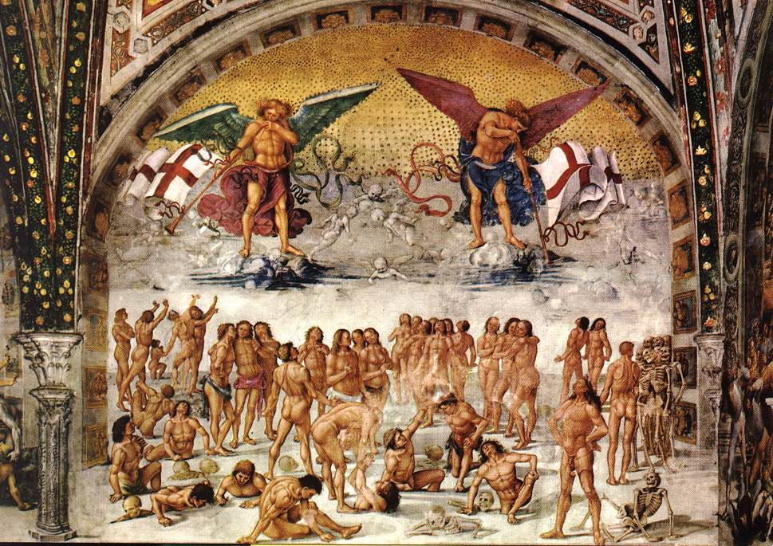

# Session 33 — The Resurrection of the Body

*Luca Signorelli, Resurrection of the Flesh (1499-1502). Public Domain via Wikimedia Commons.*

> *Signorelli's bodies climb out of the earth at Orvieto — gymnastic, surprised, shining. Your body too is going somewhere — not into the ground forever, but back, restored, recognizable. What you do with it now is not throwaway.*

## Pius X asks

**156.** What awaits us at the end of this life?

*At the end of this life, the pains and dissolution of death and the particular judgment await us.*

**157.** What awaits us at the end of the world?

*At the end of the world, the resurrection of the body and the universal judgment await us.*

**158.** What does "resurrection of the body" mean?

*"Resurrection of the body" means that our body, by the power of God, will be restored and reunited with the soul, in order to share, in eternal life, the reward or punishment it has merited.*

## St. Thomas teaches

Not only does the Holy Spirit sanctify the Church as regards the souls of its members, but also our bodies shall rise again by His power: "We believe in Him that raised up Jesus Christ, Our Lord, from the dead."[^1] And: "By a man came death: and by a Man the resurrection of the dead."[^2] In this there occur four considerations: (1) the benefits which proceed from our faith in the resurrection; (2) the qualities of those who shall rise, taken all in general; (3) the condition of the blessed; (4) the condition of the damned.

## The Benefits of the Resurrection

Concerning the first, our faith and hope in the resurrection is beneficial in four ways. Firstly, it takes away the sorrow which we feel for the departed. It is impossible for one not to grieve over the death of a relative or friend; but the hope that such a one will rise again greatly tempers the pain of parting: "And we will not have you ignorant, brethren, concerning them that are asleep, that you be not sorrowful, even as others who have no hope."[^3]

Secondly, it takes away the fear of death. If one does not hope in another and better life after death, then without doubt one is greatly in fear of death and would willingly commit any crime rather than suffer death. But because we believe in another life which will be ours after death, we do not fear death, nor would we do anything wrong through fear of it: "That, through death He might destroy him who had the empire of death, that is to say, the devil. And might deliver them who through fear of death were all their lifetime subject of servitude."[^4]

Thirdly, it makes us watchful and careful to live uprightly. If, however, this life in which we live were all, we would not have this great incentive to live well, for whatever we do would be of little importance, since it would be regulated not by eternity, but by brief, determined time. But we believe that we shall receive eternal rewards in the resurrection for whatsoever we do here. Hence, we are anxious to do good: "If in this life only we have hope in Christ, we are of all men most miserable."[^5]

Finally, it withdraws us from evil. Just as the hope of reward urges us to do good, so also the fear of punishment, which we believe is reserved for wicked deeds, keeps us from evil: "But they that have done good things shall come forth unto the resurrection of life; but they that have done evil, unto the resurrection of judgment."[^6]

## Qualities of the Risen Bodies

There is a fourfold condition of all those who shall take part in the resurrection.

### Identity

It will be the same body as it is now, both as regards its flesh and its bones. Some, indeed, have said that it will not be this same body which is corrupted that shall be raised up; but such view is contrary to the Apostle: "For this corruptible must put on incorruption."[^7] And likewise the Sacred Scripture says that by the power of God this same body shall rise to life: "And I shall be clothed again with my skin; and in my flesh I shall see my God."[^8]

### Incorruptibility

The bodies of the risen shall be of a different quality from that of the mortal body, because they shall be incorruptible, both of the blessed, who shall be ever in glory, and of the damned, who shall be ever in punishments: "For this corruptible must put on incorruption; and this mortal must put on immortality."[^9] And since the body will be incorruptible and immortal, there will no longer be the use of food or of the marriage relations: "For in the resurrection they shall neither marry nor be married, but shall be as the Angels of God in heaven."[^10] This is directly against the Jews and Mohammedans: "Nor shall he return any more into his house."[^11]

### Integrity

Both the good and the wicked shall rise with all soundness of body which is natural to man. He will not be blind or deaf or bear any kind of physical defect: "The dead shall rise again incorruptible,"[^12] this is to mean, wholly free from the defects of the present life.[^13]

### Age

All will rise in the condition of perfect age, which is of thirty-two or thirty-three years. This is because all who were not yet arrived at this age, did not possess this perfect age, and the old had already lost it. Hence, youths and children will be given what they lack, and what the aged once had will be restored to them: "Until we all attain the unity of faith and of the knowledge of the Son of God, unto a perfect man, unto the measure of the age of the fullness of Christ."[^14]

## Condition of the Blessed

It must be known that the good will enjoy a special glory because the blessed will have glorified bodies which will be endowed with four gifts.

### Brilliance

"Then shall the just shine as the sun in the kingdom of their Father."[^15]

### Impassibility

"It is sown in dishonor; it shall rise in glory." 16 "And God shall wipe away all tears from their eyes; and death shall be no more. Nor mourning, nor crying, nor sorrow shall be anymore, for the former things are passed away."[^17]

### Agility

"The just shall shine and shall run to and fro like sparks among the reeds."[^18]

### Subtility

"It is sown a natural body; it shall rise a spiritual body."[^19] This is in the sense of not being altogether a spirit, but that the body will be wholly subject to the spirit.

## Condition of the Damned

It must also be known that the condition of the damned will be the exact contrary to that of the blessed. Theirs is the state of eternal punishment, which has a fourfold evil condition. The bodies of the damned will not be brilliant: "Their countenances shall be as faces burnt." 20 Likewise they shall be passible, because they shall never deteriorate and, although burning eternally in fire, they shall never be consumed: "Their worm shall not die and their fire shall not be quenched."[^21] They will be weighed down, and the soul of the damned will be as it were chained therein: "To bind their kings with fetters, and their nobles with manacles of iron."[^22] Finally, they will be in a certain manner fleshly both in soul and body: "The beasts have rotted in their dung."[^23]

[^1]: Romans 4:24.
[^2]: 1 Corinthians 15:21. "In this Article the resurrection of mankind is called 'the resurrection of the body.' The Apostles had for object thus to convey an important truth, the immortality of the soul. Lest, therefore, contrary to the Sacred Scripturess, which in many places clearly teach the soul to be immortal, any one may imagine that it dies with the body, and denies that both are to be raised up, the Creed speaks only of 'the resurrection of the body' " ("Roman Catechism," Eleventh Article, 2).
[^3]: 1 Thessalonians 4:12.
[^4]: Hebrews 2:14.
[^5]: 1 Corinthians 15:19.
[^6]: John 5.
[^7]: 1 Corinthians 15:53.
[^8]: Job 19:26. "The identical body which belongs to each one of us during life shall, though corrupt, and dissolved into its original dust, be raised up again to life. . . . Man is, therefore, to rise again in the same body with which he served God, or was a slave to the devil that in the same body he may experience rewards and a crown of victory, or endure the severest punishments and everlasting torments" ("Roman Catechism," "loc. cit.," 7).
[^9]: 1 Corinthians 15.
[^10]: Matthew 22:30.
[^11]: Job 7:10. "To omit many other points, the chief difference between the state of all bodies when risen from the dead, and what they had previously been, is that before the resurrection they were subject to dissolution; but when reanimated they shall all, without distinction of good and bad, be invested with immortality. This marvellous restoration of nature is the result of the glorious victory of Christ over death" ("Roman Catechism," "loc. cit.," 12).
[^12]: 1 Corinthians 15:52.
[^13]: "Not only will the body rise, but it will rise endowed with whatever constitutes the reality of its nature and adorns and ornaments man. . . . The members, because essential to the integrity of human nature, shall all be restored. . . . For the resurrection like the creation, is clearly to be accounted among the chief works of God. And as at the creation all things came perfect from the hand of God, so at the resurrection all things shall be perfectly restored by the same omnipotent hand" ("Roman Catechism," "loc. cit.," 9).
[^14]: Ephesians 4:13.
[^15]: Matthew 13:43. "This brightness is a sort of refulgence reflected from the supreme happiness of the soul; it is an emanation of the beatitude which it enjoys and which shines through the body. Its communication is like to the manner in which the soul itself is made happy, by a participation of the happiness of God" ("Roman Catechism," "loc. cit.," 13).
[^16]: 1 Corinthians 15.
[^17]: Revelation 21:4. "The first is 'impassibility,' which shall place them beyond the reach of pain or inconvenience of any sort. . . . This quality the Scholastics called 'impassibility,' not incorruption, in order to distinguish it as a property peculiar to a glorified body. The bodies of the damned shall not be impassible, though incorruptible; they shall be capable of experiencing heat and cold and of feeling pain." ("Roman Catechism," "ibid.").
[^18]: Wisdom 3:7. "Agility, as it is called, is a quality by which the body shall be freed from the heaviness that now presses it down; and shall acquire a capability of moving with the utmost ease and quickness wheresoever the soul pleases" ("Roman Catechism," "ibid.").
[^19]: 1 Corinthians 15:44. "Another quality is that of subtility, a quality which subjects the body to the absolute dominion of the soul, and to an entire obedience to her control" ("Roman Catechism," "ibid.").
[^20]: Isaiah 13:8.
[^21]: "Ibid., 66:24.
[^22]: Psalm 149:8.
[^23]: Joel 1:17.

> **Scripture.** *Jesus said to her: I am the resurrection and the life: he that believeth in me, although he be dead, shall live.* — John 11:25

> *Lord of life, make my body Your temple now, and Your seed for the resurrection then.*

---

#### Going Deeper — *Catechism of Trent*

## Importance Of This Article

That this Article supplies a convincing proof of the truth of
our faith appears chiefly from the fact that not only is it
proposed in the Sacred Scriptures to the belief of the faithful,
but is also confirmed by numerous arguments. This we scarcely
find to be the case with regard to the other Articles, which
justifies the inference that on this doctrine, as on its most
solid basis, rests our hope of salvation; for according to the
reasoning of the Apostle, If there be no resurrection of the
dead, then Christ is not risen again; and if Christ be not risen
again, then is our preaching vain, and your faith is also vain.

The diligence and zeal, therefore, of the pastor in the
explanation of this dogma should not be less than the labor which
the impiety of many has expended in efforts to overthrow it. That
eminently important advantages flow to the faithful from the
knowledge of this Article will be shown further on.

## "The Resurrection of the Body"

That in this Article the resurrection of mankind is called the
resurrection of the body, is a circumstance which deserves
special attention. It was not, indeed, so named without a reason
for the Apostles intended thus to convey a necessary truth, the
immortality of the soul. Lest anyone, despite the fact that many
passages of Scripture plainly teach that the soul is immortal,
might imagine that it dies with the body, and that both are to be
restored to life, the Creed speaks only of the resurrection of
the body.

Although in Sacred Scripture the word flesh often signifies
the whole man, as in Isaias, All flesh is grass, and in St. John,
The Word was made flesh; yet in this place it is used to express
the body only, thus giving us to understand that of the two
constituent parts of man, soul and body, one only, that is, the
body, is corrupted and returns to its original dust, while the
soul remains incorrupt and immortal. As then, a man cannot be
said to return to life unless he has previously died, so the soul
could not with propriety be said to rise again.

The word body is also mentioned, in order to confute the
heresy of Hymeneus and Philetus, who, during the lifetime of the
Apostle, asserted that whenever the Scriptures speak of the
resurrection, they are to be understood to mean not the
resurrection of the body, but that of the soul, by which it rises
from the death of sin to the life of grace. The words of this
Article, therefore, as is clear, exclude that error, and
establish a real resurrection of the body.

## The Fact of the Resurrection

### Examples And Proofs Derived From Scripture

It will be the duty of the pastor to illustrate this truth by
examples taken from the Old and New Testaments, and from all
ecclesiastical history. In the Old Testament, some were restored
to life by Elias and Eliseus; and, besides those who were raised
to life by our Lord, many were raised by the holy Apostles and by
many others. These many resurrections confirm the doctrine taught
by this Article; for believing that many were recalled from death
to life, we are also naturally led to believe the general
resurrection of all. In fact the principal fruit which we should
derive from these miracles is to yield to this Article our most
unhesitating belief.

To pastors ordinarily conversant with the Sacred Volumes many
Scripture proofs of this Article will at once present themselves.
In the Old Testament the most conspicuous are those afforded by
Job, when he says that in his flesh he shall see his God, and by
Daniel when, speaking of those who sleep in the dust of the
earth, he says, some shall awake to eternal life, others to
eternal reproach. In the New Testament (the principal passages
are) those of St. Matthew, which record the disputation our Lord
held with the Sadducees, and those in which the Evangelists speak
concerning the Last Judgment. To these we may also add the
accurate reasoning of the Apostle on the subject in his Epistles
to the Corinthians and Thessalonians.

### Analogies From Nature

But although the resurrection is most certainly established by
faith, it will, notwithstanding, be of material advantage to show
from analogy and reason that what faith proposes is not at
variance with nature or human reason.

To one asking how the dead should rise again, the Apostle
answers: Foolish man! that which thou sowest is not quickened,
except it die first; and that which thou sowest, thou sowest not
the body that shall be, but bare grain, as of wheat, or of some
of the rest; but God giveth it a body as he will; and a little
after, It is sown in corruption, it shall rise in incorruption.

St. Gregory calls our attention to many other arguments of
analogy tending to the same effect. The sun, he says, is every
day withdrawn from our eyes, as it were, by dying, and is again
recalled, as it were, by rising again; trees lose, and again, as
it were, by a resurrection, resume their verdure; seeds die by
putrefaction, and rise again by germination.

### Arguments Drawn From Reason

The reasons also adduced by ecclesiastical writers seem well
calculated to establish this truth. In the first place, as the
soul is immortal, and has, as part of man, a natural propensity
to be united to the body, its perpetual separation from it must
be considered as unnatural. But as that which is contrary to
nature and in a state of violence, cannot be permanent, it
appears fitting that the soul should be reunited to the body, and
consequently that the body should rise again. This argument our
Saviour Himself employed, when in His disputation with the
Sadducees He deduced the resurrection of the body from the
immortality of the soul."

In the next place, as an alljust God holds out punishments
to the wicked and rewards to the good, and as very many of the
former depart this life unpunished for their crimes and many of
the latter unrewarded for their virtues, the soul should be
reunited to the body, in order, as the partner of her crimes, or
the companion of her virtues, to become a sharer in her
punishments or rewards. This argument has been admirably treated
by St. Chrysostom in his homily to the people of Antioch.

To this effect also, the Apostle, speaking of the
resurrection, says: If in this life only, we have hope in Christ,
we are of all men the most miserable.. These words of St. Paul
cannot be supposed to refer to the misery of the soul; for since
the soul is immortal, it is capable of enjoying happiness in a
future life, even though the body did not rise again. His words,
then, must refer to the whole man; for, unless the body receive
the due rewards of its labours, those who, like the Apostles,
endured so many afflictions and calamities in this life, would
necessarily be the most miserable of men. On this subject the
Apostle is much more explicit in his Epistle to the
Thessalonians: We glory in the churches of God, for your patience
and faith, in all your persecutions and tribulations which you
endure — for an example of the just judgment of God, that you
may be counted worthy of the kingdom of God, for which also you
suffer; seeing it is a just thing with God to repay tribulation
to them that trouble you; and to you who are troubled, rest with
us when the Lord Jesus shall be revealed from heaven with the
angels of his power, in a flame of fire, yielding vengeance to
them who know not God, and who obey not the gospel of our Lord
Jesus Christ.

Again, while the soul is separated from the body, man cannot
enjoy that full happiness which is replete with every good. For
as a part separated from the whole is imperfect, the soul
separated from the body must be imperfect. Therefore, that
nothing may be wanting to fill up the measure of its happiness,
the resurrection of the body is necessary.

By these, and similar arguments, the pastor will be able to
instruct the faithful in this Article.

### All Shall Rise

He should also carefully explain from the Apostle who are to
be raised to life. Writing to the Corinthians, he (St. Paul)
says: As in Adam all die, so also in Christ all shall be made
alive.' Good and bad then, without distinction, shall all rise
from the dead, although the condition of all will not be the
same. Those who have done good, shall rise to the resurrection of
life; and those who have done evil to the resurrection of
judgment.

When we say all we mean those who will have died before the
day of judgment, as well as those who will then die. That the
Church acquiesces in the opinion that all, without distinction,
shall die, and that this opinion is more consonant with truth, is
the teaching of St. Jerome and of St. Augustine.

Nor does the Apostle in his Epistle to the Thessalonians
dissent from this doctrine, when he says: The dead who are in
Christ shall rise first, then we who are alive, who are left,
shall be taken up together with them in the clouds to meet
Christ, into the air. St. Ambrose explaining these words says: In
that very taking up, death shall take place, as it were, in a
deep sleep, and the soul, having gone forth from the body, shall
instantly return. For those who are alive shall die when they are
taken up that, coming to the Lord, they may receive their souls
from His presence; because in His presence they cannot be dead.
This opinion is supported by the authority of St. Augustine in
his book On the City of God."

## The Body Shall Rise Substantially the Same

But as it is of vital importance to be fully convinced that
the identical body, which belongs to each one of us during life,
shall, though corrupt and dissolved into its original dust, be
raised up again to life, this too is a subject which demands
accurate explanation on the part of the pastor.

It is a truth conveyed by the Apostle when he says: This
corruptible must put on incorruption, evidently designating by
the word this, his own body. It is also clearly expressed in the
prophecy of Job: In my flesh I shall see my God, whom I myself
shall see, and mine eyes behold, and not another.

Further, this same truth is inferred from the very definition
of resurrection; for resurrection, as Damascene defines it, is a
return to the state from which one has fallen.

Finally, if we bear in mind the arguments by which we have
just established a future resurrection, every doubt on the
subject must at once disappear.

We have said that the body is to rise again, that every one
may receive the proper things of the body, according as he hath
done, whether it be good or evil. Man is, therefore, to rise
again in the same body with which he served God, or was a slave
to the devil; that in the same body he may experience rewards and
a crown of victory, or endure the severest punishments and
torments.

### Restoration Of All That Pertains To The Nature And Adornment Of The Body

Not only will the body rise, but whatever belongs to the
reality of its nature, and adorns and ornaments man will be
restored. For this we have the admirable words of St. Augustine:
There

shall then be no deformity of body; if some have been
overburdened with flesh, they shall not resume its entire weight.
All that exceeds the proper proportion shall be deemed
superfluous. On the other hand, should the body be wasted by
disease or old age, or be emaciated from any other cause, it
shall be repaired by the divine power of Christ, who will not
only restore the body unto us, but will repair whatever it shall
have lost through the wretchedness of this life. In another place
he says: Man shall not resume his former hair, but shall be
adorned with such as will become him, according to the words:
"The very hairs of your head are all numbered." God
will restore them according to His wisdom.

### Restoration Of All That Pertains To The Integrity Of The Body

But the members especially, because they belong to the
integrity of human nature, shall all be restored at once. The
blind from nature or disease, the lame, the maimed and the
paralysed in any of their members shall rise again with entire
and perfect bodies. Otherwise the desires of the soul, which so
strongly incline it to a union with the body, would be far from
satisfied; but we are convinced that in the resurrection these
desires will be fully realised.

Besides, the resurrection, like the creation, is clearly to
be numbered among the principal works of God. As, therefore, at
the creation all things came perfect from the hand of God, we
must admit that it will be the same in the resurrection.

These observations are not to be restricted to the bodies of
the martyrs, of whom St. Augustine says: As the mutilation which
they suffered would prove a deformity, they shall rise with all
their members; otherwise those who were beheaded would rise
without a head. The scars, however, which they received shall
remain, shining like the wounds of Christ, with a brilliance far
more resplendent than that of gold and of precious stones.

The wicked, too, shall rise with all their members, even with
those lost through their own fault. The greater the number of
members which they shall have, the greater will be their
torments; and therefore this restoration of members will serve to
increase not their happiness but their sorrow and misery; for
merit or demerit is ascribed not to the members, but to the
person to whose body they are united. To those, therefore, who
shall have done penance, they shall be restored as sources of
reward; and to those who shall have contemned it, as instruments
of punishment.

If the pastor gives attentive consideration to these things,
he can never lack words or ideas to move the hearts of the
faithful, and enkindle in them the flame of piety; so that having
before their minds the troubles and calamities of this life, they
may look forward with eager expectations to that blessed glory of
the resurrection which awaits the just.

## The Condition of the Risen Body Shall be Different

It now remains for the faithful to understand how the body,
when raised from the dead, although substantially the same body
that had been dead, shall be vastly different and changed in its
condition.

### Immortality

To omit other points, the chief difference between the state
of all bodies when risen from the dead and what they had
previously been is that before the resurrection they were subject
to dissolution, but when reanimated they shall all, without
distinction of good and bad, be invested with immortality.

This admirable restoration of nature, as the Scriptures
testify, is the result of the glorious victory of Christ over
death. For it is written: He shall cast death down headlong for
ever, and, O death! I will be thy death.' Explaining these words
the Apostle says: And the enemy death shall be destroyed last;
and St. John also says: Death shall be no more.

It was most fitting that the sin of Adam should be far
exceeded by the merit of Christ the Lord, who overthrew the
empire of death. It was also in keeping with divine justice, that
the good should enjoy endless felicity, while the wicked,
condemned to everlasting torments, shall seek death, and shall
not find it, shall desire to die, and death shall fly from them.
Immortality, therefore, will be common to the good and to the
bad.

### The Qualities Of A Glorified Body

In addition to this, the bodies of the risen Saints will be
distinguished by certain transcendent endowments, which will
ennoble them far beyond their former condition. Among these
endowments four are specially mentioned by the Fathers, which
they infer from the doctrine of St. Paul, and which are called
gifts.

#### Impassibility

The first endowment or gift is impassibility, which shall
place them beyond the reach of suffering anything disagreeable or
of being affected by pain or inconvenience of any sort. Neither
the piercing severity of cold, nor the glowing intensity of heat,
nor the impetuosity of waters can hurt them. It is sown says the
Apostle, in corruption, it shall rise in incorruption This
quality the Schoolmen call impassibility, not incorruption, in
order to distinguish it as a property peculiar to a glorified
body. The bodies of the damned, though incorruptible, will not be
impassible; they will be capable of experiencing heat and cold
and of suffering various afflictions.

#### Brightness

The next quality is brightness, by which the bodies of the
Saints shall shine like the sun, according to the words of our
Lord recorded in the Gospel of St. Matthew: The just shall shine
as the sun, in the kingdom of their Father. To remove the
possibility of doubt on the subject, He exemplifies this in His
Transfiguration. This quality the Apostle sometimes calls glory,
sometimes brightness: He will reform the body of our lowness,
made like to the body of his glory; " and again, It is sown
in dishonour, it shall rise in glory. Of this glory the
Israelites beheld some image in the desert, when the face of
Moses, after he had enjoyed the presence and conversation of God,
shone with such lustre that they could not look on it.

This brightness is a sort of radiance reflected on the body
from the supreme happiness of the soul. It is a participation in
that bliss which the soul enjoys just as the soul itself is
rendered happy by a participation in the happiness of God.

Unlike the gift of impassibility, this quality is not common
to all in the same degree. All the bodies of the Saints will be
equally impassible; but the brightness of all will not be the
same, for, according to the Apostle, One is the glory of the sun,
another the glory of the moon, and another the glory of the
stars, for star differeth from star in glory: so also is the
resurrection of the dead.

#### Agility

To the preceding quality is united that which is called
agility, by which the body will be freed from the heaviness that
now presses it down, and will take on a capability of moving with
the utmost ease and swiftness, wherever the soul pleases, as St.
Augustine teaches in his book On the City of God, and St. Jerome
On Isaias. Hence these words of the Apostle: It is sown in
weakness, it shall rise in power.

#### Subtility

Another quality is that of subtility, which subjects the body
to the dominion of the soul, so that the body shall be subject to
the soul and ever ready to follow her desires. This quality we
learn from these words of the Apostle: It is sown a natural body,
it shall rise a spiritual body.

These are the principal points which should be dwelt on in
the exposition of this Article.

## Advantages of Deep Meditation on this Article

But in order that the faithful may appreciate the fruit they
derive from a knowledge of so many and such exalted mysteries, it
is necessary, first of all, to point out that to God, who has
hidden these things from the wise and made them known to little
ones, we owe a debt of boundless gratitude. How many men, eminent
for wisdom or endowed with singular learning, who ever remained
blind to this most certain truth ! The fact, then, that He has
made known to us these truths, although we could never have
aspired to such knowledge, obliges us to pour forth our gratitude
in unceasing praises of His supreme goodness and clemency.

Another important advantage to be derived from reflection on
this Article is that in it we shall find consolation both for
ourselves and others when we mourn the death of those who were
endeared to us by relationship or friendship. Such was the
consolation which the Apostle himself gave the Thessalonians when
writing to them concerning those who are asleep.

Again, in all our afflictions and calamities the thought of a
future resurrection must bring the greatest relief to the
troubled heart, as we learn from the example of holy Job, who
supported his afflicted and sorrowing soul by this one hope that
the day would come when, in the resurrection, he would behold the
Lord his God.

The same thought must also prove a powerful incentive to the
faithful to use every exertion to lead lives of rectitude and
integrity, unsullied by the defilement of sin. For if they
reflect that those boundless riches which will follow after the
resurrection are now offered to them as rewards, they will be
easily attracted to the pursuit of virtue and piety.

On the other hand, nothing will have greater effect in
subduing the passions and withdrawing souls from sin, than
frequently to remind the sinner of the miseries and torments with
which the reprobate will be visited, who on the last day will
come forth unto the resurrection of judgment.
