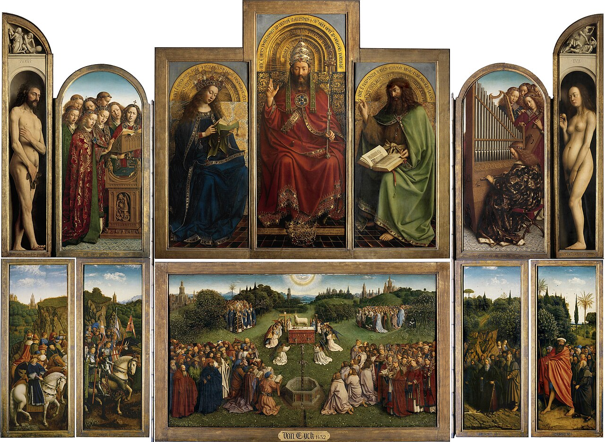

# Session 34 — Life Everlasting. Amen.

*Jan and Hubert van Eyck, Adoration of the Mystic Lamb (Ghent Altarpiece) (1432). Public Domain via Wikimedia Commons.*

> *Van Eyck's Adoration of the Lamb: the saved at last gathered, the Lamb at the center, the New Jerusalem rising behind. "Amen" is not the end of a sentence; it is the answer of all created things to all of God.*

## Pius X asks

**159.** What does "life everlasting" mean?

*"Life everlasting" means that the reward, like the punishment, will last forever, and that the vision of God will be the true life and happiness of the soul, while the privation of Him will be the greatest unhappiness and, as it were, an eternal death.*

**160.** What does the word "Amen" mean?

*The word "Amen" means truly, so it is and so be it; and by it we confirm that all that we profess in the Creed is true, and we wish for ourselves the forgiveness of sins, the resurrection unto glory, and life everlasting in God.*

## St. Thomas teaches

The end of all our desires, eternal life, is fittingly placed last among those things to be believed; and the Creed says: "life everlasting. Amen." They wrote this to stand against those who believe that the soul perishes with the body. If this were indeed true, then the condition of man would be just the same as that of the beasts. This agrees with what the Psalmist says: "Man when he was in honour did not understand; he hath been compared to senseless beasts, and made like to them."[^1] The human soul, however, is in its immortality made like unto God, and in its sensuality alone is it like the brutes. He, then, who believes that the soul dies with the body withdraws it from this similarity to God and likens it to the brutes. Against such it is said: "They knew not the secrets of God, nor hoped for the wages of justice, nor esteemed the honour of holy souls. For God created man incorruptible, and to the image of His own likeness He made him."[^2]

## The Fullness of Desires

Whatever is delightful will be there in abundant fullness. Thus, if pleasures are desired, there will be the highest and most perfect pleasure, for it derives from the highest good, namely, God: "Then shalt thou abound in delights in the Almighty."[^12] "At the right hand are delights even to the end."[^13] Likewise, if honors are desired, there too will be all honour. Men wish particularly to be kings, if they be laymen; and to be bishops, if they be clerics. Both these honors will be there: "And hath made us a kingdom and priests."[^14] "Behold how they are numbered among the children of God."[^15] If knowledge is desired, it will be there most perfectly, because we shall possess in the life everlasting knowledge of all the natures of things and all truth, and whatever we desire we shall know. And whatever we desire to possess, that we shall have, even life eternal: "Now, all good things come to me together with her."[^16] "To the just their desire shall be given."[^17]

Again, most perfect security is there. In this world there is no perfect security; for in so far as one has many things, and the higher one's position, the more one has to fear and the more one wants. But in the life everlasting there is no anxiety, no labor, no fear.

"And My people shall sit in the beauty of peace,"[^18] and "shall enjoy abundance, without fear of evils."[^19]

Finally, in heaven there will be the happy society of all the blessed, and this society will be especially delightful. Since each one will possess all good together with the blessed, and they will love one another as themselves, and they will rejoice in the others' good as their own. It will also happen that, as the pleasure and enjoyment of one increases, so will it be for all: "The dwelling in thee is as it were of all rejoicing."[^20]

> **Scripture.** *And God shall wipe away all tears from their eyes: and death shall be no more, nor mourning, nor crying, nor sorrow shall be any more, for the former things are passed away.* — Revelation 21:4

> *Amen, Lord, to all of it. To everything You will. Today and at the end. Amen.*

---

#### Going Deeper — *Catechism of Trent*

## Importance Of This Article

The holy Apostles, our guides, thought fit to conclude the
Creed, which is the summary of our faith, with the Article on
eternal life: first, because after the resurrection of the body
the only object of the Christian's hope is the reward of
everlasting life; and secondly, in order that perfect happiness,
embracing as it does the fullness of all good, may be ever
present to our minds and absorb all our thoughts and affections.

In his instructions to the faithful the pastor, therefore,
should unceasingly endeavour to light up in their souls an ardent
desire of the promised rewards of eternal life, so that whatever
difficult duties he may inculcate as a part of the Christian's
life, the faithful may look upon as light, or even agreeable, and
may yield a more willing and cheerful obedience to God.

## "Life Everlasting"

As many mysteries lie concealed under the words which are here
used to declare the happiness reserved for us, they are to be
explained in such a manner as to make them intelligible to all,
as far as each one's capacity will allow.

The faithful, therefore, are to be informed that the words,
life everlasting, signify not only continuance of existence,
which even the demons and the wicked possess, but also that
perpetuity of happiness which is to satisfy the desires of the
blessed. In this sense they were understood by the lawyer
mentioned in the Gospel when he asked the Lord our Saviour: What
shall I do to possess everlasting life? as if he had said, What
shall I do in order to arrive at the enjoyment of perfect
happiness? In this sense these words are understood in the Sacred
Scriptures, as is clear from many passages.

### "Everlasting"

The supreme happiness of the blessed is called by this name
(life everlasting) principally to exclude the notion that it
consists in corporeal and transitory things, which cannot be
everlasting. The word blessedness is insufficient to express the
idea, particularly as there have not been wanting men who, puffed
up by the teachings of a vain philosophy, would place the supreme
good in sensible things. But these grow old and perish, while
supreme happiness is to be terminated by no lapse of time. Nay
more, so far is the enjoyment of the goods of this life from
conferring real happiness that, on the contrary, he who is
captivated by a love of the world is farthest removed from true
happiness; for it is written: Love not the world, nor the things
which are in the world. If any man love the world, the charity of
the Father is not in him, and a little farther on we read: The
world passeth away, and the concupiscence thereof.

The pastor, therefore, should be careful to impress these
truths on the minds of the faithful, that they may learn to
despise earthly things, and to know that in this world, in which
we are not citizens but sojourners, happiness is not to be found.
Yet even here below we may be said with truth to be happy in
hope, if denying ungodliness and worldly desires, we . . . live
soberly, and justly, and godly in this world, looking for the
blessed hope and coming of the glory of the great God and our
Saviour Jesus Christ. Very many who seemed to themselves wise,
not understanding these things, and imagining that happiness was
to be sought in this life, became fools and the victims of the
most deplorable calamities.

These words, life everlasting, also teach us that, contrary
to the false notions of some, happiness once attained can never
be lost. Happiness is an accumulation of all good without
admixture of evil, which, as it fills up the measure of man's
desires, must be eternal. He who is blessed with happiness must
earnestly desire the continued enjoyment of those goods which he
has obtained. Hence, unless its possession be permanent and
certain, he is necessarily a prey to the most tormenting
apprehension.

### Life

The intensity of the happiness which the just enjoy in their
celestial country, and its utter incomprehensibility to all but
themselves alone, are sufficiently conveyed by the very words
blessed life. For when in order to express any idea we make use
of a word common to many things, it is clear that we do so
because we have no exact term by which to express it fully.
Since, therefore, to express happiness, words are adopted which
are not more applicable to the blessed than to all who are to
live for ever, this proves to us that the idea presents to the
mind something too great, too exalted, to be expressed fully by a
proper term. True, the happiness of heaven is expressed in
Scripture by a variety of other words, such as the kingdom of
God, of Christ, of heaven, paradise, the holy city, the new
Jerusalem, my Father's house; yet it is clear that none of these
appellations is sufficient to convey an adequate idea of its
greatness.

The pastor, therefore, should not neglect the opportunity
which this Article affords of inviting the faithful to the
practice of piety, of justice and of all the other Christian
duties, by holding out to them such ample rewards as are
announced in the words life everlasting. Among the blessings
which we instinctively desire life is certainly esteemed one of
the greatest. Now it is chiefly by this blessing that we describe
the happiness (of the just) when we say life everlasting. If,
then, there is nothing more loved, nothing dearer or sweeter,
than this short and calamitous life, which is subject to so many
and such various miseries that it should rather be called death;
with what ardour of soul, with what earnestness of purpose,
should we not seek that eternal life which, without evil of any
sort, presents to us the pure and unmixed enjoyment of every
good?

## How to Arrive at the Enjoyment of this Happiness

The pastor, therefore, should not only encourage the faithful
to seek this happiness, but should frequently remind them that
the sure way of obtaining it is to possess the virtues of faith
and charity, to persevere in prayer and the use of the
Sacraments, and to discharge all the duties of kindness towards
their neighbour.

Thus, through the mercy of God, who has prepared that blessed
glory for those who love Him, shall be one day fulfilled the
words of the Prophet: My people shall sit in the beauty of peace,
and in the tabernacle of confidence, and in wealthy rest.
