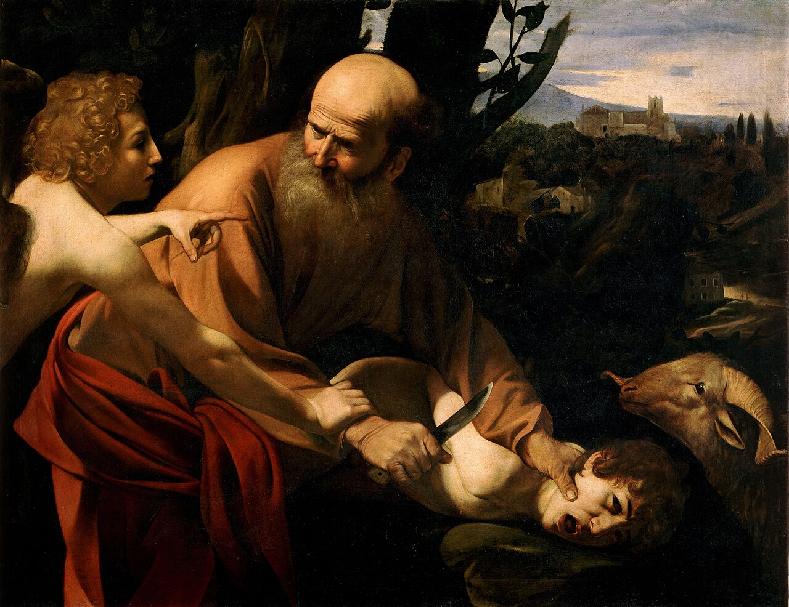

# Session 37 — First Commandment — Adoring God Alone

*Caravaggio, The Sacrifice of Isaac (c. 1603). Public Domain via Wikimedia Commons.*

> *The Magi kneel before a child. Their gold is laid down. They have come a long way to surrender at this one place — because there is one place worth surrendering to. Today, locate it again.*

## Pius X asks

**169.** What does the first commandment, "I am the Lord thy God: thou shalt not have other gods before me," order us?

*The first commandment, "I am the Lord thy God: thou shalt not have other gods before me," orders us to be religious, that is, to believe in God and to love, adore, and serve Him as the one true God, Creator and Lord of all.*

**170.** What does the first commandment forbid us?

*The first commandment forbids us impiety, superstition, and irreligion; and also apostasy, heresy, voluntary doubt, and culpable ignorance of the truths of Faith.*

**171.** What is impiety?

*Impiety is the refusal to render any worship to God.*

**172.** What is superstition?

*Superstition is divine worship, or worship of latria, rendered to one who is not God, or to God Himself but in an unsuitable manner: such as idolatry, or the worship of false divinities and of creatures; recourse to the devil, to spirits, and to any suspect means in order to obtain things humanly impossible; the use of unsuitable, vain, or Church-forbidden rites.*

## St. Thomas teaches

The entire law of Christ depends upon charity. And charity depends on two precepts, one of which concerns loving God and the other concerns loving our neighbour.

Now God, in delivering the law to Moses, gave him Ten Commandments written upon two tablets of stone. Three of these Commandments that were written on the first tablet referred to the love of God; and the seven Commandments written on the other tablet related to the love of our neighbour. The whole law, therefore, is founded on these two precepts.[^1]

The First Commandment which relates to the love of God is: "Thou shalt not have strange gods." For an understanding of this Commandment, one must know how of old it was violated. Some worshipped demons. "All the gods of the Gentiles are devils."[^2] This is the greatest and most detestable of all sins. Even now there are many who transgress this Commandment: all such as practise divinations and fortune-telling. Such things, according to St. Augustine, cannot be done without some kind of pact with the devil. "I would not that you should be made partakers with devils."[^3]

Some worshipped the heavenly bodies, believing the stars to be gods: "They have imagined the sun and the moon to be the gods that rule the world."[^4] For this reason Moses forbade the Jews to raise their eyes, or adore the sun and moon and stars: "Keep therefore your souls carefully . . . lest perhaps lifting up thy eyes to heaven, thou see the sun and the moon, and all the stars of heaven, and being deceived by error thou adore and serve them, which the Lord thy God created for the service of all the nations."[^5] The astrologers sin against this Commandment in that they say that these bodies are the rulers of souls, when in truth they were made for the use of man whose sole ruler is God.

Others worshipped the lower elements: "They imagined the fire or the wind to be gods."[^6] Into this error also fall those who wrongly use the things of this earth and love them too much: "Or covetous person (who is a server of idols)."[^7]

Some men have erred in worshipping their ancestors. This arose from three causes.

(1) From Their Carnal Nature.--"For a father being afflicted with a bitter grief, made to himself the image of his son who was quickly taken away; and him who then had died as a man, he began now to worship as a god, and appointed him rites and sacrifices among his servants."[^8]

(2) Because of Flattery.--Thus being unable to worship certain men in their presence, they, bowing down, honoured them in their absence by making statues of them and worshipping one for the other: "Whom they had a mind to honour . . . they made an image . . . that they might honour as present him that was absent."[^9] Of such also are those men who love and honour other men more than God: "He that loveth his father and mother more than Me, is not worthy of Me."[^10] "Put your trust not in princes; in the children of man, in whom there is no salvation."[^11]

(3) From Presumption.--Some because of their presumption made themselves be called gods; such, for example, was Nabuchodonosor (Judith, iii. 13). "Thy heart is lifted up and thou hast said: I am God."[^12] Such are also those who believe more in their own pleasures than in the precepts of God. They worship themselves as gods, for by seeking the pleasures of the flesh, they worship their own bodies instead of God: "Their god is their belly."[^13] We must, therefore, avoid all these things.

## Why We Should Adore One God

"Thou shalt not have strange gods before Me." As we have already said, the First Commandment forbids us to worship other than the one God. We shall now consider five reasons for this.

God's Dignity.--The first reason is the dignity of God which, were it belittled-in any way, would be an injury to God. We see something similar to this in the customs of men. Reverence is due to every degree of dignity. Thus, a traitor to the king is he who robs him of what he ought to maintain. Such, too, is the conduct of some towards God: "They changed the glory of the incorruptible God into the likeness of the image of a corruptible man."[^14] This is highly displeasing to God: "I will not give My glory to another, nor My praise to graven things."[^15] For it must be known that the dignity of God consists in His omniscience, since the name of God, Deus, is from "seeing," and this is one of the signs of divinity: "Show the things that are to come hereafter, and we shall know that ye are gods."[^16] "All things are naked and open to His eyes."[^17] But this dignity of God is denied Him by practitioners of divination, and of them it is said: "Should not the people seek of their God, for the living and the dead?"[^18]

God's Bounty.--We receive every good from God; and this also is of the dignity of God, that He is the maker and giver of all good things: "When Thou openest Thy hand, they shall all be filled with good."[^13] And this is implied in the name of God, namely, Deus, which is said to be distributor, that is, "dator" of all things, because He fills all things with His goodness. You are, indeed, ungrateful if you do not appreciate what you have received from Him, and, furthermore, you make for yourself another god; just as the sons of Israel made an idol after they had been brought out of Egypt: "I will go after my lovers."[^20] One does this also when one puts too much trust in someone other than God, and this occurs when one seeks help from another: "Blessed is the man whose hope is in the name of the Lord."[^21] Thus, the Apostle says: "Now that you have known God . . . how turn you again to the weak and needy elements? . . . You observe days and months and times and years."[^22]

The Strength of Our Promise.--The third reason is taken from our solemn promise. For we have renounced the devil, and we have promised fidelity to God alone. This is a promise which we cannot break: "A man making void the law of Moses dieth without mercy under two or three witnesses. How much more think ye he deserveth punishment who hath trodden under foot the Son of God, and hath esteemed the blood of the testament unclean, by which he was sanctified, and hath offered an affront to the Spirit of grace!"[^23] "Whilst her husband liveth, she shall be called an adulteress, if she be with another man."[^24] Woe, then, to the sinner who enters the land by two ways, and who "halts between two sides."[^25]

Against Service of the Devil.--The fourth reason is because of the great burden imposed by service to the devil: "You shall serve strange gods day and night, who will give you no rest."[^26] The devil is not satisfied with leading to one sin, but tries to lead on to others: "Whosoever sins shall be a slave of sin."[^27] It is, therefore, not easy for one to escape from the habit of sin. Thus, St. Gregory says: "The sin which is not remitted by penance soon draws man into another sin."[^28] The very opposite of all this is true of service to God; for His Commandments are not a heavy burden: "My yoke is sweet and My burden light."[^29] A person is considered to have done enough if he does for God as much as what he has done for the sake of sin: "For as you have yielded your members to serve uncleanness and iniquity, unto iniquity; so now yield your members to serve justice unto sanctification."[^30] But on the contrary, it is written of those who serve the devil: "We wearied ourselves in the way of iniquity and destruction, and have walked through hard ways."[^31] And again: "They have laboured to commit iniquity."[^32]

Greatness of the Reward.--The fifth reason is taken from the greatness of the reward or prize. In no law are such rewards promised as in the law of Christ. Rivers flowing with milk and honey are promised to the Mohammedans, to the Jews the land of promise, but to Christians the glory of the Angels: "They shall be as the Angels of God in heaven."[^33] It was with this in mind that St. Peter asked: "Lord, to whom shall we go? Thou hast the words of eternal life."[^34]

[^1]: "The Decalogue is the summary and epitome of the entire law of God," is the opinion of St. Augustine (Quest. cxl super Exod., lib. ii). "Although the Lord had spoken many things, yet He gave only two tablets of stone to Moses. . . . If carefully examined and well understood, it will be found that on them depend whatever else is commanded by God. Again, these ten commandments are reducible to two, the love of God and our neighbour, on which 'depend the whole law and the prophets' " ("Roman Catechism," "The Decalogue," Chapter I, 1).
[^2]: Ps. xcv.
[^3]: I Cor., x. 20.
[^4]: Wis., xiii. 2.
[^5]: Deut., iv. 15, 19.
[^6]: Wis., xiii. 2.
[^7]: Eph., v. 5.
[^8]: Wis., xiv. 15.
[^9]: "Ibid.," 17.
[^10]: Matt., x. 37.
[^11]: Ps. cxlv. 3.
[^12]: Ezech., xxviii. 2.
[^13]: Phil., iii. 19.
[^14]: Rom., i. 23.
[^15]: Isa., xlii. 8.
[^16]: "Ibid.," xli. 23.
[^17]: Heb., iv. 13.
[^18]: Isa., viii. 19.
[^19]: Ps. ciii. 28.
[^20]: Osee, ii. 5.
[^21]: Ps. xxxix. 5.
[^22]: Gal., iv. 9, 10.
[^23]: Heb., x. 28-29.
[^24]: Rom., vii. 3.
[^25]: III Kings, xviii. 21.
[^26]: Jerem., xvi. 13.
[^27]: John, viii.
[^28]: "Super Ezech.," xi.
[^29]: Matt., xi. 30.
[^30]: Rom., vi. 19.
[^31]: Wis., v. 7.
[^32]: Jerem., ix. 5.
[^33]: Matt., xxii, 30.
[^34]: John, vi. 69. "The faithful should continually remember these words, 'I am the Lord thy God.' They will learn from these words that their Lawgiver is none other than their Creator, by whom they were made and are preserved. . . . 'Who brought thee out of the land of Egypt, out of the house of bondage' appear at first to relate solely to the Jews liberated from the bondage of Egypt. But if we ponder on the meaning of the salvation of the entire human race, these words will be seen to apply still more specifically to all Christians who are liberated by God, not from the bondage of Egypt, but from the bondage of sin and 'the powers of darkness, and are translated into the kingdom of His beloved Son' (Col., i. 13). . . . And when it is said, 'Thou shalt not have strange gods before Me,' it is the same as to say: 'Thou shalt worship Me who am the true God, thou shalt not worship strange gods.' . . . It should be accurately taught that the veneration and invocation of the Angels, of the Saints, and of the blessed souls who enjoy the glory of heaven--and, moreover, the honour which the Catholic Church has always paid even to the bodies and ashes of the Saints- -are not forbidden by this Commandment" ("Roman Catechism," "First Commandment," 1, 2, 5, 8).

> **Scripture.** *Thou shalt not have strange gods before me.* — Exodus 20:3

> *Lord, the gods I make are bad ones. Pull them down today. Be the one I worship.*

---

#### Going Deeper — *Catechism of Trent*

## "I am the Lord thy God"

The pastor should use his best endeavours to induce the
faithful to keep continually in view these words: I am the Lord
thy God. From them they will learn that their Lawgiver is none
other than their Creator, by whom they were made and are
preserved, and that they may truly repeat: He is the Lord our
God, and we are the people of his pasture and the sheep of his
hand. The frequent and earnest inculcation of these words will
also serve to induce the faithful more readily to observe the Law
and avoid sin.

## "Who Brought Thee Out of the Land of Egypt, Out of the House of Bondage"

The next words, who brought thee out of the land of Egypt, out
of the house of bondage, seem to relate solely to the Jews
liberated from the bondage of Egypt. But if we consider the
meaning of the salvation of the entire human race, those words
are still more applicable to Christians, who are liberated by God
not from the bondage of Egypt, but from the slavery of sin and
the powers of darkness, and are translated into the kingdom of
his beloved Son. Contemplating the greatness of this favour,
Jeremias foretold: Behold the days come, saith the Lord, when it
shall be said no more: The Lord liveth that brought forth. the
children of Israel out of the land of Egypt; but: The Lord liveth
that brought the children of Israel out of the land of the north
and out of all the lands to which I cast them out; and I will
bring them again into their land which gave to their fathers.
Behold, I send many fishers, saith the Lord, and they shall fish
them, etc. And, indeed, our most indulgent Father has gathered
together, through His beloved Son, His children that were
dispersed, that being made free from sin and made the servants of
justice, we may serve before him in holiness and justice all our
days.'

Against every temptation, therefore, the faithful should arm
themselves with these words of the Apostle as with a shield:
Shall we who are dead to sin live any longer therein? We are no
longer our own, we are His who died and rose again for us. He is
the Lord our God who has purchased us for Himself at the price of
His blood. Shall we then be any longer capable of sinning against
the Lord our God, and crucifying Him again? Being made truly
free, and with that liberty wherewith Christ has made us free,
let us, as we heretofore yielded our members to serve injustice,
henceforward yield them to serve justice to sanctification.

## "Thou Shalt Not Have Strange Gods Before Me"

The pastor should teach that the first part of the Decalogue
contains our duties towards God; the second part, our duties
towards our neighbour. The reason (for this order) is that the
services we render our neighbour are rendered for the sake of
God; for then only do we love our neighbour as God commands when
we love him for God's sake. The Commandments which regard God are
those which were inscribed on the first table of the Law.

### The Above Words Contain A Command And A Prohibition

(The pastor) should next show that the words just quoted
contain a twofold precept, the one mandatory, the other
prohibitory. When it is said: Thou shalt not have strange gods
before me, it is equivalent to saying: Thou shalt worship me the
true God; thou shalt not worship strange gods.

### What They Command

The (mandatory part) contains a precept of faith, hope and
charity. For, acknowledging God to be immovable, immutable,
always the same, we rightly confess that He is faithful and
entirely just. Hence in assenting to His oracles, we necessarily
yield to Him all belief and obedience. Again, who can contemplate
His omnipotence, His clemency, His willing beneficence, and not
repose in Him all his hopes? Finally, who can behold the riches
of His goodness and love, which He lavishes on us, and not love
Him? Hence the exordium and the conclusion used by God in
Scripture when giving His commands: I, the Lord.

### What They Forbid

The (negative) part of this Commandment is comprised in these
words: Thou shalt not have strange gods before me. This the
Lawgiver subjoins, not because it is not sufficiently expressed
in the affirmative part of the precept, which means: Thou shalt
worship me, the only God, for if He is God, He is the only God;
but on account of the blindness of many who of old professed to
worship the true God and yet adored a multitude of gods. Of these
there were many even among the Hebrews, whom Elias reproached
with having halted between two sides, and also among the
Samaritans, who worshipped the God of Israel and the gods of the
nations.

### Importance Of This Commandment

After this it should be added that this is the first and
principal Commandment, not only in order, but also in its nature,
dignity and excellence. God is entitled to infinitely greater
love and obedience from us than any lord or king. He created us,
He governs us, He nurtured us even in the womb, brought us into
the world, and still supplies us with all the necessaries of life
and maintenance.

### Sins Against This Commandment

Against this Commandment all those sin who have not faith.
hope and charity. such sinners are very numerous, for they
include all who fall into heresy, who reject what holy mother the
Church proposes for our belief, who give credit to dreams.
fortunetelling, and such illusions; those who, despairing of
salvation, trust not in the goodness of God; and those who rely
solely on wealth, or health and strength of body. But these
matters are developed more at length in treatises on sins and
vices.

### Veneration And Invocation Of Angels And Saints Not Forbidden By This Commandment

In explanation of this Commandment it should be accurately
taught that the veneration and invocation of holy Angels and of
the blessed who now enjoy the glory of heaven, and likewise the
honour which the Catholic Church has always paid even to the
bodies and ashes of the Saints, are not forbidden by this
Commandment. If a king ordered that no one else should set
himself up as king, or accept the honours due to the royal
person, who would be so foolish as to infer that the sovereign
was unwilling that suitable honour and respect should be paid to
his magistrates? Now although Christians follow the example set
by the Saints of the Old Law, and are said to adore the Angels,
yet they do not give to Angels that honour which is due to God
alone.

And if we sometimes read that Angels refused to be worshipped
by men, we are to know that they did so because the worship which
they refused to accept was the honour due to God alone.

#### It Is Lawful To Honour And Invoke The Angels

The Holy Spirit who says: Honour and glory to God alone,
commands us also to honour our parents and elders; and the holy
men who adored one God only are also said in Scripture to have
adored, that is, supplicated and venerated kings. If then kings,
by whose agency God governs the world, are so highly honoured,
shall it be deemed unlawful to honour those angelic spirits whom
God has been pleased to constitute His ministers, whose services
He makes use of not only in the government of His Church, but
also of the universe, by whose aid, although we see them not, we
are every day delivered from the greatest dangers of soul and
body ? Are they not worthy of far greater honour, since their
dignity so far surpasses that of kings?

Add to this their love towards us, which, as we easily see
from Scripture, prompts them to pour out their prayers for those
countries over which they are placed, as well as for us whose
guardians they are, and whose prayers and tears they present
before the throne of God Hence our Lord admonishes us in the
Gospel not to offend the little ones because their angels in
heaven always see the face of their Father who is in heaven.

Their Intercession, therefore, we ought to invoke, because
they always see tile face of God, and are constituted by Him the
willing advocates of our salvation. The Scriptures bear witness
to such invocation. Jacob entreated the Angel with whom he
wrestled to bless him; nay, he even compelled him, declaring that
he would not let him go until he had blessed him. And not only
did he invoke the blessing of the Angel whom he saw, but also of
him whom he saw not. The angel, said he, who delivers me from all
evils, bless these boys.

#### It Is Lawful To Honour And Invoke The Saints

From all this we may conclude that to honour the Saints who
nave slept in the Lord, to invoke them, and to venerate their
sacred relics and ashes, far from diminishing, tends considerably
to increase the glory of God, in proportion as man's hope is thus
animated and fortified, and he himself encouraged to imitate the
Saints.

This is a practice which is also supported by the authority'
of the second Council of Nice, the Councils of Gangra, and of
Trent, and by the testimony of the Fathers. In order, however,
that the pastor may be the better prepared to meet the objections
of those who deny this doctrine, he should consult particularly
St. Jerome against Vigilantius and St. Damascene. To the teaching
of these Fathers should be added as a consideration of prime
importance that the practice was received from the Apostles, and
has always been retained and preserved in the Church of God.

But who can desire a stronger or more convincing proof than
that which is supplied by the admirable praises given in
Scripture to the Saints? For there are not wanting eulogies which
God Himself pronounced on some of the Saints. If, then, Holy Writ
celebrates their praises, why should not men show them singular
honour ?

A stronger claim which the Saints have to be honoured and
invoked is that they constantly pray for our salvation and obtain
for us by their merits and influence many blessings from God. If
there is joy in heaven over the conversion of one sinner, will
not the citizens of heaven assist those who repent? When they are
invoked, will they not obtain for us the pardon of sins, and the
grace of God ?

#### Objections Answered

Should it be said, as some say, that the patronage of the
Saints is unnecessary, because God hears our prayers without the
intervention of a mediator, this impious assertion is easily met
by the observation of St. Augustine: There are many things which
God does not grant without a mediator and intercessor. This is
confirmed by the wellknown examples of Abimelech and the
friends of Job who were pardoned only through the prayers of
Abraham and of Job

Should it be alleged that to recur to the patronage and
intercession of the Saints argues want or weakness of faith, what
will (the objectors) answer regarding the centurion whose faith
was highly eulogised by the Lord God Himself, despite the fact
that he had sent to the Redeemer the ancients of the Jews, to
intercede for his sick servant?

True, there is but one Mediator, Christ the Lord, who alone
has reconciled us to the heavenly Father through His blood, and
who, having obtained eternal redemption, and having entered once
into the holies, ceases not to intercede for us. But it by no
means follows that it is therefore unlawful to have recourse to
the intercession of the Saints. If, because we have one Mediator
Jesus Christ, it were unlawful to ask the intercession of the
Saints, the Apostle would never have recommended himself with so
much earnestness to the prayers of his brethren on earth. For the
prayers of the living would lessen the glory and dignity of
Christ's Mediatorship not less than the intercession of the
Saints in heaven.

#### The Honour And Invocation Of Saints Is Approved By Miracles

But who would not be convinced of the honour due the Saints
and of the help they give us by the wonders wrought at their
tombs? Diseased eyes, hands, and other members are restored to
health; the dead are raised to life, and demons are expelled from
the bodies of men ! These are facts which St. Ambrose and St.
Augustine, most unexceptionable witnesses, declare in their
writings, not that they heard, as many did, nor that they read,
as did man very reliable men, but that they saw.

But why multiply proofs? If the clothes, the handkerchiefs,
and even the very shadows of the Saints, while yet on earth,
banished disease and restored health, who will have the hardihood
to deny that God can still work the same wonders by the holy
ashes, the bones and other relics of the Saints ? Of this we have
a proof in the restoration to life of the dead body which was
accidentally let down into the grave of Eliseus, and which, on
touching the body (of the Prophet), was instantly restored to
life.
