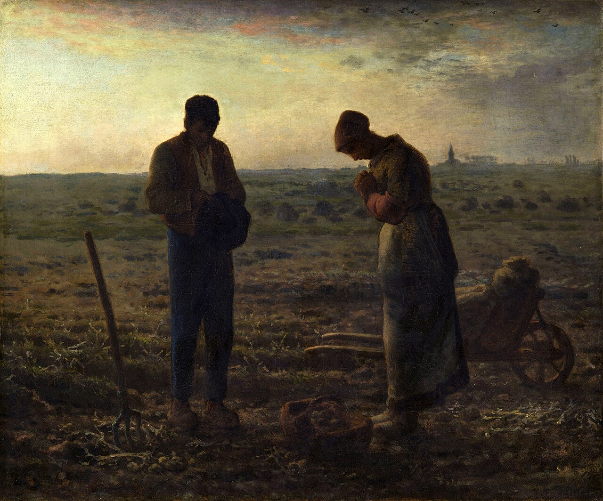

# Session 43 — Third Commandment — Sunday Rest

*Jean-François Millet, The Angelus (1857-1859). Public Domain via Wikimedia Commons.*

> *Millet's peasants pause at the Angelus — heads bowed, the field forgotten for a moment. Sabbath is rest, but it is rest with a direction. Stop, today, the way they stopped — for someone, not for nothing.*

## Pius X asks

**187.** What works are called servile?

*Servile works are the manual labors proper to artisans and workers.*

**188.** Are all servile works forbidden on feast days?

*On feast days are forbidden all servile works that are not necessary for life and for the service of God, and not justified by piety or by some other grave reason.*

**189.** How is it fitting to occupy feast days?

*It is fitting to occupy feast days for the good of the soul, by attending preaching and catechism and performing some good work, and also by resting the body, far from every vice and dissipation.*

## St. Thomas teaches

## From What We Should Abstain on the Sabbath

"Remember that you keep holy (sanctify) the Sabbath day." We have already said that, as the Jews celebrated the Sabbath, so do we Christians observe the Sunday and all principal feasts. Let us now see in what way we should keep these days. We ought to know that God did not say to "keep" the Sabbath, but to remember to keep it holy. The word "holy" may be taken in two ways. Sometimes "holy" (sanctified) is the same as pure: "But you are washed, but you are sanctified"[^20] (that is, made holy). Then again at times "holy" is said of a thing consecrated to the worship of God, as, for instance, a place, a season, vestments, and the holy vessels. Therefore, in these two ways we ought to celebrate the feasts, that is, both purely and by giving ourselves over to divine service.

We shall consider two things regarding this Commandment. First, what should be avoided on a feast day, and secondly, what we should do. We ought to avoid three things. The first is servile work.

Avoidance of Servile Work.--"Neither do ye any work; sanctify the Sabbath day."[^21] And so also it is said in the Law: "You shall do no servile work therein."[^22] Now, servile work is bodily work; whereas "free work" (i.e., non-servile work) is done by the mind, for instance, the exercise of the intellect and such like. And one cannot be servilely bound to do this kind of work.

When Servile Work Is Lawful.--We ought to know, however, that servile work can be done on the Sabbath for four reasons. The first reason is necessity. Wherefore, the Lord excused the disciples plucking the ears of corn on the Sabbath, as we read in St. Matthew (xii. 3-5). The second reason is when the work is done for the service of the Church; as we see in the same Gospel how the priests did all things necessary in the Temple on the Sabbath day. The third reason is for the good of our neighbour; for on the Sabbath the Saviour cured one having a withered hand, and He refuted the Jews who reprimanded Him, by citing the example of the sheep in a pit ("ibid."). And the fourth reason is the authority of our superiors. Thus, God commanded the Jews to circumcise on the Sabbath.[^13]

Avoidance of Sin and Negligence on the Sabbath.--Another thing to be avoided on the Sabbath is sin: "Take heed to your souls, and carry no burdens on the Sabbath day."[^24] This weight and burden on the soul is sin: "My iniquities as a heavy burden are become heavy upon me."[^25] Now, sin is a servile work because "whosoever committeth sin is the servant of sin."[^26] Therefore, when it is said, "You shall do no servile work therein,"[^27] it can be understood of sin. Thus, one violates this commandment as often as one commits sin on the Sabbath; and so both by working and by sin God is offended.[^28] "The Sabbaths and other festivals I will not abide." And why? "Because your assemblies are wicked. My soul hateth your new moon[^29] and your solemnities; they are become troublesome to me."[^30]

Another thing to avoid on the Sabbath is idleness: "For idleness hath taught much evil."[^31] St. Jerome says: "Always do some good work, and the devil will always find you occupied."[^32] Hence, it is not good for one to keep only the principal feasts, if on the others one would remain idle. "The King's honour loveth judgment,"[^33] that is to say, discretion. Wherefore, we read that certain of the Jews were in hiding, and their enemies fell upon them; but they, believing that they were not able to defend themselves on the Sabbath, were overcome and killed.[^34] The same thing happens to many who are idle on the feast days: "The enemies have seen her, and have mocked at her Sabbaths."[^35] But all such should do as those Jews did, of whom it is said: "Whosoever shall come up against us to fight on the Sabbath day, we will fight against him."[^36]

## With What the Sabbath and Feasts Should Be Occupied

"Remember that thou keep holy the Sabbath day." We have already said that man must keep the feast days holy; and that "holy" is considered in two ways, namely, "pure" and "consecrated to God." Moreover, we have indicated what things we should abstain from on these days. Now it must be shown with what we should occupy ourselves, and they are three in number.

The Offering of Sacrifice.--The first is the offering of sacrifices.[^37] In the Book of Numbers (xxviii) it is written how God ordered that on each day there be offered one lamb in the morning and another in the evening, but on the Sabbath day the number should be doubled. And this showed that on the Sabbath we should offer sacrifice to God from all that we possess: "All things are Thine; and we have given Thee what we received from Thy hand."[^38] We should offer, first of all, our soul to God, being sorry for our sins: "A sacrifice to God is an afflicted spirit;"[^39] and also pray for His blessings: "Let my prayer be directed as incense in Thy sight."[^40] Feast days were instituted for that spiritual joy which is the effect of prayer. Therefore, on such days our prayers should be multiplied.

Secondly, we should offer our body, by mortifying it with fasting:[^41] "I beseech you therefore, brethren, by the mercy of God, that you present your bodies a living sacrifice,"[^42] and also by praising God: "The sacrifice of praise shall honour Me."[^43] And thus on these days our hymns should be more numerous. Thirdly, we should sacrifice our possessions by giving alms: "And do not forget to do good, and to impart; for by such sacrifice God's favor is obtained."[^44] And this alms ought to be more than on other days because the Sabbath is a day of common joys: "Send portions to them that have not prepared for themselves, because it is the holy day of the Lord."[^45]

Hearing of God's Word.--Our second duty on the Sabbath is to be eager to hear the word of God. This the Jews did daily: "The voices of the prophets which are read every Sabbath."[^46] Therefore Christians, whose justice should be more perfect, ought to come together on the Sabbath to hear sermons and participate in the services of the Church! "He that is God, heareth the words of God."[^47] We likewise ought to speak with profit to others: "Let no evil speech proceed from your mouth; but that which is good unto sanctification."[^48] These two practices are good for the soul of the sinner, because they change his heart for the better: "Are not My words as a fire, saith the Lord, and as a hammer that breaketh the rock in pieces?"[^49] The opposite effect is had on those, even the perfect, who neither speak nor hear profitable things: "Evil communications corrupt good manners. Awake, ye just, and sin not."[^50] "Thy words have I hidden in my heart."[^51] God's word enlightens the ignorant: "Thy word is a lamp to my feet."[^52] It inflames the lukewarm: "The word of the Lord inflamed him."[^53]

## The Spiritual Sabbath

The contemplation of divine things may be exercised on the Sabbath. However, this is for the more perfect.[^54] "O taste, and see that the Lord is sweet,"[^55] and this is because of the quiet of the soul. For just as the tired body desires rest, so also does the soul. But the soul's proper rest is in God: "Be Thou unto me a God, a protector, and a house of refuge."[^56] "There remaineth therefore a day of rest for the people of God. For he that is entered into his rest, the same also hath rested from his works, as God did from His."[^57] When I go into my house, I shall repose myself with her" (i.e., Wisdom).[^58]

However, before the soul arrives at this rest, three other rests must precede. The first is the rest from the turmoil of sin: "But the wicked are like the raging sea which cannot rest."[^59] The second rest is from the passions of the flesh, because "the flesh lusteth against the spirit, and the spirit against the flesh."[^60] The third is rest from the occupations of the world: "Martha, Martha, thou art careful and art troubled about many things."[^61]

## The Heavenly Sabbath[^62]

And then after all these things the soul rests peacefully in God: "If thou call the Sabbath delightful . . . then shalt thou be delighted in the Lord,"[^63] The Saints gave up everything to possess this rest, "for it is a pearl of great price which a man having found, hid it, and for joy thereof goeth and selleth all that he hath, and buyeth that field."[^64] This rest in truth is eternal life and heavenly joy: "This is my rest for ever and ever; here will I dwell, for I have chosen it."[^65] And to this rest may the Lord bring us all!

[^1]: St. Thomas also treats of this Commandment in the "Summa Theologica," I- ll Q. cii, art. 4, 10; "ibid.," II-II, Q. cxxii, art. 4.
[^2]: II Peter, iii. 3-5.
[^3]: Gal., vi. 15.
[^4]: Rom., vi. 4-5.
[^5]: "The Apostles, therefore, resolved to consecrate the first of the seven days of the week to the divine worship, and they called it 'the Lord's Day.' St. John makes mention of 'the Lord's Day' in the Apocalypse (i. 10), and St. Paul commands collections to be made 'on the first day of the week' (I Cor., xvi. 2). . . . From all this we learn that even then the Lord's Day was kept holy in the Church. . . . The Church of God has thought it well to transfer the celebration and observance of the Sabbath to Sunday. On that day light first shone on the world when the Lord arose on that day, and the gate of eternal life was thrown open to us and we were called out of darkness into light. . . . We also learn from the Holy Scriptures that the first day of the week was held sacred for other reasons, viz., on that day the creation began, and on that day the Holy Ghost descended upon the Apostles" ("Roman Catechism." Third Commandment, 7, 18).
[^6]: Ps. xv. 9.
[^7]: "Ibid.," 10.
[^8]: Isa., xiv. 3.
[^9]: "Ibid.," xxxii. 18.
[^10]: Matt., xi. 28-30.
[^11]: Ecclus., li. 35.
[^12]: Wis., ix. 15.
[^13]: Ps. xxxiii. 2.
[^14]: I Thess., v. 17.
[^15]: Ps. cxviii. 164.
[^16]: Isa., lviii. 13-14.
[^17]: Job xxii. 26.
[^18]: This is a reference to the great public spectacles and games.
[^19]: Deut., v. 12-14.
[^20]: I Cor., vi. 11.
[^21]: Jerem., xvii. 22.
[^22]: Levit., xxiii. 25.
[^23]: John, vii. 22-23.
[^24]: Jerem., xviii. 21.
[^25]: Ps. xxxvii. 5.
[^26]: John, viii. 34.
[^27]: Levit., iii. 25.
[^28]: St. Thomas' comparison of sin and servile work follows from the words: "Whosoever committeth sin is the servant of sin," quoted above. This does not mean that commission of sin on the Sabbath changes the species of the sin or gravely increases its malice.
[^29]: This refers to the celebration and special sacrifices offered on the first day of the month. The Lord here is displeased not with the external ritual itself, but with the lack of proper internal dispositions on the part of the Jews.
[^30]: Isa., i. 13.
[^31]: Ecclus., xxxiii. 29.
[^32]: "Ep. ad Rusticum."
[^33]: Ps. xcviii. 4.
[^34]: I Mach, ii. 31-38.
[^35]: Lam., i. 7.
[^36]: I Mach., ii. 41.
[^37]: For the Catholic, of course, the great Sacrifice is that of the Mass. And we are bound to assist at Mass on Sundays and Holydays of obligation unless we are excused for serious reason. "The pastor should not omit to teach the faithful what words and actions they should perform on the festival days. These are: to go to church and there with true piety and devotion assist at the celebration of the Holy Sacrifice of the Mass; and to approach frequently the Sacraments of the Church which were instituted for our salvatlon" ("Roman Catechism," "Third Commandment," 25).
[^38]: I Paral., xxix. 14.
[^39]: Ps. l. 19.
[^40]: Ps. cxl. 2.
[^41]: St. Thomas here refers not to the "fast of affliction" ("jejunium afflictionis") but to the "fast of joy" ("iejunium exultationis"), which is a joyful lifting of the mind to higher things and proceeds from the Holy Ghost who is the spirit of liberty (cfr. "Summa Theol.," III, Q. cxlvii, art. 5).
[^42]: Rom., xii. 1.
[^43]: Ps. xlix. 23.
[^44]: Heb., xiii. 16.
[^45]: II Esdras, viii. 10.
[^46]: Acts, xiii. 27.
[^47]: John, viii. 47.
[^48]: Eph., iv. 29.
[^49]: Jerem., xxiii. 29.
[^50]: I Cor., xv. 33.
[^51]: Ps. cxviii. 11.
[^52]: "Ibid.," 105.
[^53]: Ps. civ. 19.
[^54]: "The spiritual Sabbath consists in a holy and mystical rest wherein, the carnal man (vetus homo, Rom., vi. 4) being buried with Christ, the new man is renewed to life and carefully applies himself to exercise the spirit of Christian piety" ("Roman Calechism," "Third Commandment," 15).
[^55]: Ps. xxxiii. 9.
[^56]: Ps. xxx. 3.
[^57]: Heb., iv. 9-10.
[^58]: Wis., viii. 16.
[^59]: Isa., lvii. 20.
[^60]: Gal., v. 17.
[^61]: Luke, x. 41.
[^62]: "The heavenly Sabbalh, as St. Cyril observes on the words of St. Paul, 'There remaineth therefore a day of rest for the people of God' (Eph., v. 8), is that life in which, living with Christ, we shall experience all joy and all sin will be wiped away ("In Joan.," lib. 4). And in this vision of God the souls of the saints shall obtain every good" ("Roman Catechism," "loc. cit.," 16).
[^63]: Isa., lviii. 13-14.
[^64]: Matt., xiii. 44-46.
[^65]: Ps. cxxxi. 14.

> **Scripture.** *The sabbath was made for man, and not man for the sabbath.* — Mark 2:27

> *Lord, when I rest today, let me rest in You. Otherwise it will not be rest.*

---

#### Going Deeper — *Catechism of Trent*

## Four Parts Of This Commandment

In order that the faithful may know what they are to do and
what to avoid on the Lord's day, it will not be foreign to his
purpose, if the pastor, dividing the Commandment into its four
natural parts, explain each word of it carefully.

First Part of this Commandment

In the first place, then, he should explain generally the
meaning of these words: Remember that thou keep holy the sabbath
day.

### "Remember"

The word remember is appropriately made use of at the
beginning of the Commandment to signify that the sanctification
of that particular day belonged to the ceremonial law. Of this it
would seem to have been necessary to remind the people; for,
although the law of nature commands us to devote a certain
portion of time to the external worship to God, it fixes no
particular day for the performance of this duty.

They are also to be taught, that from these words we may
learn how we should employ our time during the week; that we are
to keep constantly in view the Lord's day, on which we are, as it
were, to render an account to God for our occupations and
conduct; and that therefore our works should be such as not to be
unacceptable in the sight of God, or, as it is written, be to us
an occasion of grief, and a scruple of heart.

Finally, we are taught, and the instruction demands our
serious attention, that there will not be wanting occasions which
may lead to a forgetfulness of this Commandment, such as the evil
example of others who neglect its observance, and an inordinate
love of amusements and sports, which frequently withdraw from the
holy and religious observance of the Lord's day.

### "Sabbath"

We now come to the meaning of the word sabbath. Sabbath is a
Hebrew word which signifies cessation. To keep the Sabbath,
therefore, means to cease from labor and to rest. In this sense
the seventh day was called the Sabbath, because God, having
finished the creation of the world, rested on that day from all
the work which He had done. Thus it is called by the Lord in
Exodus.

Later on, not only the seventh day, but, in honour of that
day, the entire week was called by the same name; and in this
meaning of the word, the Pharisee says in St. Luke: I fast twice
in a sabbath. So much will suffice with regard to the
signification of the word sabbath.

### "Keep Holy"

In the Scriptures keeping holy the Sabbath means a cessation
from bodily labor and from business, as is clear from the
following words of the Commandment: Thou shalt do no work on it.
But this is not all that it means; otherwise it would have been
sufficient to say in Deuteronomy, Observe the day of the sabbath;
but it is added, and sanctify it; and these additional words
prove that the Sabbath is a day sacred to religion, set apart for
works of piety and devotion.

We sanctify the Sabbath fully and perfectly, therefore, when
we offer to God works of piety and religion. This is evidently
the Sabbath, which Isaias calls delightful; for festivals are, as
it were, the delight of God and of pious men. And if to this
religious and holy observance of the Sabbath we add works of
mercy, the rewards promised us in the same chapter are numerous
and most important.

The true and proper meaning, therefore, of this Commandment
tends to this, that we take special care to set apart some fixed
time, when, disengaged from bodily labor and worldly affairs, we
may devote our whole being, soul and body, to the religious
veneration of God.

Second Part of this Commandment

The second part of the precept declares that the seventh day
was consecrated by God to His worship; for it is written: Six
days shalt thou labour, and do all thy works; but on the seventh
day is the sabbath of the Lord thy God. From these words we learn
that the Sabbath is consecrated to the Lord, that we are required
on that day to render Him the duties of religion, and to know
that the seventh day is a sign of the Lord's rest.

### "The Seventh Day Is The Sabbath Of The Lord Thy God"

This particular day was fixed for the worship of God, because
it would not have been well to leave to a rude people the choice
of a time of worship, lest, perhaps, they might have imitated the
festivals of the Egyptians.

The last day of the week was, therefore, chosen for the
worship of God, and in this there is much that is symbolic. Hence
in Exodus,' and in Ezechiel the Lord calls it a sign: See that
you keep my sabbath because it is a sign between me and you in
your generation, that you may know that I am the Lord who
sanctify you.

It was a sign that man should dedicate and sanctify himself
to God, since even the very day is devoted to Him. For the
holiness of the day consists in this, that on it men are bound in
a special manner to practice holiness and religion.

It was also a sign, and, as it were, a memorial of the
stupendous work of the creation. Furthermore, to the Jews it was
a traditional sign, reminding them that they had been delivered
by the help of God from the galling yoke of Egyptian bondage.
This the Lord Himself declares in these words: Remember that thou
also didst serve in Egypt, and the Lord thy God brought thee out
from thence with a strong hand and a stretched out arm. Therefore
hath he commanded thee that thou shouldst observe the sabbath
day.

It is also a sign of a spiritual and celestial sabbath. The
spiritual sabbath consists in a holy and mystical rest, wherein
the old man being buried with Christ, is renewed to life and
carefully applies himself to act in accordance with the spirit of
Christian piety. For those who were once darkness but are now
light in the Lord, should walk as children of the light, in all
goodness and justice and truth, having no fellowship with the
unfruitful works of darkness.

The celestial sabbath, as St. Cyril observes on these words
of the Apostle, There remaineth therefore a day of rest for the
people of God, is that life in which, living with Christ, we
shall enjoy all good, when sin shall be eradicated, according to
the words: No lion shall be there, nor shall any mischievous
beast go up by it, nor be found there; but a path shall be there,
and it shall be called the holy way; for in the vision of God the
souls of the Saints obtain every good. The pastor therefore
should exhort and animate the faithful in the words: Let us
hasten therefore to enter into that rest.

#### Other Festivals Observed By The Jews

Besides the seventh day, the Jews observed other festivals and
holydays, instituted by the divine law to awaken the recollection
of the principal favours (conferred on them by the Almighty).

#### The Sabbath, Why Changed To Sunday

But the Church of God has thought it well to transfer the
celebration and observance of the Sabbath to Sunday.

For, as on that day light first shone on the world, so by the
Resurrection of our Redeemer on the same day, by whom was thrown
open to us the gate to eternal life, we were called out of
darkness into light; and hence the Apostles would have it called
the Lord's day.

We also learn from the Sacred Scriptures that the first day
of the week was held sacred because on that day the work of
creation commenced, and on that day the Holy Ghost was given to
the Apostles.

#### Other Festivals Observed By The Church

From the very infancy of the Church and in the following
centuries other days were also appointed by the Apostles and the
holy Fathers, in order to commemorate the benefits bestowed by
God. Among these days to be kept sacred the most solemn are those
which were instituted to honour the mysteries of our redemption.
In the next place are the days which are dedicated to the most
Blessed Virgin Mother, to the Apostles, Martyrs and other Saints
who reign with Christ. In the celebration of their victories the
divine power and goodness are praised, due honour is paid to
their memories, and the faithful are encouraged to imitate them.

### "Six Days Shalt Thou Labour And Do All Thy Work"

And as the observance of the precept is very strongly assisted
by these words: Six days shalt thou labour, but on the seventh
day is the sabbath of God, the pastor should therefore carefully
explain them to the people. For from these words it can be
gathered that the faithful are to be exhorted not to spend their
lives in indolence and sloth, but that each one, mindful of the
words of the Apostle, should do his own business, and work with
his own hands, as he had commanded them.

These words also enjoin as a duty commanded by God that in
six days we do all our works, lest we defer to a festival what
should have been done during the other days of the week, thereby
distracting the attention from the things of God.

Third Part of this Commandment

The third part of the Commandment comes next to be explained.
It points out, to a certain extent, the manner in which we are to
keep holy the Sabbath day, and explains particularly what we are
forbidden to do on that day.

#### Works Forbidden

Thou shalt do no work on it, says the Lord, thou, nor thy son,
nor thy daughter, nor thy manservant, nor thy maidservant,
nor thy beast, nor the stranger that is within thy gates.

These words teach us, in the first place, to avoid whatever
may interfere with the worship of God. Hence it is not difficult
to perceive that all servile works are forbidden, not because
they are improper or evil in themselves, but because they
withdraw the attention from the worship of God, which is the
great end of the Commandment.

The faithful should be still more careful to avoid sin, which
not only withdraws the mind from the contemplation of divine
things, but entirely alienates us from the love of God.

#### Works Permitted

But whatever regards the celebration of divine worship, such
as the decoration of the altar or church on occasion of some
festival, and the like, although servile works, are not
prohibited; and hence our Lord says: The priests in the temple
break the sabbath, and are without blame.

Neither are we to suppose that this Commandment forbids
attention to those things on a feast day, which, if neglected,
will be lost; for this is expressly permitted by the sacred
canons.

There are many other things which our Lord in the Gospel
declares lawful on festivals and which may be seen by the pastor
in St. Matthew and St. John.

#### Why Animals Are Not To Be Employed On The Sabbath

To omit nothing that may interfere with the sanctification of
the Sabbath, the Commandment mentions beasts of burden, because
their use will prevent its due observance. If beasts be employed
on the Sabbath, human labor also becomes necessary to direct
them; for they do not labor alone, but assist the labours of man.
Now it is not lawful for man to work on that day. Hence it is not
lawful for the animals to work which man uses.

But the Commandment has also another purpose. For. if God
commands the exemption of cattle from labor on the Sabbath, still
more imperative is the obligation to avoid all acts of inhumanity
towards servants, or others whose labor and industry we employ.

#### Works Commanded Or Recommended

The pastor should also not omit carefully to teach what works
and actions Christians should perform on festival days. These
are: to go to church, and there, with heartfelt piety and
devotion, to assist at the celebration of the Holy Sacrifice of
the Mass; and to approach frequently the Sacraments of the
Church, instituted for our salvation in order to obtain a remedy
for the wounds of the soul.

Nothing can be more seasonable or salutary for Christians
than frequent recourse to confession; and to this the pastor will
be enabled to exhort the faithful by using the instructions and
proofs which have been explained in their own place on the
Sacrament of Penance.

But not only should he urge his people to have recourse to
that Sacrament, he should also zealously exhort them again and
again to approach frequently the Holy Sacrament of the Eucharist.

The faithful should also listen with attention and reverence
to sermons. Nothing is more intolerable, nothing more unworthy
than to despise the words of Christ, or hear them with
indifference.

Likewise the faithful should give themselves to frequent
prayer and the praises of God; and an object of their special
attention should be to learn those things which pertain to a
Christian life, and to practice with care the duties of piety,
such as giving alms to the poor and needy, visiting the sick, and
administering consolation to the sorrowful and afflicted.
Religion clean and undefiled before God and the Father is this,
says St. James, to visit the fatherless and widows in their
tribulation.

From what has been said it is easy to perceive how this
Commandment may be violated.

Motives for the Observance of this Commandment

It is also a duty of the pastor to have ready at hand certain
main arguments by which he may especially persuade the people to
observe this Commandment with all zeal and the greatest
exactitude.

### Reasonableness Of This Duty

To the attainment of this end it will materially conduce, if
the people understand and clearly see how just and reasonable it
is to devote certain days exclusively to the worship of God in
order to acknowledge, adore, and venerate our Lord from whom we
have received such innumerable and inestimable blessings.

Had He commanded us to offer Him every day the tribute of
religious worship, would it not be our duty, in return for His
inestimable and infinite benefits towards us, to endeavour to
obey the command with promptitude and alacrity? But now that the
days consecrated to His worship are but few, there is no excuse
for neglecting or reluctantly performing this duty, which
moreover obliges under grave sin.

## The Observance Of This Commandment Brings Many Blessings

The pastor should next point out the excellence of this
precept. Those who are faithful in its observance are admitted,
as it were, into the divine presence to speak freely with God;
for in prayer we contemplate the divine majesty, and commune with
Him; in hearing religious instruction, we hear the voice of God,
which reaches us through the agency of those who devoutly preach
on divine things; and at the Holy Sacrifice of the Mass, we adore
Christ the Lord, present on our altars. Such are the blessings
which they preeminently enjoy who faithfully observe this
Commandment.

## Neglect Of This Commandment A Great Crime

But those who altogether neglect its fulfilment resist God and
His Church; they heed not God's command, and are enemies of Him
and His holy laws, of which the easiness of the command is itself
a proof. We should, it is true, be prepared to undergo the
severest labor for the sake of God; but in this Commandment He
imposes on us no labor; He only commands us to rest and disengage
ourselves from worldly cares on those days which are to be kept
holy. To refuse obedience to this Commandment is, therefore, a
proof of extreme boldness; and the punishments with which its
infraction has been visited by God, as we learn from the Book of
Numbers,' should be a warning to us.

In order, therefore, to avoid offending God in this way, we
should frequently ponder this word: Remember, and should place
before our minds the important advantages and blessings which, as
we have already seen, flow from the religious observance of
holydays, and also numerous other considerations of the same
tendency, which the good and zealous pastor should develop at
considerable length to his people as circumstances may require.
