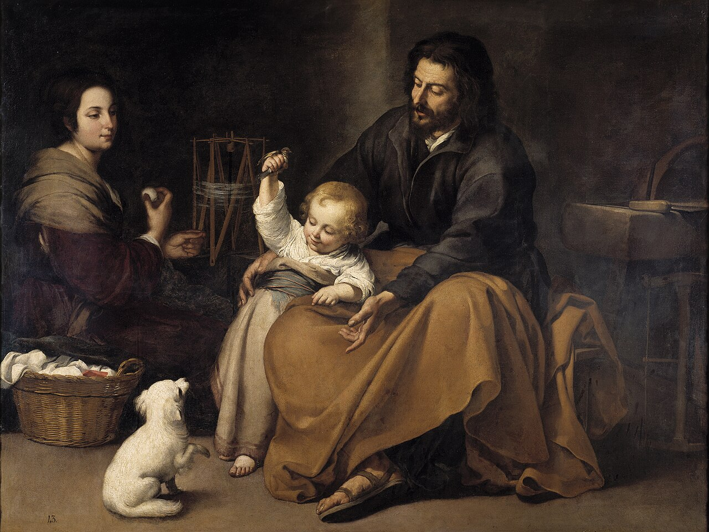

# Session 44 — Fourth Commandment — Father, Mother, and Authority

*Bartolomé Esteban Murillo, The Holy Family with a Bird (c. 1650). Public Domain via Wikimedia Commons.*

> *Joseph's hand rests on the boy's shoulder; Mary watches from the doorway. The Holy Family is not a sentimental painting — it is the model of every authority and every obedience. Honor those given to you. Become someone worth honoring.*

## Pius X asks

**190.** What does the fourth commandment, "Honor thy father and mother," order us?

*The fourth commandment, "Honor thy father and mother," orders us to love, respect, and obey our parents and whoever has authority over us, that is, our superiors in authority.*

**191.** What does the fourth commandment forbid us?

*The fourth commandment forbids us to offend our parents and our superiors in authority, and to disobey them.*

**192.** Why must we obey our superiors in authority?

*We must obey our superiors in authority because "there is no authority except from God; ... therefore he who resists authority resists the ordinance of God" (Rom. XIII. 1-2).*

## St. Thomas teaches

Perfection for man consists in the love of God and of neighbour. Now, the three Commandments which were written on the first tablet pertain to the love of God; for the love of neighbour there were the seven Commandments on the second tablet. But we must "love, not in word nor in tongue, but in deed and in truth."[^2] For a man to love thus, he must do two things, namely, avoid evil and do good. Certain of the Commandments prescribe good acts, while others forbid evil deeds. And we must also know that to avoid evil is in our power; but we are incapable of doing good to everyone. Thus, St. Augustine says that we should love all, but we are not bound to do good to all. But among those to whom we are bound to do good are those in some way united to us. Thus, "if any man have not care of his own and especially of those of his house, he hath denied the faith."[^3] Now, amongst all our relatives there are none closer than our father and mother. "We ought to love God first," says St. Ambrose, "then our father and mother." Hence, God has given us the Commandment: "Honour thy father and thy mother."[^4]

The Philosopher also gives another reason for this honour to parents, in that we cannot make an equal return to our parents for the great benefits they have granted to us; and, therefore, an offended parent has the right to send his son away, but the son has no such right.[^5] Parents, indeed, give their children three things. The first is that they brought them into being: "Honour thy father, and forget not the groanings of thy mother; remember that thou hadst not been born but through them."[^6] Secondly, they furnished nourishment and the support necessary for life. For a child comes naked into the world, as Job relates (i. 24), but he is provided for by his parents. The third is instruction: "We have had fathers of our flesh for instructors."[^7] "Hast thou children? Instruct them."[^8]

Parents, therefore, should give instruction without delay to their children, because "a young man according to his way, even when he is old will not depart from it."[^9] And again: "It is good for a man when he hath borne the yoke from his youth."[^10] Now, the instruction which Tobias gave his son (Tob., iv) was this: to fear the Lord and to abstain from sin. This is indeed contrary to those parents who approve of the misdeeds of their children. Children, therefore, receive from their parents birth, nourishment, and instruction.

## What Children Owe Parents

Now, because we owe our birth to our parents, we ought to honour them more than any other superiors, because from such we receive only temporal things: "He that feareth the Lord honoreth his parents, and will serve them as his masters that brought him into the world. Honour thy father in work and word and all patience, that a blessing may come upon thee from him."[^11] And in doing this you shall also honour thyself, because "the glory of a man is from honour of his father, and a father without honour is the disgrace of his son."[^12]

Again, since we receive nourishment from our parents in our childhood, we must support them in their old age: "Son, support the old age of thy father, and grieve him not in his life. And if his understanding fail, have patience with him; and despise him not when thou art in thy strength. . . . Of what an evil fame is he that forsaketh his father! And he is cursed of God that angereth his mother."[^13] For the humiliation of those who act contrary to this, Cassiodorus relates how young storks, when the parents have lost their feathers by approaching old age and are unable to find suitable food, make the parent storks comfortable with their own feathers, and bring back food for their worn-out bodies. Thus, by this affectionate exchange the young ones repay the parents for what they received when they were young."[^14]

We must obey our parents, for they have instructed us. "Children, obey your parents in all things."[^15] This excepts, of course, those things which are contrary to God. St. Jerome says that the only loyalty in such cases is to be cruel:[^16] "If any man hate not his father and mother . . . he cannot be My disciple."[^17] This is to say that God is in the truest sense our Father: "Is not He thy Father who hath possessed thee, and hath made thee, and created thee?"[^18]

## Rewards for Keeping This Commandment

"Honour thy father and thy mother." Among all the Commandments, this one only has the additional words: "that thou mayest be long-lived upon the land." The reason for this is lest it be thought that there is no reward for those who honour their parents, seeing that it is a natural obligation. Hence it must be known that five most desirable rewards are promised those who honour their parents.

Grace and Glory.--The first reward is grace for the present life, and glory in the life to come, which surely are greatly to be desired: "Honour thy father . . . that a blessing may come upon thee from God, and His blessing may remain in the latter end."[^19] The very opposite comes upon those who dishonor their parents; indeed, they are cursed in the law by God.[^20] It is also written: "He that is unjust in that which is little, is unjust also in that which is greater."[^21] But this our natural life is as nothing compared with the life of grace. And so, therefore, if you do not acknowledge the blessing of the natural life which you owe to your parents, then you are unworthy of the life of grace, which is greater, and all the more so for the life of glory, which is the greatest of all blessings.

A Long Life.--The second reward is a long life: "That thou mayest be long-lived upon the land." For "he that honoreth his father shall enjoy a long life."[^22] Now, that is a long life which is a full life, and it is not observed in time but in activity, as the Philosopher observes. Life, however, is full inasmuch as it is a life of virtue; so a man who is virtuous and holy enjoys a long life even if in body he dies young: "Being perfect in a short space, he fulfilled a long time; for his soul pleased God."[^23] Thus, for example, he is a good merchant who does as much business in one day as another would do in a year. And note well that it sometimes happens that a long life may lead up to a spiritual as well as a bodily death, as was the case with Judas. Therefore, the reward for keeping this Commandment is a long life for the body. But the very opposite, namely, death is the fate of those who dishonor their parents. We receive our life from them; and just as the soldiers owe fealty to the king, and lose their rights in case of any treachery, so also they who dishonor their parents deserve to forfeit their lives: "The eye that mocketh at his father and that despiseth the labor of his mother in bearing him, let the ravens pick it out, and the young eagles eat it."[^24] Here "the ravens" signify officials of kings and princes, who in turn are the "young eagles." But if it happens that such are not bodily punished, they nevertheless cannot escape death of the soul. It is not well, therefore, for a father to give too much power to his children: "Give not to son or wife, brother or friend, power over thee while thou livest; and give not thy estate to another, lest thou repent."[^25]

The third reward is to have in turn grateful and pleasing children. For a father naturally treasures his children, but the contrary is not always the case: "He that honoreth his father shall have joy in his own children."[^26] Again: "With what measure you mete, it shall be measured to you again."[^27] The fourth reward is a praiseworthy reputation: "For the glory of a man is from the honour of his father."[^28] And again: "Of what an evil fame is he that forsaketh his father?"[^29] A fifth reward is riches: "The father's blessing establisheth the houses of his children, but the mother's curse rooteth up the foundation."[^30]

## The Different Applications of Father

"Honour thy father and thy mother." A man is called father not only by reason of generation, but also for other reasons, and to each of these there is due a certain reverence. Thus, the Apostles and the Saints are called fathers because of their doctrine and their exemplification of faith: "For if you have ten thousands instructors in Christ, yet not many fathers. For in Christ Jesus, by the gospel, I have begotten you."[^31] And again: "Let us now praise men of renown and our fathers in their generation."[^32] However, let us praise them not in word only, but by imitating them; and we do this if nothing is found in us contrary to what we praise in them.

Our superiors in the Church are also called fathers; and they too are to be respected as the ministers of God: "Remember your prelates, . . . whose faith follow, considering the end of their conversation."[^33] And again: "He that heareth you, heareth Me; and he that despiseth you, despiseth Me."[^34] We honour them by showing them obedience: "Obey your prelates, and be subject to them."[^35] And also by paying them tithes: "Honour the Lord with thy substance, and give Him of the first of thy fruits."[^36]

Rulers and kings are called fathers: "Father, if the prophet had bid thee do some great thing, surely thou shouldst have done it."[^37] We call them fathers because their whole care is the good of their people. And we honour them by being subject to them: "Let every soul be subject to higher powers."[^38] We should be subject to them not merely through fear, but through love; and not merely because it is reasonable, but because of the dictates of our conscience. Because "there is no power but from God."[^39] And so to all such we must render what we owe them: "Tribute, to whom tribute is due; custom, to whom custom; fear, to whom fear; honour, to whom honour."[^40] And again: "My son, fear the Lord and the king."[^41]

Our benefactors also are called fathers: "Be merciful to the fatherless as a father."[^42] He, too, is like a father [who gives his bond] of whom it is said: "Forget not the kindness of thy surety."[^43] On the other hand, the thankless shall receive a punishment such as is written: "The hope of the unthankful shall melt away as the winter's ice."[^44] Old men also are called fathers: "Ask thy father, and he will declare to thee; thy elders and they will tell thee."[^45] And again: "Rise up before the hoary head, and honour the person of the aged man."[^46] "In the company of great men take not upon thee to speak; and when the ancients are present, speak not much."[^47] "Hear in silence, and for thy reverence good grace shall come to thee."[^48] Now, all these fathers must be honored, because they all resemble to some degree our Father who is in heaven; and of all of them it is said: "He that despiseth you, despiseth Me."[^49]

[^1]: Exod., xx. 12; Deut., v. 16.
[^2]: I John, iii. 18.
[^3]: I Tim., v. 8.
[^4]: St. Thomas also treats of the Fourth Commandment in "Summa Theol.," II- II, QQ. cxxii, ci.
[^5]: Aristotle, "Ethics."
[^6]: Ecclus., vii. 29-30.
[^7]: Heb., xii. 9.
[^8]: Ecclus., vii. 25.
[^9]: Prov. xxii. 6.
[^10]: Lam., iii. 27.
[^11]: Ecclus. iii. 10.
[^12]: "Ibid.," 13.
[^13]: "Ibid.," 14, 15, 18.
[^14]: Epist., lib. II.
[^15]: Col., iii. 20.
[^16]: "Ad Heliod."
[^17]: Luke, xiv. 26.
[^18]: Deut., xxxii. 6.
[^19]: Ecclus., iii. 9-10.
[^20]: Deut., xxvii. 16.
[^21]: Luke, xvi. 10.
[^22]: Ecclus., iii. 7.
[^23]: Wis., iv. 13.
[^24]: Prov., xxx. 17.
[^25]: Ecclus., xxxiii. 20.
[^26]: "Ibid.," iii. 6.
[^27]: Matt., vii. 2.
[^28]: Ecclus., iii. 13.
[^29]: "Ibid.," 18.
[^30]: "Ibid.," 11.
[^31]: I Cor., iv. 15.
[^32]: Ecclus., xliv. 1.
[^33]: Heb., xiii. 7.
[^34]: Luke, x. 16.
[^35]: Heb., xiii. 17.
[^36]: Prov., iii. 9.
[^37]: IV Kings, v. 13.
[^38]: Rom., xiii. 1.
[^39]: "Ibid.,"
[^40]: "Ibid."
[^41]: Prov., xxiv. 21.
[^42]: Ecclus., iv. 10.
[^43]: "Ibid.," xxix. 19.
[^44]: Wis., xvi. 29.
[^45]: Deut., xxxii. 7.
[^46]: Lev., xix. 32.
[^47]: Ecclus., xxxii. 13.
[^48]: "Ibid.," 9.
[^49]: Luke, x. 16.

> **Scripture.** *Honour thy father and thy mother, which is the first commandment with a promise.* — Ephesians 6:2

> *Lord, the people You gave me are not perfect. Help me honor them anyway. They are mine.*

---

#### Going Deeper — *Catechism of Trent*

## Relative Importance Of The Preceding And The Following Commandments

The preceding Commandments are supreme both in dignity and in
importance; but those which follow rank next in order because of
their necessity. For the first three tend directly to God; while
the object of the others is the charity we owe to our neighbour,
although even these are ultimately referred to God, since we love
our neighbour on account of God, our last end. Hence Christ our
Lord has declared that the two Commandments which inculcate the
love of God and of our neighbour are like unto each other.

## Importance Of Instruction On The Fourth Commandment

The advantages arising from the present subject can scarcely
be expressed in words; for not only does it bring with it its own
fruit, and that in the richest abundance and of superior
excellence, but it also affords a test of our obedience to and
observance of the first Commandment. He that loveth not his
brother whom he seeth, says St. John, how can he love God whom he
seeth not? In like manner, if we do not honour and reverence our
parents whom we ought to love next to God and whom we continually
see, how can we honour or reverence God, the supreme and best of
parents, whom we see not? Hence we can easily perceive the
similarity between these two Commandments.

The application of this Commandment is of very great extent.
Besides our natural parents, there are many others whose power,
rank, usefulness, exalted functions or office, entitle them to
parental honour.

Furthermore.(this Commandment) lightens the labor of parents
and superiors; for their chief care is that those under them
should live according to virtue and the divine Law. Now the
performance of this duty will be considerably facilitated, if it
be known by all that highest honour to parents is an obligation,
sanctioned and commanded by God.

## The Two Tables Of The Law

To impress the mind with this truth it will be found useful to
distinguish the Commandments of the first, from those of the
second table. This distinction, therefore, the pastor should
first explain.

Let him begin by showing that the divine precepts of the
Decalogue were written on two tables, one of which, in the
opinion of the holy Fathers, contained the three preceding, while
the rest were given on the second table.

This order of the Commandments is especially appropriate,
since the very collocation points out to us their difference in
nature. For whatever is commanded or prohibited in Scripture by
the divine law springs from one of two principles, the love of
God or of our neighbour: one or the other of these is the basis
of every duty required of us. The three preceding Commandments
teach us the love which we owe to God; and the other seven, the
duties which we owe to our neighbour and to public society. The
arrangement, therefore, which assigns some of the Commandments to
the first and others to the second table is not without good
reason.

In the first three Commandments, which have been explained,
God, the supreme good, is, as it were, the subject matter; in the
others, it is the good of our neighbour. The former require the
highest love, the latter the love next to the highest. The former
have to do with our last end, the latter with those things that
lead us to our end.

Again, the love of God terminates in God Himself, for God is
to be loved above all things for His own sake; but the love of
our neighbour originates in, and is to be regulated by, the love
of God. If we love our parents, obey our masters, respect our
superiors, our ruling principle in doing so should be that God is
their Creator, and wishes to give pre-eminence to those by whose
cooperation He governs and protects other men; and as He requires
that we yield a dutiful respect to such persons, we should do so,
because He deems them worthy of this honour. If, then, we honour
our parents, the tribute is paid to God rather than to man.
Accordingly we read in St. Matthew concerning duty to superiors:
He that receiveth you, receiveth me; and the Apostle in his
Epistle to the Ephesians, giving instruction to servants, says:
Servants, be obedient to them that are your lords according to
the flesh, with fear and trembling, in the simplicity of your
heart, as to Christ: not serving to the eye, as it were pleasing
men, but as the servants of Christ.

Moreover, no honour, no piety, no devotion can be rendered to
God sufficiently worthy of Him, since love of Him admits of
infinite increase. Hence our charity should become every day more
fervent towards Him, who commands us to love Him with our whole
heart, our whole soul, and with all our strength. The love of our
neighbour, on the contrary, has its limits, for the Lord commands
us to love our neighbour as ourselves.

To outstep these limits by loving our neighbour as we love
God would be an enormous crime. If any man come to me, says the
Lord and hate not his father and mother, and wife and children,
and brethren and sisters, yea, and his own life also; he cannot
be my disciple. In the same way, to one who would first attend
the burial of his father, and then follow Christ, it was said:
Let the dead bury their dead; and the same lesson is more clearly
conveyed in St. Matthew: He that loveth father or mother more
than me, is not worthy of me.

Parents, no doubt, are to be highly loved and respected; but
religion requires that supreme honour and homage be given to Him
alone, who is the Creator and Father of all, and that all our
love for our earthly parents be referred to our eternal Father
who is in heaven. Should, however, the injunctions of parents be
at any time opposed to the Commandments of God, children are, o{
course, to prefer the will of God to the desires of their
parents, always keeping in view the divine maxim: We ought to
obey God rather than men.

## Explanation of the Fourth Commandment

### "Honour"

After these preliminaries the pastor should explain the words
of the Commandment, beginning with honour. To honour is to think
respectfully of anyone, and to hold in the highest esteem all
that relates to him. It includes love, respect, obedience and
reverence.

Very properly, then, is the word honour used here in
preference to the word fear or love, although parents are also to
be much loved and feared. Respect and reverence are not always
the accompaniments of love; neither is love the inseparable
companion of fear; but honour, when proceeding from the heart,
combines both fear and love.

### "Thy Father"

The pastor should next explain who they are, whom the
Commandment designates as fathers; for although the law refers
primarily to our natural fathers, yet the name belongs to others
also, and these seem to be indicated in the Commandment, as we
can easily gather from numerous passages of Scripture. Besides
our natural fathers, then, there are others who in Scripture are
called fathers, as was said above, and to each of these proper
honour is due.

In the first place, the prelates of the Church, her pastors
and priests are called fathers, as is evident from the Apostle,
who, writing to the Corinthians, says: I write not these things
to confound you; but I admonish you as my dearest children. For
if you have ten thousand instructors in Christ, yet not many
fathers. For in Christ Jesus by the gospel I have begotten you.
It is also written in Ecclesiasticus: Let us praise men of
renown, and our fathers in their generation.

Those who govern the State, to whom are entrusted power,
magistracy, or command, are also called fathers; thus Naaman was
called father by his servants.

The name father is also applied to those to whose care,
fidelity, probity and wisdom others are committed, such as
teachers, instructors masters and guardians; and hence the sons
of the Prophets called Elias and Eliseus their father. Finally,
aged men, advanced in years, we also call fathers.

#### Why Parents Should Be Honoured

In his instructions the pastor should chiefly emphasise the
obligation of honouring all who are entitled to be called
fathers, especially our natural fathers, of whom the divine
Commandment particularly speaks. They are, so to say, images of
the immortal God. In them we behold a picture of our own origin;
from them we have received existence, them God made use of to
infuse into us a soul and reason, by them we were led to the
Sacraments, instructed in our religion, schooled in right conduct
and holiness, and trained in civil and human knowledge.

### "And Thy Mother"

The pastor should teach that the name mother is mentioned in
this Commandment, in order to remind us of her benefits and
claims in our regard, of the care and solicitude with which she
bore us, and of the pain and labor with which she gave us birth
and brought us up.

### Manner Of Honouring Parents

The honour which children are commanded to pay to their
parents should be the spontaneous offering of sincere and dutiful
love. This is nothing more than their due, since for love of us,
they shrink from no labor, no exertion, no danger. Their highest
pleasure it is to fed that they are loved by their children, the
dearest objects of their affection. Joseph, when he enjoyed in
Egypt the highest station and the most ample power after the king
himself, received with honour his father, who had come into
Egypt. Solomon rose to meet his mother as she approached; and
having paid her respect, placed her on a royal throne on his
right hand.

We also owe to our parents other duties of respect, such as
to supplicate God in their behalf, that they may lead prosperous
and happy lives, beloved and esteemed by all who know them, and
most pleasing in the sight of God and of the Saints in heaven.

We also honour them by submission to their wishes and
inclinations. My son, says Solomon, hear the instructon of thy
father, and forsake not the law of thy mother; that grace may be
added to thy head, and a chain of gold to thy neck. Of the same
kind are the exhortations of St. Paul. Children, he says, obey
your parents in the Lord, for this is just; and also, children,
obey your parents in all things, for this is wellpleasing to
the Lord. (This doctrine) is confirmed by the example of the
holiest men. Isaac, when bound for sacrifice by his father,
meekly and uncomplainingly obeyed; and the Rechabites, not to
depart from the counsel of their father, always abstained from
wine.

We also honour our parents by the imitation of their good
example; for, to seek to resemble closely anyone is the highest
mark of esteem towards him. We also honour them when we not only
ask, but follow their advice.

Again we honour our parents when we relieve their
necessities, supplying them with necessary food and clothing
according to these words of Christ, who, when reproving the
impiety of the Pharisees, said: Why do you also transgress the
commandments of God because of your traditions? For God said:
"Honour thy father and thy mother," and "He that
shall curse father or mother let him die the death." But you
say: "Whosoever shall say to his father or mother, The gift
whatsoever proceedeth from me, shall profit thee." And he
shall not honour his father or his mother; and you have made void
the commandment of God for your tradition.

But if at all times it is our duty to honour our parents,
this duty becomes still more imperative when they are visited by
severe illness. We should then see to it that they do not neglect
confession and the other Sacraments which every Christian should
receive at the approach of death. We should also see that pious
and religious persons visit them frequently to strengthen their
weakness, assist them by their counsel, and animate them to the
hope of immortality, that having risen above the concerns of this
world, they may fix their thoughts entirely on God. Thus blessed
with the sublime virtues of faith, hope and charity, and
fortified by the helps. of religion, they will not only look at
death without fear, since it is necessary, but will even welcome
it, as it hastens their entrance into eternity.

Finally, we honour our parents, even after their death, by
attending their funerals, procuring for them suitable obsequies
and burial, having due suffrages and anniversary Masses offered
for them, and faithfully executing their last wills.

### Manner Of Honouring Other Superiors

We are bound to honour not only our natural parents, but also
others who are called fathers, such as Bishops and priests,
kings, princes and magistrates, tutors, guardians and masters,
teachers, aged persons and the like, all of whom are entitled,
some in a greater, some in a less degree, to share our love, our
obedience, and our assistance.

#### The Honour Due To Bishops And Priests

Of Bishops and other pastors it is written: Let the priests
that rule well be esteemed worthy of double honour especially
they who labour in the word and doctrine.

What wondrous proofs of love for the Apostle must the
Galatians have shown ! For he bears this splendid testimony of
their benevolence: I bear you witness that if it could be done,
you would hove plucked out your own eyes, and would have given
them to me.

The priest is also entitled to receive whatever is necessary
for his support. Who, says the Apostle, serveth as a soldier at
his own charges? Give honour to the priests, it is written in
Ecclesiasticus, and purify thyself with thy arms; give them their
portion, as it is commanded thee, of the first fruits and of
purifications.

The Apostle also teaches that they are entitled to obedience:
Obey your prelates, and be subject to them; for they watch as
being to render an account of your souls. Nay, more. Christ the
Lord commands obedience even to wicked pastors: Upon the chair of
Moses have sitten the scribes and Pharisees: all things,
therefore, whatsoever they shall say to you, observe and do; but
according to their works do ye not, for they say and do not.

#### The Honour Due To Civil Rulers

The same is to be said of civil rulers, governors, magistrates
and others to whose authority we are subject. The Apostle in his
Epistle to the Romans, explains at length the honour, respect and
obedience that should be shown them, and he also bids us to pray
for them. St. Peter says: Be ye subject, therefore, to every
human creature for God's sake; whether it be to the king as
excelling, or to governors as sent by him.

For whatever honour we show them is given to God, since
exalted human dignity deserves respect because it is an image of
the divine power, and in it we revere the providence of God who
has entrusted to men the care of public affairs and who uses them
as the instruments of His power.

If we sometimes have wicked and unworthy officials it is not
their faults that we revere, but the authority from God which
they possess. Indeed, while it may seem strange, we are not
excused from highly honouring them even when they show themselves
hostile and implacable towards us. Thus David rendered great
services to Saul even when the latter was his bitter foe, and to
this he alludes when he says: With them that hated peace I was
peaceable.

However, should their commands be wicked or unjust, they
should not be obeyed, since in such a case they rule not
according to their rightful authority, but according to injustice
and perversity.

'That Thou Mayest be Longlived," etc.

Having explained the above matters, the pastor should next
consider the reward promised to the observance of this
Commandment and its appropriateness. That reward is great,
indeed, for it consists principally in length of days. They who
always preserve the grateful remembrance of a benefit deserve to
be blessed with its prolonged enjoyment. Children, therefore, who
honour their parents, and gratefully acknowledge the blessing of
life received from them are deservedly rewarded with the
protracted enjoyment of that life to an advanced age.

## Reward Promised For Observance Of This Commandment

The (nature of the) divine promise also demands distinct
explanation. It includes not only the eternal life of the
blessed, but also the life which we lead on earth, according to
the interpretation of St. Paul: Piety is profitable to all
things, having promise of the life that now is, and of that which
is to come

Many very holy men, it is true, such as Job, David, Paul,
desired to die, and a long life is burdensome to the afflicted
and wretched: but the reward which is here promised is,
notwithstanding, neither inconsiderable, nor to be despised.

The additional words, which the Lord thy God will give thee,
promise not only length of days, but also repose, tranquillity,
and security to live well; for in Deuteronomy it is not only
said, that thou mayest live a long time, but it is also added,
and that it may be well with thee, words afterwards quoted by the
Apostle.

### Why This Reward Is Not Always Conferred On Dutiful Children

These blessings, we say, are conferred on those whose piety
God rewards; otherwise the divine promises would not be
fulfilled, since the more dutiful child is sometimes the more
short lived.

Now this happens sometimes because it is better for him to
depart from this world before he has strayed from the path of
virtue and of duty; for he was taken away lest wickedness should
alter his understanding, or deceit beguile his soul. Or because
destruction and general upheaval are impending, he is called away
that he may escape the calamities of the times. The just man,
says the Prophet, is taken away from before the face of evil,
lest his virtue and salvation be endangered when God avenges the
crimes of men. Or else, he is spared the bitter anguish of
witnessing the calamities of his friends and relations in such
evil days. The premature death of the good, therefore, gives
special reason for fear.

## Punishment For Violation Of This Commandment

But if God promises rewards and blessings to grateful
children, He also reserves the heaviest chastisements to punish
those who are wanting in filial piety; for it is written: He that
curseth his father or mother shall die the death: He that
afflicteth his father and chaseth away his mother, is infamous
and unhappy." He that curseth his father and mother, his
lamp shall be put out in the midst of darkness: The eye that
mocketh at his father, and that despiseth the labour of his
mother in bearing him, let the ravens of the brooks pick it out,
and the young eagles eat it. There are on record many instances
of undutiful children, who were made the signal objects of the
divine vengeance. The disobedience of Absalom to his father David
did not go unpunished. On account of his sin he perished
miserably, transfixed by three lances.

Of those who resist the priest it is written: He that will be
proud, and refuse to obey the commandment of the priest, who
ministereth at that time to the Lord thy God, by the decree of
the judge, that man shall die.

Duties of Parents Towards their Children

As the law of God commands children to honour, obey, and
respect their parents so are there reciprocal duties which
parents owe to their children. Parents are obliged to bring up
their children in the knowledge and practice of religion, and to
give them the best rules for the regulation of their lives; so
that, instructed and trained in religion, they may serve God
holily and constantly. It was thus, as we read, that the parents
of Susanna acted.

The priest, therefore, should admonish parents to be to their
children guides in the virtues of justice, chastity, modesty and
holiness.

## Three Things To Be Avoided By Parents

He should also admonish them to guard particularly against
three things, in which they but too often transgress.

In the first place, they are not by words or actions to
exercise too much harshness towards their children. This is the
instruction of St. Paul in his Epistle to the Colossians:
Fathers, he says, provoke not your children to anger, lest they
be discouraged. For there is danger that the spirit of the child
may be broken, and he become abject and fearful of everything.
Hence (the pastor) should require parents to avoid too much
severity and to choose rather to correct their children than to
revenge themselves upon them.

Should a fault be committed which requires reproof and
chastisement, the parent should not, on the other hand, by undue
indulgence, overlook its correction. Children are often spoiled
by too much lenity and indulgence on the part of their parents.
The pastor, therefore, should deter from such excessive mildness
by the warning example of Heli, the highpriest, who, on account
of overindulgence to his sons, was visited with the heaviest
chastisements.

Finally, to avoid what is most shameful in the instruction
and education of children, let them not propose to themselves
aims that are unworthy. Many there are whose sole concern is to
leave their children wealth, riches and an ample and splendid
fortune; who encourage them not to piety and religion, or to
honourable employment, but to avarice, and an increase of wealth,
and who, provided their children are rich and wealthy, are
regardless of their good name and eternal salvation. Can anything
more shameful be thought or expressed? Of such parents it is true
to say, that instead of bequeathing wealth to their children,
they leave them rather their own wickedness and crimes for an
inheritance; and instead of conducting them to heaven, lead them
to the eternal torments of hell.

The priest, therefore, should impress on the minds of parents
salutary principles and should exhort them to imitate the
virtuous example of Tobias, that having properly trained up their
children to the service of God and to holiness of life, they may,
in turn, experience at their hands abundant fruit of filial
affection, respect and obedience.
