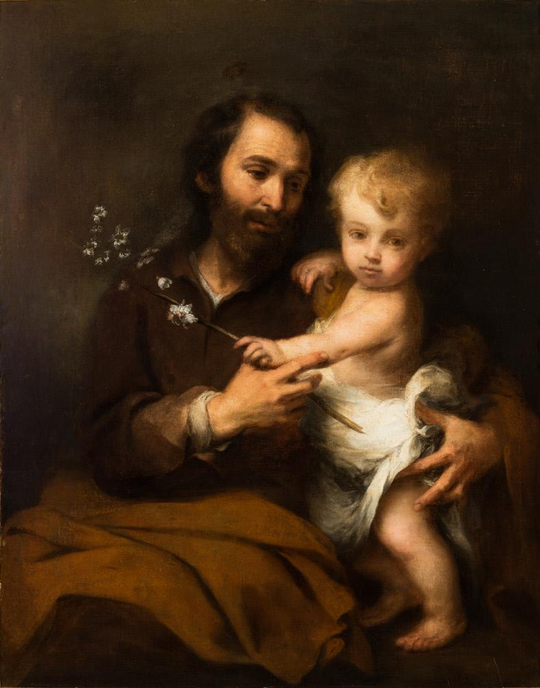

# Session 48 — Sixth Commandment — Holy in Body

*Bartolomé Esteban Murillo, Saint Joseph and the Christ Child (c. 1670-1675). Public Domain via Wikimedia Commons.*

> *Murillo's St. Joseph cradles the Child. The body is not the enemy of holiness — it is its instrument. Chastity is not anti-body; it is pro-body, in the highest possible sense. Treat your body, and other bodies, like temples.*

## Pius X asks

**201.** What does the sixth commandment, "Thou shalt not commit impure acts," forbid us?

*The sixth commandment, "Thou shalt not commit impure acts," forbids us every impurity: therefore immoral actions, words, looks, books, images, and entertainments.*

**202.** What does the sixth commandment order us?

*The sixth commandment orders us to be "holy in body," showing the greatest respect for our own person and for that of others, as the works of God and as temples in which He dwells by His presence and by His grace.*

## St. Thomas teaches

After the prohibition of murder, adultery is forbidden. This is fitting, since husband and wife are as one body. "They shall be," says the Lord, "two in one flesh."[^1] Therefore, after an injury inflicted upon a man in his own person, none is so grave as that which is inflicted upon a person with whom one is joined.[^2]

Adultery is forbidden both to the wife and the husband. We shall first consider the adultery of the wife, since in this seems to lie the greater sin, for a wife who commits adultery is guilty of three grave sins, which are implied in the following words: "So every woman that leaveth her husband, . . . first, she hath been unfaithful to the law of the Most High; and secondly, she hath offended against her husband; thirdly, she hath fornicated in adultery, and hath gotten her children of another man."

First, therefore, she has sinned by lack of faith, since she is unfaithful to the law wherein God has forbidden adultery. Moreover, she has spurned the ordinance of God: "What therefore God has joined together, let no man put asunder."[^4] And also she has sinned against the institution or Sacrament. Because marriage is contracted before the eyes of the Church, and thereupon God is called, as it were, to witness a bond of fidelity which must be kept: "The Lord hath been witness between thee and the wife of thy youth whom thou hast despised."[^5] Therefore, she has sinned against the law of God, against a precept of the Church and against a Sacrament of God.

Secondly, she sins by infidelity because she has betrayed her husband: "The wife hath not power of her own body: but the husband."[^6] In fact, without the consent of the husband she cannot observe chastity. If adultery is committed, then, an act of treachery is perpetrated in that the wife gives herself to another, just as if a servant gave himself to another master: "She forsaketh the guide of her youth, and hath forgotten the covenant of her God."[^7]

Thirdly, the adulteress commits the sin of theft in that she brings forth children from a man not her husband; and this is a most grave theft in that she expends her heredity upon children not her husband's. Let it be noted that such a one should encourage her children to enter religion, or upon such a walk of life that they do not succeed in the property of her husband. Therefore, an adulteress is guilty of sacrilege, treachery and theft.

Husbands, however, do not sin any less than wives, although they sometimes may salve themselves to the contrary. This is clear for three reasons. First, because of the equality which holds between husband and wife, for "the husband also hath not power of his own body, but the wife."[^8] Therefore, as far as the rights of matrimony are concerned, one cannot act without the consent of the other. As an indication of this, God did not form woman from the foot or from the head, but from the rib of the man. Now, marriage was at no time a perfect state until the law of Christ came, because the Jew could have many wives, but a wife could not have many husbands; hence, equality did not exist.

The second reason is because strength is a special quality of the man, while the passion proper to the woman is concupiscence: "Ye husbands, likewise dwelling with them according to knowledge, giving honour to the female as to the weaker vessel."[^9] Therefore, if you ask from your wife what you do not keep yourself, then you are unfaithful. The third reason is from the authority of the husband. For the husband is head of the wife, and as it is said: "Women may not speak in the church, . . . if they would learn anything, let them ask their husbands at home."[^10] The husband is the teacher of his wife, and God, therefore, gave the Commandment to the husband. Now, as regards fulfillment of their duties, a priest who fails is more guilty than a layman, and a bishop more than a priest, because it is especially incumbent upon them to teach others. In like manner, the husband that commits adultery breaks faith by not obeying that which he ought.

## Why Adultery and Fornication Must Be Avoided

Thus, God forbids adultery both to men and women. Now, it must be known that, although some believe that adultery is a sin, yet they do not believe that simple fornication is a mortal sin. Against them stand the words of St. Paul: "For fornicators and adulterers God will judge."[^11] And: "Do not err: neither fornicators, . . . nor adulterers, nor the effeminate, nor liers with mankind shall possess the kingdom of God."[^12] But one is not excluded from the kingdom of God except by mortal sin; therefore, fornication is a mortal sin.

But one might say that there is no reason why fornication should be a mortal sin, since the body of the wife is not given, as in adultery. I say, however, if the body of the wife is not given, nevertheless, there is given the body of Christ which was given to the husband when he was sanctified in Baptism. If, then, one must not betray his wife, with much more reason must he not be unfaithful to Christ: "Know you not that your bodies are the members of Christ? Shall I then take the members of Christ and make them the members of a harlot? God forbid!"[^13] It is heretical to say that fornication is not a mortal sin.

Moreover, it must be known that the Commandment, "Thou shalt not commit adultery," not only forbids adultery but also every form of immodesty and impurity.[^14] There are some who say that intercourse between married persons is not devoid of sin. But this is heretical, for the Apostle says: "Let marriage be honorable in all and the bed undefiled."[^15] Not only is it devoid of sin, but for those in the state of grace it is meritorious for eternal life. Sometimes, however, it may be a venial sin, sometimes a mortal sin. When it is had with the intention of bringing forth offspring, it is an act of virtue. When it is had with the intent of rendering mutual comfort, it is an act of justice. When it is a cause of exciting lust, although within the limits of marriage, it is a venial sin; and when it goes beyond these limits, so as to intend intercourse with another if possible, it would be a mortal sin.

Adultery and fornication are forbidden for a number of reasons. First of all, because they destroy the soul: "He that is an adulterer, for the folly of his heart shall destroy his own soul."[^16] It says: "for the folly of his heart," which is whenever the flesh dominates the spirit. Secondly, they deprive one of life; for one guilty of such should die according to the Law, as we read in Leviticus (20:10) and Deuteronomy (22:22). Sometimes the guilty one is not punished now bodily, which is to his disadvantage since punishment of the body may be borne with patience and is conducive to the remission of sins; but nevertheless he shall be punished in the future life. Thirdly, these sins consume his substance, just as happened to the prodigal son in that "he wasted his substance living riotiously."[^17] "Give not thy soul to harlots in any point; lest thou destroy thyself and thy inheritance."[^18] Fourthly, they defile the offspring: "The children of adulterers shall not come to perfection, and the seed of the unlawful bed shall be rooted out. And if they live long they shall be nothing regarded, and their last old age shall be without honour."[^19] And again: "Otherwise your children should be unclean; but now they are holy."[^20] Thus, they are never honored in the Church, but if they be clerics their dishonor may go without shame. Fifthly, these sins take away one's honour, and this especially is applicable to women: "Every woman that is a harlot shall be trodden upon as dung in the way."[^21] And of the husband it is said: "He gathereth to himself shame and dishonor, and his reproach shall not be blotted out."[^22]

St. Gregory says that sins of the flesh are more shameful and less blameful than those of the spirit, and the reason is because they are common to the beasts: "Man when he was in honour did not understand; and he hath been compared to senseless beasts, and made like to them."[^23]

[^1]: Genesis 2:24.
[^2]: "The bond between husband and wife is one of the strictest union, and nothing can be more gratifying to both than to realize that they are objects of mutual and undivided affection. On the other hand, nothing inflicts greater anguish than to feel that the legitimate love which they owe to each other has been transferred elsewhere. This Commandment which prohibits adultery follows properly and in order that which protects human life against the hand of the murderer" ("Roman Catechism," "Sixth Commandment," 1). St. Thomas treats of this Commandment also in the "Summa Theol.," II-II, Q. cxxii, art. 6; Q. cliv.
[^3]: Sirach 23:32, 33.
[^4]: Matthew 19:6.
[^5]: Malachi 2:14.
[^6]: Corinthians 7:4.
[^7]: Proverbs 2:17-18.
[^8]: 1 Corinthians 7:4.
[^9]: 1 Peter 3:7.
[^10]: 1 Corinthians 14:34-35.
[^11]: Hebrews 13:4.
[^12]: 1 Corinthians 6:9.
[^13]: 1 Corinthians 6:15.
[^14]: "By the prohibition of adultery, every kind of impurity and immodesty by which the body is defiled is also forbidden. Nay more, even every inward thought against chastity is forbidden by this Commandment. . . . You have heard that it was said to them of old: Thou shalt not commit adultery. But I say to you, that whcsoever shall look on a woman to lust after her, hath already committed adultery with her in his heart." ("Roman Catechism," "loc. cit.," 5).
[^15]: Hebrews 13:4.
[^16]: Proverbs 6:32.
[^17]: Luke 15:13.
[^18]: Sirach 9:6.
[^19]: Wisdom 3:16-17.
[^20]: 1 Corinthians 7:14.
[^21]: Sirach 9:10.
[^22]: Proverbs 6:33.
[^23]: Psalm 48:21. "If the occasions of sin which we have just enumerated [viz., idleness, intemperance in eating and drinking, indulgence of the eyes, immodest dress, immodest conversation and reading] be carefully avoided, almost every excitement to lust will be removed. But the most efficacious means to subdue its violence are frequent use of confession and reception of the Holy Eucharist. Unceasing and devout prayer to God, accompanied by fasting and giving of alms, has the same salutary effect. Chastity is a gilt of God. To those who ask it aright, He does not deny it; nor does He allow us to be tempted beyond our strength" ("Roman Catechism," "loc. cit.," 12).

> **Scripture.** *Or know you not, that your members are the temple of the Holy Ghost, who is in you, whom you have from God; and you are not your own?* — 1 Corinthians 6:19

> *Lord, this body is Yours. Today, let me handle it as Yours, and the bodies of others as Yours also.*

---

#### Going Deeper — *Catechism of Trent*

## The Position Of This Commandment In The Decalogue Is Most Suitable

The bond between man and wife is one of the closest, and
nothing can be more gratifying to both than to know that they are
objects of mutual and special affection. On the other hand,
nothing inflicts deeper anguish than to feel that the legitimate
love which one owes the other has been transferred elsewhere.
Rightly, then, and in its natural order, is the Commandment which
protects human life against the hand of the murderer, followed by
that which forbids adultery and which aims to prevent anyone from
injuring or destroying by such a crime the holy and honourable
union of marriage — a union which is generally the source of
ardent affection and love.

## Importance Of Careful Instruction On This Commandment

In the explanation of this Commandment, however, the pastor
has need of great caution and prudence, and should treat with
great delicacy a subject which requires brevity rather than
copiousness of exposition. For it is to be feared that if he
explained in too great detail or at length the ways in which this
Commandment is violated, he might unintentionally speak of
subjects which, instead of extinguishing, usually serve rather to
inflame corrupt passion.

As, however, the precept contains many things which cannot be
passed over in silence, the pastor should explain them in their
proper order and place.

## Two Parts Of This Commandment

This Commandment, then, resolves itself into two heads; the
one expressed, which prohibits adultery; the other implied, which
inculcates purity of mind and body.

## What this Commandment Prohibits

### Adultery Forbidden

To begin with the prohibitory part (of the Commandment),
adultery is the defilement of the marriage bed, whether it be
one's own or another's. If a married man have intercourse with an
unmarried woman, he violates the integrity of his marriage bed;
and if an unmarried man have intercourse with a married woman, he
defiles the sanctity of the marriage bed of another.

### Other Sins Against Chastity Are Forbidden

But that every species of immodesty and impurity are included
in this prohibition of adultery, is proved by the testimonies of
St. Augustine and St. Ambrose; and that such is the meaning of
the Commandment is borne out by the Old, as well as the New
Testament. In the writings of Moses, besides adultery, other sins
against chastity are said to have been punished. Thus the book of
Genesis records the judgment of Judah against his
daughter-in-law. In Deuteronomy is found the excellent law of
Moses, that there should be no harlot amongst the daughters of
Israel. Take heed to keep thyself, my son, from all fornication,
is the exhortation of Tobias to his son; and in Ecclesiasticus we
read: Be ashamed of looking upon a harlot.

In the Gospel, too, Christ the Lord says: From the heart come
forth adulteries and fornications, which defile a man. The
Apostle Paul expresses his detestation of this crime frequently,
and in the strongest terms: This is the will of God, your
sanctification, that you should abstain from fornication; Fly
fornication; Keep not company with fornicators; Fornication, and
an uncleanness and covetousness, let it not so much as be named
among you; " Neither fornicators nor adulterers, nor the
effeminate nor sodomites shall possess the kingdom of God.

### Why Adultery Is Expressly Mentioned

But the reason why adultery is expressly forbidden is
because in addition to the turpitude which it shares with other
kinds of incontinence, it adds the sin of injustice, not only
against our neighbour, but also against civil society.

Again it is certain that he who abstains not from other sins
against chastity, will easily fall into the crime of adultery. By
the prohibition of adultery, therefore, we at once see that every
sort of immodesty and impurity by which the body is defiled is
prohibited. Nay, that every inward thought against chastity is
forbidden by this Commandment is clear, as well from the very
force of the law, which is evidently spiritual, as also from
these words of Christ the Lord: You have heard that it was said
to them of old: "Thou shalt not commit adultery." But I
say to you, that whosoever shall look on a woman to lust after
her, hath already committed adultery with her in his heart.

These are the points which we have deemed proper matter for
public instruction of the faithful. The pastor, however, should
add the decrees of the Council of Trent against adulterers, and
those who keep harlots and concubines, omitting many other
species of immodesty and lust, of which each individual is to be
admonished privately, as circumstances of time and person may
require.

## What this Commandment Prescribes

### Purity Enjoined

We now come to explain the positive part of the precept. The
faithful are to be taught and earnestly exhorted to cultivate
continence and chastity with all care, to cleanse themselves from
all defilement of the flesh and of the spirit, perfecting
sanctification in the fear of God.

First of all they should be taught that although the virtue
of chastity shines with a brighter lustre in those who make the
holy and religious vow of virginity, nevertheless it is a virtue
which belongs also to those who lead a life of celibacy; or who,
in the married state, preserve themselves pure and undefiled from
unlawful desire.

### Reflections which Help one to Practice Purity

The holy Fathers have taught us many means whereby to subdue
the passions and to restrain sinful pleasure. The pastor,
therefore, should make it his study to explain these accurately
to the faithful, and should use the utmost diligence in their
exposition. Of these means some are reflections, others are
active measures.

### Impurity Excludes From Heaven

The first kind consists chiefly in our forming a just
conception of the filthiness and evil of this sin; for such
knowledge will lead one more easily to detest it. Now the evil of
this crime we may learn from the fact that, on account of it, man
is banished and excluded from the kingdom of God, which is the
greatest of all evils.

### Impurity Is A Filthy Sin

The abovementioned calamity is indeed common to every mortal
sin. But what is peculiar to this sin is that fornicators are
said to sin against their own bodies, according to the words of
the Apostle: Fly fornication. Everysin that a man doth is
without the body; but he that committeth fornication, sinneth
against his own body. The reason is that such a one does an
injury to his own body violating its sanctity. Hence St. Paul,
writing to the Thessalonians, says: This is the will of God, your
sanctification; that you should abstain from fornication, that
every one of you should know how to possess his vessel in
sanctification and honour; not in the passion of lust, like the
Gentiles that know not God.

Furthermore, what is still more criminal, the Christian who
shamefully sins with a harlot makes the members of Christ the
members of an harlot, according to these words of St. Paul: Know
you not that your bodies are the members of Christ? Shall I then
take the members of Christ and make them the members of a harlot?
God forbid. Or know you not, that he who is joined to a harlot is
made one body? Moreover, a Christian, as St. Paul testifies is
the temple of the Holy Ghost ; and to violate this temple is
nothing else than to expel the Holy Ghost.

### Adultery Is A Grave Injustice

But the crime of adultery involves that of grievous injustice.
If, as the Apostle says, they who are joined in wedlock are so
subject to each other that neither has power or right over his or
her body, but both are bound, as it were, by a mutual bond of
subjection, the husband to accommodate himself to the will of the
wife, the wife to the will of the husband; most certainly if
either dissociate his or her person, which is the right of the
other, from him or her to whom it is bound, the offender is
guilty of an act of great injustice and wickedness.

### Adultery Is Disgraceful

As dread of disgrace strongly stimulates to the performance of
duty and deters from the commission of crime, the pastor should
also teach that adultery brands its guilty perpetrators with an
unusual stigma. He that is an adulterer, says Scripture, for the
folly of his heart shall destroy his own soul: he gathereth to
himself shame and dishonour, and his reproach shall not be
blotted out.

### Impurity Severely Punished

The grievousness of the sin of adultery may be easily inferred
from the severity of its punishment. According to the law
promulgated by God in the Old Testament, the adulterer was stoned
to death. Nay more, because of the criminal passion of one man,
not only the perpetrator of the crime, but a whole city was
destroyed, as we read with regard to the Sichemites. The Sacred
Scriptures abound with examples of the divine vengeance, such as
the destruction of Sodom and of the neighbouring cities,' the
punishment of the Israelites who committed fornication in the
wilderness with the daughters of Moab, and the slaughter of the
Benjamites. These examples the pastor can easily make use of to
deter men from shameful lust.

### Impurity Blinds The Mind And Hardens The Heart

But even though the adulterer may escape the punishment of
death, he does not escape the great pains and torments that often
overtake such sins as his. He becomes afflicted with blindness of
mind a most severe punishment; he is lost to all regard for God,
for reputation, for honour, for family, and even for life; and
thus, utterly abandoned and worthless, he is undeserving of
confidence in any matter of moment, and becomes unfitted to
discharge any kind of duty.

Of this we find examples in the persons of David and of
Solomon. David had no sooner fallen into the crime of adultery
than he degenerated into a character the very reverse of what he
had been before; from the mildest of men he became so cruel as to
consign to death Urias, one of his most deserving subjects.
Solomon, having abandoned himself to the lust of women, gave up
the true religion to follow strange gods. This sin, therefore, as
Osee observes, takes away man's heart and often blinds his
understanding.

means of practicing purity

### Avoidance Of Idleness

We now come to the remedies which consist in action. The first
is studiously to avoid idleness; for, according to Ezechiel, it
was by yielding to the enervating influence of idleness that the
Sodomites plunged into the most shameful crime of criminal lust.

### Temperance

In the next place, intemperance is carefully to be avoided. I
fed them to the full, says the Prophet, and they committed
adultery. An overloaded stomach begets impurity. This our Lord
intimates in these words: Take heed to yourselves, lest perhaps
your hearts be overcharged with surfeiting and drunkenness. Be
not drunk with wine, says the Apostle, wherein is luxury.

### Custody Of The Eyes

But the eyes, in particular, are the inlets to criminal
passion, and to this refer these words of our Lord: If thine eye
scandalise thee, pluck it out, and cast it from thee. The
Prophets, also, frequently speak to the same effect. I made a
covenant with mine eyes, says Job, that I would not so much as
think upon a virgin. Finally, there are on record innumerable
examples of the evils which have their origin in the indulgence
of the eyes. It was thus that David sinned, thus that the king of
Sichem fell, and thus also that the elders sinned who calumniated
Susanna.

### Avoidance Of Immodest Dress

Too much display in dress, which especially attracts the eye,
is but too frequently an occasion of sin. Hence the admonition of
Ecclesiasticus: Turn away thy face from a woman dressed up. As
women are given to excessive fondness for dress, it will not be
unseasonable in the pastor to give some attention to the subject,
and sometimes to admonish and reprove them in the impressive
words of the Apostle Peter: Whose adorning let it not be the
outward plaiting of the hair, or the wearing of gold, or the
putting on of apparel. St. Paul likewise says: Not with plaited
hair, or gold, or pearls, or costly attire. Many women adorned
with gold and precious stones, have lost the only true ornament
of their soul and body.

### Avoidance Of Impure Conversation, Reading, Pictures

Next to the sexual excitement, usually provoked by too studied
an elegance of dress, follows another, which is indecent and
obscene conversation. Obscene language is a torch which lights up
the worst passions of the young mind; and the Apostle has said,
that evil communications corrupt good manners. Immodest and
passionate songs and dances are most productive of this same
effect and are, therefore, cautiously to be avoided.

In the same class are to be numbered soft and obscene books
which must be avoided no less than indecent pictures. All such
things possess a fatal influence in exciting to unlawful
attractions, and in inflaming the mind of youth. In these matters
the pastor should take special pains to see that the faithful
most carefully observe the pious and prudent regulations of the
Council of Trent.

### Frequentation Of The Sacraments

If the occasions of sin which we have just enumerated be
carefully avoided, almost every excitement to lust will be
removed. But the most efficacious means for subduing its violence
are frequent use of confession and Communion, as also unceasing
and devout prayer to God, accompanied by fasting and almsdeeds.
Chastity is a gift of God. To those who ask it aright He does not
deny it; nor does He suffer us to be tempted beyond our strength.

### Mortification

But the body is to be mortified and the sensual appetites to
be repressed not only by fasting, and particularly, by the fasts
instituted by the Church, but also by watching, pious
pilgrimages, and other works of austerity. By these and similar
observances is the virtue of temperance chiefly manifested. In
connection with this subject, St. Paul, writing to the
Corinthians, says: Every one that striveth for the mastery,
refraineth himself from all things; and they indeed that they may
receive a corruptible crown, but we an incorruptible one. A
little after he says: I chastise my body and bring it into
subjection, lest, perhaps, when I have preached to others, I
myself should become a castaway. And in another place he says:
Make not provision for the flesh in its concupiscence.
