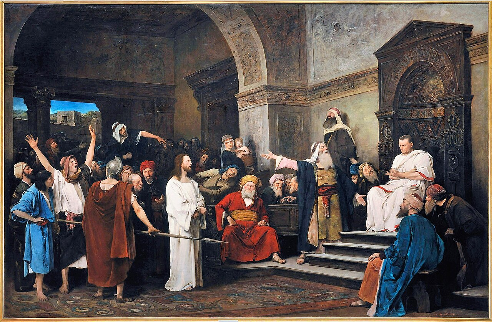

# Session 50 — Eighth Commandment — Truth and the Reputation of Others

*Mihály Munkácsy, Christ Before Pilate (1881). Public Domain via Wikimedia Commons.*

> *Susanna stands accused; she did nothing. The lie is exposed by Daniel — but only after she suffers it. Reputations are easy to tear and slow to mend. Speak the truth in due time. Do not slander, even silently.*

## Pius X asks

**206.** What does the eighth commandment, "Thou shalt not bear false witness," forbid us?

*The eighth commandment, "Thou shalt not bear false witness," forbids us every falsehood and every unjust harm to another's reputation: therefore, besides false witness, calumny, lying, detraction or murmuring, flattery, and rash judgment and suspicion.*

**207.** What does the eighth commandment order us?

*The eighth commandment orders us to speak the truth in due time and place, and to interpret in a good sense, when possible, the actions of our neighbor.*

**208.** One who has harmed his neighbor in his good name by accusing him falsely or by speaking ill of him — to what is he bound?

*One who has harmed his neighbor in his good name by accusing him falsely or by speaking ill of him must, as far as he is able, repair the harm caused.*

## St. Thomas teaches

The Lord has forbidden anyone to injure his neighbour by deed; now he forbids us to injure him by word. "Thou shalt not bear false witness against thy neighbour."[^1] This may occur in two ways, either in a court of justice or in ordinary conversation.

In the court of justice it may happen in three ways, according to the three persons who may violate this Commandment in court.[^2] The first person is the plaintiff who makes a false accusation: "Thou shalt not be a detractor nor a whisperer among the people."[^3] And note well that it is not only wrong to speak falsely, but also to conceal the truth: "If thy brother shall offend against thee, go and rebuke him."[^4] The second person is the witness who testifies by lying: "A false witness shall not be unpunished."[^5] For this Commandment includes all the preceding ones, inasmuch as the false witness may himself be the murderer or the thief, etc. And such should be punished according to the law. "When after most diligent inquisition, they shall find that the false witness hath told a lie against his brother, they shall render to him as he meant to do to his brother. . . . Thou shalt not pity him, but shalt require life for life, eye for eye, tooth for tooth, hand for hand, foot for foot."[^6] And again: "A man that beareth false witness against his neighbour is like a dart and a sword and a sharp arrow."[^7] The third person is the judge who sins by giving an unjust sentence: "Thou shalt not . . . judge unjustly. Respect not the person of the poor, nor honour the countenance of the mighty. But judge thy neighbour according to justice."[^8]

## Ways of Violating This Commandment

In ordinary conversation one may violate this Commandment in five ways. The first is by detraction: "Detractors, hateful to God."[^9] "Hateful to God" here indicates that nothing is so dear to a man as his good name: "A good name is better than great riches."[^10] But detractors take away this good name: "If a serpent bite in silence, he is no better that backbiteth secretly."[^11] Therefore, if detractors do not restore this reputation, they cannot be saved.

Secondly, one may break this precept by listening to detractors willingly: "Hedge in thy ears with thorns, hear not a wicked tongue, and make doors and bars to thy mouth."[^12] One should not listen deliberately to such things, but ought to turn away, showing a sad and stern countenance: "The north wind driveth away rain as doth a sad countenance a backbiting tongue."[^13]

Thirdly, gossipers break this precept when they repeat whatever they hear: "Six things there are which the Lord hateth, and the seventh His soul detesteth . . . him that soweth discord among brethren."[^14] Fourthly, those who speak honied words, the flatterers: "The sinner is praised in the desires of his soul, and the unjust man is blessed."[^15] And again: "O My people, they that call thee blessed, the same shall deceive thee."[^16]

## Special Effects of Telling Lies

The prohibition of this Commandment includes every form of falsehood: "Be not willing to make any manner of lie; for the custom thereof is no good."[^17] There are four reasons for this. The first is that lying likens one to the devil, because a liar is as the son of the devil. Now, we know that a man's speech betrays from what region and country he comes from, thus: "Even thy speech doth discover thee."[^18] Even so, some men are of the devil's kind, and are called sons of the devil because they are liars, since the devil is "a liar and the father of lies."[^19] Thus, when the devil said, "No, you shall not die the death,"[^20] he lied. But, on the contrary, others are the children of God, who is Truth, and they are those who speak the truth.

The second reason is that lying induces the ruin of society. Men live together in society, and this is soon rendered impossible if they do not speak the truth to one another. "Wherefore putting away Iying, speak ye the truth, every man with his neighbour; for we are members one of another."[^21]

The third reason is that the liar loses his reputation for the truth. He who is accustomed to telling lies is not believed even when he speaks the truth: "What can be made clean by the unclean? And what truth can come from that which is false?"[^22]

The fourth reason is because a liar kills his soul, for "the mouth that belieth killeth the soul."[^23] And again: "Thou wilt destroy all that speak a lie."[^24] Accordingly, it is clear that lying is a mortal sin; although it must be known that some lies may be venial.

It is a mortal sin, for instance, to lie in matters of faith. This concerns professors, prelates and preachers, and is the gravest of all other kinds of lies: "There shall be among you lying teachers, who shall bring in sects of perdition."[^25] Then there are those who lie to wrong their neighbour: "Lie not to one another."[^26] These two kinds of lies, therefore, are mortal sins.

There are some who lie for their own advantage, and this in a variety of ways. Sometimes it is out of humility. This may be the case in confession, about which St. Augustine says: "Just as one must avoid concealing what he has committed, so also he must not mention what he has not committed." "Hath God any need of your lie?"[^27] And again: "There is one that humbleth himself wickedly, and his interior is full of deceit; and there is one that humbleth himself exceedingly with a great lowness."[^28]

There are others who tell lies out of shame, namely, when one tells a falsehood believing that he is telling the truth, and on becoming aware of it he is ashamed to retract: "In no wise speak against the truth, but be ashamed of the lie of thy ignorance."[^29] Other some lie for desired results as when they wish to gain or avoid something: "We have placed our hope in lies, and by falsehood we are protected."[^30] And again: "He that trusteth in lies feedeth the winds."[^31]

Finally, there are some who lie to benefit another, that is, when they wish to free someone from death, or danger, or some other loss. This must be avoided, as St. Augustine tells us: "Accept no person against thy own person, nor against thy soul a lie."[^32] But others lie only out of vanity, and this, too, must never be done, lest the habit of such lead us to mortal sin: "For the bewitching of vanity obscureth good things."[^33]

[^1]: St. Thomas also treats of this Commandment in the "Summa Theol.," II-II, Q. cxxii, art. 6.
[^2]: "The Commandment specially prohibits that species of false testimony which is given on oath in a court of justice. The witness swears by the Deity and thus pledges God's holy name for the truth of what he says, and this has very great weight and constitutes the strongest claim for credit. Such testimony, therefore, because it is dangerous, is particularly prohibited. When no legal exceptions can be taken against a sworn witness, and when he cannot be convicted of open dishonesty and malice, even the judge himself cannot reject his testimony. This is especially true since it is commanded by divine authority that 'in the mouth of two or three witnesses every word shall stand' " ("Roman Catechism," "Eighth Commandment," 3).
[^3]: Leviticus 19:16.
[^4]: Matthew 18:15.
[^5]: Proverbs 19:5.
[^6]: Deuteronomy 19:18-21.
[^7]: Proverbs 25:18.
[^8]: Leviticus 19:15. "This Commandment prohibits deceit, lying, and perjury on the part of witnesses. The same prohibition also applies to plaintiffs, defendants, promoters, representatives, procurators, and advocates; in a word, all who take any part in lawsuits. . . . Finally, God forbids all testimony which may injure others or do them injustice, whether it be a matter of legal evidence or not" ("Roman Catechism," "loc. cit.," 6).
[^9]: Romans 1:30.
[^10]: Proverbs 22:1.
[^11]: Ecclesiastes 10:11.
[^12]: Sirach 28:28.
[^13]: Proverbs 25:23. "This Commandment not only forbids false testimony, but also the abominable sin of detraction. This is a moral pestilence which is the poisoned source of many and calamitous evils. . . . That we may see the nature of the sin of detraction more clearly, we must know that reputation is injured not only by calumniating the character. but also by exaggerating the faults of others. He who makes known the secret sin of any man at any time or place unnecessarily, or before persons who have no right to know, is also rightly regarded as a detractor and evil-speaker, if his revelation seriously injures the other's reputation" ("Roman Catechism," "loc. cit.," 9).
[^14]: Proverbs 6:16, 19.
[^15]: Psalm 9:2487
[^16]: Isaiah 3:12. "Flatterers and sycophants are among those who violate this Commandment, for by fawning and insincere praise they gain the hearing and good will of those whose favor. money, and honors they seek" ("Roman Catechism," "loc. cit.," 11).
[^17]: Sirach 7:14.
[^18]: Matthew 26:73.
[^19]: John 8:44.
[^20]: Genesis 3:4.
[^21]: Ephesians 4:25.
[^22]: Sirach 34:4.
[^23]: Wisdom 1:11.
[^24]: Psalm 5:7.
[^25]: 2 Peter 2:1.
[^26]: Colossians 3:9.
[^27]: Job 13:7.
[^28]: Sirach 19.
[^29]: "Ibid.," 4:30.
[^30]: Isaiah 28:15.
[^31]: Proverbs 10:4.
[^32]: Ecclesiastes 4:26.
[^33]: Wisdom 4:12.

> **Scripture.** *A good name is better than great riches: and good favour is above silver and gold.* — Proverbs 22:1

> *Lord, today, I will not speak ill of someone behind their back. Hold my tongue. Heal what others say of me.*

---

#### Going Deeper — *Catechism of Trent*

## Importance Of Instruction On This Commandment

The great utility, nay the necessity, of carefully explaining
this Commandment, and of emphasising its obligation, we learn
from these words of St. James: If any man offend not in word, the
same is a perfect man; and again, The tongue is indeed a little
member, and boasteth great things. Behold how small a fire, what
a great wood it kindleth; and so on, to the same effect.

From these words we learn two truths. The first is that sins
of the tongue are very prevalent, which is confirmed by these
words of the Prophet: Every man is a liar, so that it would
almost seem as if this were the only sin which extends to all
mankind. The other truth is that the tongue is the source of
innumerable evils. Through the fault of the evilspeaker are
often lost the property, the reputation, the life, and the
salvation of the Injured person, or of him who inflicts the
injury. The injured person, unable to bear patiently the
contumely, avenges it without restraint. The offender, on the
other hand, deterred by a perverse shame and a false idea of what
is called honour, cannot be induced to make reparation to him
whom he has offended.

## This Commandment Should Call Forth Our Gratitude

Hence the faithful are to be exhorted to thank God as much as
they can for having given this salutary Commandment, not to bear
false witness, which not only forbids us to injure others, but
which also, if duly observed, prevents others from injuring us.

## Two Parts Of This Commandment

In its explanation we shall proceed as we have done with
regard to the others, pointing out that in it are contained two
laws. The first forbids us to bear false witness. The other
commands us to lay aside all dissimulation and deceit, and to
measure our words and actions by the standard of truth, a duty of
which the Apostle admonishes the Ephesians in these words: Doing
the truth in charity, let us grow up in all things in him.

## Negative Part Of This Commandment

With regard to the prohibitory part of this Commandment,
although by false testimony is understood whatever is positively
but falsely affirmed of anyone, be it for or against him, be it
in a public court or elsewhere; yet the Commandment specially
prohibits that species of false testimony which is given on oath
in a court of justice. For a witness swears by the Deity, because
the words of a man thus giving evidence and using the divine
name, have very great weight and possess the strongest claim to
credit. Such testimony, therefore, because it is dangerous, is
specially prohibited; for even the judge himself cannot reject
the testimony of sworn witnesses, unless they be excluded by
exceptions made in the law, or unless their dishonesty and malice
are notorious. This is especially true since it is commanded by
divine authority that in the mouth of two or three every word
shall stand.

### "Against Thy Neighbour"

In order that the faithful may have a clear comprehension of
this Commandment it should be explained who is our neighbour,
against whom it is unlawful to bear false witness. According to
the interpretation of Christ the Lord, our neighbour is he who
needs our assistance, whether bound to us by ties of kindred or
not, whether a fellowcitizen or a stranger, a friend or an
enemy.' It is wrong to think that one may give false evidence
against an enemy, since by the command of God and of our Lord we
are bound to love him.

Moreover, as every man is bound to love himself, and is thus,
in some sense, his own neighbour, it is unlawful for anyone to
bear false witness against himself. He who does so brands himself
with infamy and disgrace, and injures both himself and the Church
of which he is a member, much as the suicide, by his act, does a
wrong to the state. This is the doctrine of St. Augustine, who
says: To those who do not understand (the precept) properly, it
might seem lawful to give false testimony against one's self,
because the words "against thy neighbour" are subjoined
in the Commandment. But let no one who bears false testimony
against himself think that he has not violated this Commandment,
for the standard of loving our neighbour is the love which we
cherish towards ourselves.

### False Testimony In Favour Of A Neighbour Is Also Forbidden

But if we are forbidden to injure our neighbour by false
testimony, let it not be inferred that the contrary is lawful,
and that we may help by perjury those who are bound to us by ties
of kinship or religion. It is never allowed to have recourse to
lies or deception, much less to perjury. Hence St. Augustine in
his book to Crescentius On Lying teaches from the words of the
Apostle that a lie, although uttered in false praise of anyone,
is to be numbered among false testimonies. Treating of that
passage, Yea, and we are found false witnesses of God, because we
have given testimony against God, that he hath raised up Christ
whom he hath not raised, if the dead rise not again, he says: The
Apostle calls it false testimony to utter a lie with regard to
Christ, even though it should seem to redound to His praise.

It also not infrequently happens, that by favouring one party
we injure the other. False testimony is certainly the occasion of
misleading the judge, who, yielding to such evidence, is
sometimes obliged to decide against justice, to the injury of the
innocent.

Sometimes, too, it happens that the successful party, who by
means of perjured witnesses, has gained his case and escaped with
impunity, exulting in his iniquitous victory, soon becomes
accustomed to the work of corrupting and suborning false
witnesses, by whose aid he hopes to obtain whatever he wishes.

To the witness himself it must be most grievous that his
falsehood and perjury are known to him whom he has aided and
abetted by his perjury; whilst encouraged by the success that
follows his crime, he becomes every day more accustomed to
wickedness and audacity.

### "Thou Shalt Not Bear False Witness"

#### All Falsehoods In Lawsuits Are Forbidden

This precept then prohibits deceit, lying and perjury on the
part of witnesses. The same prohibition extends also to
plaintiffs, defendants, promoters, representatives, procurators
and advocates; in a word, to all who take any part in lawsuits.

#### False Testimony Out Of Court Is Forbidden

Finally, God prohibits all testimony which may inflict injury
or injustice, whether it be a matter of legal evidence or not. In
the passage of Leviticus where the Commandments are repeated, we
read: Thou shalt not steal; thou shalt not lie; neither shall any
man deceive his neighbour.' To none, therefore can it be a matter
of doubt, that this Commandment condemns lies of every sort, as
these words of David explicitly declare: Thou wilt destroy all
that speak a lie.

### This Commandment Forbids Detraction

This Commandment forbids not only false testimony, but also
the detestable vice and practice of detraction,  a
pestilence, which is the source of innumerable and calamitous
evils. This vicious habit of secretly reviling and calumniating
character is frequently reprobated in the Sacred Scriptures. With
him, says David, I would not eat; and St. James: Detract not one
another, my brethren.

Holy Writ abounds not only with precepts on the subject, but
also with examples which reveal the enormity of the crime. Aman,
by a crime of his own invention, had so incensed Assuerus against
the Jews that he ordered the destruction of the entire race.
Sacred history contains many other examples of the same kind,
which priests should recall in order to deter the people from
such iniquity.

#### Various Kinds Of Detraction

But, to understand well the nature of this sin of detraction,
we must know that reputation is injured not only by calumniating
the character, but also by exaggerating the faults of others. He
who gives publicity to the secret sin of any man, in an
unnecessary place or time, or before persons who have no right to
know, is also rightly regarded as a detractor and evilspeaker,
if his revelation seriously injures the other's reputation.

But of all sorts of calumnies the worst is that which is
directed against Catholic doctrine and its teachers. Persons who
extol the propagators of error and of unsound doctrine are guilty
of a like crime.

Nor are those to be dissociated from the ranks of
evilspeakers, or from their guilt, who, instead of reproving,
lend a willing ear and a cheerful assent to the calumniator and
reviler. As we read in St. Jerome and St. Bernard, it is not so
easy to decide which is more guilty, the detractor, or the
listener; for if there were no listeners, there would be no
detractors.

To the same category belong those who cunningly foment
divisions and excite quarrels; who feel a malignant pleasure in
sowing discord, dissevering by fiction and falsehood the closest
friendships and the dearest social ties, impelling to endless
hatred and deadly combat the fondest friends. Of such pestilent
characters the Lord expresses His detestation in these words:
Thou shalt not be a detractor nor a whisperer among the people.
Of this description were many of the advisers of Saul, who strove
to alienate the king's affection from David and to arouse his
enmity against him.

### This Commandment Forbids Flattery

Among the transgressors of this Commandment are to be numbered
those fawners and sycophants who, by flattery and insincere
praise, gain the hearing and good will of those whose favour,
money, and honours they seek, calling good evil, and evil good,
as the Prophet says. Such characters David admonishes us to repel
and banish from our society. The just man, he says, shall correct
me in mercy, and shall reprove me; but let not the oil of the
sinner fatten my head. This class of persons do not, it is true,
speak ill of their neighbour; but they greatly injure him, since
by praising his sins they cause him to continue in vice to the
end of his life.

Of this species of flattery the most pernicious is that which
proposes to itself for object the injury and the ruin of others.
Thus Saul, when he sought to expose David to the sword and fury
of the Philistines, in order to bring about his death, ad dressed
him in these soothing words: Behold my eldest daughter Merob, her
will I give thee to wife: only be a valiant man and fight the
battles of the Lord. In the same way the Jews thus insidiously
addressed our Lord: Master, we know that thou art a true speaker,
and teachest the way of God in truth.

Still more pernicious is the language addressed sometimes by
friends and relations to a person suffering with a mortal
disease, and on the point of death, when they assure him that
there is no danger of dying, telling him to be of good spirits,
dissuading him from confession, as though the very thought should
fill him with melancholy, and finally withdrawing his attention
from all care and thought of the dangers which beset him in the
last perilous hour.

### This Commandment Forbids Lies Of All Kinds

In a word, lies of every sort are prohibited, especially those
that cause grave injury to anyone, while most impious of all is a
lie uttered against or regarding religion.

God is also grievously offended by those attacks and slanders
which are termed lampoons, and other defamatory publications of
this kind.

To deceive by a jocose or officious lie, even though it helps
or harms no one, is, notwithstanding, altogether unworthy; for
thus the Apostle admonishes us: Putting away lying, speak ye the
truth. This practice begets a strong tendency to frequent and
serious lying, and from jocose lying men contract the habit of
lying, lose all reputation for truth, and ultimately find it
necessary, in order to gain belief, to have recourse to continual
swearing.

### This Commandment Forbids Hypocrisy

Finally, the first part of this Commandment prohibits
dissimulation. It is sinful not only to speak, but to act
deceitfully. Actions, as well as words, are signs of what is in
our mind; and hence our Lord, rebuking the Pharisees, frequently
calls them hypocrites. So, far with regard to the negative, which
is the first part of this Commandment.

## Positive Part of this Commandment

### Judges Must Pass Sentence According To Law And Justice

We now come to explain what the Lord commands in the second
part. Its nature and purpose require that trials be conducted on
principles of strict justice and according to law. It requires
that no one usurp judicial powers or authority, for, as the
Apostle writes, it were unjust to judge another man's servant.

Again it requires that no one pass sentence without a
sufficient knowledge of the case. This was the sin of the priests
and scribes who passed judgment on St. Stephen. The magistrates
of Philippi furnish another example. They have beaten us
publicly, says the Apostle, uncondemned, men that are Romans, and
have cast us into prison; and now do they thrust us out
privately.

This Commandment also requires that the innocent be not
condemned, nor the guilty acquitted; and that (the decision) be
not influenced by money, or favour, hatred or love. For so Moses
admonished the elders whom he had constituted judges of the
people: Judge that which is just, whether he be one of your
country or a stranger. There shall be no difference of persons,
you shall hear the little as well as the great; neither shall you
respect any man's person, because it is the judgment of God.

### Witnesses Must Give Testimony Truthfully

With regard to an accused person who is conscious of his own
guilt, God commands him to confess the truth, if he is
interrogated judicially. By that confession he, in some sort,
bears witness to, and proclaims the praise and glory of God; and
of this we have a proof in these words of Josue, when exhorting
Achan to confess the truth: My son, give glory to the Lord the
God of Israel.

But as this Commandment chiefly concerns witnesses, the
pastor should give them special attention. The spirit of the
precept not only prohibits false testimony, but also commands the
truth to be told. In human affairs, to bear testimony to the
truth is a matter of the highest importance, because there are
innumerable things of which we must be ignorant unless we arrive
at a knowledge of them on the faith of witnesses. In matters with
which we are not personally acquainted and which we need to know,
there is nothing so important as true evidence. Hence the words
of St. Augustine: He who conceals the truth and he who utters
falsehood are both guilty; the one, because he is unwilling to
render a service; the other, because he has the will to do an
injury.

We are not, however, at all times, obliged to disclose the
truth; but when, in a court of justice, a witness is legally
interrogated by the judge, he is emphatically bound to tell the
whole truth. Here, however, witnesses should be most circumspect,
lest, trusting too much to memory, they affirm for certain what
they have not fully ascertained.

### Lawyers And Plaintiffs Must Be Guided By Love Of Justice

Attorneys and counsel, plaintiffs and prosecutors, remain
still to be treated of. The two former should not refuse to
contribute their services and legal assistance, when the
necessities of others call for their aid. They should deal
generously with the poor. They should not defend an unjust cause,
prolong lawsuits by trickery, nor encourage them for the sake of
gain. As to remuneration for their services and labours, let them
be guided by the principles of justice and of equity.

Plaintiffs and prosecutors, on their side, are to be warned
not to be led by the influence of love, or hatred, or any other
undue motive into exposing anyone to danger through unjust
charges:

### All Must Speak Truthfully And With Charity

To all conscientious persons is addressed the divine command
that in all their intercourse with society, in every
conversation, they should speak the truth at all times from the
sincerity of their hearts; that they should utter nothing
injurious to the reputation of another, not even of those by whom
they know they have been injured and persecuted. For they should
always remember that between them and others there exists such a
close social bond that they are all members of the same body.

### Inducements To Truthfulness

In order that the faithful may be more disposed to avoid the
vice of lying, the pastor should place before them the extreme
lowness and disgrace of this sin. In the Sacred Scriptures the
devil is called the father of lies; for as, he stood not in the
truth, he is a liar and the father thereof.

To banish so great a sin, (the pastor) should add the
mischievous consequences of lying; but since they are
innumerable, he must be content with pointing out the chief kinds
of these evils and calamities.

In the first place, he should show how grievously lies and
deceit offend God and how deeply they are hated by God. This he
should prove from the words of Solomon: Six things there are
which the Lord hateth, and the seventh his soul detesteth:
haughty eyes, a lying tongue, hands that shed innocent blood, a
heart that deviseth wicked plots, feet that are swift to run into
mischief, a deceitful witness that uttereth lies, etc. Who, then,
can protect or save from severest chastisements the man who is
thus the object of God's special hate?

Again, what more wicked, what more base than, as St. James
says, with the same tongue, by which we bless God and the Father,
to curse men, who are made after the image and likeness of God,
so that out of the same fountain flows sweet and bitter water.
The tongue, which was before employed in giving praise and glory
to God, afterwards, as far as it is able, by lying treats Him
with ignominy and dishonour. Hence liars are excluded from a
participation in the bliss of heaven. To David asking, Lord! who
shall dwell in thy tabernacle? the Holy Spirit answers: He that
speaketh truth in his heart, who hath not used deceit in his
tongue.

Lying is also attended with this very great evil that it is
an almost incurable disease. For since the guilt of the
calumniator cannot be pardoned, unless satisfaction be made to
the calumniated person, and since, as we have already observed,
this duty is difficult for those who are deterred from its
performance by false shame and a foolish idea of dignity, we
cannot doubt that he who continues in this sin is destined to the
unending punishments of hell. Let no one indulge the hope of
obtaining the pardon of his calumnies or detractions, until he
has repaired the injury which they have inflicted on the honour
or fame of another, whether this was done in a court of justice,
or in private and familiar conversation.

But the evil consequences of lying are widespread and extend
to society at large. By duplicity and lying, good faith and
truth, which form the closest links of human society, are
dissolved, confusion ensues, and men seem to differ in nothing
from demons.

### How To Avoid Lying

The pastor should also teach that loquacity is to be avoided.
By avoiding loquacity other evils will be obviated, and a great
preventive opposed to lying, from which loquacious persons can
scarcely abstain.

## Excuses for Lying Refuted

### The Plea Of Prudence

There are those who seek to justify their duplicity either by
the unimportance of what they say, or by the example of the
worldly wise who, they claim, lie at the proper time. The pastor
should correct such erroneous ideas by answering what is most
true, namely, that the wisdom of the flesh is death. He should
exhort his listeners in all their difficulties and dangers to
trust in God, not in the artifice of lying; for those who have
recourse to subterfuge, plainly show that they trust more to
their own prudence than to the providence of God.

### The Plea Of Revenge

Those who lay the blame of their own falsehood on others, who
first deceived them by lies, are to be taught the unlawfulness of
avenging their own wrongs, and that evil is not to be rendered
for evil, but rather that evil is to be overcome by good. Even if
it were lawful to return evil for evil, it would not be to our
interest to harm ourselves in order to get revenge. The man who
seeks revenge by uttering falsehood inflicts very serious injury
on himself.

### The Pleas Of Frailty, Habit, And Bad Example

Those who plead human frailty are to be taught that it is a
duty of religion to implore the divine assistance, and not to
yield to human infirmity.

Those who excuse themselves by habit are to be admonished to
endeavour to acquire the contrary habit of speaking the truth;
particularly as those who sin habitually are more guilty than
others.

There are some who adduce in their own justification the
example of others, who, they contend, constantly indulge in
falsehood and perjury. Such persons should be undeceived by
reminding them that bad men are not to be imitated, but reproved
and corrected; and that, when we ourselves are addicted to the
same vice, our admonitions have less influence in reprehending
and correcting it in others.

### The Pleas Of Convenience, Amusement, And Advantage

With regard to those who defend their conduct by saying that
to speak the truth is often attended with inconvenience, priests
should answer that (such an excuse) is an accusation, not a
defence, since it is the duty of a Christian to suffer any
inconvenience rather than utter a falsehood.

There remain two other classes of persons who seek to justify
lying: those who say that they tell lies for the sake of
amusement, and those who plead motives of interest, claiming that
without recourse to lies, they can neither buy nor sell to
advantage. The pastor should endeavour to reform both these kinds
of liars. He should correct the former by showing how strong a
habit of sinning is contracted by their practice, and by strongly
impressing upon them the truth that for every idle word they
shall render an account. As for the second class, he should
upbraid them with greater severity, because their very excuse is
a most serious accusation against themselves, since they show
thereby that they yield no faith or confidence to these words of
God: Seek first the kingdom of God and his justice, and all these
things shall be added unto you.
