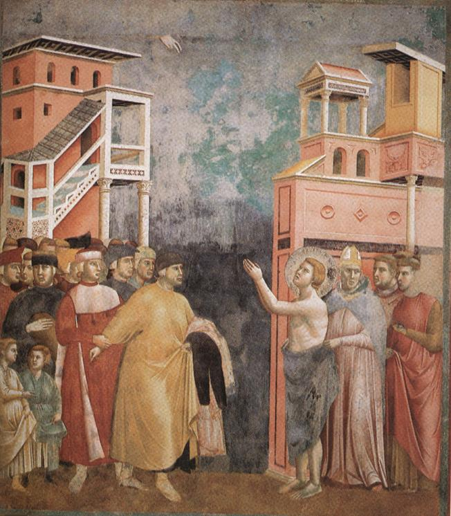

# Session 52 — Tenth Commandment — Detachment from Goods

*Giotto di Bondone, St. Francis Renouncing Worldly Goods (c. 1297-1300). Public Domain via Wikimedia Commons.*

> *Giotto's Francis throws his clothes at his father's feet. Coveting is the disease that does not announce itself — you only know you have it when you finally let go of something. Today, let go of one thing.*

## Pius X asks

**211.** What does the tenth commandment, "Thou shalt not desire thy neighbor's goods," forbid us?

*The tenth commandment, "Thou shalt not desire thy neighbor's goods," forbids us the unbridled greed for riches, without regard for the rights and the good of our neighbor.*

**212.** What does the tenth commandment order us?

*The tenth commandment orders us to be just and moderate in our desire to better our condition, and to bear with patience the hardships and other miseries permitted by the Lord for our merit, since "we must enter the kingdom of God through many tribulations" (Acts XIV. 22).*

## St. Thomas teaches

"Thou shalt not covet thy neighbour’s goods." There is this difference between the divine and the human laws that human law judges only deeds and words, whereas the divine law judges also thoughts. The reason is because human laws are made by men who see things only exteriorly, but the divine law is from God, who sees both external things and the very interior of men. "Thou art the God of my heart."[^2] And again: "Man seeth those things that appear, but the Lord beholdeth the heart."[^3] Therefore, having considered those Commandments which concern words and deeds, we now treat of the Commandments about thoughts. For with God the intention is taken for the deed, and thus the words, "Thou shalt not covet," mean to include not only the taking by act, but also the intention to take. Therefore, it says: "Thou shalt not even covet thy neighbour’s goods." There are a number of reasons for this.

The first reason for the Commandment is that man's desire has no limits, because desire itself is boundless. But he who is wise will aim at some particular end, for no one should have aimless desires: "A covetous man shall not be satisfied with money."[^4] But the desires of man are never satisfied, because the heart of man is made for God. Thus, says St. Augustine: "Thou hast made us for Thee, O Lord, and our heart is restless until it rests in Thee."[^5] Nothing, therefore, less than God can satisfy the human heart: "Who satisfieth thy desire with good things."[^6]

The second reason is that covetousness destroys peace of heart, which is indeed highly delightful. The covetous man is ever solicitous to acquire what he lacks, and to hold that which he has: "The fullness of the rich will not suffer him to sleep."[^7] "For where thy treasure is, there is thy heart also."[^8] It was for this, says St. Gregory, that Christ compared riches to thorns.[^9]

Thirdly, covetousness in a man of wealth renders his riches useless both to himself and to others, because he desires only to hold on to them: "Riches are not comely for a covetous man and a niggard."[^10] The fourth reason is that it destroys the equality of justice: "Neither shalt thou take bribes, which even blind the wise, and pervert the words of the just."[^11] And again: "He that loveth gold shall not be justified."[^12] The fifth reason is that it destroys the love of God and neighbour, for says St. Augustine: "The more one loves, the less one covets," and also the more one covets, the less one loves. "Nor despise thy dear brother for the sake of gold."[^13] And just as "No man can serve two masters," so neither can he serve "God and mammon."[^14]

Finally, covetousness produces all kinds of wickedness. It is "the root of all evil," says St. Paul, and when this root is implanted in the heart it brings forth murder and theft and all kinds of evil. "They that will become rich, fall into temptation, and into the snare of the devil, and into many unprofitable and hurtful desires which drown men in destruction and perdition. For the desire of money is the root of all evil."[^15] And note, furthermore, that covetousness is a mortal sin when one covets one's neighbour’s goods without reason; and even if there be a reason, it is a venial sin.[^16]

[^1]: St. Thomas places the Tenth Commandment (in the present traditional enumeration) before the Ninth. The Tenth Commandment is wider in extension than the Ninth, which is specific. The "Roman Catechism" ("Ninth and Tenth Commandments" 1) treats both the Ninth and Tenth Commandments together, and remarks that "what is commanded in these two precepts amounts to this, that to observe the preceding Commandments we must be particularly careful not to covet. For he who does not covet, being content with what he has, will not desire what belongs to others, but will rejoice in their prosperity, giving glory to God."
[^2]: Ps. lxxii. 26.
[^3]: I Kings, xvi. 7.
[^4]: Eccles., v. 9.
[^5]: "Confessions," I.
[^6]: Ps. cii. 5.
[^7]: Eccles., v. 11.
[^8]: Matt. vi. 21.
[^9]: Luke viii. 14.
[^10]: Ecclus., xiv. 3.
[^11]: Exod., xxiii. 8.
[^12]: Ecclus., xxxi. 5.
[^13]: "Ibid.," vii. 20.
[^14]: Matt., vi. 24.
[^15]: I Tim., vi. 9, 10.
[^16]: "Another reason for these two Commandments is that they clearly and in definite terms forbid some things not expressly prohibited in the Sixth and Seventh Commandments. The Seventh Commandment, for instance, forbids an unjust desire to take what belongs to another; but the Tenth Commandment further prohibits even to covet it in any way, even though it could be acquired justly and lawfully--if we foresee that by such acquisition our neighbour would suffer some loss. . . . Another reason why this sort of vicious desire is condemned is that it has for its object that which belongs to another, such as a house, maidservant, field, wife, ox, ass, and many other things, all of which the law of God forbids us to covet, simply because they belong to another. The desire for such things, when consented to, is criminal, and is numbered among the most grievous sins. When the mind, yielding to the impulse of evil desires, is pleased with evil or does not resist it, sin is necessarily committed" ("Roman Catechism," loc. cit.," 11).

---

These are the ten precepts to which Our Lord referred when He said: "If thou wilt enter into life, keep the commandments" (Matt., xix. 17). There are two main principles of all the Commandments, namely, love of God and love of neighbour. The man that loves God must necessarily do three things: (1) he must have no other God. And in support of this is the Commandment: "Thou shalt not have strange gods"; (2) he must give God all honour. And so it is commanded: "Thou shalt not take the name of God in vain"; (3) he must freely take his rest in God. Hence: "Remember that thou keep holy the Sabbath day."

But to love God worthily, one must first of all love one's neighbour. And so: "Honour thy father and mother." Then, one must avoid doing harm to one's neighbour in act. "Thou shalt not kill" refers to our neighbour’s person; "Thou shalt not commit adultery" refers to the person united in marriage to our neighbour; "Thou shalt not steal" refers to our neighbour’s external goods. We must also avoid injury to our neighbour both by word, "Thou shalt not bear false witness," and by thought, "Thou shalt not covet thy neighbour’s goods" and "Thou shalt not covet thy neighbour’s wife."

> **Scripture.** *For we brought nothing into this world: and certainly we can carry nothing out.* — 1 Timothy 6:7

*A note on numbering. Pius X numbers this the Tenth Commandment ('thou shalt not covet thy neighbor's goods'); Aquinas's Naples sermons treat it as the Ninth. The doctrine is identical; only the historical order varies.*

> *Lord, You are enough. Today, let me act like it once.*

---

#### Going Deeper — *Catechism of Trent*

## Two Parts Of These Commandments

In common with the other Commandments, however, these two are
partly mandatory, partly prohibitory.

## Negative Part

### "Thou Shalt Not Covet"

With regard to the prohibitory part, the pastor should explain
what sort of concupiscence is prohibited by this law, lest some
may think that which is not sinful to be sinful.

### What Sort Of Concupiscence Is Not Forbidden

Such is the concupiscence of the spirit against the flesh; Or
that which David so earnestly desired, namely, to long after the
justifications of God at all times.

Concupiscence, then, is a certain commotion and impulse of
the soul, urging men to the desire of pleasures, which they do
not actually enjoy. As the other propensities of the soul are not
always sinful, neither is the impulse of concupiscence always
vicious. It is not, for instance, sinful to desire food and
drink; when cold, to wish for warmth; when warm, to wish to
become cool. This lawful species of concupiscence was implanted
in us by the Author of nature; but in consequence of the sin of
our first parents it passed the limits prescribed by nature and
became so depraved that it frequently excites to the desire of
those things which conflict with the spirit and reason.

However, if well regulated, and kept within proper bounds, it
is often still the source of no slight advantage. In the first
place, it leads us to supplicate God continually, and humbly to
beg of Him those things which we most earnestly desire. Prayer is
the interpreter of our wishes; and if this lawful concupiscence
did not exist within us, prayer would be far less frequent in the
Church of God. It also makes us esteem the gifts of God more
highly; for the more eagerly we desire anything, the dearer and
more pleasing will be its possession to us. Finally, the
gratification which we receive from the acquisition of the
desired object increases the devotion of our gratitude to God.

If then it is sometimes lawful to covet, it must be conceded
that not every species of concupiscence is forbidden. St. Paul,
it is true, says that concupiscence is sin; but his words are to
be understood in the same sense as those of Moses, whom he cites,
as the Apostle himself declares when, in his Epistle to the
Galatians he calls it the concupiscence of the flesh for he says:
Walk in the spirit, and you shall not fulfil the lusts of the
flesh.

Hence that natural, wellregulated concupiscence which does
not go beyond its proper limits, is not prohibited; still less do
these Commandments forbid that spiritual desire of the virtuous
mind, which prompts us to long for those things that war against
the flesh, for the Sacred Scriptures themselves exhort us to such
a desire: Covet ye my words, Come over to me all ye that desire
me.

### What Sort Of Concupiscence Is Here Prohibited

It is not, then, the mere power of desire, which can move
either to a good or a bad object that is prohibited by these
Commandments; it is the indulgence of evil desire, which is
called the concupiscence of the flesh, and the fuel of sin, and
which when accompanied by the consent of the will, is always
sinful. Therefore only that covetousness is forbidden which the
Apostle calls the concupiscence of the flesh, that is to say,
those motions of desire which are contrary to the dictates of
reason and outstep the limits prescribed by God.

### Two Kinds Of Sinful Concupiscence

This kind of covetousness is condemned, either because it
desires what is evil, such as adultery, drunkenness, murder, and
such heinous crimes, of which the Apostle says: Let us not covet
evil things, as they also coveted; or because, although the
objects may not be bad in themselves, yet there is some other
reason which makes it wrong to desire them, as when, for
instance, God or His Church prohibit their possession; for it is
not permitted us to desire these things which it is altogether
unlawful to possess. Such were, in the Old Law, the gold and
silver from which idols were made, and which the Lord in
Deuteronomy forbade anyone to covet

Another reason why this sort of vicious desire is condemned
is that it has for its object that which belongs to another, such
as a house, maidservant, field, wife, ox, ass and many other
things, all of which the law of God forbids us to covet, simply
because they belong to another. The desire of such things, when
consented to, is criminal, and is numbered among the most
grievous sins. For sin is committed the moment the soul, yielding
to the impulse of corrupt desires, is pleased with evil things,
and either consents to, or does not resist them, as St. James,
pointing out the beginning and progress of sin, teaches when he
says: Every man is tempted by his own concupiscence, being drawn
away and allured; then, when concupiscence hath conceived, it
bringeth forth sin; but sin, when it is completed, begetteth
death.

When, therefore, the Law says: Thou shalt not covet, it means
that we are not to desire those things which belong to others. A
thirst for what belongs to others is intense and insatiable; for
it is written: A covetous man shall not be satisfied with money;
and of such a one Isaias says: Woe to you that join house to
house, and lay field to field.

### The Various Objects We Are Forbidden To Covet

But a distinct explanation of each of the words (in which this
Commandment is expressed) will make it easier to understand the
deformity and grievousness of this sin.

#### "Thy Neighbour's House"

The pastor, therefore, should teach that by the word house is
to be understood not only the habitation in which we dwell, but
all our property, as we know from the usage and custom of the
sacred writers. Thus when it is said in Exodus that the Lord
built houses for the midwives, the meaning is that He improved
their condition and means.

From this interpretation, therefore, we perceive, that we are
forbidden to indulge an eager desire of riches, or to envy others
their wealth, or power, or rank; but, on the contrary, we are
directed to be content with our own condition, whether it be high
or low. Furthermore, it is forbidden to desire the glory of
others since glory also is comprised under the word house.

#### "Nor His Ox, Nor His Ass"

The words that follow, nor his ox, nor his ass, teach us that
not only is it unlawful to desire things of greater value, such
as a house, rank, glory, because they belong to others; but also
things of little value, whatever they may be, animate or
inanimate.

"Nor His Servant

The words, nor his servant, come next, and include captives as
well as other slaves whom it is no more lawful to covet than the
other property of our neighbour. With regard to the free who
serve voluntarily either for wages, or out of affection or
respect, it is unlawful, by words, or hopes, or promises, or
rewards to bribe or solicit them, under any pretext whatever, to
leave those to whose service they have freely engaged themselves;
nay more, if, before the period of their contract has expired,
they leave their employers, they are to be admonished, on the
authority of this Commandment, to return to them by all means.

"Thy Neighbour's"

The word neighbour is mentioned in this Commandment to mark
the wickedness of those who habitually covet the lands, houses
and the like, which lie in their immediate vicinity; for
neighbourhood, which should make for friendship, is transformed
by covetousness from a source of love into a cause of hatred.

Goods For Sale Not Included Under This Prohibition

But this Commandment is by no means transgressed by those who
desire to purchase or have actually purchased, at a fair price,
from a neighbour, the goods which he has for sale. Instead of
doing him an injury, they, on the contrary, very much assist
their neighbour, because to him the money will be much more
convenient and useful than the goods he sells.

"His Wife"

The Commandment which forbids us to covet the goods of our
neighbour, is followed by another, which forbids us to covet our
neighbour's wife — a law that prohibits not only the
adulterer's criminal desire of his neighbour's wife, but even the
wish to marry her. For of old when a bill of divorce was
permitted, it might easily happen, that she who was put away by
one husband might be married to another. But the Lord forbade the
desire of another's wife lest husbands might be induced to
abandon their wives, or wives conduct themselves with such bad
temper towards their husbands as to make it necessary to send
them away.

But now this sin is more grievous because the wife, although
separated from her husband, cannot be taken in marriage by
another until the husband's death. He, therefore, who covets
another man's wife will easily fall from this into another
desire, for he will wish either the death of the husband or the
commission of adultery.

The same principle holds good with regard to women who have
been betrothed to another. To covet them is also unlawful; and
whoever strives to break their engagement violates one of the
most holy of promises.

And if to covet the wedded wife of another is entirely
unlawful, it is on no account right to desire in marriage the
virgin who is consecrated to religion and to the service of God.
But should anyone desire in marriage a married woman whom he
thinks to be single, and whom he would not wish to marry if he
knew she had a husband living, certainly he does not violate this
Commandment. Pharaoh and Abimelech, as the Scripture informs us,
were betrayed into this error; they wished to marry Sarah,
supposing her to be unmarried, and to be the sister, not the wife
of Abraham.

Positive Part

Detachment From Riches Enjoined

In order to make known the remedies calculated to overcome the
vice of covetousness, the pastor should explain the positive part
of the Commandment, which consists in this, that if riches
abound, we set not our hearts upon them, that we be prepared to
sacrifice them for the sake of piety and religion, that we
contribute cheerfully towards the relief of the poor, and that,
if we ourselves are poor, we bear our poverty with patience and
joy. And, indeed, if we are generous with our own goods, we shall
extinguish (in our own hearts) the desire of what belongs to
another.

Concerning the praises of poverty and the contempt of riches,
the pastor will find little difficulty in collecting abundant
matter for the instruction of the faithful from the Sacred
Scriptures and the works of the Fathers.

The Desire Of Heavenly And Spiritual Things Enjoined

Likewise this Commandment requires us to desire, with all the
ardour and all the earnestness of our souls, the consummation,
not of our own wishes, but of the holy will of God, as it is
expressed in the Lord's Prayer. Now it is His will that we be
made eminent in holiness; that we preserve our souls pure and
undefiled; that we practice those duties of mind and spirit which
are opposed to sensuality; that we subdue our unruly appetites,
and enter, under the guidance of reason and of the spirit, upon a
virtuous course of life; and finally that we hold under restraint
those senses in particular which supply matter to the passions.

Thoughts which Help one to Keep these Commandments

In order to extinguish the fire of passion, it will be found
most efficacious to place before our eyes the evil consequences
of its indulgence.

Among those evils the first is that by obedience to the
impulse of passion, sin gains uncontrolled sway over the soul;
hence the Apostle warns us: Let not sin, therefore, reign in your
mortal body, so as to obey the lusts thereof. Just as resistance
to the passions destroys the power of sin, so indulgence of the
passions expels God from His kingdom and introduces sin in His
place.

Again, concupiscence, as St. James teaches, is the source
from which flows very sin. Likewise St. John says: All that is in
the world is the concupiscence of the mesh, the concupiscence of
the eyes, and the pride of life.

A third evil of sensuality is that it darkens the
understanding. Blinded by passion man comes to regard whatever he
desires as lawful and even laudable.

Finally, concupiscence stifles the seed of the divine word,
sown in our souls by God, the great husband man. Some, it is
written in St. Mark, are sown among thorns; these are they who
hear the word, and the cares of the world, and the deceitfulness
of riches, and the lust after other things, entering in, choke
the word, and it is made fruitless.

Chief Ways in which These two Commandments are
Violated

They who, more than others, are the slaves of concupiscence,
the pastor should exhort with greater earnestness to observe this
Commandment. Such are the following: those who are addicted to
improper amusements, or who are immoderately given to recreation;
merchants, who wish for scarcity, and who cannot bear that other
buyers or sellers hinder them from selling at a higher or buying
at a lower rate; those who wish to see their neighbour reduced to
want in order that they themselves may profit in buying or
selling; soldiers who thirst for war, in order to enrich
themselves with plunder; physicians, who wish for the spread of
disease; lawyers, who are anxious for a great number ofcases
and litigations; and artisans who, through greed for gain, wish
for a scarcity of the necessaries of life in order that they may
increase their profits.

They too, sin gravely against this Commandment, who, because
they are envious of the praise and glory won by others, strive to
tarnish in some degree their fame, particularly if they
themselves are idle and worthless characters; for fame and glory
are the reward of virtue and industry, not of indolence and
laziness.
