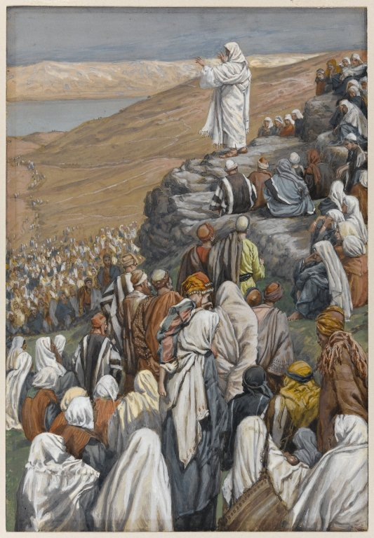

# Session 58 — The Capital Sins, the Passions, the Beatitudes

*James Tissot, The Sermon of the Beatitudes (c. 1886-1894). Public Domain via Wikimedia Commons.*

> *On the hillside again — the Beatitudes. Blessed are the poor in spirit, the meek, the pure, the persecuted. The whole moral life of Christianity is the inversion of what the world says wins. Live the inversion today, in something small.*

## Pius X asks

**259.** What are the passions?

*The passions are emotions or violent movements of the soul which, if not moderated by reason, drag us toward vice and often even toward crime.*

**260.** What is vice?

*Vice is the habit of doing evil, acquired by repeating evil acts.*

**261.** What are the principal vices?

*The principal vices are the seven capital vices, so called because they are the head and the origin of the other vices and sins.*

*261 a. The seven capital sins: 1. Pride; 2. Covetousness; 3. Lust; 4. Anger; 5. Gluttony; 6. Envy; 7. Sloth.*

**262.** What are the virtues opposed to the capital vices?

*The virtues opposed to the capital vices are: humility, liberality, chastity, patience, sobriety, fraternity, and diligence in the service of God.*

**263.** Did Jesus Christ recommend any moral virtue in particular?

*Jesus Christ recommended in particular some moral virtues, calling blessed, in the eight Evangelical Beatitudes, those who would practice them.*

**264.** Recite the Evangelical Beatitudes.

*Blessed are the poor in spirit, for theirs is the kingdom of heaven. Blessed are the meek, for they shall inherit the earth. Blessed are they who mourn, for they shall be comforted. Blessed are they who hunger and thirst for justice, for they shall be satisfied. Blessed are the merciful, for they shall obtain mercy. Blessed are the pure of heart, for they shall see God. Blessed are the peacemakers, for they shall be called the children of God. Blessed are they who suffer persecution for the sake of justice, for theirs is the kingdom of heaven (Matt. V. 3-10).*

**265.** Why did Jesus Christ, in the Evangelical Beatitudes, call blessed — contrary to the opinion of the world — the humble and the afflicted?

*Jesus Christ, in the Evangelical Beatitudes, called blessed — contrary to the opinion of the world — the humble and the afflicted, because they will have a special reward from God; and He taught us also to imitate them, without heeding the deceitful maxims of the world.*

**266.** Can those who follow the maxims of the world be truly happy?

*Those who follow the maxims of the world cannot be truly happy, because they do not seek God, their Lord and their true happiness; and so they have no peace of conscience, and walk toward perdition.*

> **Scripture.** *Blessed are the poor in spirit: for theirs is the kingdom of heaven.* — Matthew 5:3

> *Lord, today, let me be a little more poor in spirit, a little more meek, a little less impressive. Bless what You bless.*
