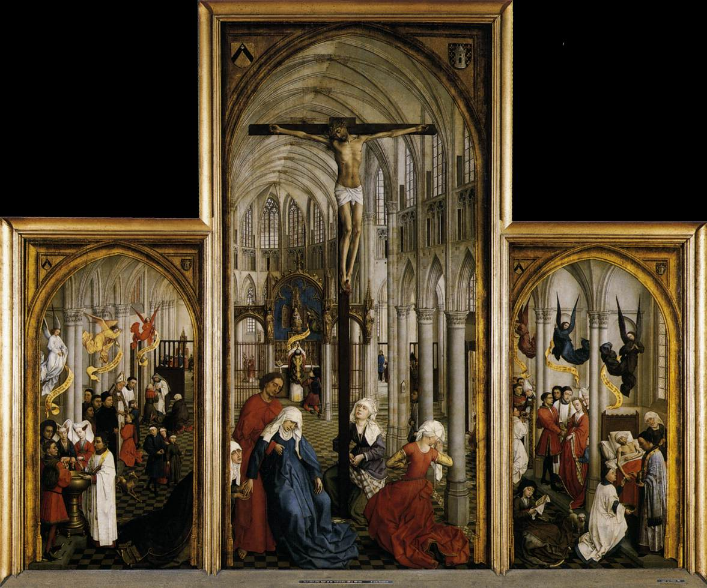

# Session 59 — What a Sacrament Is

*Rogier van der Weyden, Seven Sacraments Altarpiece (c. 1445-1450). Public Domain via Wikimedia Commons.*

> *Van der Weyden's altarpiece holds all seven sacraments under one roof — birth, growth, sin, healing, vocation, marriage, dying. The sacraments are not symbolic gestures. They are the doors through which God touches the body and changes the soul.*

## Pius X asks

**267.** What are the sacraments?

*The sacraments are efficacious signs of grace, instituted by Jesus Christ to sanctify us.*

**268.** Why are the sacraments efficacious signs of grace?

*The sacraments are signs of grace because, by the perceptible part they have, they signify or indicate the invisible grace they confer; and they are efficacious signs of grace because, signifying grace, they really confer it.*

**269.** What grace do the sacraments confer?

*The sacraments confer sanctifying grace and sacramental grace.*

**270.** What is sanctifying grace?

*Sanctifying grace is that supernatural gift, inherent in our soul and therefore habitual, which makes us holy — that is, just, friends and adopted children of God, brothers of Jesus Christ, and heirs of heaven.*

**271.** What is sacramental grace?

*Sacramental grace is the right to the special graces necessary to attain the proper end of each sacrament.*

**272.** Who gave to the sacraments the power to confer grace?

*Jesus Christ, the Man-God, gave to the sacraments the power to confer grace, which He Himself merited for us by His Passion and Death.*

**273.** How do the sacraments sanctify us?

*The sacraments sanctify us either by giving us the first sanctifying grace, which blots out sin, or by increasing in us the grace we already possess.*

**274.** Which sacraments give us the first grace?

*The sacraments that give us the first grace are Baptism and Penance, which are called sacraments of the dead, because they give the life of grace to souls dead through sin.*

**275.** Which sacraments increase grace in us?

*The sacraments that increase grace in us are Confirmation, the Eucharist, Extreme Unction, Holy Orders, and Matrimony, which are called sacraments of the living, because whoever receives them must already live spiritually by the grace of God.*

## The Roman Catechism teaches

## Importance Of Instruction On The Sacraments

The exposition of every part of Christian doctrine demands
knowledge and industry on the part of the pastor. But instruction
on the Sacraments, which, by the ordinance of God, are a
necessary means of salvation and a plenteous source of spiritual
advantage, demands in a special manner his talents and industry
By accurate and frequent instruction (on the Sacraments) the
faithful will be enabled to approach worthily and with salutary
effect these inestimable and most holy institutions; and the
priests will not depart from the rule laid down in the divine
prohibition: Give not that which is holy to dogs: neither cast ye
your pearls before swine.

## The Word "Sacrament"

Since, then, we are about to treat of the Sacraments in
general, it is proper to begin in the first place by explaining
the force and meaning of the word Sacrament, and showing its
various significations, in order the more easily to comprehend
the sense in which it is here used. The faithful, therefore, are
to be informed that the word Sacrament, in so far as it concerns
our present purpose, is differently understood by sacred and
profane writers.

By some it has been used to express the obligation which
arises from an oath, pledging to the performance of some service;
and hence the oath by which soldiers promise military service to
the State has been called a military sacrament. Among profane
writers this seems to have been the most ordinary meaning of the
word.

But by the Latin Fathers who have written on theological
subjects, the word sacrament is used to signify a sacred thing
which lies concealed. The Greeks, to express the same idea, made
use of the word mystery. This we understand to be the meaning of
the word, when, in the Epistle to the Ephesians, it is said: That
he might make known to us the mystery (sacramentum) of his will;
and to Timothy: great is the mystery (sacramentum) of godliness;
and in the Book of Wisdom: They knew not the secrets (sacramenta)
of God. In these and many other passages the word sacrament, it
will be perceived, signifies nothing more than a holy thing that
lies concealed and hidden.

The Latin Doctors, therefore, deemed the word a very
appropriate term to express certain sensible signs which at once
communicate grace, declare it, and, as it were, place it before
the eyes. St. Gregory, however, is of the opinion that such a
sign is called a Sacrament, because the divine power secretly
operates our salvation under the veil of sensible things.

Let it not, however, be supposed that the word sacrament is
of recent ecclesiastical usage. Whoever peruses the works of
Saints Jerome and Augustine will at once perceive that ancient
ecclesiastical writers made use of the word sacrament, and some
times also of the word symbol, or mystical sign or sacred sign,
to designate that of which we here speak.

So much will suffice in explanation of the word sacrament.
What we have said applies equally to the Sacraments of the Old
Law; but since they have been superseded by the Gospel Law and
grace, it is not necessary that pastors give instruction
concerning them.

## Definition of a Sacrament

Besides the meaning of the word, which has hitherto engaged
our attention, the nature and efficacy of the thing which the
word signifies must be diligently considered, and the faithful
must be taught what constitutes a Sacrament. No one can doubt
that the Sacraments are among the means of attaining
righteousness and salvation. But of the many definitions, each of
them sufficiently appropriate, which may serve to explain the
nature of a Sacrament, there is none more comprehensive, none
more perspicuous, than the definition given by St. Augustine and
adopted by all scholastic writers. A Sacrament, he says, is a
sign of a sacred thing; or, as it has been expressed in other
words of the same import: A Sacrament is a visible sign of an
invisible grace, instituted for our justification.

### "A Sacrament is a Sign"

The more fully to develop this definition, the pastor should
ex plain it in all its parts. He should first observe that
sensible objects are of two sorts: some have been invented
precisely to serve as signs; others have been established not for
the sake of signifying something else, but for their own sakes
alone. To the latter class almost every object in nature may be
said to belong; to the former, spoken and written languages,
military standards, images, trumpets, signals a and a
multiplicity of other things of the same sort. Thus with regard
to words; take away their power of expressing ideas, and you seem
to take away the only reason for their invention. Such things
are, therefore, properly called signs. For, according to St.
Augustine, a sign, besides what it presents to the senses, is a
medium through which we arrive at the knowledge of something
else. From a footstep, for instance, which we see traced on the
ground, we instantly infer that some one whose trace appears has
passed.

### Proof From Reason

A Sacrament, therefore, is clearly to be numbered among those
things which have been instituted as signs. It makes known to us
by a certain appearance and resemblance that which God, by His
invisible power, accomplishes in our souls. Let us illustrate
what we have said by an example. Baptism, for instance, which is
administered by external ablution, accompanied with certain
solemn words, signifies that by the power of the Holy Ghost all
stain and defilement of sin is inwardly washed away, and that the
soul is enriched and adorned with the admirable gift of heavenly
justification; while, at the same time, the bodily washing, as we
shall hereafter explain in its proper place, accomplishes in the
soul that which it signifies.

### Proof From Scripture

That a Sacrament is to be numbered among signs is dearly
inferred also from Scripture. Speaking of circumcision, a
Sacrament of the Old Law which was given to Abraham, the father
of all believers," the Apostle in his Epistle to the Romans,
says: And he received the sign of circumcision, a seal of the
justice of the faith. In another place he says: All we who are
baptised in Christ Jesus, are baptised in his death, words which
justify the inference that Baptism signifies, to use the words of
the same Apostle, that we are buried together with him by baptism
into death.

Nor is it unimportant that the faithful should know that the
Sacraments are signs. This knowledge will lead them more readily
to believe that what the Sacraments signify, contain and effect
is holy and august; and recognising their sanctity they will be
more disposed to venerate and adore the beneficence of God
displayed towards us.

### "Sign of a Sacred Thing" — Kind of Sign Meant Here

We now come to explain the words, sacred thing, which
constitute the second part of the definition. To render this
explanation satisfactory we must enter somewhat more minutely
into the accurate and acute remarks of St. Augustine on the
variety of signs.

### Natural Signs

Some signs are called natural. These, besides making
themselves known to us, also convey a knowledge of something
else, an effect, as we have already said, common to all signs.
Smoke, for instance, is a natural sign from which we immediately
infer the existence of fire. It is called a natural sign, because
it implies the existence of fire, not by arbitrary institution,
but from experience. If we see smoke, we are at once convinced of
the presence of fire, even though it is hidden.

### Signs Invented By Man

Other signs are not natural, but conventional, and are
invented by men to enable them to converse one with another, to
convey their thoughts to others, and in turn to learn the
opinions and receive the advice of other men. The variety and
multiplicity of such signs may be inferred from the fact that
some belong to the eyes, many to the ears, and the rest to the
other senses. Thus when we intimate any thing to another by such
a sensible sign as the raising of a flag, it is obvious that such
intimation is conveyed only through the medium of the eyes; and
it is equally obvious that the sound of the trumpet, of the lute
and of the lyre,instruments which are not only sources of
pleasure, but frequently signs of ideas — is addressed to the
ear. Through the latter sense especially are also conveyed words,
which are the best medium of communicating our inmost thoughts.

### Signs Instituted By God

Besides the signs instituted by the will and agreement of men,
of which we have been speaking so far, there are certain other
signs appointed by God. These latter, as all admit, are not all
of the same kind. Some were instituted by God to indicate
something or to bring back its recollection. Such were the
purifications of the Law, the unleavened bread, and many other
things which belonged to the ceremonies of the Mosaic worship.
But God has appointed other signs with power not only to signify,
but also to accomplish (what they signify).

Among these are manifestly to be numbered the Sacraments of
the New Law. They are signs instituted not by man but by God,
which we firmly believe have in themselves the power of producing
the sacred effects of which they are the signs.

### Kind of Sacred Thing Meant Here

We have seen that there are many kinds of signs. The sacred
thing referred to is also of more than one kind. As regards the
definition already given of a Sacrament, theologians prove that
by the words sacred thing is to be understood the grace of God,
which sanctifies the soul and adorns it with the habit of all the
divine virtues; and of this grace they rightly consider the words
sacred thing, an appropriate appellation, because by its salutary
influence the soul is consecrated and united to God.

In order, therefore, to explain more fully the nature of a
Sacrament, it should be taught that it is a sensible object which
possesses, by divine institution, the power not only of
signifying, but also of accomplishing holiness and righteousness.
Hence it follows, as everyone can easily see, that the images of
the Saints, crosses and the like, although signs of sacred
things, cannot be called Sacraments. That such is the nature of a
Sacrament is easily proved by the example of all the Sacraments,
if we apply to the others what has been already said of Baptism;
namely, that the solemn ablution of the body not only signifies,
but has power to effect a sacred thing which is wrought
interiorly by the operation of the Holy Ghost.

## Constituent Parts of the Sacraments

In the first place, then, it should be explained that the
sensible thing which enters into the definition of a Sacrament as
already given, although constituting but one sign, is twofold.
Every Sacrament consists of two things, matter, which is called
the element, and form, which is commonly called the word.

This is the doctrine of the Fathers of the Church; and the
testimony of St. Augustine on the subject is familiar to all. The
word, he says, is joined to the element and it becomes a
Sacrament. By the words sensible thing, therefore, the Fathers
understand not only the matter or element, such as water in
Baptism, chrism in confirmation, and oil in Extreme Unction, all
of which fall under the eye; but also the words which constitute
the form, and which are addressed to the ear.

Both are clearly pointed out by the Apostle, when he says:
Christ loved the Church, and delivered himself up for it, that he
might sanctify it, cleansing it by the laver of water in the word
of life. Here both the matter and form of the Sacrament are
expressly mentioned.

In order to make the meaning of the rite that is being
performed easier and clearer, words had to be added to the
matter. For of all signs words are evidently the most
significant, and without them, what the matter for the Sacraments
designates and declares would be utterly obscure. Water, for
instance, has the quality of cooling as well as cleansing, and
may be symbolic of either. In Baptism, therefore, unless the
words were added, it would not be certain, but only conjectural,
which signification was intended; but when the words are added,
we immediately understand that the Sacrament possesses and
signifies the power of cleansing.

In this the Sacraments of the New Law excel those of the Old
that, as far as we know, there was no definite form of
administering the latter, and hence they were very uncertain and
obscure. In our Sacraments, on the contrary, the form is so
definite that any, even a casual deviation from it renders the
Sacrament null. Hence the form is expressed in the clearest
terms, such as exclude the possibility of doubt.

These, then, are the parts which belong to the nature and
substance of the Sacraments, and of which every Sacrament is
necessarily composed.

> **Scripture.** *Then Jesus said to them: Amen, amen, I say unto you: Except you eat the flesh of the Son of man, and drink his blood, you shall not have life in you.* — John 6:53

> *Lord, You touch matter to save souls. Today, let me approach the matter You sanctified.*
