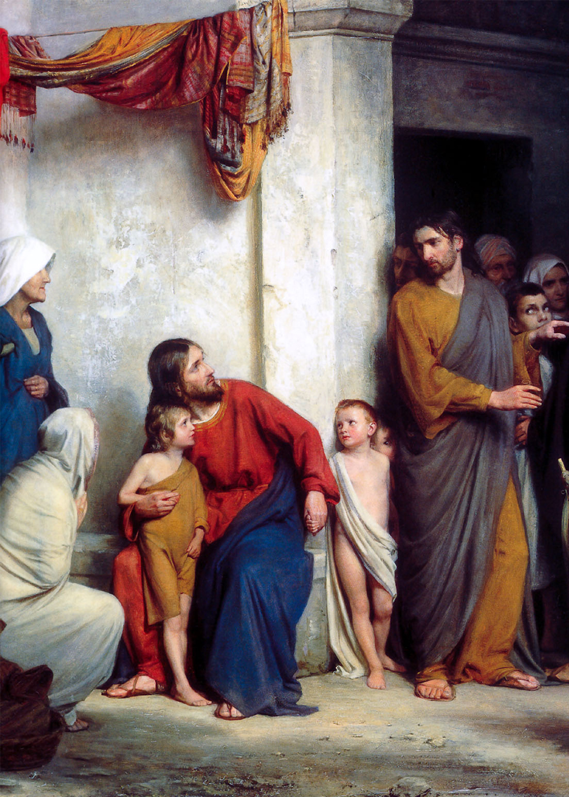

# Session 63 — Baptism — Minister, Names, and Children

*Carl Heinrich Bloch, Suffer the Children (c. 1865-1879). Public Domain via Wikimedia Commons.*

> *Christ kneels at a child's level, hand on a head. "Let the children come." Baptism's first job is the rescue of innocence; its second is the creation of citizens of heaven. There is no one too small for it, and no one too late.*

## Pius X asks

**297.** To what does one who receives Baptism bind himself?

*One who receives Baptism, becoming a Christian, binds himself to profess the Faith and to observe the Law of Jesus Christ; and therefore he renounces whatever is opposed to them.*

**298.** What does one renounce in receiving Baptism?

*In receiving Baptism, one renounces the devil, his works, and his pomps.*

**299.** What is meant by the works and pomps of the devil?

*By the works and pomps of the devil are meant sins, the vanities of the world, and its perverse maxims, contrary to the Gospel.*

**300.** How do children renounce the devil at Baptism?

*Children at Baptism renounce the devil through their godparents.*

**301.** Who are the godparents at Baptism?

*The godparents at Baptism are those who present the one to be baptized to the Church, answer in his name if he is a child, and undertake, as spiritual parents, the care of his Christian upbringing should the parents fail in it; and for this reason they must be good Christians.*

**302.** Are we bound to keep the promises and renunciations made by our godparents in our name at Baptism?

*We are bound to keep the promises and renunciations made by our godparents in our name at Baptism, because they impose on us only what God imposes on all, and what we ourselves would have to promise in order to be saved.*

**303.** When must parents, or those who take their place, send the child to be baptized?

*Parents, or those who take their place, must send the child to be baptized no later than eight or ten days; indeed, it is fitting to secure for him grace and eternal happiness at once, since he might very easily die.*

## The Roman Catechism teaches

## Administration of Baptism

What has been said on the matter and form, which are required
for the essence of the Sacrament, will be found sufficient for
the instruction of the faithful; but as in the administration of
the Sacrament the legitimate manner of ablution should also be
observed, pastors should teach the doctrine of thispoint also.

They should briefly explain that, according to the common
custom and practice of the Church, Baptism may be administered in
three ways,  by immersion, infusion or aspersion.

Whichever of these rites be observed, we must believe that
Baptism is rightly administered. For in Baptism water is used to
signify the spiritual ablution which it accomplishes, and on this
account Baptism is called by the Apostle a laver. Now this
ablution is not more really accomplished by immersion, which was
for a considerable time the practice in the early ages of the
Church, than by infusion, which we now see in general use, or by
aspersion, which there is reason to believe was the manner in
which Peter baptised, when on one day he converted and gave
Baptism to about three thousand souls.

It is a matter of indifference whether the ablution be
performed once or thrice. For it is evident from the Epistle of
St. Gregory the Great to Leander that Baptism was formerly and
may still be validly administered in the Church in either way.
The faithful, however, should follow the practice of the
particular Church to which they belong.

Pastors should be particularly careful to observe that the
baptismal ablution is not to be applied indifferently to any part
of the body, but principally to the head, which is the seat of
all the internal and external senses; and also that he who
baptises is to pronounce the sacramental words which constitute
the form, not before or after, but when performing the ablution.

## The Ministers of Baptism

In the next place, it appears not only expedient, but
necessary to say who are ministers of this Sacrament; both in
order that those to whom this office is specially confided may
study to perform its functions religiously and holily; and that
no one, outstepping, as it were, his proper limits, may
unseasonably take possession of, or arrogantly assume, what
belongs to another; for, as the Apostle teaches, order is to be
observed in all things.

### Bishops And Priests The Ordinary Ministers

The faithful, therefore, are to be informed that of those (who
administer Baptism) there are three gradations. Bishops and
priests hold the first place. To them belongs the administration
of this Sacrament, not by any extraordinary concession of power,
but by right of office; for to them, in the persons of the
Apostles, was addressed the command of our Lord: Go, baptise.
Bishops, it is true, in order not to neglect the more weighty
charge of instructing the faithful, have generally left its
administration to priests. But the authority of the Fathers and
the usage of the Church prove that priests exercise this function
by their own right, so much so that they may baptise even in the
presence of the Bishop. Ordained to consecrate the Holy
Eucharist, the Sacrament of peace and unity, it was fitting that
they be invested with power to administer all those things which
are required to enable others to participate in that peace and
unity. If, therefore, the Fathers have at any time said that
without the leave of the Bishop the priest has not the right to
baptise, they are to be understood to speak of that Baptism only
which was administered on certain days of the year with solemn
ceremonies.

### Deacons Extraordinary Ministers Of Baptism

Next among the ministers are deacons, for whom, as numerous
decrees of the holy Fathers attest it is not lawful without the
permission of the Bishop or priest to administer this Sacrament.

### Ministers In Case Of Necessity

Those who may administer Baptism in case of necessity, but
without its solemn ceremonies, hold the last place; and in this
class are included all, even the laity, men and women, to
whatever sect they may belong. This office extends in case of
necessity, even to Jews, infidels and heretics, provided,
however, they intend to do what the Catholic Church does in that
act of her ministry. These things were established by many
decrees of the ancient Fathers and Councils; and the holy Council
of Trent denounces anathema against those who dare to say, that
Baptism, even when administered by heretics, in the name of the
Father, and of the Son, and of the Holy Ghost, with the intention
of doing what the Church does, is not true Baptism.

And here indeed let us admire the supreme goodness and wisdom
of our Lord. Seeing the necessity of this Sacrament for all, He
not only instituted water, than which nothing can be more common,
as its matter, but also placed its administration within the
power of all. In its administration, however, as we have already
observed, all are not allowed to use the solemn ceremonies; not
that rites and ceremonies are of higher dignity, but because they
are less necessary than the Sacrament.

Let not the faithful, however, imagine that this office is
given promiscuously to all, so as to do away with the propriety
of observing a certain precedence among those who are its
ministers. When a man is present a woman should not baptise; an
ecclesiastic takes precedence over a layman, and a priest over a
simple ecclesiastic. Midwives, however, when accustomed to its
administration, are not to be found fault with if sometimes, when
a man is present who is unacquainted with the manner of its
administration, they perform what may otherwise appear to belong
more properly to men.

## The Sponsors at Baptism

Besides the ministers who, as just explained, confer Baptism,
another class of persons, according to the most ancient practice
of the Church, is admitted to assist at the baptismal font. In
former times these were commonly called by sacred writers
receivers, sponsors or sureties, and are now called godfathers
and godmothers. As this is an office pertaining almost to all the
laity, pastors should explain it with care, so that the faithful
may understand what is chiefly necessary for its proper
performance.

### Why Sponsors Are Required At Baptism

In the first instance it should be explained why at Baptism,
besides those who administer the Sacrament, godparents and
sponsors are also required. The propriety of the practice will at
once appear to all if they recollect that Baptism is a spiritual
regeneration by which we are born children of God; for of it St.
Peter says: As newborn infants, desire the rational milk without
guile. As, therefore, every one, after his birth, requires a
nurse and instructor by whose assistance and attention he is
brought up and formed to learning and useful knowledge, so those,
who, by the waters of Baptism, begin to live a spiritual life
should be entrusted to the fidelity and prudence of some one from
whom they may imbibe the precepts of the Christian religion and
may be brought up in all holiness, and thus grow gradually in
Christ, until, with the Lord's help, they at length arrive at
perfect manhood.

This necessity must appear still more imperative, if we
recollect that pastors, who are charged with the public care of
parishes have not sufficient time to undertake the private
instruction of children in the rudiments of faith.

### Antiquity Of This Law

Concerning this very ancient practice we have this noteworthy
testimony of St. Denis: It occurred to our divine leaders (so he
called the Apostles), and they in their wisdom ordained that
infants should be introduced (into the Church) in this holy
manner that their natural parents should deliver them to the care
of some one well skilled in divine things, as to a master under
whom, as a spiritual father and guardian of his salvation in
holiness, the child should lead the remainder of his life. The
same doctrine is confirmed by the authority of Hyginus.

### Affinity Contracted By Sponsors

The Church, therefore, in her wisdom has ordained that not
only the person who baptises contracts a spiritual affinity with
the person baptised, but also the sponsor with the godchild and
its natural parents, so that between all these marriage cannot be
lawfully contracted, and if contracted, it is null and void.

### Duties Of Sponsors

The faithful are also to be taught the duty of sponsors; for
such is the negligence with which this office is treated in the
Church that only the bare name of the function remains, while
none seem to have the least idea of its sanctity. Let all
sponsors, then, at all times recollect that they are strictly
bound by this law to exercise a constant vigilance over their
spiritual children, and carefully to instruct them in the maxims
of a Christian life; so that these may show themselves throughout
life to be what their sponsors promised in the solemn ceremony.

On this subject let us hear the words of St. Denis. Speaking
in the person of the sponsor he says: I promise, by my constant
exhortations to induce this child, when he comes to a knowledge
of religion, to renounce every thing opposed (to his Christian
calling) and to profess and perform the sacred promises which he
now makes.

St. Augustine also says: I most especially admonish you, men
and women, who have acquired godchildren through Baptism, to
consider that you stood as sureties before God, for those whom
you received at the sacred font. Indeed it preeminently becomes
every man, who undertakes any office, to be indefatigable in the
discharge of its duties; and he who promised to be the teacher
and guardian of another should never allow to be deserted him
whom he once received under his care and protection as long as he
knows the latter to stand in need of either.

Speaking of this same duty of sponsors, St. Augustine sums up
in a few words the lessons of instruction which they are bound to
impart to their spiritual children. They ought, he says, to
admonish them to observe chastity, love justice, cling to
charity; and above all they should teach them the Creed, the
Lord's Prayer, the Ten Commandments, and the rudiments of the
Christian religion.

### Who May Not Be Sponsors

It is easy, therefore, to decide who are inadmissible to this
holy guardianship, that is, those who are unwilling to discharge
its duties with fidelity, or who cannot do so with care and
accuracy.

Wherefore, besides the natural parents, who, to mark the
great difference that exists between this spiritual and the
carnal bringing up of youth, are not permitted to undertake this
charge, heretics, Jews and infidels are on no account to be
admitted to this office, since their thoughts and efforts are
continually employed in darkening by falsehood the true faith and
in subverting all Christian piety.

### Number Of Sponsors

The number of sponsors is limited by the Council of Trent to
one godfather or one godmother, or at most, to a godfather and a
godmother; because a number of teachers may confuse the order of
discipline and instruction, and also because it was necessary to
prevent the multiplication of affinities which would impede a
wider diffusion of society by means of lawful marriage.

## Dispositions for Baptism

### Intention

The faithful are also to be instructed in the necessary
dispositions for Baptism. In the first place they must desire and
intend to receive it; for as in Baptism we all die to sin and
resolve to live a new life, it is fit that it be administered to
those only who receive it of their own free will and accord; it
is to be forced upon none. Hence we learn from holy tradition
that it has been the invariable practice to administer Baptism to
no individual without previously asking him if he be willing to
receive it. This disposition even infants are presumed to have,
since the will of the Church, which promises for them, cannot be
mistaken.

Insane, delirious persons who were once of sound mind and
afterwards became deranged, having in their present state no wish
to be baptised, are not to be admitted to Baptism, unless in
danger of death. In such cases, if previous to insanity they give
intimation of a wish to be baptised, the Sacrament is to be
administered; without such indication previously given it is not
to be administered. The same rule is to be followed with regard
to persons who are unconscious.

But if they (the insane) never enjoyed the use of reason, the
authority and practice of the Church decide that they are to be
baptised in the faith of the Church, just as children are
baptised before they come to the use of reason.

### Faith

Besides a wish to be baptised, in order to obtain the grace of
the Sacrament, faith is also necessary. Our Lord and Saviour has
said: He that believes and is baptised shall be saved.

### Repentance

Another necessary condition is repentance for past sins, and a
fixed determination to avoid all sin in the future. Should anyone
desire Baptism and be unwilling to correct the habit of sinning,
he should be altogether rejected. For nothing is so opposed to
the grace and power of Baptism as the intention and purpose of
those who resolve never to abandon sin.

Seeing that Baptism should be sought with a view to put on
Christ and to be united to Him, it is manifest that he who
purposes to continue in sin should justly be repelled from the
sacred font, particularly since none of those things which belong
to Christ and His Church are to be received in vain, and since we
well understand that, as far as regards sanctifying and saving
grace, Baptism is received in vain by him who purposes to live
according to the flesh, and not according to the spirit. As far,
however, as the Sacrament is concerned, if the person who is
rightly baptised intends to receive what the Church administers,
he without doubt validly receives the Sacrament.

Hence, to the vast multitude who, in compunction of heart, as
the Scripture says, asked him and the other Apostles what they
should do, the Prince of the Apostles answered: Do penance and be
baptised every one of you; and in another place he said: Be
penitent, therefore, and be converted, that your sins may be
blotted out. Writing to the Romans, St. Paul also clearly shows
that he who is baptised should entirely die to sin; and he
therefore admonishes us not to yield our members as instruments
of iniquity unto sin, but present ourselves to God, as those who
are alive from the dead.

### Advantages To Be Derived From These Reflections

Frequent reflection upon these truths cannot fail, in the
first place, to fill the minds of the faithful with admiration
for the infinite goodness of God, who, uninfluenced by any other
consideration than that of His mercy, gratuitously bestowed upon
us, undeserving as we are, a blessing so extraordinary and divine
as that of Baptism.

If in the next place they consider how spotless should be the
lives of those who have been made the objects of such
munificence, they cannot fail to be convinced of the special
obligation imposed on every Christian to spend each day of his
life in such sanctity and fervour, as if on that very day he had
received the Sacrament and grace of Baptism.

## Ceremonies of Baptism

### Their Importance

It now remains to explain, clearly and concisely, what is to
be taught concerning the prayers, rites, and ceremonies of this
Sacrament. To rites and ceremonies may, in some measure, be
applied what the Apostle says of the gift of tongues, that it is
unprofitable to speak, unless the faithful understand. They
present an image, and convey the signification of the things that
are done in the Sacrament; but if the people do not understand
the force and meaning of these signs, there is but little
advantage derived from ceremonies. Pastors should take care,
therefore, to make them understood and to impress the minds of
the faithful with a conviction that, although ceremonies are not
of absolute necessity, they are of very great importance and
deserve great veneration.

This the authority of those by whom they were instituted, who
were, no doubt, the Apostles, and also the object of their
institution, sufficiently prove. It is manifest that ceremonies
contribute to the more religious and holy administration of the
Sacraments, serve to place, as it were, before the eyes the
exalted and inestimable gifts which they contain, and impress on
the minds of the faithful a deeper sense of the boundless
beneficence of God.

### Three Classes Of Ceremonies In Baptism

In order that the pastor's instructions may follow a certain
plan and that the people may find it: easier to remember his
words, all the ceremonies and prayers which the Church uses in
the administration of Baptism are to be reduced to three heads.
The first comprehends such as are observed before coming to the
baptismal font; the second, such as are used at the font; the
third, those that usually follow the administration of the
Sacrament.

### Ceremonies That Are Observed Before Coming To The Font: Consecration Of Baptismal Water

In the first place, then, the water to be used in Baptism
should be prepared. The baptismal font is consecrated with the
oil of mystic unction; not, however, at all times, but, according
to ancient usage, only on certain feasts, which are justly deemed
the greatest and the most holy solemnities in the year. The water
of Baptism was consecrated on the vigils of those feasts; and on
those days alone, except in cases of necessity, it was also the
practice of the ancient Church to administer Baptism. But
although the Church, on account of the dangers to which life is
continually exposed, has deemed it expedient to change her
discipline in this respect, she still observes with the greatest
solemnity the festivals of Easter and Pentecost on which the
baptismal water is to be consecrated.

#### The Person To Be Baptised Stands At The Church Door

After the consecration of the water the other ceremonies that
precede Baptism are next to be explained. The persons to be
baptised are brought or conducted a to the door of the church and
are strictly forbidden to enter, as unworthy to be admitted into
the house of God, until they have cast off the yoke of the most
degrading servitude and devoted themselves unreservedly to Christ
the Lord and His most just authority.

#### Catechetical Instruction

The priest then asks what they demand of the Church; and
having received the answer, he first instructs them in the
doctrines of the Christian faith, of which a profession is to be
made in Baptism.

This the priest does in a brief catechetical instruction, a
practice which originated, no doubt, in the precept of our Lord
addressed to His Apostles: Go ye into the whole world, and teach
all nations, baptising them in the name of the Father, and of the
Son, and of the Holy Ghost, teaching them to observe all things
whatsoever I have commanded you. From this command we may learn
that Baptism is not to be administered until, at least, the
principal truths of our religion are explained.

But as the catechetical form consists of many interrogations,
if the person to be instructed be an adult, he himself answers;
if an infant, the sponsor answers for him according to the
prescribed form and makes the solemn promise.

#### The Exorcism

The exorcism comes next in order. It consists of words of
sacred and religious import and of prayers, and is used to expel
the devil, to weaken and crush his power.

#### The Salt

To the exorcism are added other ceremonies, each of which,
being mystical, has its own clear signification. When, for
instance, salt is put into the mouth of the person to be
baptised, this evidently means that, by the doctrines of faith
and by the gift of grace, he shall be delivered from the
corruption of sin, shall experience a relish for good works, and
shall be delighted with the food of divine wisdom.

#### The Sign Of The Cross

Next his forehead, eyes, breast, shoulders and ears are
signed with the sign of the cross, to declare, that by the
mystery of Baptism, the senses of the person baptised are opened
and strengthened, to enable him to receive God, and to understand
and observe His Commandments.

#### The Saliva

His nostrils and ears are next touched with spittle, and he
is then immediately admitted to the baptismal font. By this
ceremony we understand that, as sight was given to the blind man
mentioned in the Gospel, whom the Lord after He had spread clay
on his eyes commanded to wash them in the waters of Siloe, so
through the efficacy of holy Baptism a light is let in on the
mind, which enables it to discern heavenly truth.

### The Ceremonies Observed After Coming To The Font

After the performance of these ceremonies the persons to be
baptised approach the baptismal font, at which are performed
other rites and ceremonies which present a summary of the
Christian religion.

#### The Renunciation Of Satan

Three distinct times the person to be baptised is asked by
the priest: Dost thou renounce Satan, and all his works, and all
his pomps? To each of which he, or the sponsor in his name,
replies, I renounce. Whoever, then, purposes to enlist, under the
standard of Christ, must first of all, enter into a sacred and
solemn engagement to renounce the devil and the world, and always
to hold them in utter detestation as his worst enemies.

#### The Profession Of Faith

Next, standing at the baptismal font, he is interrogated by
the priest in these words: Dost thou believe in God, the Father
Almighty? To which he answers: I believe. Being similarly
questioned on the remaining Articles of the Creed, he solemnly
professes his faith. These two promises contain, it is clear, the
sum and substance of the law of Christ.

#### The Wish To Be Baptised

When the Sacrament is now about to be administered, the
priest asks the candidate if he wishes to be baptised. After an
answer in the affirmative has been given by him, or, if he is an
infant, by the sponsor, the priest immediately performs the
salutary ablution, in the name of the Father, and of the Son, and
of the Holy Ghost.

As man, by yielding the assent of his will to the wicked
suggestions of Satan, fell under a just sentence of condemnation;
so God will have none enrolled in the number of His soldiers but
those whose service is voluntary, that by a willing obedience to
His commands they may obtain eternal salvation.

### The Ceremonies That Follow Baptism: Chrism

After the person has been baptised, the priest anoints the
crown of his head with chrism, thus giving him to understand,
that from that day he is united as a member to Christ, His Head,
and ingrafted on His body; and that he is, therefore, called a
Christian from Christ, as Christ is so called from chrism. What
the chrism signifies, the prayers then offered by the priest, as
St. Ambrose observes, sufficiently explain.

#### The White Garment

On the person baptised the priest then puts a white garment
saying: Receive this white garment, which mayest thou carry
unstained before the judgmentseat of our Lord Jesus Christ;
that thou mayest have eternal life. Instead of a white garment,
infants, because not formally dressed, receive a white cloth,
accompanied by the same words.

According to the teaching of the Fathers this symbol
signifies the glory of the resurrection to which we are born by
Baptism, the brightness and beauty with which the soul, when
purified from the stains of sin, is invested in Baptism, and the
innocence and integrity which the person who has received Baptism
should preserve throughout life.

#### The Lighted Candle

A lighted taper is then put into the hand of the baptised to
signify that faith, inflamed by charity, which is received in
Baptism, is to be fed and augmented by the exercise of good
works.

#### The Name Given In Baptism

Finally, a name is given the person baptised. It should be
taken from some person whose eminent sanctity has given him a
place in the catalogue of the Saints. The similarity of name will
stimulate each one to imitate the virtues and holiness of the
Saint, and, moreover, to hope and pray that he who is the model
for his imitation will also be his advocate and watch over the
safety of his body and soul.

Wherefore those are to be reproved who search for the names
of heathens, especially of those who were the greatest monsters
of iniquity, to bestow upon their children. By such conduct they
practically prove how little they regard Christian piety when
they so fondly cherish the memory of impious men, as to wish to
have their profane names continually echo in the ears of the
faithful.

## Recapitulation

This exposition of the Sacrament of Baptism, if given by
pastors, will be found to embrace almost everything which should
be known regarding this Sacrament. We have explained the meaning
of the word Baptism, the nature and substance of the Sacrament,
and also the parts of which it is composed. We have said by whom
it was instituted; who are the ministers necessary to its
administration; who should be, as it were, the tutors whose
instructions should sustain the weakness of the person baptised;
to whom Baptism should be administered; and how they should be
disposed; what are the virtue and efficacy of the Sacrament;
finally, we have developed, at sufficient length for our purpose,
the rites and ceremonies that should accompany its
administration.

Pastors should recollect that the chief purpose of all these
instructions is to induce the faithful to direct their constant
attention and solicitude to the fulfilment of the promises so
sacredly made at Baptism, and to lead lives not unworthy of the
sanctity that should accompany the name and profession of
Christian.

> **Scripture.** *Suffer the little children, and forbid them not to come to me: for the kingdom of heaven is for such.* — Matthew 19:14

> *Lord, for those still unbaptized — children, parents, friends — make a way. Send someone with the water.*
