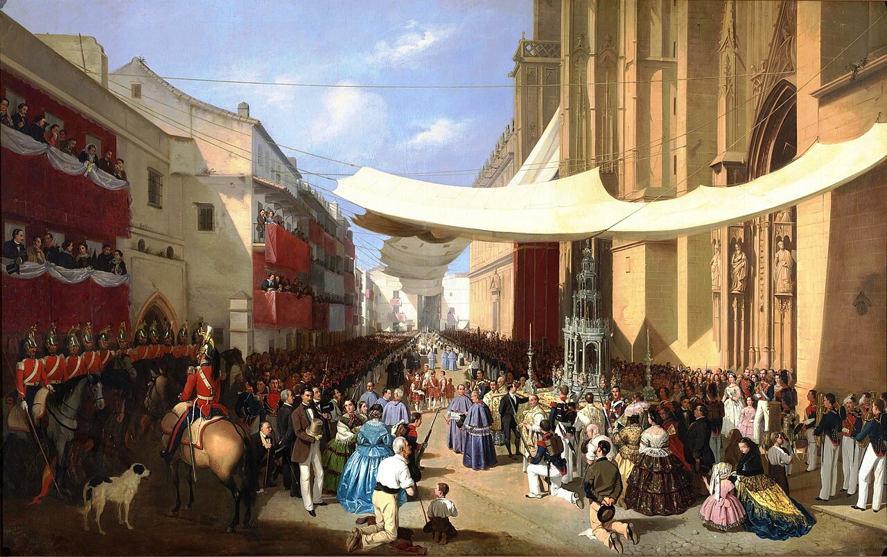

# Session 69 — Frequent and Daily Communion

*Manuel Cabral Aguado-Bejarano, The Corpus Christi Procession in Seville (19th century). Public Domain via Wikimedia Commons.*

> *A small saint kneels in a sunlit chapel, the host on her tongue. Daily Communion is not for the perfect — it is for the dependent. The medicine of immortality, taken when most needed: every day.*

## Pius X asks

**334.** Why is the Most Holy Eucharist preserved in churches?

*The Most Holy Eucharist is preserved in churches so that the faithful may adore it, may receive it in Communion, and may sense in it the perpetual assistance and presence of Jesus Christ in the Church.*

## § 3. Holy Communion: Dispositions, Obligation, Effects

**335.** How many things are necessary to make a good Communion?

*To make a good Communion three things are necessary: 1. to be in the grace of God; 2. to know and to think about whom one is going to receive; 3. to be fasting from midnight.*

**336.** What does "to be in the grace of God" mean?

*To be in the grace of God means to have one's conscience clean of every mortal sin.*

**337.** Does one who receives Communion knowing that he is in mortal sin receive Jesus Christ?

*One who receives Communion knowing that he is in mortal sin does receive Jesus Christ, but not His grace; rather, by committing a horrible sacrilege, he renders himself deserving of damnation.*

**338.** What does "to know and to think about whom one is going to receive" mean?

*To know and to think about whom one is going to receive means to approach Our Lord Jesus Christ in the Eucharist with living faith, with ardent desire, and with deep humility and modesty.*

**339.** What fast is required before Communion?

*Before Communion the natural — that is, total — fast is required, which is broken by anything taken in the manner of food or drink.*

## The Roman Catechism teaches

## The Obligation of Communion

### How Often Must Communion Be Received?

Lest any be kept away from Communion by the fear that the
requisite preparation is too hard and laborious, the faithful are
frequently to be reminded that they are all bound to receive the
Holy Eucharist. Furthermore, the Church has decreed that whoever
neglects to approach Holy Communion once a year, at Easter, is
liable to sentence of excommunication.

### The Church Desires The Faithful To Communicate Daily

However, let not the faithful imagine that it is enough to
receive the body of the Lord once a year only, in obedience to
the decree of the Church. They should approach oftener; but
whether monthly, weekly, or daily, cannot be decided by any fixed
universal rule. St. Augustine, however, lays down a most certain
norm: Live in such a manner as to be able to receive every day.

It will therefore be the duty of the pastor frequently to
admonish the faithful that, as they deem it necessary to afford
daily nutriment to the body, they should also feel solicitous to
feed and nourish the soul every day with this heavenly food. It
is clear that the soul stands not less in need of spiritual, than
the body of corporal food. Here it will be found most useful to
recall the inestimable and divine advantages which, as we have
already shown, flow from sacramental Communion. It will be well
also to refer to the manna, which was a figure (of this
Sacrament), and which refreshed the bodily powers every day. The
Fathers who earnestly recommended the frequent reception of this
Sacrament may also be cited. The words of St. Augustine, Thou
sinnest daily, receive daily, express not his opinion only, but
that of all the Fathers who have written on the subject, as
anyone may easily discover who will carefully read them.

That there was a time when the faithful approached Holy
Communion every day we learn from the Acts of the Apostles. All
who then professed the faith of Christ burned with such true and
sincere charity that, devoting themselves to prayer and other
works of piety, they were found prepared to communicate daily.
This devout practice, which seems to have been interrupted for a
time, was again partially revived by the holy Pope and martyr
Anacletus, who commanded that all the ministers who assisted at
the Sacrifice of the Mass should communicatean ordinance, as
the Pontiff declares, of Apostolic institution. It was also for a
long time the practice of the Church that, as soon as the
Sacrifice was complete, and when the priest himself had
communicated, he turned to the congregation and invited the
faithful to the Holy Table in these words: Come, brethren, and
receive Communion; and thereupon those who were prepared,
advanced to receive the holy mysteries with the most fervent
devotion.

The Church Commands; The Faithful To Communicate Once
A Year

But subsequently, when charity and devotion had grown so cold
that the faithful very seldom approached Communion, it was
decreed by Pope Fabian, that all should communicate thrice every
year, at Christmas, at Easter and at Pentecost. This decree was
afterwards confirmed by many Councils, particularly by the first
of Agde.

Such at length was the decay of piety that not only was this
holy and salutary law unobserved, but Communion was deferred for
years. The Council of Lateran, therefore, decreed that all the
faithful should receive the sacred body of the Lord, at least
once a year, at Easter, and that neglect of this duty should be
chastised by exclusion from the society of the faithful.

### Who Are Obliged By The Law Of Communion

But although this law, sanctioned by the authority of God and
of His Church, concerns all the faithful, it should be taught
that it does not extend to those who on account of their tender
age have not attained the use of reason. For these are not able
to distinguish the Holy Eucharist from common and ordinary bread
and cannot bring with them to this Sacrament piety and devotion.
Furthermore (to extend the precept to them) would appear
inconsistent with the ordinance of our Lord, for He said: Take
and eat words which cannot apply to infants, who are evidently
incapable of taking and eating.

In some places, it is true, an ancient practice prevailed of
giving the Holy Eucharist even to infants; but, for the reasons
already assigned, and for other reasons in keeping with Christian
piety, this practice has been long discontinued by authority of
the Church.

With regard to the age at which children should be given the
holy mysteries, this the parents and confessor can best
determine. To them it belongs to inquire and to ascertain from
the children themselves whether they have some knowledge of this
admirable Sacrament and whether they desire to receive it.

Communion must not be given to persons who are insane and
incapable of devotion. However, according to the decree of the
Council of Carthage, it may be administered to them at the close
of life, provided they have shown, before losing their minds, a
pious and religious disposition, and no danger, arising from the
state of the stomach or other inconvenience or disrespect, is
likely.

## A pastoral reading

The Pope who wrote the catechism above did the most for daily Communion of any pope in the modern era. In 1905, **St. Pius X** issued *Sacra Tridentina Synodus*, encouraging the faithful — for the first time in centuries — to receive Communion daily. Five years later, in *Quam Singulari* (1910), he lowered the age of First Communion to the age of reason (about seven). Both decrees were quietly revolutionary. Until then the faithful, schooled by Jansenism's long shadow, often went months between Communions, believing themselves unworthy.

Pius X's pastoral instinct was Augustinian. *You sin daily; receive daily*, said St. Augustine — and the Trent passage above quotes him directly. What the Pope did not need to say (though he meant it) is that the *fear of unworthiness*, in any generation, is itself the obstacle. Nobody is worthy. The Eucharist is given precisely to the unworthy. The catechism above tells you the requirements honestly: free from mortal sin, awareness of Whom you receive, the Eucharistic fast. These are real but they are not *high*. They are the lowest reasonable threshold for receiving God Himself.

If you are in mortal sin, go to Confession first — that is what the sacrament of mercy is for. If you are merely tired, distracted, lukewarm, go to Communion anyway. The Church puts these words on your lips at every Mass:

> *Lord, I am not worthy that Thou shouldst enter under my roof, but only say the word and my soul shall be healed.*

It is not rhetorical apologizing; it is doctrine. *Only say the word.* The word He says, when you receive Him, is **come**.

Daily Communion is not for the holy. It is for the dependent. Live such a life that you are able to come every day — and then, if you can, come.

> **Scripture.** *He that eateth my flesh, and drinketh my blood, hath everlasting life: and I will raise him up in the last day.* — John 6:54

> *Lord, when I can come, let me come. Free me from the embarrassment of needing You that often.*
