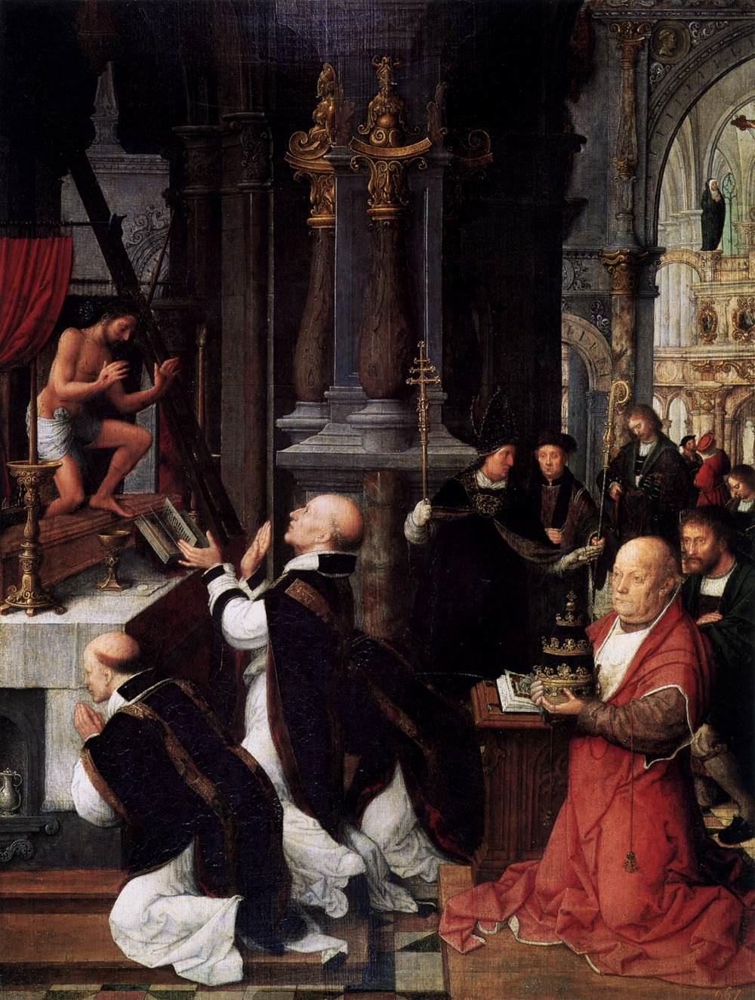

# Session 70 — Eucharistic Adoration

*Adriaen Ysenbrandt (Isenbrandt), The Mass of Saint Gregory (c. 1510-1550). Public Domain via Wikimedia Commons.*

> *A monstrance held high, gold rays bursting from a small white center. The world keeps moving, but in the chapel, time bends — kneels. Adore. There is nowhere better for a soul to spend an hour.*

## Pius X asks

**340.** Is Communion ever permitted to one who is not fasting?

*Communion is permitted to one who is not fasting in danger of death, and during long illnesses, under the conditions determined by the Church.*

**341.** Is there an obligation to receive Communion?

*There is an obligation to receive Communion every year at Easter, and in danger of death, as Viaticum, to sustain the soul on its journey to eternity.*

**342.** At what age does the obligation of the Easter Communion begin?

*The obligation of the Easter Communion begins at the age at which one is capable of making it with sufficient dispositions, that is, ordinarily about the seventh year.*

**343.** Is it good and useful to receive Communion often?

*It is most good and most useful to receive Communion often, even every day, provided one always does so with the proper dispositions.*

**344.** After Communion, how long does Jesus Christ remain in us?

*After Communion, Jesus Christ remains in us as long as the eucharistic species last.*

**345.** What effects does the Eucharist produce in one who receives it worthily?

*The Eucharist, in one who receives it worthily, preserves and increases the grace that is the life of the soul, as food does for the life of the body; remits venial sins and preserves from mortal ones; gives spiritual consolation and comfort, increasing charity and the hope of eternal life, of which it is the pledge.*

## The Roman Catechism teaches

## The Effects of the Eucharist

But with regard to the admirable virtue and fruits of this
Sacrament, there is no class of the faithful to whom a knowledge
of them is not most necessary. For all that has been said at such
length on this Sacrament has principally for its object, to make
the faithful sensible of the advantages of the Eucharist. As,
however, no language can convey an adequate idea of its utility
and fruits, pastors must be content to treat of one or two
points, in order to show what an abundance and profusion of all
goods are contained in those sacred mysteries.

The Eucharist Contains Christ And Is The Food Of The
Soul

This they will in some degree accomplish, if, having explained
the efficacy and nature of all the Sacraments, they compare the
Eucharist to a fountain, the other Sacraments to rivulets. For
the Holy Eucharist is truly and necessarily to be called the
fountain of all graces, containing, as it does, after an
admirable manner, the fountain itself of celestial gifts and
graces, and the author of all the Sacrament, Christ our Lord,
from whom, as from its source, is derived whatever of goodness
and perfection the other Sacraments possess. From this
(comparison), therefore, we may easily infer what most ample
gifts of divine grace are bestowed on us by this Sacrament.

It will also be useful to consider attentively the nature of
bread and wine, which are the symbols of this Sacrament. For what
bread and wine are to the body, the Eucharist is to the health
and delight of the soul, but in a higher and better way. This
Sacrament is not, like bread and wine, changed into our
substance; but we are, in some wise, changed into its nature, so
that we may well apply here the words of St. Augustine: I am the
food of the frown. Grow and thou shalt eat Me; nor shalt thou
change Me into thee, as thy bodily food, but thou shalt be
changed into Me.

### The Eucharist Gives Grace

If, then, grace and truth came by Jesus Christ, they must
surely be poured into the soul which receives with purity and
holiness Him who said of Himself: He that eateth my flesh and
drinketh my blood abideth in me and I in him. Those who receive
this Sacrament piously and fervently must, beyond all doubt, so
receive the Son of God into their souls as to be ingrafted as
living members on His body. For it is written: He that eateth me,
the same also shall live by me; also: The bread which I will give
is my flesh for the life of the world. Explaining this passage,
St. Cyril says: The Word of God, uniting Himself to His own
flesh, imparted to it a vivifying power: it became Him,
therefore, to unite Himself to our bodies in a wonderful manner,
through His sacred flesh and precious blood, which we receive in
the bread and wine, consecrated by His vivifying benediction.

### The Grace Of The Eucharist Sustains

When it is said that the Eucharist imparts grace, pastors must
admonish that this does not mean that the state of grace is not
required for a profitable reception of this Sacrament. For as
natural food can be of no use to the dead, so in like manner the
sacred mysteries can evidently be of no avail to a soul which
lives not by the spirit. Hence this Sacrament has been instituted
under the forms of bread and wine to signify that the object of
its institution is not to recall the soul to life, but to
preserve its life.

The reason, then, for saying that this Sacrament imparts
grace, is that even the first grace, with which all should be
clothed before they presume to approach the Holy Eucharist, lest
they eat and drink judgment to themselves,' is given to none
unless they receive in wish and desire this very Sacrament. For
the Eucharist is the end of all the Sacraments, and the symbol of
unity and brotherhood in the Church, outside which none can
attain grace.

### The Grace Of The Eucharist Invigorates And Delights

Again, just as the body is not only supported but also
increased by natural food, from which the taste every day derives
new relish and pleasure; so also is the soul not only sustained
but invigorated by feasting on the food of the Eucharist, which
gives to the spirit an increasing zest for heavenly things. Most
truly and fitly therefore do we say that grace is imparted by
this Sacrament, for it may be justly compared to the manna having
in it the sweetness of every taste.

### The Eucharist Remits Venial Sins

It cannot be doubted that by the Eucharist are remitted and
pardoned lighter sins, commonly called venial. Whatever the soul
has lost through the fire of passion, by falling into some slight
offence, all this the Eucharist, cancelling those lesser faults,
repairs, in the same way — not to depart from the illustration
already adduced — as natural food gradually restores and
repairs the daily waste caused by the force of the vital heat
within us. Justly, therefore, has St. Ambrose said of this
heavenly Sacrament: That daily bread is taken as a remedy for
daily infirmity. But these things are to be understood of those
sins for which no actual affection is retained.

### The Eucharist Strengthens Against Temptation

There is, furthermore, such a power in the sacred mysteries as
to preserve us pure and unsullied from sin, keep us safe from the
assaults of temptation, and, as by some heavenly medicine,
prepare the soul against the easy approach and infection of
virulent and deadly disease. Hence, as St. Cyprian records, when
the faithful were formerly hurried in multitudes by tyrants to
torments and death, because they confessed the name of Christ, it
was an ancient usage in the Catholic Church to give them, by the
hands of the Bishop, the Sacrament of the body and blood of our
Lord, lest perhaps overcome by the severity of their sufferings,
they should fail in the fight for salvation.

It also restrains and represses the lusts of the flesh, for
while it inflames the soul more ardently with the fire of
charity, it of necessity extinguishes the ardour of
concupiscence.

The Eucharist Facilitates The Attainment Of Eternal
Life

Finally, to comprise all the advantages and blessings of this
Sacrament in one word, it must be taught that the Holy Eucharist
is most efficacious towards the attainment of eternal glory. For
it is written: He that eateth my flesh, and drinketh my blood,
hath everlasting life, and I will raise him up on the last day.
That is to say, by the grace of this Sacrament men enjoy the
greatest peace and tranquillity of conscience during the present
life; and, when the hour of departing from this world shall have
arrived, like Elias, who in the strength of the bread baked on
the hearth, walked to Horeb, the mount of God, they, too,
invigorated by the strengthening influence of this (heavenly
food), will ascend to unfading glory and bliss.

How The Effects Of The Eucharist May Be Developed And
Illustrated

All these matters will be most fully expounded by pastors, if
they but dwell or. the sixth chapter of St. John, in which are
developed the manifold effects of this Sacrament. Or again,
glancing at the admirable actions of Christ our Lord, they may
show that if those who received Him beneath their roof during His
mortal life, or were restored to health by touching His vesture
or the hem of His garment, were justly and deservedly deemed most
blessed, how much more fortunate and happy we, into whose soul,
resplendent as He is with unfading glory, He disdains not to
enter, to heal all its wounds, to adorn it with His choicest
gifts, and unite it to Himself.

Recipient of the Eucharist

## The Rite of Administering Communion

As to the rite to be observed in communicating, pastors should
teach that the law of the holy Church forbids Communion under
both kinds to anyone but the officiating priests, without the
authority of the Church itself.

Christ the Lord, it is true, as has been explained by the
Council of Trent, instituted and delivered to His Apostles at His
Last Supper this most sublime Sacrament under the species of
bread and wine; but it does not follow that by doing so our Lord
and Saviour established a law ordering its administration to all
the faithful under both species. For speaking of this Sacrament,
He Himself frequently mentions it under one kind only, as, for
instance, when He says: If any man eat of this bread, he shall
live for ever, and: The bread that I will give is my flesh for
the life of the world, and: He that eateth this bread shall live
for ever.

### Why The Celebrant Alone Receives Under Both Species

It is clear that the Church was influenced by numerous and
most cogent reasons, not only to approve, but also to confirm by
authority of its decree, the general practice of communicating
under one species. In the first place, the greatest caution was
necessary to avoid spilling the blood of the Lord on the ground,
a thing that seemed not easily to be avoided, if the chalice were
administered in a large assemblage of the people.

In the next place, whereas the Holy Eucharist ought to be in
readiness for the sick, it was very much to be apprehended, were
the species of wine to remain long unconsumed, that it might turn
acid.

Besides, there are many who cannot at all bear the taste or
even the smell of wine. Lest, therefore, what is intended for the
spiritual health should prove hurtful to the health of the body,
it has been most prudently provided by the Church that it should
be administered to the people under the species of bread only.

We may also further observe that in many countries wine is
extremely scarce; nor can it, moreover, be brought from elsewhere
without incurring very heavy expenses and encountering very
tedious and difficult journeys.

Finally, a most important reason was the necessity of
opposing the heresy of those who denied that Christ, whole and
entire, is contained under either species, and asserted that the
body is contained under the species of bread without the blood,
and the blood under the species of wine without the body. In
order, therefore, to place more clearly before the eyes of all
the truth of the Catholic faith, Communion under one kind, that
is, under the species of bread, was most wisely introduced.

There are also other reasons, collected by those who have
treated on this subject, and which, if it shall appear necessary,
can be brought forward by pastors.

## The Minister of the Eucharist

To omit nothing doctrinal on this Sacrament, we now come to
speak of its minister, a point, however. on which scarcely anyone
can be ignorant.

Only Priests Have Power To Consecrate And Administer
The Eucharist

It must be taught, then, that to priests alone has been given
power to consecrate and administer to the faithful, the Holy
Eucharist. That this has been the unvarying practice of the
Church, that the faithful should receive the Sacrament from the
priests, and that the officiating priests should communicate
themselves, has been explained by the holy Council of Trent,
which has also shown that this practice, as having proceeded from
Apostolic tradition, is to be religiously retained, particularly
as Christ the Lord has left us an illustrious example thereof,
having consecrated His own most sacred body, and given it to the
Apostles with His own hands.

### The Laity Prohibited To Touch The Sacred Vessels

To safeguard in every possible way the dignity of so august a
Sacrament, not only is the power of its administration entrusted
exclusively to priests, but the Church has also prohibited by law
any but consecrated persons, unless some case of great necessity
intervene, to dare handle or touch the sacred vessels, the linen,
or other instruments necessary to its completion.

Priests themselves and the rest of the faithful may hence
understand how great should be the piety and holiness of those
who approach to consecrate, administer or receive the Eucharist.

The Unworthiness Of The Minister Does Not Invalidate
The Sacrament

What, however, has been already said of the other Sacraments,
holds good also with regard to the Sacrament of the Eucharist;
namely, that a Sacrament is validly administered even by the
wicked, provided all the essentials have been duly observed. For
we are to believe that all these depend not on the merit of the
minister, but are operated by the virtue and power of Christ our
Lord.

These are the things necessary to be explained regarding the
Eucharist as a Sacrament.

> **Scripture.** *One thing I have asked of the Lord, this will I seek after; that I may dwell in the house of the Lord all the days of my life.* — Psalm 27:4

> *Lord, today, even five minutes — let me find You in a tabernacle and stay.*
