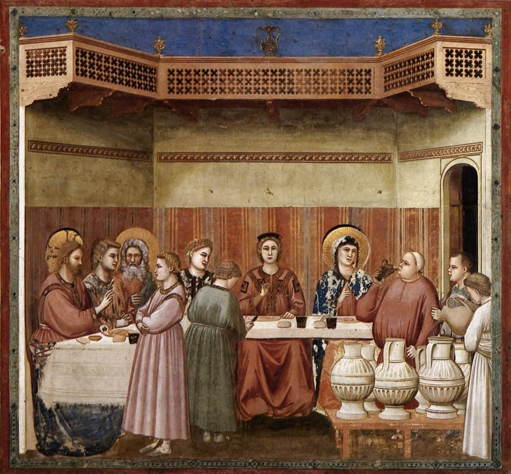

# Session 79 — Matrimony — A Covenant in Christ

*Giotto di Bondone, The Marriage at Cana (c. 1305). Public Domain via Wikimedia Commons.*

> *The wedding at Cana — water turning to wine, and a marriage taking place in the foreground. Marriage is one of the seven channels through which grace becomes a body. Two souls bound, made one, given to children, spent in love.*

## Pius X asks

**406.** What is Matrimony?

*Matrimony is the sacrament that unites man and woman indissolubly, as Jesus Christ and the Church His spouse are united, and gives them the grace to live together in holiness and to raise their children in a Christian way.*

**407.** Who is the minister of Matrimony?

*The ministers of Matrimony are the spouses who contract it.*

**408.** How is Matrimony contracted?

*Matrimony is contracted by expressing the mutual consent before the parish priest, or a priest delegated by him, and at least two witnesses.*

**409.** Does Matrimony celebrated in this form also obtain civil effects in Italy?

*Matrimony celebrated in this form also obtains civil effects in Italy, because the Italian State recognizes such effects in the Sacrament of Matrimony.*

**410.** How does Matrimony so celebrated obtain civil effects in Italy?

*Matrimony so celebrated obtains civil effects in Italy through its regular transcription in the registers of the civil state, made at the request of the parish priest.*

## The Roman Catechism teaches

## Importance Of Instruction On This Sacrament

As it is the duty of the pastor to seek the holiness and
perfection of the faithful, his earnest desires must be in full
accordance with those expressed by the Apostle when writing to
the Corinthians: I would that all men were even as myself, that
is, that all should embrace the virtue of continence. No greater
happiness can befall the faithful in this life than to have their
souls distracted by no worldly cares, the unruly desires of the
flesh tranquillised and restrained, and the mind fixed on the
practice of piety and the contemplation of heavenly things.

But as, according to the same Apostle, every one hath his
proper gift from God, one after this manner, and another after
that; and as marriage is gifted with great and divine blessings,
so much so as truly and properly to hold a place among the other
Sacraments of the Catholic Church, and as its celebration was
honoured by the presence of our Lord Himself, it is clear that
this subject should be explained, particularly since we find that
St. Paul and the Prince of the Apostles have in many places
minutely described to us not only the dignity but also the duties
of the married state. Filled with the Spirit of God (these
Apostles) well understood the numerous and important advantages
which must flow to Christian society from a knowledge, and an
inviolable observance by the faithful of the sanctity of
marriage; while they saw that from ignorance or disregard of (its
holiness), many and serious calamities and losses must be brought
upon the Church.

## Nature and Meaning of Marriage

The nature and meaning of marriage are, therefore, to be first
explained. Vice not infrequently assumes the semblance of virtue,
and hence care must be taken that the faithful be not deceived by
a false appearance of marriage, and thus stain their souls with
turpitude and wicked lusts. To explain this subject, let us begin
with the meaning of the word itself.

### Names Of This Sacrament

The word matrimony is derived from the fact that the principal
object which a female should propose to herself in marriage is to
become a mother; or from the fact that to a mother it belongs to
conceive, bring forth and train her offspring.

It is also called wedlock (conjugium) from joining together,
because a lawful wife is united to her husband, as it were, by a
common yoke.

It is called nuptials, because, as St. Ambrose observes, the
bride veiled her face through modesty — a custom which would
also seem to imply that she was to be subject and obedient to her
husband.

### Definition Of Matrimony

Matrimony, according to the general opinion of theologians, is
defined: The conjugal union of man and woman, contracted between
two qualified persons, which obliges them to live together
throughout life.

In order that the different parts of this definition may be
better understood, it should be taught that, although a perfect
marriage has all the following conditions,  namely, internal
consent, external compact expressed by words, the obligation and
tie which arise from the contract, and the marriage debt by which
it is consummated; yet the obligation and tie expressed by the
word union alone have the force and nature of marriage.

The special character of this union is marked by the word
conjugal. This word is added because other contracts, by which
men and women bind themselves to help each other in consideration
of money received or other reason, differ essentially from
matrimony.

Next follow the words between qualified persons; for persons
excluded by law cannot contract marriage, and if they do their
marriage is invalid. Persons, for instance, within the fourth
degree of kindred, a boy before his fourteenth year, and a female
before her twelfth, the ages established by law, cannot contract
marriage.

The words, which obliges them to live together throughout
life, express the indissolubility of the tie which binds husband
and wife.

### Essence And Cause Of Marriage

Hence it is evident that marriage consists in the tie spoken
of above. Some eminent theologians, it is true, say that it
consists in the consent, as when they define it: The consent of
the man and woman. But we are to understand them to mean that the
consent is the efficient cause of marriage, which is the doctrine
of the Fathers of the Council of Florence; because, without the
consent and contract, the obligation and tie cannot possibly
exist.

### The Kind of Consent Required in Matrimony

It is most necessary that the consent be expressed in words
denoting present time.

#### Mutual

Marriage is not a mere donation, but a mutual agreement; and
therefore the consent of one of the parties is insufficient for
marriage, the consent of both being essential.

#### External

To declare this consent words are obviously necessary. If the
internal consent alone, without any external indication, were
sufficient for marriage, it would then seem to follow as a
necessary consequence, that were two persons, living in the most
separate and distant countries, to consent to marry, they would
contract a true and indissoluble marriage, even before they had
mutually signified to each other their consent by letter or
messenger — a consequence as repugnant to reason as it is
opposed to the decrees and established usage of holy Church.

#### Present

Rightly was it said that the consent must be expressed in
words which have reference to present time; for words which
signify a future time, promise, but do not actually unite in
marriage. Besides, it is evident that what is to be done has no
present existence, and what has no present existence can have
little or no firmness or stability. Hence a man who has only
promised to marry a certain woman acquires by the promise no
marriage rights, since his promise has not yet been fulfilled.
Such promises are, it is true, obligatory, and their violation
involves the offending party in a breach of faith. But he who has
once entered into the matrimonial alliance, regret it as he
afterwards may, cannot possibly change, or invalidate, or undo
what has been done.

As, then, the marriage contract is not a mere promise, but a
transfer of right, by which the man actually yields the dominion
of his body to the woman, the woman the dominion of her body to
the man, it must therefore be made in words which designate the
present time, the force of which words abides with undiminished
efficacy from the moment of their utterance, and binds the
husband and wife by a tie that cannot be broken.

Instead of words, however, it may be sufficient for marriage
to substitute a nod or other unequivocal sign of internal
consent. Even silence, when the result of female modesty, may be
sufficient, provided the parents answer for their daughter.

### The Essence of Marriage Constituted by the Consent

Hence pastors should teach the faithful that the nature and
force of marriage consists in the tie and obligation; and that,
without consummation, the consent of the parties, expressed in
the manner already explained, is sufficient to constitute a true
marriage. It is certain that our first parents before their fall,
when, according to the holy Fathers, no consummation took place,
were really united in marriage. Hence the Fathers say that
marriage consists not in its use but in the consent. This
doctrine is repeated by St. Ambrose in his book On Virgins.

## Twofold Consideration of Marriage

When these matters have been explained, it should be taught
that matrimony is to be considered from two points of view,
either as a natural union, since it was not invented by man but
instituted by nature; or as a Sacrament, the efficacy of which
transcends the order of nature.

### Marriage As A Natural Contract

As grace perfects nature, and as that was not first which is
spiritual, but that which is natural; afterwards that which is
spiritual, the order of our matter requires that we first treat
of Matrimony as a natural contract, imposing natural duties, and
next consider what pertains to it as a Sacrament.

#### Instituted By God

The faithful, therefore, are to be taught in the first place
that marriage was instituted by God. We read in Genesis that God
created them male and female, and blessed them, saying:
"Increase and multiply"; and also: "It is not good
for man to be alone: let us make him a help like unto himself.,'
And a little further on: But for Adam there was not found a
helper like himself. Then the Lord God cast a deep sleep upon
Adam; and when he was fast asleep, he took one of his ribs, and
filled up flesh for it. And the Lord God built a rib which he
took from Adam. into a woman, and brought her to Adam; and Adam
said: "This is now bone of my bones, and flesh of my flesh:
she shall be called woman, because she was taken out of man:
wherefore a man shall leave father and mother, and shall cleave
to his wife; and they shall be two in one flesh," These
words, according to the authority of our Lord Himself, as we read
in St. Matthew, prove the divine institution. of Matrimony.

#### Marriage Is Indissoluble By Divine Law

Not only did God institute marriage; He also, as the Council
of Trent declares, rendered it perpetual and indissoluble.' What
God hath joined together, says our Lord, let not man separate.

Although it belongs to marriage as a natural contract to be
indissoluble, yet its indissolubility arises principally from its
nature as a Sacrament, as it is the sacramental character that,
in all its natural relations, elevates marriage to the highest
perfection. In any event, dissolubility is at once opposed to the
proper education of children, and to the other advantages of
marriage.

### Marriage Not Obligatory On All

The words increase and multiply, which were uttered by the
Lord, do not impose on every individual an obligation to marry,
but only declare the purpose of the institution of marriage. Now
that the human race is widely diffused, not only is there no law
rendering marriage obligatory, but, on the contrary, virginity is
highly exalted and strongly recommended in Scripture as superior
to marriage, and as a state of greater perfection and holiness.
For our Lord and Saviour taught as follows: He that can take it,
let him take it; and the Apostle says: Concerning virgins I have
no commandment from the Lord; but I give counsel as having
obtained mercy from the Lord to be faithful.

### The Motives And Ends Of Marriage

We have now to explain why man and woman should be joined in
marriage. First of all, nature itself by an instinct implanted in
both sexes impels them to such companionship, and this is further
encouraged by the hope of mutual assistance in bearing more
easily the discomforts of life and the infirmities of old age.

A second reason for marriage is the desire of family, not so
much, however, with a view to leave after us heirs to inherit our
property and fortune, as to bring up children in the true faith
and in the service of God. That such was the principal object of
the holy Patriarchs when they married is clear from Scripture.
Hence the Angel, when informing Tobias of the means of repelling
the violent assaults of the evil demon, says: I will show thee
who they are over whom the devil can prevail; for they who in
such manner receive matrimony as to shut out God from themselves
and from their mind, and to give themselves to their lust, as the
horse and mule which have not understanding, over them the devil
hath power. He then adds: Thou shalt take the virgin with the
fear of the Lord, moved rather for love of children than for
lust, that in the seed of Abraham thou mayest obtain a blessing
in children. It was also for this reason that God instituted
marriage from the beginning; and therefore married persons who,
to prevent conception or procure abortion, have recourse to
medicine, are guilty of a most heinous crime — nothing less
than wicked conspiracy to commit murder.

A third reason has been added, as a consequence of the fall
of our first parents. On account of the loss of original
innocence the passions began to rise in rebellion against right
reason; and man, conscious of his own frailty and unwilling to
fight the battles of the flesh, is supplied by marriage with an
antidote by which to avoid sins of lust. For fear of fornication,
says the Apostle, let every man have his own wife, and let every
woman have her own husband; and a little after, having
recommended to married persons a temporary abstinence from the
marriage debt, to give themselves to prayer, he adds: Return
together again, lest Satan tempt you for your incontinency.

These are ends, some one of which, those who desire to
contract marriage piously and religiously, as becomes the
children of the Saints, should propose to themselves. If to these
we add other causes which induce to contract marriage, and, in
choosing a wife, to prefer one person to another, such as the
desire of leaving an heir, wealth, beauty, illustrious descent,
congeniality of disposition — such motives, because not
inconsistent with the holiness of marriage, are not to be
condemned. We do not find that the Sacred Scriptures condemn the
Patriarch Jacob for having chosen Rachel for her beauty, in
preference to Lia.

So much should be explained regarding Matrimony as a natural
contract.

### Marriage Considered as a Sacrament

It will now be necessary to explain that Matrimony is far
superior in its sacramental aspect and aims at an incomparably
higher end. For as marriage, as a natural union, was instituted
from the beginning to propagate the human race; so was the
sacramental dignity subsequently conferred upon it in order that
a people might be begotten and brought up for the service and
worship of the true God and of Christ our Saviour.

Thus when Christ our Lord wished to give a sign of the
intimate union that exists between Him and His Church and of His
immense love for us, He chose especially the sacred union of man
and wife. That this sign was a most appropriate one will readily
appear from the fact that of all human relations there is none
that binds so closely as the marriagetie, and from the fact
that husband and wife are bound to one another by the bonds of
the greatest affection and love. Hence it is that Holy Writ so
frequently represents to us the divine union of Christ and the
Church under the figure of marriage.

### Marriage Is A Sacrament

That Matrimony is a Sacrament the Church, following the
authority of the Apostle, has always held to be certain and
incontestable. In his Epistle to the Ephesians he writes: Men
should love their wives as their own bodies. He that loveth his
wife loveth himself. For no man ever hated his own flesh, but
nourisheth it and cherisheth it, as also Christ doth the church;
for we are members of his body, of his flesh, and of his bones.
For this cause shall a man leave his father and mother, and shall
adhere to his wife, and they shall be two in one flesh. This is a
great sacrament; but I speak in Christ and in the church. Now his
expression, this is a great sacrament, undoubtedly refers to
Matrimony, and must be taken to mean that the union of man and
wife, which has God for its Author, is a Sacrament, that is, a
sacred sign of that most holy union that binds Christ our Lord to
His Church.

That this is the true and proper meaning of the Apostle's
words is shown by the ancient holy Fathers who have interpreted
them, and by the explanation furnished by the Council of Trent.
It is indubitable, therefore, that the Apostle compares the
husband to Christ, and the wife to the Church; that the husband
is head of the wife as Christ is the head of the Church; and that
for this very reason the husband should love his wife and the
wife love and respect her husband. For Christ loved his church,
and gave himself for her; while as the same Apostle teaches, the
church is subject to Christ.

That grace is also signified and conferred by this Sacrament,
which are two properties that constitute the principal
characteristics of each Sacrament, is declared by the Council as
follows: By his passion Christ, the Author and Perfecter of the
venerable Sacraments, merited for us the grace that perfects the
natural love (of husband and wife), confirms their indissoluble
union, and sanctifies them. It should, therefore, be shown that
by the grace of this Sacrament husband and wife are joined in the
bonds of mutual love, cherish affection one towards the other,
avoid illicit attachments and passions, and so keep their
marriage honourable in all things, . . . and their bed undefiled.

## Marriage before Christ

### It Was Not A Sacrament

How much the Sacrament of Matrimony is superior to the
marriages made both previous to and under the (Mosaic) Law may be
judged from the fact that though the Gentiles themselves were
convinced there was something divine in marriage, and for that
reason regarded promiscuous intercourse as contrary to the law of
nature, while they also considered fornication, adultery and
other kinds of impurity to be punishable offences; yet their
marriages never had any sacramental value.

Among the Jews the laws of marriage were observed far more
religiously, and it cannot be doubted that their unions were
endowed with more holiness. As they had received from God the
promise that in the seed of Abraham all nations should be
blessed," it was justly considered by them to be a very
pious duty to bring forth children, and thus contribute to the
propagation of the chosen people from whom Christ the Lord and
Saviour was to derive His birth in His human nature. Still their
unions also fell short of the real nature of a Sacrament.

Before Christ Marriage Had Fallen From Its Primitive
Unity And Indissolubility

It should be added that if we consider the law of nature after
the fall and the Law of Moses we shall easily see thatmarriage
had fallen from its original honour and purity. Thus under the
law of nature we read of many of the ancient Patriarchs that they
had several wives at the same time; while under the Law of Moses
it was permissible, should cause exist, to repudiate one's wife
by giving her a bill of divorce. Both these (concessions) have
been suppressed by the law of the Gospel, and marriage has been
restored to its original state.

## Christ Restored to Marriage its Primitive Qualities

### Unity Of Marriage

Though some of the ancient Patriarchs are not to be blamed for
having married several wives, since they did not act thus without
divine dispensation, yet Christ our Lord has clearly shown that
polygamy is not in keeping with the nature of Matrimony. These
are His words: For this cause shall a man leave father and
mother, and shall cleave unto his wife, and they shall be two in
one flesh; and He adds: wherefore they are no more two but one
flesh. In these words He makes it clear that God instituted
marriage to be the union of two, and only two persons. The same
truth He has taught very distinctly in another passage, wherein
He says: Whosoever shall put away his wife and marry another,
committeth adultery against her; and if the wife shall put away
her husband, and be married to another, she committeth adultery.
For if it were lawful for a man to have several wives, there is
no reason why he who takes to himself a second wife, along with
the wife he already has, should be regarded as more guilty of
adultery than if he had dismissed his first wife and taken a
second.

Hence it is that when an infidel who, following the customs
of his country has married several wives, happens to be converted
to the true religion, the Church orders him to dismiss all but
the first, and regard her alone as his true and lawful wife.

### Indissolubility Of Marriage

The selfsame testimony of Christ our Lord easily proves that
the marriagetie cannot be broken by any sort of divorce. For if
by a bill of divorce a woman were freed from the law that binds
her to her husband, she might marry another husband without being
in the least guilty of adultery. Yet our Lord says clearly:
Whosoever shall put away his wife and shall marry another
committeth adultery. Hence it is plain that the bond of marriage
can be dissolved by death alone, as is confirmed by the Apostle
when he says: A woman is bound by the law as long as her husband
liveth; but if her husband die she is at liberty; let her marry
whom she will, only in the Lord; and again: To them that are
married, not I but the Lord commandeth, that the wife depart not
from her husband; and if she depart that she remain unmarried or
be reconciled to her husband. To the wife, then, who for a just
cause has left her husband, the Apostle offers this alternative:
Let her either remain unmarried or be reconciled to her husband.
Nor does holy Church permit husband and wife to separate without
weighty reasons.

### Advantages Of Indissolubility

Lest, however, the law of Matrimony should seem too severe on
account of its absolute indissolubility, the advantages of this
indissolubility should be pointed out.

The first (beneficial consequence) is that men are given to
understand that in entering Matrimony virtue and congeniality of
disposition are to be preferred to wealth or beauty — a
circumstance that cannot but prove of the very highest advantage
to the interests of society at large.

In the second place, if marriage could be dissolved by
divorce, married persons would hardly ever be without causes of
disunion, which would be daily supplied by the old enemy of peace
and purity; while, on the contrary, now that the faithful must
remember that even though separated as to bed and board, they
remain none the less bound by the bond of marriage with no hope
of marrying another, they are by this very fact rendered less
prone to strife and discord. And even if it sometimes happens
that husband and wife become separated, and are unable to bear
the want of their partnership any longer, they are easily
reconciled by friends and return to their common life.

The pastor should not here omit the salutary admonition of
St. Augustine who, to convince the faithful that they should not
consider it a hardship to receive back the wife they have put
away for adultery, provided she repents of her crime, observes:
Why should not the Christian husband receive back his wife when
the Church receives her? And why should not the wife pardon her
adulterous but penitent husband when Christ has already pardoned
him? True it is that Scripture calls him foolish who keepeth an
adulteress ; but the meaning refers to her who refuses to repent
of her crime and quit the disgraceful course she has entered on.

From all this it will be clear that Christian marriage is far
superior in dignity and perfection to that of Gentiles and Jews.

## The Three Blessings of Marriage

The faithful should also be shown that there are three
blessings of marriage: children, fidelity and the Sacrament.
These are blessings which to some degree compensate for the
inconveniences referred to by the Apostle in the words: Such
shall have tribulation of the flesh, and they lead to this other
result that sexual intercourse, which is sinful outside of
marriage, is rendered right and honourable.

### Offspring

The first blessing, then, is a family, that is to say,
children born of a true and lawful wife. So highly did the
Apostle esteem this blessing that he says: The woman shall be
saved by bearing children.' These words are to be understood not
only of bearing children, but also of bringing them up and
training them to the practice of piety; for the Apostle
immediately subjoins: If she continue in faith. Scripture says:
Hast thou children? Instruct them and bow down their necks from
childhood. The same is taught by the Apostle; while Tobias, Job
and other holy Patriarchs in Sacred Scripture furnish us with
beautiful examples of such training. The duties of both parents
and children will, however, be set forth in detail when we come
to speak of the fourth Commandment.

### Fidelity

The second advantage of marriage is faith, not indeed that
virtue which we receive in Baptism; but the fidelity which binds
wife to husband and husband to wife in such a way that they
mutually deliver to each other power over their bodies, promising
at the same time never to violate the holy bond of Matrimony.
This is easily inferred from the words pronounced by Adam when
taking Eve as his wife, and which were afterwards confirmed by
Christ our Lord in the Gospel: Wherefore a man shall leave father
and mother and shall cleave to his wife and they shall be two in
one flesh. It is also inferred from the words of the Apostle: The
wife hath not power of her own body, but the husband: and in like
manner, the husband hath not power of his own body but the wife.
Justly, then, did the Lord in the Old Law ordain the most severe
penalties against adulterers who violated this conjugal fidelity.

Matrimonial fidelity also demands that they love one another
with a special, holy and pure love; not as adulterers love one
another but as Christ loves His Church. This is the rule laid
down by the Apostle when he says: Husbands, love your wives as
Christ also loved the church. And surely (Christ's) love for His
Church was immense; it was a love inspired not by His own
advantage, but only by the advantage of His spouse.

### Sacrament

The third advantage is called the Sacrament, that is to say,
the indissoluble bond of marriage. As the Apostle has it: The
Lord commanded that the wife depart not from the husband, and if
she depart that she remain unmarried or be reconciled to' her
husband; and let not the husband put away his wife. And truly, if
marriage as a Sacrament represents the union of Christ with His
Church, it also necessarily follows that just as Christ never
separates Himself from His Church, so in like manner the wife can
never be separated from her husband in so far as regards the
marriagetie.

## The Recipient of Matrimony

Dispositions With Which The Sacrament Is To Be
Approached

From the above may be learned the dispositions with which the
faithful should contract matrimony. They should consider that
they are about to enter upon a work that is not human but divine.
The example of the Fathers of the Old Law, who esteemed marriage
as a most holy and religious rite, although it had not then been
raised to the dignity of a Sacrament, shows the singular purity
of soul and piety (with which Christians should approach
marriage).

### Consent Of Parents

Among other things, children should be exhorted earnestly that
they owe as a tribute of respect to their parents, or to those
under whose guardianship and authority they are placed, not to
contract marriage without their knowledge, still less in defiance
of their express wishes. It should be observed that in the Old
Law children were always given in marriage by their fathers; and
that the will of the parent is always to have very great
influence on the choice of the child, is clear from these words
of the Apostle He that giveth his virgin in marriage doth well;
and he that giveth her not, doth better.

> **Scripture.** *This is a great sacrament; but I speak in Christ and in the church.* — Ephesians 5:32

> *Lord, for spouses I know — bless them, hold them. For my own future or present marriage — sanctify it, make it Yours.*
