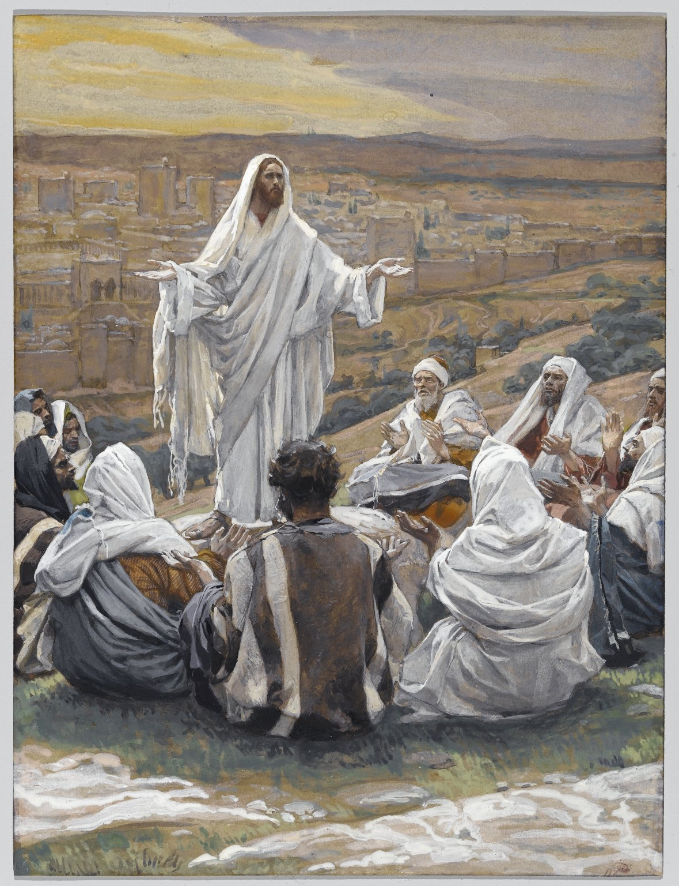

# Session 83 — "Our Father, who art in Heaven"

*James Tissot, The Lord's Prayer (Pater Noster) (c. 1886-1894). Public Domain via Wikimedia Commons.*

> *Christ on a hill, His disciples sitting close: "When you pray, say: Our Father…" The Lord's Prayer is not just a prayer; it is the structure of every prayer. Begin with whose child you are. The rest follows.*

## Pius X asks

**426.** What must we ask as good children of God?

*As good children of God we must ask that throughout the world His name be known and honored, that His kingdom — the Church — be spread, and that His most holy will be fulfilled by all: this is what is asked in the first three petitions of the Our Father.*

**428.** Why does Jesus Christ have us call upon God as "Our Father"?

*Jesus Christ has us call upon God as "Our Father" to remind us that God is truly the Father of all, especially of us Christians who, in Baptism, were adopted by Him as His children; and to inspire in us a great love and confidence toward Him.*

## St. Thomas teaches

## Preparation for the Petitions

Our FATHER.--Note here two things, namely, that God is our Father, and what we owe to Him because He is our Father. God is our Father by reason of our special creation, in that He created us in His image and likeness, and did not so create all inferior creatures: "Is not He thy Father, that made thee, and created thee?"[^1] Likewise God is our Father in that He governs us, yet treats us as masters, and not servants, as is the case with all other things. "For Thy providence, Father, governeth all things;"[^2] and "with great favor disposest of us."[^3] God is our Father also by reason of adoption. To other creatures He has given but a small gift, but to us an heredity--indeed, "if sons, heirs also."[^4] "For you have not received the spirit of bondage again in fear; but you have received the spirit of adoption of sons, whereby we cry, Abba (Father)."[^5]

We owe God, our Father, four things. First, honour: "If then I be a Father, where is My honour?"[^6] Now, honour consists in three qualities. (1) It consists in giving praise to God: "The sacrifice of praise shall glorify Me."[^7] This ought not merely come from the lips, but also from the heart, for: "This people draw near Me with their mouth, and with their lips glorify Me, but their heart is far from Me."[^8] (2) Honour, again, consists in purity of body towards oneself: "Glorify and bear God in your body."[^9] (3) Honour also consists in just estimate of one's neighbour, for: "The king's honour loveth judgment."[^10]

Secondly, since God is our Father, we ought to imitate Him: "Thou shalt call Me Father, and shalt not cease to walk after Me."[^11] This imitation of our Father consists of three things. (1) It consists in love: "Be ye therefore followers of God, as most dear children; and walk in love."[^12] This love of God must be from the heart. (2) It consists in mercy: "Be ye merciful."[^13] This mercy must likewise come from the heart, and it must be in deed. (3) Finally, imitation of God consists in being perfect, since love and mercy should be perfect: "Be ye therefore perfect, as also your Heavenly Father is perfect."[^14]

Thirdly, we owe God obedience: "Shall we not much more obey the Father of spirits?"[^15] We must obey God for three reasons. First, because He is our Lord: "All things that the Lord has spoken we will do, we will be obedient."[^16] Secondly, because He has given us the example of obedience, for the true Son of God "became obedient to His Father even unto death."[^17] Thirdly, because it is for our good: "I will play before the Lord who hath chosen me."[^18] Fourthly, we owe God patience when we are chastised by Him: "Reject not the correction of the Lord; and do not faint when thou art chastised by Him. For whom the Lord loveth He chastises; and as a father in the son He pleaseth Himself.[^19]

OUR Father.--From this we see that we owe our neighbour both love and reverence. We must love our neighbour because we are all brothers, and all men are sons of God, our Father: "For he that loveth not his brother whom he seeth, how can he love God whom he seeth not?"[^20] We owe reverence to our neighbour because he is also a child of God: "Have we not all one Father? Hath not one God created us? Why then does everyone of us despise his brother?"[^21] And again: "With honour preventing one another."[^22] We do this because of the fruit we receive, for "He became to all that obey the cause of eternal salvation."[^23]

## The Preeminence of God

Who Art in Heaven.--Among all that is necessary for one who prays, faith is above all important: "Let him ask in faith, nothing wavering."[^24] Hence, the Lord, teaching us to pray, first mentions that which causes faith to spring up, namely, the kindness of a father. So, He says "Our Father," in the meaning which is had in the following: "If you then being evil know how to give good gifts to your children, how much more will your Father from heaven give the good Spirit to them that ask him!"[^25] Then, He says "Who art in heaven" because of the greatness of His power: "To Thee have I lifted up my eyes, who dwellest in heaven."[^26]

The words, "who art in heaven," signify three things. First, it serves as a preparation for him who utters the prayer, for, as it is said: "Before prayer prepare thy soul."[^27] Thus, "in heaven" is understood for the glory of heaven: "For your reward is very great in heaven."[^28] And this preparation ought to be in the form of an imitation of heavenly things, since the son ought to imitate his Father: "Therefore, as we have borne the image of the earthly, let us bear also the image of the heavenly."[^29] So also this preparation ought to be through contemplation of heavenly things, because men are wont to direct their thoughts to where they have a Father and others whom they love, as it is written: "For where thy treasure is, there is thy heart also."[^30] The Apostle wrote: "Our conversation is in heaven."[^31] Likewise, we prepare through attention to heavenly things, so that we may then seek only spiritual things from Him who is in heaven: "Seek things that are above, where Christ is."[^32] "Who art in heaven" can also pertain to Him who hears us, who is nearest to us; and then the "in heaven" is understood to mean "in devout persons" in whom God dwells, as it is written: "Thou, O Lord, art among us."[^33] For holy persons are called "the heavens" in the Psalm: "The heavens show forth the glory of God,"[^34] since God dwells in the devout through faith. "That Christ may dwell by faith in your hearts."[^35] God also dwells in us through love: "He that abideth in charity, abideth in God and God in him."[^36] And also through the keeping of the commandments: "If any one love Me, he will keep My word, and My Father will love him, and We will come to him, and will make Our abode with him."[^37]

In the third place, "who art in heaven" can pertain to Him who is in heaven, He who cannot be included in the physical heavens, for "the heaven and the heaven of heavens cannot contain Thee."[^38] And so it can mean that God is all-seeing in His survey of us, in that He sees us from above, that is, from heaven: "Because He hath looked forth from His high sanctuary; from heaven the Lord hath looked upon the earth."[^39] It also signifies how sublime is God in His power: "The Lord hath prepared His throne in heaven";[^40] and that He lives without change through eternity: "But Thou, O Lord, endurest forever."[^41] And again: "Thy years shall not fail."[^42] And so of Christ was it written: "His throne as the days of heaven."[^43]

The Philosopher says that on account of the incorruptibility of the heavens all have considered them as the abode of spirits.[^44] And so "who art in heaven" tends to give us confidence in our prayer which arises from a threefold consideration: of God's power, of our familiarity with Him, and of the fitness of our requests.

The power of Him to whom we pray is implied if we consider "heaven" as the corporeal heavens. God is not limited by any physical bounds: "Do not I fill heaven and earth? saith the Lord."[^45] Nevertheless, He is said to be in the corporeal heavens to indicate two things: the extent of His power and the greatness of His nature. The former of these attributes is contrary to the view that all things happen out of necessity, by a fate regulated by the celestial bodies; and thus all prayer would be vain and useless. But such is absurd, since God dwells in the heavens as their Lord: "The Lord has prepared His throne in heaven."[^46] The latter attribute, viz., His sublime nature, is against those who in praying propose or build up any corporeal images of God. Therefore, God is stated to be "in heaven" in that He exceeds all corporeal things, and even the desires and intellects of men; so that whatsoever man thinks or desires is far less than God. Thus, it is said: "Behold, God is great, exceeding our knowledge."[^47] And again: "The Lord is high above all nations."[^48] And finally: "To whom then have you likened God? Or what image will you make for Him?"[^49]

Familiar intercourse with God is shown through this "in heaven." Some indeed have said that because of His great distance from us God does not care for men, and they cite these words: "He walketh about the poles of heaven, and He doth not consider our things."[^50] Against this is the fact that God is nearer to us than we are to ourselves. This brings confidence to one who prays. First, because of the nearness of God: "The Lord is nigh unto all them that call upon Him."[^51] Hence, it is written: "But thou when thou shalt pray, enter into thy chamber,"[^52] that is, into thy heart. Second, because of the intercession of all the Saints among whom God dwells; for from this arises faith to ask through their merits for what we desire: "Turn to some of the Saints,"[^53] and, "Pray one for another, that you may be saved."[^54]

This part of the prayer--that is, "in heaven"--is appropriate and fitting also, if "in heaven" is taken to mean that spiritual and eternal good in which true happiness consists. Because of it our desires are lifted up towards heavenly things; since our desires ought to tend towards where we have our Father, because there is our true home: "Seek the things that are above."[^55] And again: "Unto an inheritance incorruptible, and undefiled, and that cannot fade, reserved in heaven for you."[^56] Moreover, from it we are told that, if our life is to be in heaven, then we ought to be conformed to our Heavenly Father: "Such as is the heavenly, such also are they that are heavenly."[^57] From all this the words "in heaven" are most appropriate in prayer in that they signify both a heavenly desire and heavenly life.

[^1]: Deut., xxxii. 6. "The first word which, by the command and institution of Our Lord, we say in this prayer is 'Father.' The Saviour could, indeed, have begun this prayer with some other word more expressive of His majesty, such as 'Creator' or 'Lord.' Yet, He omitted all such expressions as they might be associated with fear, and instead of them He has chosen a word which inspires love and confidence. What name is more tender than that of Father? It is a name which expresses both indulgence and love" ("Roman Catechism," Lord's Prayer, Chapter IX, 1).
[^2]: Wis. xiv. 3.
[^3]: "Ibid.," xii. 18.
[^4]: Rom., viii. 17.
[^5]: "Ibid.," 15.
[^6]: Mal., i. 6.
[^7]: Ps. xxix. 13.
[^8]: Isa., xxix. 13.
[^9]: I Cor., vi. 20.
[^10]: Ps. xcviii. 3.
[^11]: Jerem., iii. 19.
[^12]: Eph., v. 1.
[^13]: Luke, vi. 36.
[^14]: Matt., v. 48.
[^15]: Heb., xii. 9.
[^16]: Exod., xxiv. 7.
[^17]: Phil., ii. 8.
[^18]: II Kings, vi. 21.
[^19]: Prov., iii. 11-12.
[^20]: I John, iv. 20. "When we call upon the Father, invoking Him as our Father, we are to understand it as a necessary consequence of the gift and right of divine adoption and that we are all brethren, and should love one another as brothers. 'You are all brethren,' says Our Lord, 'for one is your Father, He that is in heaven' (Matt., xxiii. 8). For this reason the Apostles in their Epistles call the faithful, 'brethren'" ("Roman Catechism," "loc. cit.," 14).
[^21]: Mal., ii. 10.
[^22]: Rom., xii. 10.
[^23]: Heb., v. 9.
[^24]: James, i. 6.
[^25]: Luke, ii. 13.
[^26]: Ps. cxxii. 1.
[^27]: Ecclus., xviii. 23.
[^28]: Matt., v. 12.
[^29]: I Cor., xv. 49.
[^30]: Matt., vi. 21.
[^31]: Phil., iii. 20.
[^32]: Colos., iii. 1.
[^33]: Jerem., xiv. 9.
[^34]: Ps. xvii. 2.
[^35]: Eph., iii. 17.
[^36]: I John, iv. 16.
[^37]: John, xiv. 23. "And . . . with him" in Vives ed., omitted in Parma ed.
[^38]: III Kings, viii. 27.
[^39]: Ps. ci. 20.
[^40]: Ps. cii. 19.
[^41]: Ps. ci. 13.
[^42]: "Ibid.," 28.
[^43]: Ps. lxxxviii. 30.
[^44]: Aristotle, "De Coelo," 1.
[^45]: Jerem., xxiii. 24.
[^46]: Ps. cii. 19.
[^47]: Job. xxxvi. 26.
[^48]: Ps. cxii.
[^49]: Isa., xl. 18.
[^50]: Job, xxii. 14.
[^51]: Ps. cxliv. 18.
[^52]: Matt., vi. 6.
[^53]: Job, v. 1.
[^54]: James, v. 16.
[^55]: Col., iii. 1.
[^56]: I Pet., i. 4.
[^57]: I Cor., xv. 48.

> **Scripture.** *Thus therefore shall you pray: Our Father who art in heaven.* — Matthew 6:9

> *Father, before I ask anything else today, let me say this — that You are mine, and I am Yours.*

---

#### Going Deeper — *Catechism of Trent*

## Importance Of Instruction On These Words

The form of Christian prayer given us by Jesus Christ is so
composed and arranged that before coming to requests and
petitions certain words must be used as a sort of preface
calculated to increase our confidence in God when we are about to
address Him devoutly in prayer; and this being so it will be the
pastor's duty to explain each of these words separately and with
precision, so that the faithful may have recourse to prayer more
readily because of the knowledge that they are going to commune
and converse with a God who is also their Father. Regarding this
preface, if we merely consider the number of words of which it is
composed, it is brief indeed; but if we regard the ideas, it is
of the greatest importance and replete with mysteries.

## "Father"

The first word, which, by the order and institution of God we
employ in this prayer, is Father. Our Saviour could, indeed, have
commenced this divine prayer with some other word, conveying more
the idea of majesty, such, for instance, as Lord or Creator. Yet
He omitted all such expressions because they might rather inspire
fear, and instead of them He has chosen a term inspiring
confidence and love in those who pray and ask anything of God;
for what is sweeter than the name Father, conveying, as it does,
the idea of indulgence and tenderness ? The reasons why this name
Father is applicable to God, can be easily explained to the
faithful by speaking to them on the subjects of creation,
providence, and redemption.

### God Is Called Father Because He Created Us

Thus having created man to His own image — a favour He
accorded to no other living creature — it is with good reason
that, in view of this unique privilege with which He has honoured
man, Sacred Scripture calls God the Father of all men; not only
of the faithful, but also of the unbelieving.

### God Is Called Father Because He Provides For Us

From His providence also may be drawn an argument. By a
special superintending care and providence over our interests God
displays a paternal love for us.

#### God's Care For Us Is Seen In The Appointment Of Guardian Angels

But in order to comprehend more clearly the fatherly care of
God for men, it will be well in the explanation of this
particular point to say something regarding the guardian Angels
under whose protection men are placed.

By God's providence Angels have been entrusted with the
office of guarding the human race and of accompanying every human
being so as to preserve him from any serious dangers. Just as
parents, whose children are about to travel a dangerous and
infested road, appoint guardians and helpers for them, so also in
the journey we are making towards our heavenly country our
heavenly Father has placed over each of us an Angel under whose
protection and vigilance we may be enabled to escape the snares
secretly prepared by our enemy, repel the dreadful attacks he
makes on us, and under his guiding hand keep the right road, and
thus be secure against all false steps which the wiles of the
evil one might cause us to make in order to draw us aside from
the path that leads to heaven.

#### How We Are Helped By The Angels

And the immense advantage springing from the special care and
providence of God with regard to men, the execution of which is
entrusted to Angels, who by nature hold an intermediate place
between God and man, will be clear from a multitude of examples
with which Sacred Scripture supplies us in abundance, and which
show that in God's goodness it has often happened that Angels
have wrought wondrous works under the very eyes of men. This
gives us to understand that many and equally important services,
which do not fall under our sight, are wrought by our Angels, the
guardians of our salvation, in our interest and for our
advantage.

The Angel Raphael, the divinely appointed companion and guide
of Tobias, conducted him and brought him back safe and sound;
saved him from being devoured by an enormous fish; made known to
him the extremely useful properties possessed by the liver, gall
and heart of the monster; expelled the demon; repressed and
fettered his power and prevented him from injuring Tobias; taught
the young man the true and legitimate notion and use of
matrimony; and finally restored to the elder Tobias the use of
his sight.

In the same way the Angel who liberated the Prince of the
Apostles, will supply copious material for the instruction of the
pious flock regarding the striking fruits of the vigilance and
protection of the Angels. The pastor need do no more than depict
the Angel lighting up the darkness of the prison, touching
Peter's side and awakening him from his sleep, loosing his
chains, breaking his bonds, ordering him to rise, to take up his
sandals and to follow; and then the pastor will point out how
Peter was led forth out of prison by the same Angel, how he was
enabled to pass without let or hindrance through the midst of the
guard, how the doors were thrown open, and finally how he was
placed in safety.

The historical part of Sacred Scripture, as we have already
remarked, is full of such examples, all of which go to show the
extent of the benefits bestowed by God on man through the
ministry and intervention of Angels whom He deputes not only on
particular and private occasions, but also appoints to take care
of us from our very births. He furthermore appoints them to watch
over the salvation of each one of the human race.

This teaching, if carefully explained, will have the effect
of interesting and compelling the minds of the faithful to
acknowledge and venerate more and more the paternal care and
providence of God towards them.

#### God's Care For Us Seen In The Love He Has Ever Shown To Man

And here the pastor should especially praise and proclaim the
treasures of God's goodness towards the human race. Though from
the time of our first parents and from the moment of our first
sin down to this very day we have offended Him by countless sins
and crimes, yet He still retains His love for us and never
renounces His singular solicitude for our welfare.

To imagine that He has forgotten us would be an act of folly
and nothing short of a most outrageous insult. God was angry with
the Israelites because of the blasphemy they had been guilty of
in imagining that they had been abandoned by providence. Thus do
we read in Exodus: They tempted the Lord, saying: "Is the
Lord amongst us or not?" and in Ezechiel the divine anger is
inflamed against the same people for having said: The Lord seeth
us not: the Lord hath forsaken the earth. These examples should
suffice to deter the faithful from entertaining the criminal
notion that God can ever possibly forget mankind. To the same
effect we may read in Isaias the complaint uttered by the
Israelite. against God; and, on the other hand, the kindly
similitude with which God refutes their folly: Sion said:
"The Lord hath forsaken me, and the Lord hath forgotten
me." To which God answers: Can a woman forget her infant, so
as not to have pity on the son of her womb? And if she should
forget, yet will not I forget thee. Behold, I have engraven thee
in my hands.

Although these passages clearly establish the point under
discussion, yet thoroughly to convince the faithful that never
for a moment can God forget man or cease to lavish on him tokens
of His paternal tenderness, the pastor should still further
confirm this by the striking example of our first parents. They
had ignored and violated God's command. When you hear them
sharply accused and that dreadful sentence of condemnation
pronounced against them: Cursed is the earth in thy work, with
labour and toil shalt thou eat thereof all the days of thy life;
thorns and thistles shall it bring forth to thee; and thou shalt
eat the herbs of the earth; " when you see them driven out
of Paradise; when you read that to preclude all hope of their
return a cherub was stationed at the entrance of Paradise,
brandishing a flaming sword turning every way; and finally, when
you know that, to avenge the injury done Him, God had afflicted
them with punishments, internal and external, would you not be
inclined to think that man's case was hopeless? Would you not
consider that not only was he bereft of all divine help, but was
even abandoned to every misfortune? Yet, surrounded as he then
was by so many evidences of divine wrath and vengeance, a gleam
of the goodness of God towards him is seen to shine forth. For
the Lord God, says Sacred Scripture, made for Adam and his wife
garments of skins and clothed them, which was a very clear proof
that at no time would God abandon man.

This truth, that the love of God can be exhausted by no human
iniquity, was indicated by David in these words: Will God in his
anger shut up his mercies? It was set forth by Habacuc when,
addressing God, he said: When thou art angry thou wilt remember
mercy; and by Micheas, who thus expresses it: Who is a God like
to thee who takest away iniquity and passest by the sin of the
remnant of thy inheritance? He will send his fury in no more,
because he delighteth in mercy.

And thus precisely does it happen. At the very moment when we
imagine ourselves to be utterly lost and altogether bereft of His
protection, then it is that God in His infinite goodness seeks us
out in a special way and takes care of us. Even in His anger He
stays the sword of His justice, and ceases not to pour out the
inexhaustible treasures of His mercy.

### God Is Called Father Because He Has Granted Us Redemption

The creation of the world and God's providence are, then, of
great weight in bringing into relief the singular love of God for
the human race and the special care He takes of man. But far
above these two shines the work of redemption, so much so indeed
that our most bountiful God and Father has crowned His infinite
goodness towards us by granting us this third favour.

Accordingly the pastor should instruct his spiritual children
and constantly recall to their minds the surpassing love of God
for us, so that they may be fully alive to the fact that having
been redeemed in a wonderful manner they are thereby made the
sons of God. To them, says St. John, He gave power to be made the
sons of God . . . and they are born of God.

This is why Baptism, the first pledge and token of our
redemption, is called the Sacrament of regeneration; for it is by
Baptism that we are born children of God: That which is born of
the Spirit, says our Lord, is spirit; and: You must be born
again. In the same way we have the words of St. Peter: Being born
again, not of corruptible seed, but incorruptible, by the word of
God who liveth.

By reason of this redemption we have received the Holy Ghost
and have been made worthy of the grace of God. As a consequence
of this gift we are the adopted sons of God, as the Apostle Paul
wrote to the Romans when he said: Ye have not received the spirit
of bondage again in fear, but you have received the spirit of
adoption of sons, whereby we cry: "Abba, Father." The
force and efficacy of this adoption are thus set forth by St.
John: Behold what manner of charity the Father hath bestowed upon
us, that we should be called, and should be the sons of God.

## Duties We Owe Our Heavenly Father

These points having been explained, the faithful should be
reminded of all they owe in return to God, their most loving
Father, so that they may be aware of the extent of the love,
piety, obedience and respect they are bound to render to Him who
has created them, who watches over them, and who has redeemed
them; and with what hope and trust they should invoke Him.

But to enlighten the ignorant and to correct the false ideas
of such as imagine prosperity and success in life to be the only
test that God preserves and maintains His love towards us, and
that the adversities and trials which come from His hand are a
sign that He is not well disposed towards us and that He
entertains hostile dispositions towards us, it will be necessary
to point out that even if the hand of the Lord sometimes presses
heavily upon us, it is by no means because He is hostile to us,
but that by striking us He heals us, and that the wounds coming
from God are remedies.

He chastises sinners so as to improve them by this lesson,
and inflicts temporal punishments in order to deliver them from
eternal torments. For though He visits our iniquities with a rod
and our sins with stripes, yet his mercy he will not take away
from us.

The faithful, therefore, should be recommended to recognise
in such chastisements the fatherly love of God, and ever to have
in their hearts and on their lips the saying of Job, the most
patient of men: He woundeth and cureth; he striketh and his hands
shall heal; as well as to repeat frequently the words written by
Jeremias in the name of the people of Israel: Thou hast chastised
me and I was instructed, as a young bullock unaccustomed to the
yoke: convert me and I shall be converted; for thou art the Lord
my God; and to keep before their eyes the example of Tobias who,
recognising in the loss of his sight the paternal hand of God
raised against him, cried out: I bless thee, O Lord God of
Israel, because thou hast chastised me and thou hast saved me.

In this connection the faithful should be particularly on
their guard against believing that any calamity or affliction
that befalls them can take place without the knowledge of God;
for we have His own words: A hair of your heads shall not perish.
Let them rather find consolation in that divine oracle read in
the Apocalypse: Those whom I love I rebuke and chastise; and let
them find comfort in the exhortation addressed by St. Paul to the
Hebrews: My son, neglect not the discipline of the Lord; neither
be thou weaned whilst thou art rebuked by him: for whom the Lord
loveth he chastiseth, and he scourgeth every son whom he
receiveth.... But if you be without chastisement, ... then are
you bastards and not sons.... Moreover if we have had the fathers
of our flesh for instructors, and we reverenced them, shall we
not much more obey the Father of spirits and live?

## "Our"

When we invoke the Father and when each one of us calls Him
our Father, we are to understand thereby that from the privilege
and gift of divine adoption it necessarily follows that all the
faithful are brethren and should love each other as such: You are
all brethren for one is your Father who is in heaven." This
is why the Apostles in their Epistles address all the faithful as
brethren.

Another necessary consequence of this adoption is that not
only are the faithful thereby united in the bonds of brotherhood,
but that, the Son of God being truly man, we are called and
really are his brethren also. Thus, in his Epistle to the Hebrews
the Apostle, speaking of the Son of God, wrote as follows: He is
not ashamed to call them brethren, saying: "I will declare
thy name to my brethren. And long before this, David had foretold
this of Christ the Lord; while Christ Himself thus addresses the
women in the Gospel: Go, tell my brethren that they go into
Galilee; there they shall see me. These words, as we know, He
pronounced only after His Resurrection and when He had already
put on immortality, thus showing that no one is at liberty to
imagine that the bonds of brotherhood with us have been severed
by His Resurrection and Ascension into heaven. Not only has the
Resurrection of Christ not dissolved this union and love, but we
know that one day, when from His throne of glory and majesty He
shall judge mankind of all ages, He will call even the very least
of the faithful by the name of brethren.

Indeed, how can we be other than brethren of Christ, seeing
that we are called His coheirs? Doubtless He is the first
begotten, the appointed heir of all things; but we are begotten
in the second place after Him, and are His coheirs according to
the measure of heavenly gifts we receive and according to the
extent of the charity by which we show ourselves servants and
cooperators of the Holy Ghost. He it is who by His inspirations
moves and inflames us to virtue and good works, in order that we
may be strengthened by His grace valiantly to undertake the
combat that must be waged to secure salvation. And if we wisely
and firmly carry on this combat we shall at the close of our
earthly career be rewarded by our heavenly Father with the just
recompense of that crown promised and held out to all those who
run the same course. God, says the Apostle, is not unjust that He
should forget your work and love.

### Dispositions That Should Accompany The Words "Our Father": Fraternal Regard

How sincere should be the manner in which we ought to utter
the word our, we learn from St. Chrysostom. God, he says, listens
willingly to the Christian who prays not only for himself but for
others; because to pray for ourselves is an inspiration of
nature; but to pray for others is an inspiration of grace;
necessity compels us to pray for ourselves, whereas fraternal
charity calls on us to pray for others. And he adds: That prayer
which is inspired by fraternal charity is more agreeable to God
than that which is dictated by necessity.

In connection with the important subject of salutary prayer,
the pastor should be careful to remind and exhort all the
faithful of every age, condition and rank, never to forget the
bonds of universal brotherhood that bind them, and consequently
ever to treat each other as friends and brothers, and never to
seek arrogantly to raise themselves above their neighbours.

Though there are in the Church of God various gradations of
office, yet this diversity of dignity and position in no way
destroys the bond of fraternal union; just as in the human body
the various uses and different functions of our organs in no way
cause this or that part of the body to lose the name or office of
an organ of the body.

Take, for instance, one who wields kingly power. If he is a
Christian, is he not the brother of all those united in the
communion of the Christian faith? Yes, beyond all doubt; and why?
Because there is not one God giving existence to the rich and
noble, and another giving existence to the poor and to subjects.
There is but one God, the Father and Lord of all; and
consequently we have all the same nobility of spiritual birth,
all the same dignity, all the same glory of race; for all have
been regenerated by the same Spirit through the same Sacrament of
faith, and have been made children of God and coheirs to the
same inheritance. The wealthy and great have not one Christ for
their God; the poor and lowly, another; they are not initiated by
different Sacraments; nor can they expect a different inheritance
in the kingdom of heaven. We are all brethren and, as the Apostle
says in his Epistle to the Ephesians: We are members of Christ's
body, of his flesh and of his bones. This is a truth which the
same Apostle thus expresses in his Epistle to the Galatians: You
are the children of God, by faith in Jesus Christ; for as many of
you as have been baptised in Christ, have put on Christ. There is
neither Greek nor Jew, neither bond nor free, neither male nor
female; for you are all one in Christ Jesus.

Now this is a point which calls for accuracy on the part of
the pastor of souls, and one on which he should purposely dwell
at considerable length; for it is a subject that is calculated
both to strengthen and animate the poor and lowly, and to
restrain and repress the arrogance of the rich and powerful.
Indeed it was to remedy this latter evil that the Apostle
insisted on brotherly charity and so often impressed it on the
ears of his hearers.

### Filial Confidence And Piety

Do not, then, forget, oh Christian, that when about to address
this prayer to God, you ought to approach Him as a son to his
Father; and hence in beginning your prayers and in pronouncing
the words Our Father you should consider the rank to which God in
His goodness has raised you when He commands you to fly to Him,
not as a timid and fearful servant to his master, but willingly
and confidently, like a child to its father.

In this remembrance and in this thought, consider with what
fervour and piety you should pray. Endeavour to act as becomes a
child of God; that is to say, see that your prayers and actions
are never unworthy of that divine origin with which He has been
pleased in His infinite bounty to ennoble you. It is to the
discharge of this duty that the Apostle exhorts us when he says:
Be ye therefore imitators of God as most dear children, so that
what the Apostle wrote to the Thessalonians may be truly said of
us: You are all the children of light, and the children of the
day.

## "Who Art In Heaven"

### Meaning Of These Words

All who have a correct idea of God will grant that He is where
and in all places. This is not to be taken in the sense that He
is distributed into parts and that He occupies and governs one
place with one part and another place with another part. God is a
Spirit, and therefore utterly incapable of division into parts.
Who will dare to assign to any particular place or circumscribe
within any limits that God who says of Himself: Do I not fill
heaven and earth? On the contrary, these words must be taken in
this sense, that by His power and virtue He embraces heaven and
earth and all things contained therein; but that He Himself is
not contained in any place. God is present to all things, either
creating them, or preserving them after He has created them; but
He is confined to no place, is limited by no bounds, nor in any
way hindered from being everywhere present by His substance and
power, as is indicated by holy David in the words: If I ascend
into heaven thou art there.

But though God is present in all places and in all things,
without being bound by any limits, as has been already said, yet
in Sacred Scripture it is frequently said that He has His
dwelling in heaven. And the reason is because the heavens which
we see above our heads are the noblest part of the world, remain
ever Incorruptible, surpass all other bodies in power, grandeur
and beauty, and are endowed with fixed and regular motion.

God, then, in order to lift up the minds of men to
contemplate His infinite power and majesty, which are so
preeminently visible in the work of the heavens, declares in
Sacred Scripture that heaven is His dwellingplace. Yet at the
same time He often affirms, what indeed is most true, that there
is no part of the universe to which He is not present intimately
by His nature and His power.

### Lessons Taught By The Words "Who Art In Heaven"

In connection with this consideration, however, let the
faithful keep before their minds not only the image of the common
Father of all, but also of a God reigning in heaven; and hence
when about to pray, let them remember that they should raise
heart and soul to heaven, and that the more the name of Father
inspires them with hope and trust, the more should the sublime
nature and divine majesty of our Father who is in heaven inspire
them with sentiments of Christian humility and respect.

These words, furthermore, determine what we ought to ask of
God in prayer; for every demand regarding the needs and wants of
this life, if it have not some reference to the goods of heaven
and if it be not directed to that end, is vain and unworthy of a
Christian.

Let the pastor, therefore, instruct his pious hearers
regarding this particular element of prayer, confirming his own
words by the authority of the Apostle: If you be risen with
Christ, seek the things that are above, where Christ is sitting
at the right hand of God. Mind the things that are above, not the
things that are upon the earth.
