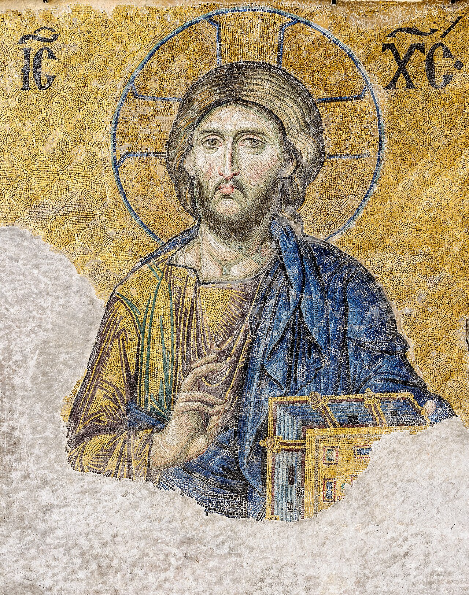

# Session 85 — Second Petition — "Thy Kingdom Come"

*Byzantine mosaicist, Christ Pantocrator (Deesis mosaic) (c. 13th century). Public Domain via Wikimedia Commons.*

> *Christ enthroned — Pantocrator in a Russian dome. "Thy kingdom come" is not pious vagueness; it is a request for a real kingdom, real laws, real reign — first in the soul, then everywhere else.*

## St. Thomas teaches

The Holy Spirit makes us love, desire and pray rightly; and instills in us, first of all, a fear whereby we ask that the name of God be sanctified. He gives us another gift, that of piety. This is a devout and loving affection for our Father and for all men who are in trouble. Now, since God is our Father, we ought not only reverence and fear Him, but also have towards Him a sweet and pious affection. This love makes us pray that the kingdom of God may come: "We should live soberly and justly in this world, looking for the blessed hope and coming of the glory of the great God."[^1]

It may be asked of us: "Why, since the kingdom of God always was, do we then ask that it may come?" This, however, can be understood in three ways. First, a king sometimes has only the right to a kingdom or dominion, and yet his rule has not been declared because the men in his kingdom are not as yet subject to him. His rule or dominion will come only when the men of his kingdom are his subjects. Now, God is by His very essence and nature the Lord of all things; and Christ being God and Man is the Lord over all things: "And He gave Him power and glory and a kingdom."[^2] It is, therefore, necessary that all things be subject to Him. This is not yet the case, but will be so at the end of the world: "For He must reign, until He hath put all His enemies under His feet."[^3] Hence it is for this we pray when we say: "Thy kingdom come."

## Why We Pray Thus

In so doing we pray for a threefold purpose: that the just may be strengthened, that sinners may be punished, and that death be destroyed. Now, the reason is that men are subject to Christ in two ways, either willingly or unwillingly. Again, the will of God is so efficacious that it must be fully complied with; and God does wish that all things be subject to Christ. Hence, two things are necessary: either man will do the will of God by subjecting himself to His commands, as do the just; or God shall exert His will and punish those who are sinners and His enemies; and this will take place at the end of the world: "Until I make Thy enemies Thy footstool."[^4]

It is enjoined upon the faithful to pray that the kingdom of God may come, namely, that they subject themselves completely to Him. But it is a terrible thing for sinners, because for them to ask the coming of God's kingdom is nothing else than to ask that they be subjected to punishment: "Woe to them that desire the day of the Lord!"[^5] By this prayer, too, we ask that death be destroyed. Since Christ is life, death cannot exist in His kingdom,[^6] because death is the opposite of life: "And the enemy, death, shall be destroyed last."[^7] "He shall cast death down headlong forever."[^8] And this shall take place at the last resurrection: "Who will reform the body of our lowness, made like to the body of His glory."[^9]

In a second sense, the kingdom of heaven signifies the glory of paradise. Nor is this to be wondered at, for a kingdom ("regnum") is nothing other than a government ("regimen"). That will be the best government where nothing is found contrary to the will of the governor. Now, the will of God is the very salvation of men, for He "will have all men to be saved";[^10] and this especially shall come to pass in paradise where there will be nothing contrary to man's salvation. "They shall gather out of His kingdom all scandals."[^11] In this world, however, there are many things contrary to the salvation of men. Hence, when we pray, "Thy kingdom come," we pray that we might participate in the heavenly kingdom and in the glory of paradise.

## Why We Desire This Kingdom

This kingdom is greatly to be desired for three reasons. (1) It is to be greatly desired because of the perfect justice that obtains there: "Thy people shall be all just."[^12] In this world the bad are mingled with the good, but in heaven there will be no wicked and no sinners. (2) The heavenly kingdom is to be desired because of its perfect liberty. Here below there is no liberty, although all men naturally desire it; but above there will be perfect liberty without any form of oppression: "Because the creature also shall be delivered from the servitude of corruption."[^13] Not only will men then be free, but indeed they will all be kings: "And Thou hast made us to our God a kingdom."[^14] This is because all shall be of one will with God, and God shall will what the Saints will, and the Saints shall will whatsoever God wills; hence, in the will of God shall their will be done All, therefore, shall reign, because the will of all shall be done, and the Lord shall be their crown: "In that day, the Lord of hosts shall be a crown of glory and a garland of joy to the residue of His people."[^15] (3) The kingdom of God is to be desired because of the marvellous riches of heaven: "The eye hath not seen O God, besides Thee, what things Thou hast prepared for them that wait for Thee."[^16] And also: "Who satisfieth thy desire with good things."[^17]

Note that man will find everything that he seeks for in this world more excellently and more perfectly in God alone. Thus, if it is pleasure you seek, then in God you will find the highest pleasure: "You shall see and your heart shall rejoice."[^18] "And everlasting joy shall be upon their heads."[^19] If it is riches, there you will find it in abundance: "When the soul strays from Thee, she looks for things apart from Thee, but she finds all things impure and useless until she returns to Thee," says St. Augustine.[^20]

Lastly, "Thy kingdom come" is understood in another sense because sometimes sin reigns in this world. This occurs when man is so disposed that he follows at once the enticement of sin. "Let not sin reign in your mortal body,"[^21] but let God reign in your heart; and this will be when thou art prepared to obey God and keep all His Commandments. Therefore, when we pray to God that His kingdom may come, we pray that God and not sin may reign in us.

May we through this petition arrive at that happiness of which the Lord speaks: "Blessed are the meek!"[^22] Now, according to what we have first explained above, viz., that man desires that God be the Lord of all things, then let him not avenge injuries that are done him, but let him leave that for the Lord. If you avenge yourself, you do not really desire that the kingdom of God may come. According to our second explanation (i.e., regarding the glory of paradise), if you await the coming of this kingdom which is the glory of paradise, you need not worry about losing earthly things. Likewise, if according to the third explanation, you pray that God may reign within you, then you must be humble, for He is Himself most humble: "Learn of Me because I am meek and humble of heart."[^23]

[^1]: Tit., ii. 12.
[^2]: Dan., vii. 14.
[^3]: I Cor., xv. 25.
[^4]: Ps. cix. 1.
[^5]: Amos, v. 18.
[^6]: "Since . . . Kingdom" in Vives edition; not in Parma.
[^7]: I Cor., xv. 26.
[^8]: Isa., xxv. 8. This is in Vives edition: not in Parma.
[^9]: Phil., iii. 21.
[^10]: I Tim., ii. 4.
[^11]: Matt, xiii. 41.
[^12]: Isa., lx. 21.
[^13]: Rom., viii, 21.
[^14]: Apoc., v. 10.
[^15]: Isa., xxviii. 5.
[^16]: "Ibid.," lxiv. 4.
[^17]: Ps. cii. 5.
[^18]: Isa., lxvi. 14.
[^19]: "Ibid.," xxxv. 10. These two citations in Vives edition are omitted in Parma.
[^20]: "Confessions," II, 6.
[^21]: Rom., vi. 12.
[^22]: Matt., v.
[^23]: "Ibid.," xi. 29. "Finally, we pray that God alone may live, alone may reign, within us, that death no longer may exist, but may be absorbed by the victory won by Chrisl our Lord, who, having broken and scattered the power of all His enemies, may, in His might, subject all things to His dominion. . . . Let us, therefore, earnestly implore . . . that His commands may be observed, that there be found no traitor, no deserter, and that all may so act that they may come with joy into the presence of God their King: and may reach the possession of the heavenly kingdom prepared for them from all eternity" ("Roman Catechism." "Lord's Prayer," Chapter xi. 14, 19).

> **Scripture.** *For lo, the kingdom of God is within you.* — Luke 17:21

> *Lord, reign in me first. Take whatever territory in me has not yet surrendered.*

---

#### Going Deeper — *Catechism of Trent*

## Importance Of Instruction On This Petition

The kingdom of heaven which we pray for in this second
Petition is the great end to which is referred, and in which
terminates all the preaching of the Gospel; for from it St. John
the Baptist commenced his exhortation to penance: Do penance, for
the kingdom of heaven is at hand. With it also the Saviour of the
world opened His preaching. In that admirable discourse on the
mount in which He points out to His disciples the way to
happiness, having proposed, as it were, the subjectmatter of
His discourse, our Lord commences with the kingdom of heaven:
Blessed are the poor in spirit, for theirs is the kingdom of
heaven. Again, to those who would detain Him with them, He
assigns as the necessary cause of His departure: To other cities,
also, I must preach the kingdom of God; therefore am I sent. This
kingdom He afterwards commanded the Apostles to preach. And to
him who expressed a wish to go and bury his father, He replied:
Go thou, and preach the kingdom of God. And after He had risen
from the dead, during those forty days in which He appeared to
the Apostles, He spoke of the kingdom of God.

This second Petition, therefore, the pastor should treat with
the greatest attention, in order to impress on the minds of his
faithful hearers its great importance and necessity.

## Greatness Of This Petition

In the first place pastors will be greatly assisted towards an
accurate and careful explanation of this Petition by the thought
that (the Redeemer Himself) commanded this Petition, although
united to the others, to be also offered separately, in order
that we may seek with the greatest earnestness that for which we
pray; for He says: Seek first the kingdom of God and his justice,
and all these things shall be added unto you.

So great and so abundant are the heavenly gifts contained in
this Petition, that it includes all things necessary for the
security of soul and body. The king who pays no attention to
those things on which depends the safety of his kingdom we should
deem unworthy of the name. If a man is so anxious for the welfare
of his kingdom, what must be the solicitude, what the
providential care, with which the King of kings guards the life
and safety of man?

We compress, therefore, within the small compass of this
Petition for God's kingdom all that we stand in need of in our
present pilgrimage, or rather exile, and all this God graciously
promises to grant us; for He immediately subjoins: All these
things shall be added unto you. Thus does he declare that He is
that king who with bountiful hand bestows upon man an abundance
of all things, whose infinite goodness enraptured David when he
sang: The Lord ruleth me, and I shall want nothing.

## Necessity Of Rightly Making This Petition

It is not enough, however, that we utter an earnest petition
for the kingdom of God; we must also add to our prayer the use of
all those means by which that kingdom is sought and found. The
five foolish virgins uttered earnestly the same petition in these
words: Lord, Lord, open to us; but they used not the means
necessary to secure its attainment, and were therefore rightly
excluded. For God Himself has said: Not every one that saith to
me, Lord, Lord, shall enter into the kingdom of heaven.

## Motives For Adopting The Necessary Means

The priest, therefore, who is charged with the care of souls,
should draw from the exhaustless fountain of the divine
Scriptures those powerful motives which are calculated to move
the faithful to the desire and pursuit of the kingdom of heaven,
which portray in vivid coloring our deplorable condition, and
which should make so sensible an impression upon them that,
entering into themselves, they may call to mind that supreme
happiness and those unutterable goods with which the eternal
abode of God our Father abounds.

Here below we are exiles, inhabitants of a land in which
dwell those demons whose hatred for us cannot be softened, who
are the determined and implacable foes of mankind. What shall we
say of those intestine conflicts and domestic battles in which
the soul and the body, the flesh and the spirit, are continually
engaged against each other, in which we have always to fear
defeat, nay, in which instant defeat becomes inevitable, unless
we be defended by the protecting hand of God? Feeling this weight
of misery the Apostle exclaims: Unhappy man that I am, who shall
deliver me from the body of this death?

The misery of our condition, it is true, strikes us at once
of itself; but if contrasted with that of other creatures, it
strikes us still more forcibly. Although irrational and even
inanimate, the lower creatures are seldom seen so to depart from
the acts, the instincts and the movements imparted to them by
nature, as to fail of obtaining their appointed and determined
end. This is so obvious in the case of beasts, fishes and birds
that there is no need to dwell on it. But if we look to the
heavens, do we not behold the verification of these words of
David? For ever, O Lord, thy word standeth firm in the heavens.
Constant in their motions, uninterrupted in their revolutions,
they never depart in the least from the laws divinely prescribed.
The earth, too, and universal nature, as we at once perceive,
adhere strictly to, or at least depart but very little from the
laws of their being.

But unhappy man is guilty of frequent falls. Seldom does he
carry out his good resolutions; often he abandons and despises
what he has well commenced; his best purposes which pleased for a
time, are often suddenly abandoned, and he plunges into designs
as degrading as they are pernicious.

What then is the cause of this misery and inconstancy?
Manifestly a contempt of the divine inspirations. We close our
ears to the admonitions of God, our eyes to the divine lights
which shine before us; nor do we hearken to those salutary
commands which are delivered by our heavenly Father.

To paint to the eyes of the faithful the miseryof man's
condition, to detail its various causes, and to point out the
efficacious remedies are, therefore, among the objects which
should employ the zealous exertions of the pastor. In the
discharge of this duty, his labor will be not a little lightened
if he consults what has been said on the subject by those holy
men, John Chrysostom and Augustine, and still more if he refers
to our exposition of the Creed. For with a knowledge of these
truths, who will be so obstinate in sin as not to endeavour, with
the help of God's preventing grace, to rise, like the prodigal
son spoken of in the Gospel, to stand erect, and hasten into the
presence of his heavenly Father and king ?

## "Thy Kingdom"

Having pointed out the advantages to be derived by the
faithful from this Petition, the pastor should next explain the
favours which it seeks. This becomes the more necessary as the
words, kingdom of God, have a variety of significations, the
exposition of each of which will not be found without its
advantages in elucidating other passages of Scripture, and is
necessary to a knowledge of the present subject.

### The Kingdom Of Nature

In their ordinary sense, which is frequently employed by
Scripture, the words, kingdom of God, signify not only that power
which God possesses over all men and over the entire universe,
but, also, His providence which rules and governs all things. In
his hands, says the Prophet, are all the ends of the earth. The
word ends includes those things also which lie buried in the
depths of the earth, and are concealed in the most hidden
recesses of creation. In this sense Mardochaeus exclaims: O Lord,
Lord, almighty king, for all things are in thy power, and there
is none that can resist thy will: thou art God of all, and there
is none that can resist thy majesty.

### The Kingdom Of Grace

By the kingdom of God is also understood that special and
singular providence by which God protects and watches over pious
and holy men. It is of this peculiar and admirable care that
David speaks when he says: The Lord rules me, I shall want
nothing, and Isaias: The Lord our king he will save us.

But although, even in this life, the pious and holy are
placed, in a special manner, under this kingly power of God; yet
our Lord Himself informed Pilate that His kingdom was not of this
world, that is to say, had not its origin in this world, which
was created and is doomed to perish. In this perishable way power
is exercised by kings, emperors, commonwealths, rulers, and all
whose titles to the government of states and provinces is founded
upon the desire or election of men, or who have intruded
themselves, by violent and unjust usurpation, into sovereign
power.

Not so Christ the Lord, who, as the Prophet declares, is
appointed king by God, and whose kingdom, as the Apostle says, is
justice: The kingdom of God's justice and peace, and joy in the
Holy Ghost. Christ our Lord reigns in us by the interior virtues
of faith, hope and charity. By these virtues we are made a
portion, as it were, of His kingdom, become subject in a special
manner to God, and are consecrated to His worship and veneration;
so that, as the Apostle could say: I live, yet not I, but Christ
liveth in me, we too are able to say: I reign, yet not , but
Christ reigneth in me.

This kingdom is called justice, because it has for its basis
the justice of Christ the Lord. Of it our Lord says in St. Luke:
The kingdom of God is within you. For although Jesus Christ
reigns by faith in all who are within the bosom of our holy
mother, the Church; yet in a special manner He reigns over those
who are endowed with a superior faith, hope and charity, and have
yielded themselves pure and living members to God. It is in these
that the kingdom of God's grace is said to consist.

### The Kingdom Of Glory

By the words kingdom of God is also meant that kingdom of His
glory, of which Christ our Lord says in St. Matthew: Come ye
blessed of my Father, possess the kingdom which was prepared for
you from the beginning of the world. This kingdom the thief, when
he had admirably acknowledged his crimes, begged of Christ in the
words related by St. Luke: Lord, remember me, when thou comest
into thy kingdom. Of this kingdom St. John speaks when he says:
Unless a man be born again of water and the Spirit, he cannot
enter into the kingdom of God; and of it the Apostle says to the
Ephesians: No fornicator, or unclean, or covetous person (which
is a serving of idols) hath inheritance in the kingdom of Christ
and of God. To it also refer some of the parables made use of by
Christ the Lord when speaking of the kingdom of heaven.

But the kingdom of grace must precede that of glory; for
God's glory cannot reign in anyone in whom His grace does not
already reign. Grace, according to the Redeemer, is a fountain of
water springing up to eternal life; while as regards glory, what
can we call it except a certain perfect and absolute grace? As
long as we are clothed with this frail mortal flesh, as long as
we wander in this gloomy pilgrimage and exile, weak and far away
from God, we often stumble and fall, because we rejected the aid
of the kingdom of grace, by which we were supported. But when the
light of the kingdom of glory, which is perfect, shall have shone
upon us, we shall stand forever firm and secure. Then shall all
that is defective and unsuitable be utterly removed; then shall
every infirmity be strengthened and invigorated; in a word, God
Himself will then reign in our souls and bodies. But on this
subject we have dealt already at greater length in the exposition
of the Creed, when speaking of the resurrection of the flesh.

## "Come"

Having thus explained the ordinary acceptation of the words,
kingdom of God, we now come to point out the particular objects
contemplated by this Petition.

### We Pray For The Propagation Of The Church

In this Petition we ask God that the kingdom of Christ, that
is, His Church, may be enlarged; that Jews and infidels may
embrace the faith of Christ and the knowledge of the true God;
that schismatics and heretics may return to soundness of mind,
and to the communion of the Church of God which they have
deserted; and that thus may be fulfilled and realised the words
of the Lord, spoken by the mouth of Isaias: Enlarge the place of
thy tent, and stretch out the skins of thy tabernacles; lengthen
thy cords, and strengthen thy stakes, for thou shalt pass on to
the right hand and to the left, for he that made thee shall rule
over thee. And again: The Gentiles shall walk in thy light, and
kings in the brightness of thy rising; lift up thy eyes round
about and see; all these are gathered together, they are come to
thee; thy sons shall come from afar, and thy daughters shall rise
up at thy side.

### For The Conversion Of Sinners

But in the Church there are to be found those who profess they
know God, but in their works deny Him; whose conduct shows that
they have only a deformed faith; who, by sinning, become the
dwellingplace of the devil, where the demon exercises
uncontrolled dominion. Therefore do we pray that the kingdom of
God may also come to them so that the darkness of sin being
dispelled from around them, and their minds being illumined by
the rays of the divine light, they may be restored to their lost
dignity of children of God; that heresy and schism being removed,
and all offences and causes of sins being eradicated from His
kingdom, our heavenly Father may cleanse the floor of His Church;
and that, worshipping God in piety and holiness, she may enjoy
undisturbed peace and tranquillity.

### That Christ May Reign Over All

Finally, we pray that God alone may live, alone may reign
within us; that death may no longer exist, but may be absorbed in
the victory achieved by Christ our Lord, who, having broken and
scattered the power of all His enemies, may, in His might,
subject all things to His dominion.

## Dispositions That Should Accompany This Petition

The pastor should also be mindful to teach the faithful, as
the nature of this Petition demands, the thoughts and reflections
with which their minds should be impressed in order to offer this
prayer devoutly to God.

### We Should Prize God's Kingdom Above All Things

He should exhort them, in the first place, to consider the
force and import of that similitude of the Redeemer: The kingdom
of heaven is like a treasure hidden in a field: which when a man
hath found he hideth, and for joy thereof goeth and selleth all
that he hath, and buyeth that field. He who knows the riches of
Christ the Lord will despise all things when compared to them; to
him wealth, riches, power, will appear as dross. Nothing can be
compared to, or stand in competition with that inestimable
treasure. Whoever, then, is blessed with this knowledge will say
with the Apostle: I esteem all things to be but loss, and count
them but as dung, that I may gain Christ. This is that precious
jewel of the Gospel, and he who sells all his earthly goods to
purchase it shall enjoy an eternity of bliss.

Happy we, should Jesus Christ shed so much light on us, as to
enable us to discover this jewel of divine grace, by which He
reigns in the hearts of those that are His. Then should we be
prepared to sell all that we have on earth, even ourselves, to
purchase and secure its possession; then might we say with
confidence: Who shall separate us from the love of Christ?

But would we know the incomparable excellence of the kingdom
of God's glory, let us hear the words and teaching of the
Apostle: Eye hath not seen, nor ear heard, neither hath it
entered into the heart of man, what things God hath prepared for
them that love him.

### We Must Realise That We Are Exiles

To obtain the object of our prayers it will be found most
helpful to reflect within ourselves who we are,  namely,
children of Adam, exiled from Paradise by a just sentence of
banishment, and deserving, by our unworthiness and perversity, to
become the objects of God's supreme hatred, and to be doomed to
eternal punishment.

This consideration should excite in us humility and
lowliness. Thus our prayers will be full of Christian humility;
and wholly distrusting ourselves, like the publican, we will fly
to the mercy of God. Attributing all to His bounty we will render
immortal thanks to Him who has imparted to us that Holy Spirit,
relying on whom we are emboldened to say: Abba (Father).

### We Must Labor To Obtain God's Kingdom

We should also be careful to consider what is to be done, what
avoided, in order to arrive at the kingdom of heaven. For we are
not called by God to lead lives of ease and indolence. On the
contrary, He declares that the kingdom of God suffereth violence,
and the violent bear it away; and, If thou wilt enter into life,
keep the commandments. It is not enough, therefore, that we pray
for the kingdom of God; we must also use our best exertions. It
is a duty incumbent on US to cooperate with the grace of God, to
use it in pursuing the path that leads to heaven. God never
abandons us; He has promised to be with us at all times. We have
therefore only this to see to, that we forsake not God, or
abandon ourselves.

In this kingdom of the Church, God has provided all those
succours by which He defends the life of man, and accomplishes
his eternal salvation; whether they are invisible to us, such as
the hosts of angelic spirits, or visible, such as the Sacraments,
those unfailing sources of heavenly grace. Defended by these
divine safeguards, not only may we securely defy the assaults of
our most determined enemies, but may even lay prostrate, and
trample under foot, the tyrant himself with all his nefarious
legions.

## Recapitulation

To conclude, let us then earnestly implore the Spirit of God
that He may command us to do all things in accordance with His
holy will; that He may so overthrow the empire of Satan that it
shall have no power over us on the great accounting day; that
Christ may be victorious and triumphant; that the divine
influence of His law may be spread throughout the world; that His
ordinances may be observed; that there be found no traitor, no
deserter; and that all may so conduct themselves, as to come with
joy into the presence of God their King, and may reach the
possession of the celestial kingdom, prepared for them from all
eternity, in the fruition of endless bliss with Christ Jesus.
