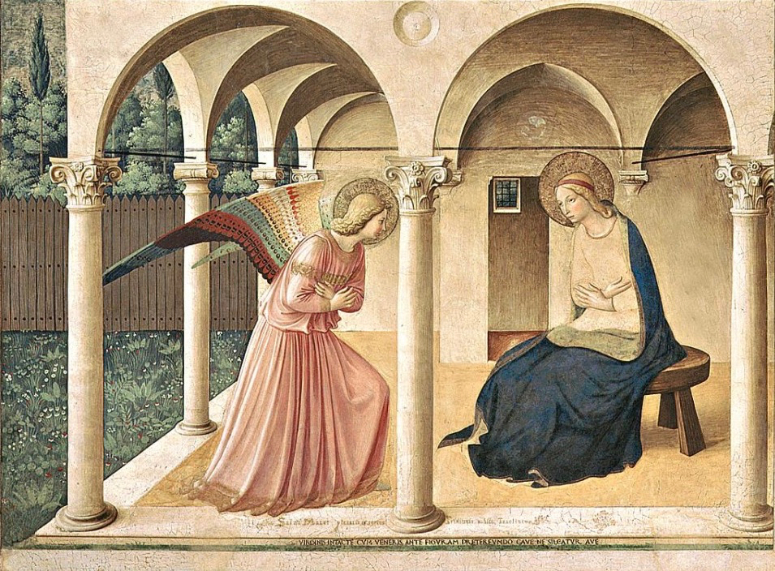

# Session 90 — The Hail Mary and the Communion of Saints

*Fra Angelico, The Annunciation (San Marco) (c. 1440-1445). Public Domain via Wikimedia Commons.*

> *Fra Angelico's Annunciation: "Hail, full of grace." The Hail Mary is the angel's words, Elizabeth's words, and the Church's plea — held together. We do not pray to Mary; we pray with her, and to her Son through her.*

## Pius X asks

**429.** If God hears one who prays well, why do we also call upon Our Lady, the Angels, and the Saints?

*We also call upon Our Lady, the Angels, and the Saints because, being dear to the Lord and merciful toward us, they may help us in our petitions by their powerful intercession.*

**430.** Why are the Angels, the Saints, and Our Lady powerful intercessors before God?

*The Angels and the Saints are powerful intercessors before God because they are His faithful servants, indeed His chosen friends; Our Lady is most powerful because she is the Mother of God and full of grace, and for this reason we call upon her so often, all the more since she was left to us as our Mother by Jesus Christ.*

**431.** With what prayer especially do we call upon Our Lady?

*We call upon Our Lady especially with the Hail Mary, or Angelic Salutation, so called because it begins with the greeting that the Archangel Gabriel made to her when announcing that she was chosen to be the Mother of God.*

**432.** What do we ask of Our Lady in the Hail Mary?

*In the Hail Mary we ask Our Lady for her motherly intercession for us in life and in death.*

**433.** Does the invocation of Our Lady and of the Saints not perhaps show distrust in Jesus Christ, the one Mediator, as if His merits were not enough to obtain graces for us?

*The invocation of Our Lady and of the Saints shows no distrust in Jesus Christ, the one Mediator; on the contrary, it shows a greater faith in His merits, so great and so efficacious that through them, and only through them, Our Lady and the Saints have from God grace, merits, and the power of intercession.*

## St. Thomas teaches

## The Angelic Salutation

This salutation has three parts. The Angel gave one part, namely: "Hail, full of grace, the Lord is with thee, blessed art thou among women."[^1] The other part was given by Elizabeth, the mother of John the Baptist, namely: "Blessed is the fruit of thy womb."[^2] The Church adds the third part, that is, "Mary," because the Angel did not say, "Hail, Mary," but "Hail, full of grace." But, as we shall see, this name, "Mary," according to its meaning agrees with the words of the Angels.[^3] "HAIL MARY"

We must now consider concerning the first part of this prayer that in ancient times it was no small event when Angels appeared to men; and that man should show them reverence was especially praiseworthy. Thus, it is written to the praise of Abraham that he received the Angels with all courtesy and showed them reverence. But that an Angel should show reverence to a man was never heard of until the Angel reverently greeted the Blessed Virgin saying: "Hail."

## The Angel's Dignity

In olden time an Angel would not show reverence to a man, but a man would deeply revere an Angel. This is because Angels are greater than men, and indeed in three ways. First, they are greater than men in dignity. This is because the Angel is of a spiritual nature: "Who makest Thy angels spirits."[^4] But, on the other hand, man is of a corruptible nature, for Abraham said: "I will speak to my Lord, whereas I am dust and ashes."[^5] It was not fitting, therefore, that a spiritual and incorruptible creature should show reverence to one that is corruptible as is a man. Secondly, an Angel is closer to God. The Angel, indeed, is of the family of God, and as it were stands ever by Him: "Thousands of thousands ministered to Him, and ten thousand times a hundred thousand stood before Him."[^6] Man, on the other hand, is rather a stranger and afar off from God because of sin: "I have gone afar off."[^7] Therefore, it is fitting that man should reverence an Angel who is an intimate and one of the household of the King.

Then, thirdly, the Angels far exceed men in the fullness of the splendor of divine grace. For Angels participate in the highest degree in the divine light: "Is there any numbering of His soldiers? And upon whom shall not His light arise?"[^8] Hence, the Angels always appear among men clothed in light, hut men on the contrary, although they partake somewhat of the light of grace, nevertheless do so in a much slighter degree and with a certain obscurity. It was, therefore, not fitting that an Angel should show reverence to a man until it should come to pass that one would be found in human nature who exceeded the Angels in these three points in which we have seen that they excel over men--and this was the Blessed Virgin. To show that she excelled the Angels in these, the Angel desired to show her reverence, and so he said: "Ave (Hail)."

"FULL OF GRACE"

The Blessed Virgin was superior to any of the Angels in the fullness of grace, and as an indication of this the Angel showed reverence to her by saying: "Full of grace." This is as if he said: "I show thee reverence because thou dost excel me in the fullness of grace."

The Blessed Virgin is said to be full of grace in three ways. First, as regards her soul she was full of grace. The grace of God is given for two chief purposes, namely, to do good and to avoid evil. The Blessed Virgin, then, received grace in the most perfect degree, because she had avoided every sin more than any other Saint after Christ. Thus it is said: "Thou art fair, My beloved, and there is not a spot in thee."[^9] St. Augustine says: "If we could bring together all the Saints and ask them if they were entirely without sin, all of them, with the exception of the Blessed Virgin, would say with one voice: 'If we say that we have no sin, we deceive ourselves and the truth is not in us.'[^10] I except, however, this holy Virgin of whom, because of the honour of God, I wish to omit all mention of sin."[^11] For we know that to her was granted grace to overcome every kind of sin by Him whom she merited to conceive and bring forth, and He certainly was wholly without sin.

## Virtues of the Blessed Virgin

Christ excelled the Blessed Virgin in this, that He was conceived and born without original sin, while the Blessed Virgin was conceived in original sin, but was not born in it.[^12] She exercised the works of all the virtues, whereas the Saints are conspicuous for the exercise of certain special virtues. Thus, one excelled in humility, another in chastity, another in mercy, to the extent that they are the special exemplars of these virtues-- as, for example, St. Nicholas is an exemplar of the virtue of mercy. The Blessed Virgin is the exemplar of all the virtues.

In her is the fullness of the virtue of humility: "Behold the handmaid of the Lord."[^13] And again: "He hath regarded the humility of his handmaid."[^14] So she is also exemplar of the virtue of chastity: "Because I know not man."[^15] And thus it is with all the virtues, as is evident. Mary was full of grace not only in the performance of all good, but also in the avoidance of all evil. Again, the Blessed Virgin was full of grace in the overflowing effect of this grace upon her flesh or body. For while it is a great thing in the Saints that the abundance of grace sanctified their souls, yet, moreover, the soul of the holy Virgin was so filled with grace that from her soul grace poured into her flesh from which was conceived the Son of God. Hugh of St. Victor says of this: "Because the love of the Holy Spirit so inflamed her soul, He worked a wonder in her flesh, in that from it was born God made Man." "And therefore also the Holy which shall be born of thee shall be called the Son of God."[^16]

## Mary, Help of Christians

The plenitude of grace in Mary was such that its effects overflow upon all men. It is a great thing in a Saint when he has grace to bring about the salvation of many, but it is exceedingly wonderful when grace is of such abundance as to be sufficient for the salvation of all men in the world, and this is true of Christ and of the Blessed Virgin. Thus, "a thousand bucklers," that is, remedies against dangers, "hang therefrom."[^17] Likewise, in every work of virtue one can have her as one's helper. Of her it was spoken: "In me is all grace of the way and of the truth, in me is all hope of life and of virtue."[^18] Therefore, Mary is full of grace, exceeding the Angels in this fullness and very fittingly is she called "Mary" which means "in herself enlightened": "The Lord will fill thy soul with brightness."[^19] And she will illumine others throughout the world for which reason she is compared to the sun and to the moon.[^20] "THE LORD IS WITH THEE"

The Blessed Virgin excels the Angels in her closeness to God. The Angel Gabriel indicated this when he said: "The Lord is with thee"--as if to say: "I reverence thee because thou art nearer to God than I, because the Lord is with thee." By the Lord; he means the Father with the Son and the Holy Spirit, who in like manner are not with any Angel or any other spirit: "The Holy which shall be born of thee shall be called the Son of God."[^21] God the Son was in her womb: "Rejoice and praise, O thou habitation of Sion; for great is He that is in the midst of thee, the Holy One of Israel."[^22]

The Lord is not with the Angel in the same manner as with the Blessed Virgin; for with her He is as a Son, and with the Angel He is the Lord. The Lord, the Holy Ghost, is in her as in a temple, so that it is said: "The temple of the Lord, the sanctuary of the Holy Spirit,"[^23] because she conceived by the Holy Ghost. "The Holy Ghost shall come upon thee."[^24] The Blessed Virgin is closer to God than is an Angel, because with her are the Lord the Father, the Lord the Son, and the Lord the Holy Ghost--in a word, the Holy Trinity. Indeed of her we sing: "Noble resting place of the Triune God."[^25] "The Lord is with thee" are the most praiseladen words that the Angel could have uttered; and, hence, he so profoundly reverenced the Blessed Virgin because she is the Mother of the Lord and Our Lady. Accordingly she is very well named "Mary," which in the Syrian tongue means "Lady."

"BLESSED ART THOU AMONG WOMEN"

The Blessed Virgin exceeds the Angels in purity. She is not only pure, but she obtains purity for others. She is purity itself, wholly lacking in every guilt of sin, for she never incurred either mortal or venial sin. So, too, she was free from the penalties of sin. Sinful man, on the contrary, incurs a threefold curse on account of sin. The first fell upon woman who conceives in corruption, bears her child with difficulty, and brings it forth in pain. The Blessed Virgin was wholly free from this, since she conceived without corruption, bore her Child in comfort, and brought Him forth in joy: "It shall bud forth and blossom, and shall rejoice with joy and praise."[^26]

The second penalty was inflicted upon man in that he shall earn his bread by the sweat of his brow. The Blessed Virgin was also immune from this because, as the Apostle says, virgins are free from the cares of this world and are occupied wholly with the things of the Lord.[^27]

The third curse is common both to man and woman in that both shall one day return to dust. The Blessed Virgin was spared this penalty, for her body was raised up into heaven, and so we believe that after her death she was revived and transported into heaven: "Arise, O Lord, into Thy resting place, Thou and the ark which Thou hast sanctified."[^28] Because the Blessed Virgin was immune from these punishments, she is "blessed among women." Moreover, she alone escaped the curse of sin, brought forth the Source of blessing, and opened the gate of heaven. It is surely fitting that her name is "Mary," which is akin to the Star of the Sea ("Maria--maris stella"), for just as sailors are directed to port by the star of the sea, so also Christians are by Mary guided to glory.

"BLESSED IS THE FRUIT OF THY WOMB"

The sinner often seeks for something which he does not find; but to the just man it is given to find what he seeks: "The substance of the sinner is kept for the just."[^29] Thus, Eve sought the fruit of the tree (of good and evil), but she did not find in it that which she sought. Everything Eve desired, however, was given to the Blessed Virgin.[^30] Eve sought that which the devil falsely promised her, namely, that she and Adam would be as gods, knowing good and evil. "You shall be," says this liar, "as gods."[^31] But he lied, because "he is a liar and the father of lies."[^32] Eve was not made like God after having eaten of the fruit, but rather she was unlike God in that by her sin she withdrew from God and was driven out of paradise. The Blessed Virgin, however, and all Christians found in the Fruit of her womb Him whereby we are all united to God and are made like to Him: "When He shall appear, we shall be like to Him, because we shall see Him as He is."[^33]

Eve looked for pleasure in the fruit of the tree because it was good to eat. But she did not find this pleasure in it, and, on the contrary, she at once discovered she was naked and was stricken with sorrow. In the Fruit of the Blessed Virgin we find sweetness and salvation: "He that eateth My flesh . . . hath eternal life."[^34]

The fruit which Eve desired was beautiful to look upon, but that Fruit of the Blessed Virgin is far more beautiful, for the Angels desire to look upon Him: "Thou art beautiful above the sons of men."[^35] He is the splendor of the glory of the Father. Eve, therefore, looked in vain for that which she sought in the fruit of the tree, just as the sinner is disappointed in his sins. We must seek in the Fruit of the womb of the Virgin Mary whatsoever we desire. This is He who is the Fruit blessed by God, who has filled Him with every grace, which in turn is poured out upon us who adore Him: "Blessed be God and the Father of our Lord Jesus Christ, who hath blessed us with spiritual blessings in Christ."[^36] He, too, is revered by the Angels: "Benediction and glory and wisdom and thanksgiving, honour and power and strength, to our God."[^37] And He is glorified by men: "Every tongue should confess that the Lord Jesus Christ is in the glory of God the Father."[^38] The Blessed Virgin is indeed blessed, but far more blessed is the Fruit of her womb: "Blessed is He who cometh in the name of the Lord."[^39]

[^1]: Luke i. 28.
[^2]: "Ibid.," 42.
[^3]: The Hail Mary or Angelical Salutation or Ave Maria in the time of St. Thomas consisted only of the present first part of the prayer. The words, "Mary" and "Jesus," were added by the Church to the first part, and the second part--"Holy Mary, Mother of God, etc."--was also added by the Church later. "Most fittingly has the Holy Church of God added to this thanksgiving [i.e., the Hail Mary] a petition also and an invocation to the most holy Mother of God. This is to impress upon us the need to have recourse to her in order that by her intercession she may reconcile God with us sinners, and obtain for us the blessings necessary for this life and for life eternal" ("Roman Catechism," "On Prayer," Chapter V, 8).
[^4]: Ps. ciii. 4.
[^5]: Gen., xviii. 27.
[^6]: Dan. vii. 10.
[^7]: Ps. liv. 8.
[^8]: Job, xxv. 3.
[^9]: Cant., iv. 7.
[^10]: I John, i. 8.
[^11]: "De natura et gratia," c. xxxvi. Elsewhere St. Thomas says: "In the Angelic Salutation is shown forth the worthiness of the Blessed virgin for this conception when it says, 'Full of grace;; it expresses the Conception itself in the words, 'The Lord is with thee'; and it foretells the honour which will follow with the words, 'Blessed art thou among women' " ("Summa Theol.," III, Q. xxx, art. 4).
[^12]: St. Thomas wrote before the solemn definition of the Immaculate conception by the Church and at a time when the subject was still a matter of controversy among theologians. In an earlier work, however, he pronounced in favor of the doctrine (I Sent., c. 44 Q. i, ad. 3), although he seemingly concluded against it in the "Summa Theologica." "Yet much discussion has arisen as to whether St. Thomas did or did not deny that the Blessed virgin was immaculate at the instant of her animation ("Catholic Encyclopedia." art. "Immaculate Conception"). On December 8, 1854, Pope Pius IX settled the question in the following definition: "Mary. ever blessed Virgin in the first instant of her conception, by a singular privilege and grace granted by God, in view of the merits of Jesus Christ, the Saviour of the human race, was preserved exempt from all stain of original sin."
[^13]: Luke, i. 38.
[^14]: "Ibid.," 48.
[^15]: "Ibid.," 34.
[^16]: "Ibid.," 35.
[^17]: Cant., iv. 4.
[^18]: Eccl., xxiv. 25.
[^19]: Isa., lviii. 11.
[^20]: "The Blessed Virgin Mary obtained such a plenitude of grace that she was closest of all creatures to the Author of Grace; and thus she received in her womb Him who is full of grace. and by giving Him birth she is in a certain manner the source of grace for all men" ("Summa Theol.," III, Q. xxvii, art. 5). St. Bernard says: "It is God's will that we should receive all graces through Mary" ("Serm. de aquaeductu," n. vii). Mary is called the "Mediatrix of all Graces," and her mediation is immediate and universal, subordinate however to that of Jesus.
[^21]: Luke. i.
[^22]: Isa., xii. 6.
[^23]: Antiphon from the Little Office of Blessed Virgin.
[^24]: Luke. i.
[^25]: "Totius Trinitatis nobile Triclinium."
[^26]: Isa., xxxv. 2.
[^27]: I Cor., vii. 34.
[^28]: Ps. cxxxi. 8.
[^29]: Prov., xiii. 22.
[^30]: Here St. Thomas compares the fruit of the forbidden tree for Eve with the Fruit of Mary's womb for all Christians.
[^31]: Gen., iii
[^32]: John, viii. 44.
[^33]: I John, iii. 2.
[^34]: John, vi. 55.
[^35]: Ps. xliv. 3.
[^36]: Eph., i. 3.
[^37]: Apoc., vii. 12.
[^38]: Phil., ii. 11.
[^39]: Ps. cxvii. 26.

> **Scripture.** *Hail, full of grace, the Lord is with thee: blessed art thou among women.* — Luke 1:28

> *Mother, in this hour and in the hour of my death, hold me. Pray me through to your Son.*
