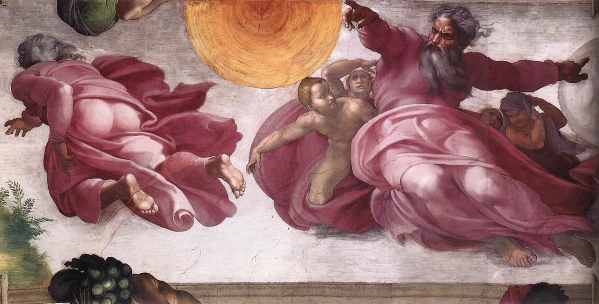

# Sessão 01 — Quem nos criou, quem é Deus

*Michelangelo Buonarroti, The Creation of the Sun, Moon, and Plants (1508-1512). Public Domain via Wikimedia Commons.*

> *Pare um instante. Antes de rolar para longe disto, olhe. O pintor lhe mostra a primeira manhã de tudo — água e terra ainda separando-se, a luz chegando onde nenhuma havia, o Espírito pairando. Você existe sobre a mesma palavra que Deus falou ali. Ele nunca deixou de pronunciá-la.*

## São Pio X pergunta

**1.** Quem nos criou?

*Deus nos criou.*

**2.** Quem é Deus?

*Deus é o Ser perfeitíssimo, Criador e Senhor do Céu e da Terra.*

**3.** O que significa "perfeitíssimo"?

*Perfeitíssimo significa que há em Deus toda a perfeição, sem defeito e sem limite, ou seja, que Ele é poder, sabedoria e bondade infinitos.*

**4.** O que significa "Criador"?

*Criador significa que Deus fez todas as coisas do nada.*

**5.** O que significa "Senhor"?

*Senhor significa que Deus é dono absoluto de todas as coisas.*

**6.** Deus tem corpo como nós?

*Deus não tem corpo, mas é puríssimo espírito.*

**7.** Onde Deus está?

*Deus está no Céu, na Terra e em todo lugar: Ele é o Imenso.*

**8.** Deus sempre existiu?

*Deus sempre existiu e sempre existirá: Ele é o Eterno.*

**9.** Deus sabe tudo?

*Deus sabe tudo, inclusive nossos pensamentos: Ele é o Onisciente.*

**10.** Deus pode fazer tudo?

*Deus pode fazer tudo o que quer: Ele é o Onipotente.*

**11.** Deus pode fazer inclusive o mal?

*Deus não pode fazer o mal porque, sendo bondade infinita, não o pode querer; porém o tolera para deixar livres as criaturas, sabendo depois tirar o bem inclusive do mal.*

**12.** Deus tem cuidado das coisas criadas?

*Deus tem cuidado e providência das coisas criadas, e as conserva e dirige todas ao fim próprio com sabedoria, bondade e justiça infinitas.*

**13.** Para que fim Deus nos criou?

*Deus nos criou para conhecê-lO, amá-lO e servi-lO nesta vida, e para fruí-lO depois na outra, no Paraíso.*

## São Tomás ensina

Natureza e efeitos da fé. — O primeiro requisito para todo cristão é a fé, sem a qual ninguém pode ser verdadeiramente chamado fiel cristão.[^1] A fé produz quatro bons efeitos. O primeiro é que, por meio da fé, a alma se une a Deus, e por ela há entre a alma e Deus uma união semelhante ao matrimônio: «Desposar-te-ei comigo na fé».[^2] Quando se batiza um homem, a primeira pergunta que se lhe dirige é: «Crês em Deus?»[^3] É que o Batismo é o primeiro Sacramento da fé. Por isso disse o Senhor: «Aquele que crer e for batizado será salvo».[^4] O Batismo sem a fé não tem valor algum. E, na verdade, é preciso saber que ninguém é aceitável diante de Deus se não tiver fé: «Sem a fé é impossível agradar a Deus».[^5] Santo Agostinho explica assim aquelas palavras de São Paulo, «Tudo o que não é segundo a fé, é pecado»:[^6] «Onde não há conhecimento da Verdade eterna e imutável, mesmo a virtude no meio da melhor vida moral é falsa».

O segundo efeito da fé é que a vida eterna já se inicia em nós, pois a vida eterna não é outra coisa senão conhecer a Deus. Foi o que anunciou o Senhor ao dizer: «Esta é a vida eterna: que te conheçam a ti, único Deus verdadeiro, e a Jesus Cristo, a quem enviaste».[^7] Este conhecimento de Deus começa aqui pela fé, mas é aperfeiçoado na vida futura, quando conheceremos a Deus tal como Ele é. Por isso diz São Paulo: «A fé é a substância das coisas que se devem esperar».[^8] Ninguém, pois, pode chegar à perfeita felicidade do Céu, que é o verdadeiro conhecimento de Deus, sem que primeiro O conheça pela fé: «Bem-aventurados os que não viram e creram».[^9]

O terceiro bem que provém da fé é a reta direção que ela imprime à nossa vida presente. Ora, para que se viva uma vida boa, é necessário saber o que é preciso para viver retamente; e se alguém depende exclusivamente dos próprios esforços para adquirir esse conhecimento, ou jamais o alcançará, ou só chegará a ele depois de muito tempo. A fé, porém, ensina-nos tudo o que é necessário para viver bem. Ensina-nos que existe um só Deus, remunerador dos bons e castigador dos maus; que existe outra vida além desta, e outras verdades semelhantes pelas quais somos atraídos a viver retamente e a fugir do mal. «O justo vive da fé».[^10] Isto é manifesto: nenhum dos filósofos antes da vinda de Cristo pôde, por suas próprias forças, conhecer a Deus e os meios necessários à salvação tanto quanto, depois da vinda de Cristo, qualquer mulher idosa O conhece pela fé. E por isso diz Isaías que «a terra está cheia do conhecimento do Senhor».[^11]

O quarto efeito da fé é vencermos por ela as tentações: «Os santos pela fé venceram reinos».[^12] Sabemos que toda tentação procede ou do mundo, ou da carne, ou do demônio. O demônio quer que desobedeçamos a Deus e não Lhe sejamos sujeitos. Mas a fé afasta isto, pois por ela conhecemos que Ele é o Senhor de todas as coisas e, por isso, deve ser obedecido: «O vosso adversário, o diabo, anda como leão rugidor, buscando a quem devorar; resisti-lhe firmes na fé».[^13] O mundo nos tenta, ou prendendo-nos a si pela prosperidade, ou enchendo-nos de medo na adversidade. A fé, porém, vence isso, porque cremos numa vida futura melhor que esta, e por isso desprezamos as riquezas deste mundo e não nos amedrontamos diante das adversidades: «Esta é a vitória que vence o mundo: a nossa fé».[^14] Quanto à carne, ela nos tenta atraindo-nos aos prazeres efêmeros desta vida presente. Mas a fé nos mostra que, se a esses prazeres nos apegarmos desordenadamente, perderemos os gozos eternos: «Em todas as coisas, embraçando o escudo da fé».[^15] Por aí se vê quanto é necessário ter fé.

«Argumento das coisas que não aparecem». — Mas alguém dirá que é tolice crer no que não se vê, e que não se deve crer naquilo que não se pode ver. Respondo dizendo que a natureza imperfeita do nosso entendimento desfaz a base desta dificuldade. Se o homem por si mesmo pudesse, de modo perfeito, conhecer todas as coisas visíveis e invisíveis, seria realmente tolice crer no que não vê. Mas o nosso modo de conhecer é tão débil, que nenhum filósofo pôde investigar perfeitamente sequer a natureza de uma pequena mosca. Lê-se até que certo filósofo passou trinta anos em solidão para conhecer a natureza da abelha. Se, portanto, o nosso entendimento é tão fraco, é tolice querer crer a respeito de Deus apenas aquilo que o homem pode conhecer por si mesmo. Contra isso é a palavra de Jó: «Eis que Deus é grande, excede o nosso conhecimento».[^16] Pode-se também responder a esta objeção supondo que certo mestre tivesse dito algo a respeito do seu próprio campo de conhecimento, e algum ignorante o contradissesse, sem outra razão senão por não compreender o que o mestre dissera! Tal pessoa seria considerada muito tola. Ora, o entendimento dos Anjos excede em muito o do maior filósofo, tanto quanto o do maior filósofo excede o do ignorante. É, pois, tolice o filósofo recusar-se a crer no que diz um Anjo, e muito maior tolice recusar-se a crer no que diz Deus. Contra isso vão estas palavras: «Muitas coisas te são mostradas acima do entendimento dos homens».[^17]

E ainda: se alguém quisesse crer apenas naquilo que conhece com certeza, não poderia viver neste mundo. Como viveríamos se não acreditássemos nos outros? Como saberíamos que este homem é o nosso pai? É necessário, portanto, crer nos outros em matérias que não podemos conhecer perfeitamente por nós mesmos. Mas ninguém é tão digno de fé como Deus, e por isso aqueles que não crêem nas palavras da fé não são sábios, mas insensatos e soberbos. Como diz o Apóstolo: «É um soberbo, que nada sabe».[^18] E também: «Sei em quem cri, e estou certo».[^19] E está escrito: «Vós que temeis o Senhor, crede n'Ele, e não será vão o vosso galardão».[^20] Por fim, pode-se também dizer que o próprio Deus prova a verdade das coisas que a fé ensina. Assim, se um rei envia cartas seladas com o seu sinete, ninguém ousaria dizer que tais cartas não traduzem a vontade do rei. Da mesma forma, tudo o que os santos creram e nos transmitiram a respeito da fé de Cristo está selado com o sinete de Deus. Esse sinete são as obras que nenhuma simples criatura poderia realizar: os milagres pelos quais Cristo confirmou as palavras dos Apóstolos e dos santos.

Se, porém, alguém disser que ninguém testemunhou esses milagres, responderei o seguinte. É fato que o mundo inteiro adorava os ídolos e que a fé de Cristo era perseguida, como atestam também as histórias dos pagãos. Mas agora todos se voltaram para Cristo — sábios, nobres e ricos — convertidos pela palavra dos pobres e simples pregadores de Cristo. Ora, este fato é milagre ou não. Se é milagre, tendes o que pedíeis: um fato visível; se não é, então não poderia haver maior milagre do que o mundo inteiro ter-se convertido sem milagres. E não precisamos ir além. Estamos, portanto, mais certos crendo nas coisas da fé do que nas que se vêem, porque o conhecimento de Deus jamais nos engana, ao passo que os sentidos visíveis do homem muitas vezes se equivocam.[^21]

[^1]: O *Catecismo do Concílio de Trento*, conhecido como *Catecismo Romano* (e assim chamado ao longo deste livro), introduz desta forma a explicação dos doze Artigos do Símbolo: «A religião cristã propõe aos fiéis muitas verdades, que individualmente ou em conjunto devem ser sustentadas com fé certa e firme. O que primeira e necessariamente deve ser crido por todos é o que o próprio Deus nos ensinou como fundamento da verdade e seu sumário, sobre a unidade da Essência Divina, a distinção das Três Pessoas, e as ações que por particular razão se atribuem a cada uma. O pároco ensine que o Símbolo dos Apóstolos expõe brevemente a doutrina destes mistérios. […] O Símbolo dos Apóstolos divide-se em três partes principais. A primeira parte descreve a Primeira Pessoa da Natureza Divina e a obra admirável da criação. A segunda parte trata da Segunda Pessoa e do mistério da redenção do homem. A terceira parte conclui com a Terceira Pessoa, cabeça e fonte de nossa santificação. As várias e apropriadas proposições do Símbolo são chamadas Artigos, segundo comparação muitas vezes feita pelos Padres; pois, assim como os membros do corpo se distinguem pelas articulações (*articuli*), assim também nesta profissão de fé tudo o que deve ser crido distinta e separadamente é, com razão e propriedade, chamado de Artigo» (Parte I, Capítulo I, 4).
[^2]: Os 2.
[^3]: Na cerimônia da administração do Sacramento do Batismo, o sacerdote pergunta ao padrinho: «N., crês em Deus Pai Todo-Poderoso, Criador do Céu e da Terra?»
[^4]: Mc 16, 16.
[^5]: Hb 11, 6.
[^6]: Rm 14, 23.
[^7]: Jo 17, 3.
[^8]: Hb 11, 1.
[^9]: Jo 20, 29.
[^10]: Hab 2, 4.
[^11]: Is 11, 9.
[^12]: Hb 11, 33.
[^13]: 1 Pd 5, 8.
[^14]: 1 Jo 5, 4.
[^15]: Ef 6, 16.
[^16]: Jó 36, 26.
[^17]: Eclo 3, 25.
[^18]: 1 Tm 6, 4.
[^19]: 2 Tm 1, 12.
[^20]: Eclo 2, 8.
[^21]: Sobre o sentido da palavra «fé», ver a *Catholic Encyclopedia*, vol. V. A necessidade da fé é explicada em São Tomás, *Suma Teológica*, II-II, q. 2, aa. 3 e 4.

> **Escritura.** *No princípio criou Deus o céu e a terra.* — Gênesis 1, 1

> *Pai, antes que eu pedisse, Vós me fizestes — por amor, sem necessidade, por Vós. Hoje, fazei-me viver como alguém que o sabe.*
