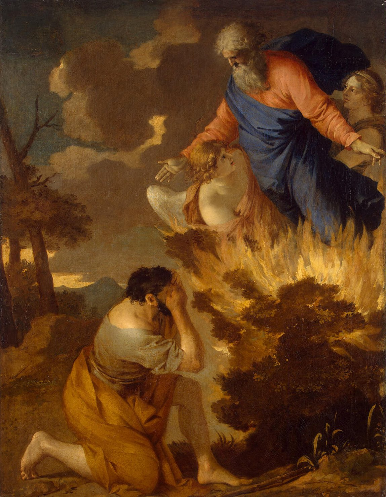

# Sessão 05 — Há um só Deus

*Sébastien Bourdon, Moses and the Burning Bush (c. 1642-1645). Public Domain via Wikimedia Commons.*

> *Moisés se inclina diante de uma sarça que arde sem se consumir. Não há outro Deus. Não a sua versão, não o seu projeto, não o deus que você gostaria que existisse — Ele. O fogo não negocia.*

## São Pio X pergunta

**37.** O que significa "Unidade de Deus"?

*Unidade de Deus significa que existe um único Deus.*

**38.** O que significa "Trindade de Deus"?

*Trindade de Deus significa que em Deus existem três Pessoas iguais e realmente distintas: Pai, Filho e Espírito Santo.*

**39.** O que significa "três Pessoas realmente distintas"?

*Três Pessoas realmente distintas significa que em Deus uma Pessoa não é a outra, apesar de todas três serem um único Deus.*

**40.** Nós compreendemos como as três Pessoas divinas, embora realmente distintas, são um único Deus?

*Nós não compreendemos nem podemos compreender como as três Pessoas divinas, embora realmente distintas, são um único Deus: é um mistério.*

## São Tomás ensina

Entre todas as verdades em que os fiéis devem crer, esta é a primeira: que existe um só Deus. Devemos compreender que «Deus» significa o governador e provedor de todas as coisas. Crê em Deus, portanto, aquele que crê que tudo o que há neste mundo é por Ele governado e provido. Quem cresse que todas as coisas se produzem por acaso, não creria que existe um Deus. Ninguém é tão tolo a ponto de negar que toda a natureza, que opera com tempo certo e com ordem definida, está sujeita ao governo, à providência e à disposição ordenada de alguém. Vemos como o sol, a lua, as estrelas e todas as coisas naturais seguem um curso determinado, o que seria impossível se fossem meros produtos do acaso. Por isso, como diz o Salmo, é deveras tolo aquele que não crê em Deus: «Disse o insensato no seu coração: Não há Deus».[^1]

Há, contudo, quem creia que Deus governa e sustenta todas as coisas da natureza, mas, ao mesmo tempo, não creia que Ele seja o supervisor dos atos humanos; e, assim, julga que os atos do homem não estão sob a Providência divina. Raciocinam deste modo porque vêem como neste mundo os bons são afligidos e os maus desfrutam de bens, de modo que a Divina Providência parece desinteressar-se das coisas humanas. Por isso costumam aplicar a esta posição as palavras de Jó: «Ele não considera as nossas coisas, e passeia em volta dos pólos do céu».[^2] Mas isto é absurdo. É como se alguém ignorante de medicina visse o médico dar água a um paciente e vinho a outro. Pensaria que era mero acaso, por não compreender a ciência da medicina, que por boas razões prescreve a um o vinho e a outro a água. Assim é com Deus. Pois Deus, em sua justa e sábia Providência, sabe o que é bom e necessário aos homens; e por isso aflige alguns que são bons e permite que certos ímpios prosperem. Mas é deveras tolo quem crê que isto se deva ao acaso, por não conhecer as causas e o método com que Deus trata os homens. «Oxalá Deus falasse contigo, e abrisse os seus lábios sobre ti, para te mostrar os segredos da sabedoria, e que a sua lei é múltipla; e compreenderias que Ele exige de ti muito menos do que a tua iniquidade merece».[^3]

Devemos, pois, crer firmemente que Deus governa e regula não só toda a natureza, mas também as ações dos homens. «E disseram: O Senhor não verá; o Deus de Jacó não entenderá. Entendei, ó insensatos do povo; ó loucos, sede enfim sábios. Aquele que plantou o ouvido, porventura não ouvirá? Aquele que formou o olho, não considerará? […] O Senhor conhece os pensamentos dos homens».[^4] Deus vê todas as coisas, tanto os nossos pensamentos como os desejos ocultos da nossa vontade. Assim, a necessidade de fazer o bem se impõe ao homem com particular força, pois todos os seus pensamentos, palavras e ações são conhecidos diante de Deus: «Todas as coisas estão patentes e descobertas aos seus olhos».[^5]

Cremos que Deus, que governa e regula todas as coisas, é um só Deus. Isto se vê pelo fato de que, onde quer que a regulação dos negócios humanos seja bem ordenada, encontra-se a coletividade governada e provida por um só, e não por muitos. Pois a multiplicidade de chefes amiúde traz dissensão entre os súditos. E como o governo divino excede em tudo o que é meramente humano, é evidente que o governo do mundo não se faz por muitos deuses, mas por um só.[^6]

## Alguns motivos para crer em muitos deuses

São quatro os motivos que levaram os homens a crer em muitos deuses. (1) A obtusidade do entendimento humano. Os homens obtusos, incapazes de ir além das coisas sensíveis, não criam que existisse algo além dos corpos físicos. Por isso julgavam que o mundo é disposto e governado por aqueles corpos que lhes pareciam mais belos e mais valiosos neste mundo. E, assim, atribuíam e prestavam culto divino a coisas como o sol, a lua e as estrelas. Tais homens são como aquele que, indo a uma corte real para ver o rei, pensa que quem quer que esteja sumptuosamente vestido ou ocupe cargo oficial é o rei! «Imaginaram que o sol e a lua, ou o círculo das estrelas […] eram os deuses que governavam o mundo. Se com tal beleza, encantados, os tomaram por deuses…».[^7]

(2) O segundo motivo foi a adulação humana. Alguns homens, querendo lisonjear reis e governantes, obedecem-lhes, sujeitam-se a eles e lhes prestam honras devidas somente a Deus. Após a morte desses governantes, às vezes os homens deles fazem deuses, e às vezes isto é feito mesmo enquanto ainda vivem: «Para que toda nação saiba que Nabucodonosor é o deus da terra, e fora dele não há outro».[^8]

(3) O terceiro motivo foi a afeição humana por filhos e parentes. Alguns, em razão do amor excessivo que tinham pela família, mandavam erigir estátuas dos seus depois de mortos, e gradualmente foi-se atribuindo a essas estátuas honra divina.[^9] «Pois os homens, servindo aos seus afetos ou aos seus reis, deram a pedras e madeira o Nome incomunicável».[^10]

(4) O último motivo é a malícia do demônio. Desde o princípio o demônio quis igualar-se a Deus, e por isso disse: «Subirei acima da altura das nuvens, serei semelhante ao Altíssimo».[^11] Esse desejo o demônio ainda hoje alimenta. Todo o seu intuito é fazer com que o homem o adore e lhe ofereça sacrifícios; não que ele se compraza num cão ou num gato que se lhe ofereça, mas regozija-se em que, por isso, se preste irreverência a Deus. Assim falou a Cristo: «Tudo isto te darei, se, prostrando-te, me adorares».[^12] Por essa razão, os demônios que entraram nos ídolos diziam que deviam ser venerados como deuses. «Todos os deuses dos gentios são demônios».[^13] «O que os pagãos sacrificam, sacrificam-no aos demônios e não a Deus».[^14]

Embora tudo isso seja terrível de contemplar, ainda hoje há quem incida nestas quatro causas mencionadas. Não por palavras nem com o coração, mas pelos atos, mostram que crêem em muitos deuses. Assim, os que crêem que os corpos celestes influenciam a vontade do homem e regulam seus negócios pela astrologia fazem realmente dos corpos celestes deuses, e a eles se sujeitam. «Não temais os sinais do céu, que os pagãos temem, pois as leis dos povos são vãs».[^15] Na mesma categoria estão todos os que obedecem aos governantes temporais mais do que a Deus naquilo em que não devem; tais, na verdade, fazem deles deuses. «Devemos obedecer mais a Deus do que aos homens».[^16] Assim também os que amam os filhos e os parentes mais do que a Deus mostram pelos atos que crêem em muitos deuses; bem como os que amam mais a comida do que a Deus: «O seu deus é o ventre».[^17] Mais ainda: todos os que se entregam à magia ou aos encantamentos crêem que os demônios são deuses, porque buscam do demônio aquilo que só Deus pode dar, como revelar o futuro ou descobrir coisas ocultas. Devemos, portanto, crer que existe um só Deus.

[^1]: Sl 13, 1.
[^2]: Jó 22, 14.
[^3]: Jó 11, 5-6.
[^4]: Sl 93, 7-11.
[^5]: Hb 4, 13.
[^6]: «Há um só Deus, e não muitos deuses. Atribuímos a Deus a suprema bondade e perfeição, e é impossível que o que é supremo e absolutamente perfeito se encontre em muitos. Se um ser carece daquilo que constitui a suprema perfeição, então é imperfeito e não pode ter a natureza de Deus» (*Catecismo Romano*, «O Símbolo», Primeiro Artigo, 7).
[^7]: Sb 13, 2-3.
[^8]: Jt 5, 29.
[^9]: Tudo isto se explica plenamente no capítulo 14 do Livro da Sabedoria, versículos 15-21.
[^10]: Sb 14, 21.
[^11]: Is 14, 14.
[^12]: Mt 4, 9.
[^13]: Sl 115, 5.
[^14]: 1 Cor 10, 20.
[^15]: Jr 10, 2-3.
[^16]: At 5, 29.
[^17]: Fl 3, 19.

> **Escritura.** *Ouve, ó Israel: o Senhor nosso Deus é o único Senhor.* — Deuteronômio 6, 4

> *Há um só Deus. Hoje, que nada O usurpe em mim — nem a ansiedade, nem o algoritmo, nem eu mesmo.*

---

#### Aprofundamento — *Catecismo de Trento*

## Sinopse do Artigo

[1] Estas palavras querem dizer: Creio com toda a certeza, e sem nenhuma hesitação confesso a Deus Padre, a primeira Pessoa da Santíssima Trindade, que pela virtude de Sua onipotência criou do nada o próprio céu, a terra, e tudo que se contém em suas dimensões; que sustenta e governa todas as coisas criadas. E não só de coração o creio, e de boca o confesso, mas com o maior afeto e filial piedade a Ele me entrego, por ser o bem sumo e perfeito.

Nestes termos se pode, brevemente, formular o sentido deste primeiro artigo. Mas como quase cada uma destas palavras envolve grandes mistérios, é obrigação do pároco explicá-las mais amplamente, para que o povo cristão, quanto o permitir a graça de Deus, aprenda a contemplar, com temor e tremor, a glória de Sua majestade.[^72]

## Crer

[2] Neste lugar, a palavra "Creio" não tem a significação de "pensar", "julgar", "dar opinião". Conforme a doutrina da Sagrada Escritura, significa uma adesão absolutamente certa, pela qual a inteligência aceita, com firmeza e constância, os mistérios que Deus lhe manifesta. Para se compreender melhor este ponto, [basta dizer] que só crê propriamente quem está certo de alguma verdade, sem a menor hesitação.

Ninguém deve todavia julgar menos seguro o conhecimento que nos vem da fé, pelo fato de não compreendermos as verdades que ela nos propõe a crer. É certo, a luz divina que no-las faz conhecer, não nos dando a evidência das coisas, nem por isso abre margem para se duvidar de sua realidade. "Pois Deus ordenou que das trevas rompesse a luz; Ele mesmo resplandece em nossos corações"[^74], para que "o Evangelho não seja encoberto, como acontece aos que se perdem".[^75]

[3] A concluirmos pelo que ficou dito, quem recebeu o celestial conhecimento da fé, já não sente o prurido de investigar só por mera curiosidade. Quando nos deu o preceito de crer, Deus não nos incumbiu de sondar os juízos divinos, nem de lhes aferir as causas e razões. Prescreveu-nos, ao contrário, uma fé inalterável, cuja ação faz a alma repousar no conhecimento da verdade.

De fato, como diz o Apóstolo, "Deus é verdadeiro, e todo homem é mentiroso".[^76] Ora, quando um homem grave e sensato nos assegura a verdade, seria orgulho e insolência não lhe dar crédito, e pedir-lhe ainda por cima provas e testemunhos de sua palavra. Qual não seria então a temeridade, ou antes, a loucura daquele que, ouvindo as palavras de Deus, quisesse ainda devassar as razões da celestial doutrina da salvação?

Devemos, portanto, abraçar a fé não só com exclusão de toda dúvida, mas também sem o desejo de vê-la demonstrada.[^78]

[4] O pároco ensinará também o seguinte: Quem diz "Creio" exprime a íntima aquiescência da alma, que é o ato interior da fé. Deve, porém, externar em pública profissão a fé que lhe vai na alma, e manifestá-la com a maior expansão de alegria.

Devem os fiéis estar possuídos daquele espírito que levou o Profeta a dizer: "Eu tinha fé, por isso é que falei".[^79] Força lhes é imitar os Apóstolos que aos príncipes do povo responderam: "Não podemos silenciar o que vimos e ouvimos".[^80]

Devem entusiasmar-se com a grandiosa declaração de São Paulo: "Não me envergonho do Evangelho, pois é uma virtude de Deus para salvar todo homem crente"[^81]; — ou também, com esta outra palavra: "Com o coração se crê para ser justificado; com a boca se faz confissão, para que haja salvação".[^82]

## [Creio] em Deus

[5] Estas palavras "em Deus" nos mostram a dignidade e excelência da sabedoria cristã, pela qual podemos reconhecer o quanto devemos à bondade divina por nos levar, sem demoras de raciocínio, a conhecer pelos degraus da fé o ser mais sublime e desejável.

[6] Existe, realmente, uma enorme diferença entre a filosofia cristã e a sabedoria deste mundo. Guiada só pela luz da razão, pode esta desenvolver-se aos poucos, pelo conhecimento dos efeitos e pela experiência dos sentidos. Mas só depois de longos esforços é que chega afinal a contemplar, com dificuldade, "as coisas invisíveis de Deus"[^83]; a reconhecer e compreender a Deus como causa primeira e autor de todas as coisas.

A fé, pelo contrário, aumenta de tal maneira a penetração natural do espírito, que este pode sem esforço elevar-se até ao céu, e, inundado de luz divina, contemplar primeiramente o próprio foco de toda a luz, e de lá todas as coisas colocadas debaixo [de seu clarão]. Num transporte de júbilo, sentimos então que "das trevas, como diz o Príncipe dos Apóstolos, fomos chamados para uma luz admirável"[^84]; e nessa "fé exultamos de inefável alegria".[^85]

É, pois, com razão que os fiéis professam em primeiro lugar sua fé em Deus, cuja majestade, numa expressão de Jeremias, dizemos ser "incompreensível".[^86] Deus "habita numa luz inacessível, como diz o Apóstolo, e nunca foi nem pode ser visto por homem algum".[^87] Ele mesmo disse a Moisés: "Não pode o homem ver-Me, e continuar com vida".[^88]

Com efeito, para chegarmos até Deus, o mais transcendente de todos os seres, é preciso que nossa alma se desfaça totalmente das faculdades sensitivas. Isto, porém, não nos é possível por lei da natureza, enquanto durar a vida presente.

Ainda assim, como diz o Apóstolo, Deus "não deixou todavia de dar testemunho de Si mesmo, dispensando benefícios, mandando chuvas do céu e tempos férteis, dando alimento, e enchendo de alegria os corações dos homens".[^89]

Eis por que os filósofos nada de imperfeito podiam admitir em Deus. Da noção de Deus, afastaram categòricamente tudo o que fosse matéria, crescimento, composição.

Atribuindo-Lhe, pelo contrário, a suma plenitude de todos os bens, consideravam-n'O como fonte perpétua e inexaurível de bondade e clemência, donde se derrama em todas as criaturas tudo o que nelas há de bom e perfeito.

Chamavam-Lhe sábio, autor e amigo da verdade, justo, supremo benfeitor. Deram-Lhe ainda outros atributos que exprimem uma perfeição suma e absoluta. Em Deus reconheciam um poder imenso e absoluto, que abrange todos os lugares, e chega a todas as criaturas.

No entanto, estas verdades são expressas, com mais vigor e propriedade, nas páginas da Sagrada Escritura, como por exemplo nas passagens seguintes:

"Deus é Espírito".[^90] — "Sede perfeitos como vosso Pai no céu é perfeito".[^91] — "Todas as coisas estão a nu e a descoberto diante de seus olhos".[^92] — "Ó profundidade das riquezas, da sabedoria e do conhecimento de Deus!"[^93] — "Deus é verdadeiro".[^94] — "Eu sou o caminho, a verdade e a vida".[^95] — "Vossa destra é cheia de justiça".[^96] — "Vós abris a mão, e encheis de bênçãos todos os viventes".[^97] — "Para onde irei, a fim de esquivar-me de Vosso espírito, e para onde fugirei da Vossa face? Ainda que tomasse asas, ao romper da aurora, e fosse morar nos confins do oceano, ainda lá me guiaria a Vossa mão, e Vossa destra me tomaria".[^98] — "Porventura, não encho Eu o céu e a terra? diz o Senhor".[^99]

Por grandes e sublimes que sejam os conceitos que, de harmonia com a doutrina da Sagrada Escritura, os filósofos tiraram da investigação das coisas criadas, devemos todavia reconhecer a necessidade de uma revelação sobrenatural.

Para esse fim, basta considerar que a excelência da fé, como acima foi dito, não consiste apenas em patentear, aos simples e ignorantes, com clareza e prontidão, o que eminentes sábios conseguiram averiguar só depois de longas lucubrações. O conhecimento que a fé nos transmite dessas verdades, é também muito mais certo e estreme de erros, do que as noções adquiridas com os recursos de uma ciência meramente humana.

Além disso, quão superior não deve ser, aos nossos olhos, o conhecimento que a fé nos dá da essência divina, para o qual a contemplação da natureza não leva em geral todos os homens, enquanto a luz da fé propriamente o franqueia a todos os crentes?

Esse conhecimento está depositado nos Artigos do Símbolo. Explanam-nos a unidade da essência divina, a distinção das três Pessoas. Ensinam-nos que o último fim do homem é o próprio Deus, do qual o homem deve esperar a posse da celestial e eterna felicidade, segundo a palavra de São Paulo: "Deus retribuirá aos que o procuram".[^100]

Para mostrar a grandeza dessa recompensa, e como a inteligência é de si mesma incapaz de imaginá-la, o Profeta Isaías disse muito antes de São Paulo: "Nunca ninguém ouviu, nem ouvido algum percebeu, nem olhar algum enxergou, a não serdes Vós, ó meu Deus, o que tendes preparado para os que em Vós esperam".[^101]

[7] Das explicações dadas, segue-se também a obrigação de confessarmos que há um só Deus, e não vários deuses. A razão é óbvia. A Deus atribuímos suma bondade e perfeição. Ora, em vários seres não pode haver perfeição em grau sumo e absoluto.[^102] Se a um deles falta alguma coisa para ser sumamente perfeito, por isso mesmo é imperfeito, e não lhe compete a natureza divina.

Comprovam esta verdade, muitas passagens dos Livros Sagrados. Está escrito: "Ouve, Israel, o Senhor nosso Deus é um só Deus".[^103] Além disso, há um preceito do Senhor: "Não tereis deuses estranhos em Minha presença".[^104] E pela boca do Profeta diz [Deus] com insistência: "Eu sou o Primeiro, e Eu sou o Último. Fora de Mim, não há outro Deus".[^105] O Apóstolo também o atesta sem ambiguidade: "Um só Senhor, uma só fé, um só Batismo".[^106]

[8] Não devemos estranhar que a Sagrada Escritura, por vezes, aplique o nome de "deuses" a seres criados. Quando chama de deuses aos juízes e profetas[^107], não o faz à moda dos gentios que, louca e impiamente, imaginavam a existência de muitas divindades. Com tal expressão, quer apenas designar algum poder ou encargo extraordinário, que lhes foi confiado pela munificência de Deus.

A fé cristã crê, pois, e confessa que Deus é uno em natureza, substância e essência, conforme o definiu o Símbolo do Concílio de Nicéia, em confirmação da verdade. Mas, subindo mais alto, ela crê de tal maneira em Deus Uno que, ao mesmo tempo, adora a Unidade na Trindade, e a Trindade na Unidade.[^108] É desse mistério que vamos tratar agora.
