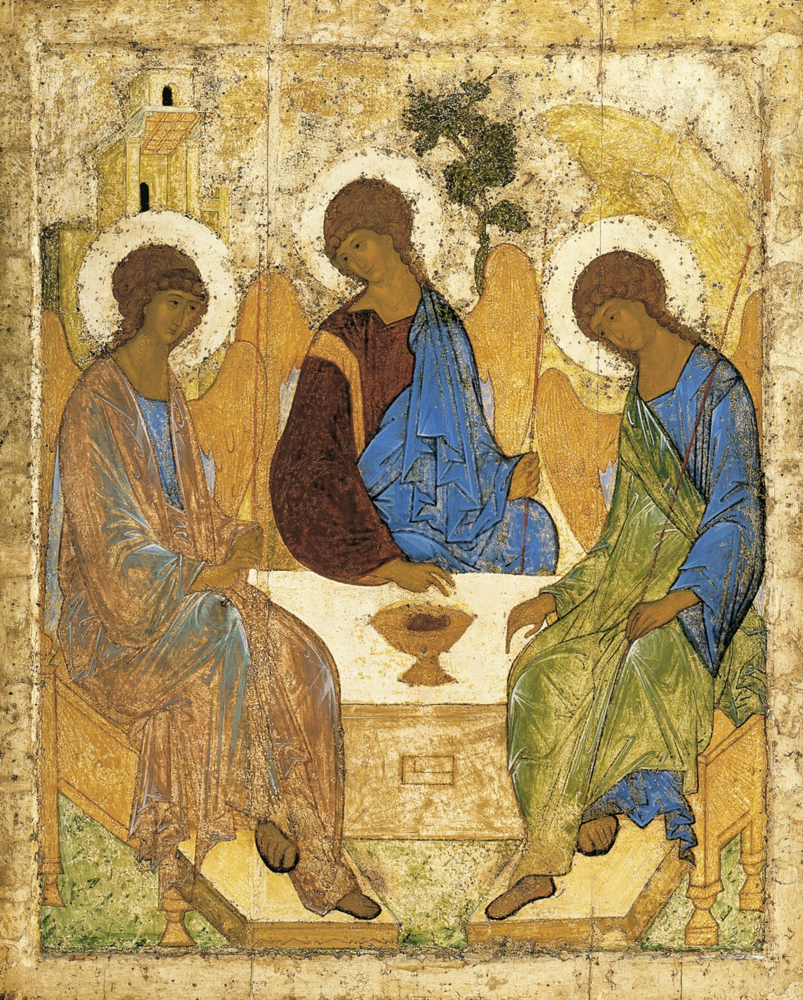

# Sessão 06 — Pai, Filho e Espírito Santo

*Andrei Rublev, The Holy Trinity (Hospitality of Abraham) (c. 1425-1427). Public Domain via Wikimedia Commons.*

> *Três figuras a uma só mesa. Rublev as pintou tão quietas que quase repousam umas nas outras. Pai, Filho, Espírito — distintos, olhando-se, um. Fomos feitos por um amor que já é uma conversa.*

## São Pio X pergunta

**41.** Qual é a Primeira Pessoa da Santíssima Trindade?

*A Primeira Pessoa da Santíssima Trindade é o Pai.*

**42.** Qual é a Segunda Pessoa da Santíssima Trindade?

*A Segunda Pessoa da Santíssima Trindade é o Filho.*

**43.** Qual é a Terceira Pessoa da Santíssima Trindade?

*A Terceira Pessoa da Santíssima Trindade é o Espírito Santo.*

**44.** Por que o Pai é a Primeira Pessoa da Santíssima Trindade?

*O Pai é a Primeira Pessoa da Santíssima Trindade porque não procede de outra Pessoa e dele procedem as outras duas, isto é, o Filho e o Espírito Santo.*

**45.** Por que o Filho é a Segunda Pessoa da Santíssima Trindade?

*O Filho é a Segunda Pessoa da Santíssima Trindade porque é gerado pelo Pai e é, conjuntamente com o Pai, princípio do Espírito Santo.*

**46.** Por que o Espírito Santo é a Terceira Pessoa da Santíssima Trindade?

*O Espírito Santo é a Terceira Pessoa da Santíssima Trindade porque procede do Pai e do Filho.*

## São Tomás ensina

Como dissemos, o Verbo de Deus é o Filho de Deus, assim como, em certo sentido, a palavra do homem é o conceito do seu entendimento.[^1] Mas, às vezes, o homem tem uma palavra morta. É o caso, por exemplo, em que ele concebe o que deve fazer, mas não tem a vontade de fazê-lo; ou quando alguém crê, mas não pratica; então a sua fé é dita morta, como assinala São Tiago.[^2] O Verbo de Deus, porém, é vivo: «Pois a palavra de Deus é viva».[^3] É necessário, portanto, que em Deus haja vontade e amor. Por isso diz Santo Agostinho: «O Verbo de Deus que pretendemos enunciar é conhecimento com amor».[^4] Ora, assim como o Verbo de Deus é o Filho de Deus, o amor de Deus é o Espírito Santo. Assim, possui o Espírito Santo aquele que ama a Deus: «A caridade de Deus está derramada em nossos corações pelo Espírito Santo, que nos foi dado».[^5]

> **Escritura.** *Ide, pois, e ensinai a todas as gentes, batizando-as em nome do Pai, e do Filho, e do Espírito Santo.* — Mateus 28, 19

> *Santíssima Trindade, atraí-me para dentro da conversa que Vós já sois. Que o meu dia seja vivido dentro do Vosso círculo.*
